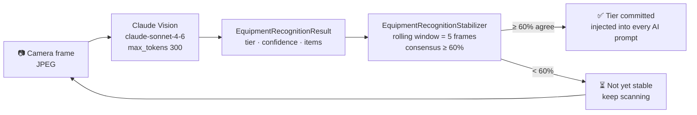
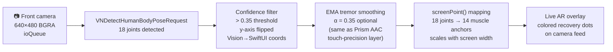
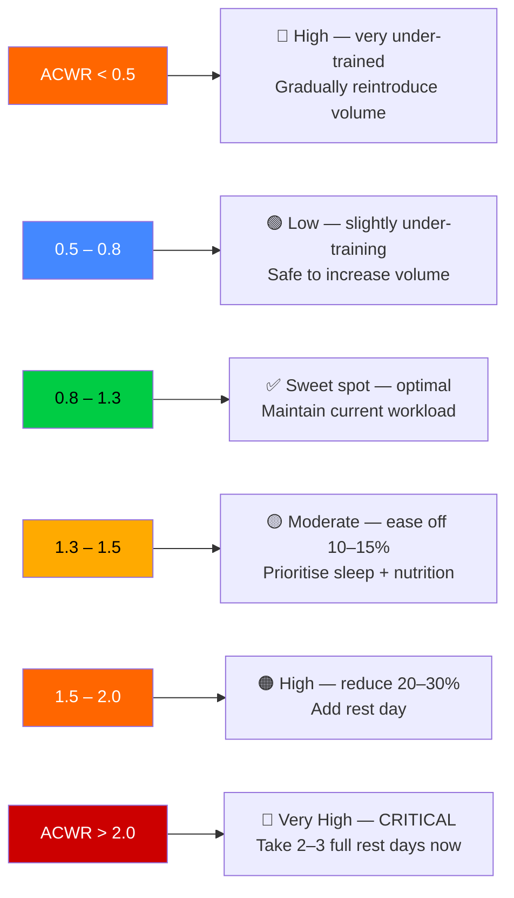
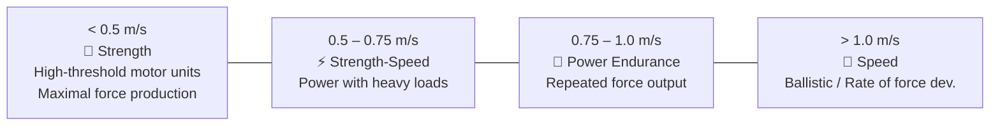
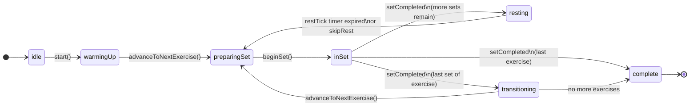
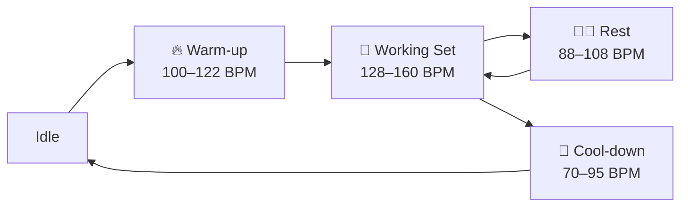
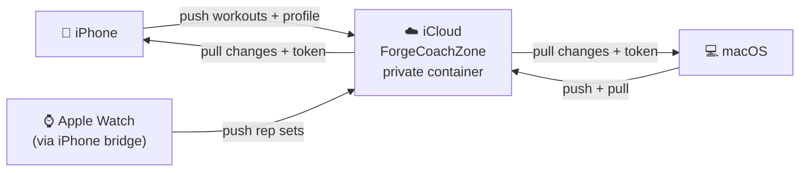

# ForgeCoach

**AI fitness coaching for iPhone, iPad, and Apple Watch.**

Track recovery, predict fatigue, generate periodized programs, and get coached in real time — in 23 languages. Fully offline with on-device AI (Pro+).

<p align="center">
  <a href="https://apps.apple.com/app/forgecoach/id123456789"></a>
  <a href="https://forgecoach.app/subscribe"></a>
  
  
</p>

🌐 **Translations:** [Español](docs/i18n/forgecoach_es.md) · [Français](docs/i18n/forgecoach_fr.md) · [Português](docs/i18n/forgecoach_pt.md) · [Română](docs/i18n/forgecoach_ro.md) · [Українська](docs/i18n/forgecoach_uk.md) · [Русский](docs/i18n/forgecoach_ru.md) · [Deutsch](docs/i18n/forgecoach_de.md) · [日本語](docs/i18n/forgecoach_ja.md) · [한국어](docs/i18n/forgecoach_ko.md) · [中文](docs/i18n/forgecoach_zh.md) · [العربية](docs/i18n/forgecoach_ar.md)

---

## 🔋 Body Battery

Your single readiness score — a composite of overnight HRV, resting heart-rate trend, sleep quality, and 7-day cumulative training load.

- **Score 0–100** — ≥ 75 Fresh (green), 50–74 Moderate (yellow), 25–49 Fatigued (orange), < 25 Spent (red)
- **Passive HealthKit sync** — reads overnight HRV captured by Apple Watch; no manual input
- **ATR Engine** — Adaptive Training Readiness synthesizes 7+ biometric signals into a single readiness index, balancing acute (3-day) vs chronic (28-day) load
- **Weekly baseline recalibration** — scores normalize over time so a well-trained athlete and a beginner both read correctly

<p align="center">
  
  
</p>
<p align="center"><em>Body Battery dashboard — readiness score, weekly trend, and quick-action shortcuts. Watch companion shows the ring at a glance.</em></p>

---

## 💪 Muscle Recovery Map

Per-muscle fatigue tracking across 14 anatomical regions on a parametric body-canvas rendered in SwiftUI.

- **14 muscle groups** — Chest, Anterior/Lateral/Posterior Deltoid, Biceps, Triceps, Traps, Lats, Core, Lower Back, Glutes, Quads, Hamstrings, Calves
- **Decay model** — each muscle recovers from 100% → 0% over 48–96 h post-workout based on exercise volume and RPE; recovery follows a sigmoid curve
- **Front/back toggle** — tap to flip the silhouette; iOS uses a segmented picker, watchOS shows both as swipeable tabs
- **Color coding** — ≥ 75% green · 50–75% yellow · 25–50% orange · < 25% red
- **Workout highlights** — today's program target muscles pulse orange on the canvas

<p align="center">
  
  
</p>
<p align="center"><em>Muscle recovery map — 14 regions color-coded by load. The pulsing overlay shows today's target muscles.</em></p>

---

## 📋 Training Programs

Six science-backed periodization templates covering every major training goal, plus AI-generated custom blocks.

| Program | Structure | Goal |
|---|---|---|
| PPL (Push/Pull/Legs) | 6-day upper/lower split | Hypertrophy + strength |
| 5/3/1 Wendler | 4-day barbell + accessories | Powerlifting strength |
| GZCLP | 3-day tiered system | Linear beginner progression |
| PHUL (Power Hypertrophy) | 4-day classic split | Balanced hypertrophy |
| Full Body | 3-day compound emphasis | General fitness |
| Deload / Maintenance | 1-day active recovery | Regeneration |

- **AI-generated programs** (Elite) — describe your goal and constraints; ForgeCoach generates a custom multi-week block using Prism 8B or Claude Sonnet
- **JSON Program Generator** — programs are typed Swift models; the engine generates a full 8-week program in < 500 ms on-device
- **Watch sync** — active program is cached on Apple Watch for offline training (< 100 KB payload)

<p align="center">
  
  
</p>
<p align="center"><em>Training programs — six periodization templates, plus AI-custom programs for Elite. Watch shows live set logging with rest timer.</em></p>

---

## 🍎 Nutrition Engine

NLP-driven meal logging — describe the food in plain language, get the macros.

- **NLP meal entry** — type or dictate "2 eggs, buttered toast, black coffee" and the engine parses food entities, quantities, and units using regex + Claude Haiku
- **Macro targets** — calculated from bodyweight, goal (deficit / surplus / maintenance), and activity level; adjusted daily by training load
- **Calorie tracking** — running daily total with breakdown (protein / carbs / fat / fiber / water)
- **Nutrient density score** — flags micronutrient gaps based on logged foods
- **Hydration reminders** — adaptive push notifications based on estimated sweat rate during exercise

<p align="center">
  
  
</p>
<p align="center"><em>Nutrition tracker — NLP meal logging, daily macro targets, and hydration tracking.</em></p>

---

## 🤖 AI Coach (Cascade)

Conversational coaching that knows your recovery state, last session, and program context.

| Tier | Route | Latency | Privacy |
|---|---|---|---|
| Free | No AI — static templates only | — | — |
| Pro | Prism 1.7B on-device (Metal) | ~500 ms | 100% local — no network |
| Elite | Prism 1.7B → 8B → Claude Sonnet | ~500 ms / ~1.5 s / ~3 s | Anon context to Prism server; Claude for complex queries |

- **Context window** — ForgeMemoryStore injects last 3 sessions, active program week, current muscle loads, and Body Battery score into every prompt
- **Voice output** — AI responses spoken via ForgeTTSEngine: Synalux cloud TTS (MP3, 24 kHz) with AVSpeechSynthesizer offline fallback; 6 coaching tones: Friendly, Calm, Enthusiastic, Precise, Empathetic, Hopeful
- **Proactive coaching** — ProactiveCoachEngine surfaces unsolicited insights ("Your HRV dropped 15% — consider reducing intensity today") based on 7 trigger types
- **Velocity-based feedback** — wrist-mounted bar velocity estimation via CoreMotion flags neuromuscular fatigue when bar speed drops > 15%

<p align="center">
  
  
</p>
<p align="center"><em>AI Coach — contextual conversational coaching with voice output and proactive insights. iPad shows the full chat UI.</em></p>

---

## ⌚ Apple Watch

Full companion app — not just notifications. Independent wrist-side session tracking.

- **5 watch tabs** — Dashboard (Body Battery), Muscle Map, Workout Log, CNS Tap Test, Settings
- **Workout session** — log sets (exercise, weight, reps, RPE) directly from your wrist; 90-second rest timer with haptic countdown
- **CNS Tap Test** — 10-second rapid-tap test before training; measures taps/sec and flags neuromuscular fatigue below personal baseline
- **Haptic Pacer** — rhythmic haptics during AMRAP/EMOM circuits
- **Auto Set Detection** — accelerometer + gyroscope recognize set start/end and classify exercise type
- **Phone sync** — WatchConnectivity bridge pushes muscle batteries, body battery, and feature flags bidirectionally in real time

<p align="center">
  
  
  
  
</p>
<p align="center"><em>Apple Watch companion — Body Battery ring, muscle map, live workout logging, and CNS tap test.</em></p>

---

## 📷 Vision AI

Two independent camera systems — equipment classification uses Claude Vision (one-shot onboarding only); body pose runs entirely on-device via Apple Vision with zero network calls.

### Equipment Scanner

Point your camera at your workout space once during onboarding. Claude Vision analyzes the frame and maps it to one of four equipment tiers. Every AI coaching prompt and program generated afterward is injected with the matching tier hint so workouts never prescribe equipment you don't have.

| Tier | Includes | AI hint injected |
|---|---|---|
| Full Gym | Barbells, power rack, cable machines, leg press, Smith machine | Full commercial gym access |
| Home Gym | Barbell + rack/stand, dumbbells, bench, pull-up bar | No cables or machines |
| Dumbbells Only | Fixed or adjustable DBs, bands, optional bench | No barbell or cable machines |
| Bodyweight | No equipment, floor space, optional pull-up bar | Bodyweight exercises only |

**Drift stabilization** — a single frame can be misclassified if the camera pans through a doorway or captures a reflection. `EquipmentRecognitionStabilizer` buffers a rolling window of 5 scan results and only commits when ≥ 60 % of the window agrees on the same tier:

```
Frame history:  [homeGym] [homeGym] [fullGym] [homeGym] [homeGym]
                                        ↑ outlier frame
Tally: homeGym=4 (80%) fullGym=1 (20%) → 80% ≥ 60% threshold → ✅ homeGym confirmed
```



### Body Pose AR

The front camera continuously streams 18 body joints via Apple Vision's `VNDetectHumanBodyPoseRequest` (iOS 14+, fully on-device). Detected joint positions drive the live muscle recovery overlay — colored fatigue dots anchor to your actual body in the camera feed rather than a static silhouette.

**Pipeline:**



**Joint-to-muscle anchor mapping (14 regions):**

```
              [neck]
   [lShoulder]——————[rShoulder]   ← traps · ant/lat/post delts
        |      chest    |
   [lElbow]          [rElbow]     ← biceps (L) · triceps (R)
        |                |
   [lWrist]          [rWrist]
   [lHip]————————————[rHip]       ← core · lower back · glutes
        |                |
   [lKnee]            [rKnee]     ← quads (L) · hamstrings (R)
        |                |
  [lAnkle]           [rAnkle]     ← calves
```

All nudges (e.g. `+20 px` for lats, `+42 px` for glutes) are scaled by `screenWidth / 390` so dots stay on-body across all iPhone sizes. Falls back to static `bodyMapAnchor` positions when camera is denied or tracking confidence drops.

---

## 🏋️ Training Intelligence

Five scientific engines run behind every coaching decision.

### Acute:Chronic Workload Ratio (ACWR) — Injury Prevention

`ATREngine` calculates the ratio of your 7-day acute training load to your 28-day chronic baseline. Each session contributes `duration (min) × RPE` load units.

```
Acute load  = sum of (duration × RPE) over last 7 days
Chronic load = sum of (duration × RPE) over last 28 days ÷ 4   (weekly average)
ACWR ratio  = acute ÷ chronic
```



Siri Shortcut: *"Check my injury risk in ForgeCoach"* — returns ACWR ratio + recommendation via `CheckInjuryRiskIntent`.

### Volume Landmarks — MEV / MAV / MRV

`VolumeLandmarkEngine` tracks weekly sets per muscle group against science-based volume landmarks from Renaissance Periodization (2019–2024).

| Zone | Definition | Action |
|---|---|---|
| Under MEV | Below minimum effective volume | Add sets — no adaptation happening |
| In MAV | Optimal stimulus range | Add +2 sets/week to progress |
| Approaching MRV | Within 80% of maximum recoverable | Hold volume, monitor fatigue |
| Over MRV | Above recoverable ceiling | Reduce immediately |
| Deload | Intentional recovery week | Target 50% of MEV |

**Default landmarks (sets/week) by muscle group:**

| Muscle | MEV | MAV | MRV |
|---|---|---|---|
| Chest | 8 | 16 | 22 |
| Back | 10 | 18 | 25 |
| Quads | 8 | 16 | 20 |
| Hamstrings | 6 | 12 | 16 |
| Shoulders | 8 | 16 | 22 |
| Biceps | 8 | 14 | 20 |
| Triceps | 6 | 14 | 18 |
| Core | 6 | 16 | 25 |
| Calves | 8 | 16 | 20 |
| Glutes | 4 | 12 | 16 |
| Traps | 8 | 14 | 20 |
| Forearms | 4 | 10 | 14 |

Landmarks scale with `TrainingDifficulty.frequencyMultiplier` so a beginner and an advanced lifter see appropriately different targets.

### Sleep-Training Readiness Loop

`SleepTrainingLoop` synthesizes last night's sleep, morning HRV, and Body Battery into a single 0–100 readiness score:

```
Score = 50 (base)
      + quality.multiplier × 20    (Poor=0.7, Fair=0.85, Good=1.0, Excellent=1.1)
      + HRV bonus                   (≥60 ms → +20 | 45–60 ms → +10 | <45 ms → 0)
      + bodyBattery / 100 × 10
      → clamped to [0, 100]
```

| Score | Recommendation | Intensity |
|---|---|---|
| ≥ 80 | Full Training | 100% |
| 60–79 | Reduced Volume | 75% |
| 40–59 | Active Recovery | 50% |
| < 40 | Rest Day | 0% |

Missing sensors degrade gracefully — the base score of 50 always applies even if no wearable data is available. Siri Shortcut: *"Check my readiness in ForgeCoach"*.

### HR-Adaptive Rest Timer

`HRAdaptiveRestTimer` extends or shortens prescribed rest in real time based on live heart rate. No more fixed countdowns — rest ends when your body is actually ready.

**Three recovery models:**
- `threshold(targetBPM: 130)` — ready when HR ≤ target (default)
- `percentOfMax(maxHR:, fraction:)` — e.g. ready at 65% of max HR
- `heartRateReserve(restingHR:, bpmAboveResting:)` — HRR-based readiness

**Goal-adaptive defaults:**

| Goal | Recovery target | Prescribed rest |
|---|---|---|
| Strength / Powerlifting | 60% max HR (~114 bpm) | 240 s |
| Hypertrophy | 65% max HR (~124 bpm) | 90–150 s |
| General Fitness | 70% max HR (~133 bpm) | 60 s |
| Weight Loss | 70% max HR | 45 s |
| Athletic Performance | 65% max HR | 120 s |

Extensions are applied in 15-second steps, minimum floor 30 s, hard ceiling 180 s beyond prescription. At exactly 30 seconds remaining the `AutonomousCoachEngine` checks HR live and announces extensions: *"Your HR is 148 bpm — adding 30 more seconds."*

### Velocity-Based Training (VBT)

`VBTEngine` estimates mean propulsive velocity (m/s) and power output (W) from Apple Watch accelerometer data per rep, using trapezoidal numerical integration:

```
1. resultantG = √(x² + y² + z²)
2. netG = resultantG − 1.0 g  (gravity removal)
3. noise gate: |netG| < 0.05 g → zero
4. convert g → m/s²  (× 9.81)
5. velocity = ∫ acceleration dt  (trapezoidal rule)
6. power    = (bodyweight + load) × 9.81 × velocity
```

**Velocity zones:**



**Fatigue indicator** — velocity loss from rep 1 to last rep of a set:
- < 10% → Fresh — push the next set
- 10–20% → Moderate fatigue — maintain form
- ≥ 20% → Significant fatigue — `AutonomousCoachEngine` calls out *"Velocity loss is X%. Rest well before the next set."*

Typical stop-set thresholds: **20%** for strength, **30%** for hypertrophy, **10%** for power.

---

## 🎤 Voice Control

Hands-free training — every core action is reachable by voice without touching the screen.

### 50+ Voice Commands

`VoiceCommandRegistry` + `VoiceCommandEngine` provide continuous on-device speech recognition (`requiresOnDeviceRecognition = true`) with a 1.5-second silence timeout before command dispatch.

**Matching strategy:** exact alias → prefix → keyword scoring (≥ 2 token overlap, or 1 for short commands). Filler words ("please", "hey forge", "ok", "um") are stripped before matching.

**Command categories:**

| Category | Example phrases |
|---|---|
| Workout lifecycle | "Start workout", "End session", "Pause", "Resume training" |
| Set logging | "Log 5 reps at 100 kilos", "Done 8 reps", "Undo last set" |
| RPE | "RPE 8", "Rate effort 9" |
| Rest timer | "Start rest", "Skip rest", "Extend rest 30 seconds", "I'm ready" |
| Navigation | "Go to nutrition", "Open coach", "Go back" |
| AI Coach | "Ask coach how should I progress?", "Repeat that", "Stop speaking" |
| Music | "Play music", "Skip track", "Set volume 60", "Pause music" |
| Biometrics | "Check body battery", "Check HRV", "Check muscle recovery" |
| Nutrition | "Log meal 2 eggs and oatmeal", "View nutrition" |
| Programs | "Generate program", "What's today?", "View schedule" |

### Autonomous Coach

`AutonomousCoachEngine` is a Swift actor that guides you through a complete workout via voice — no screen interaction required once started. It integrates `HRAdaptiveRestTimer`, `VBTEngine`, and `ProactiveCoachEngine` in a single state machine:



**What it says at each stage:**
- `warmingUp` → "Start with a light warm-up set of [exercise] to prepare your joints."
- `inSet` → monitors VBT readings; if velocity loss ≥ 20%: *"Velocity loss is 24%. You're in Strength-Speed territory — rest well."*
- `resting` → countdown at 30s, 20s, 10s, 5s, 3s, 2s, 1s with live HR suffix; HR-based extension at 30s remaining
- `complete` → "Workout complete! You finished 18 sets across 5 exercises in 52 minutes. Average RPE: 7.8. Peak bar velocity: 0.84 m/s."

Free-form questions mid-workout are handled inline: *"How many sets left?"*, *"How long to rest?"*, *"I'm tired"*, *"Check my form"* all produce context-aware spoken responses.

---

## 🎵 Music

Workout music that adapts to your training phase — not just a static playlist.

### Apple Music + Spotify

`MusicEngine` coordinates Apple Music (MusicKit) and Spotify (OAuth PKCE) through a unified `MusicServiceProtocol`. You connect one or both services; the engine handles auth, queueing, and controls.

**BPM phase transitions** — as you move through workout phases, music BPM shifts automatically (configurable, default `autoTransition = true`):



Phase transitions debounce 500 ms to avoid flickering during rapid state changes.

**TTS ducking** — when `AutonomousCoachEngine` or `ForgeTTSEngine` speaks, music volume automatically drops to 20% (`duckVolume = 0.20`) and restores to 85% when speech ends.

**Linked playlists** — pin a specific Apple Music catalog ID or Spotify URI to each workout phase. When a phase starts, the linked playlist plays instead of the auto-BPM queue.

| Feature | Apple Music | Spotify |
|---|---|---|
| Auth | MusicKit `MusicAuthorization` | OAuth 2.0 PKCE |
| BPM queue | Energy-mapped search terms | Energy + BPM audio features |
| Playlist support | Catalog ID | `spotify:playlist:xxx` URI |
| Now-playing info | MusicKit metadata | Web API polling |

---

## 🖥️ macOS

Full native macOS app alongside iPhone and iPad.

- **Menu bar companion** — 260 px popover with Body Battery ring, now-playing music controls (play/pause, skip), and deep-link to open the full app (`forgecoach://open`)
- **Dashboard view** — full program view, AI coach chat, and nutrition summary in a native macOS window
- **Menu commands** — `MacMenuCommands` wires keyboard shortcuts and `File` / `Coach` menu items to the same ForgeCoachCore engines used on iOS

<p align="center">
  
  
</p>
<p align="center"><em>macOS — full dashboard window and menu-bar companion showing Body Battery + music controls.</em></p>

---

## ☁️ iCloud Sync (Elite)

`CloudKitSyncEngine` keeps workouts, profile, meal logs, and rep sets in sync across all your devices using a private CloudKit zone (`ForgeCoachZone`).

- **Append-only workouts** — sessions are never deleted remotely; soft-deleted locally with a flag
- **Profile conflict resolution** — last-write-wins using `lastModifiedAt`; server wins on equal timestamps
- **Device deduplication** — every record carries a `deviceID` field; the same session uploaded from two devices merges cleanly
- **Change tokens** — incremental pulls via `CKServerChangeToken`; only changed records are transferred after the first full sync
- **Availability check** — `isAvailable()` confirms iCloud account status before attempting any sync



---

## 🔑 Siri Shortcuts

Five App Shortcuts registered via `AppShortcutsProvider` (iOS 16.4 +, watchOS 9.4 +, macOS 13.3 +):

| Shortcut | Siri phrase | What it does |
|---|---|---|
| Start Workout | "Start workout in ForgeCoach" | Opens app and begins session |
| Log Meal | "Log what I ate in ForgeCoach" | Parses NLP description → macros |
| Check Readiness | "Am I ready to train in ForgeCoach" | Sleep + HRV + Body Battery → score |
| Generate Program | "Create a program in ForgeCoach" | Runs JSONProgramGenerator, opens app |
| Injury Risk | "How is my training load in ForgeCoach" | ACWR ratio → risk tier + recommendation |

---

## 🧬 FemmeEngine

Cycle-phase metric adjustments for female athletes (optional, never synced off-device).

- **4 phases** — Menstrual, Follicular, Ovulatory, Luteal
- **Training adjustments** — volume, intensity targets, and RPE recommendations shift per phase based on published research on hormonal effects on strength and recovery
- **Body Battery correction** — basal body temperature and HRV baselines are phase-adjusted to avoid mid-cycle false fatigue signals
- **Privacy** — cycle data stays in CoreData only; no sync, no cloud

---

## 🌍 23 Languages

Coaching and UI available in English, Spanish, French, Portuguese, German, Italian, Dutch, Polish, Russian, Ukrainian, Romanian, Czech, Hungarian, Swedish, Norwegian, Finnish, Japanese, Korean, Mandarin, Arabic, Hindi, Turkish, Hebrew.

<p align="center">
  
  
</p>
<p align="center"><em>Settings — language picker, subscription tier, AI routing, TTS voice selection, and FemmeEngine toggle.</em></p>

---

## 💳 Plans

| Feature | Free | Pro | Elite |
|---|---|---|---|
| Body Battery + HRV dashboard | ✅ | ✅ | ✅ |
| Muscle recovery map | ✅ | ✅ | ✅ |
| Workout log (60-day history) | ✅ | ✅ | ✅ |
| Equipment scanner (camera onboarding) | ✅ | ✅ | ✅ |
| Siri Shortcuts (5 App Intents) | ✅ | ✅ | ✅ |
| Unlimited workout history | — | ✅ | ✅ |
| All 6 training templates | — | ✅ | ✅ |
| Full nutrition engine + food database | — | ✅ | ✅ |
| Body visualizer — live AR pose overlay | — | ✅ | ✅ |
| Apple Watch companion app | — | ✅ | ✅ |
| macOS native app + menu bar | — | ✅ | ✅ |
| FemmeEngine (cycle tracking) | — | ✅ | ✅ |
| Voice control (50+ commands) | — | ✅ | ✅ |
| Music — Apple Music + Spotify + BPM phases | — | ✅ | ✅ |
| HR-Adaptive Rest Timer | — | ✅ | ✅ |
| Sleep-Training Readiness Loop | — | ✅ | ✅ |
| ACWR injury risk tracking | — | ✅ | ✅ |
| VBT — bar velocity + power output | — | ✅ | ✅ |
| AI Coach — Prism 1.7B on-device | — | ✅ | ✅ |
| Autonomous voice coach (full workout) | — | — | ✅ |
| AI Coach — Prism 8B server | — | — | ✅ |
| AI Coach — Claude Sonnet cascade | — | — | ✅ |
| AI-generated custom programs | — | — | ✅ |
| Volume Landmarks — MEV / MAV / MRV | — | — | ✅ |
| iCloud sync (multi-device) | — | — | ✅ |
| **Monthly** | Free | $8.99/mo | $17.99/mo |
| **Annual** | Free | $69.99/yr | $129.99/yr |

Subscribe at [forgecoach.app/subscribe](https://forgecoach.app/subscribe) — web payment via Stripe. No in-app purchase required.

---

## 🔬 Science

- Mifflin-St Jeor BMR (JADA, 1990)
- ACSM activity multipliers (Resource Manual, 8th ed.)
- NSCA protein targets: 1.5–2.2 g/kg BW by goal (NSCA Essentials, 4th ed.)
- Menstrual cycle recovery modifiers: McNulty et al., 2020 (*Sports Medicine*)
- CNS tap-test readiness: Saldanha et al., 2019 (*JSCR*)
- Sleep stage analysis: Apple HealthKit HKCategoryTypeIdentifierSleepAnalysis
- ACWR injury risk model: Hulin et al., 2016 (*BJSM*); sweet spot 0.8–1.3 per Gabbett, 2016
- Volume landmarks (MEV/MAV/MRV): Israetel, Hoffmann & Case, *Scientific Principles of Hypertrophy Training*, Renaissance Periodization (2019)
- Velocity-Based Training zones: González-Badillo & Sánchez-Medina, 2010 (*IJSM*); fatigue threshold 20% velocity loss per Pareja-Blanco et al., 2017

---

## 🔒 Privacy

All biometric data stays on-device. No analytics SDK. No third-party crash reporting.

- **HealthKit** — read-only except workout session writes; described in App Store privacy label
- **AI prompts (Pro)** — never sends data to any server
- **AI prompts (Elite)** — sends anonymized training context to Prism inference server (no PII, no HealthKit data)
- **Subscription check** — email sent over HTTPS to `api.forgecoach.app`; stored in Keychain with 24-hour TTL and 48-hour grace window
- **Cycle data** — FemmeEngine data is CoreData-only, never synced

---

*© Synalux · All rights reserved*
