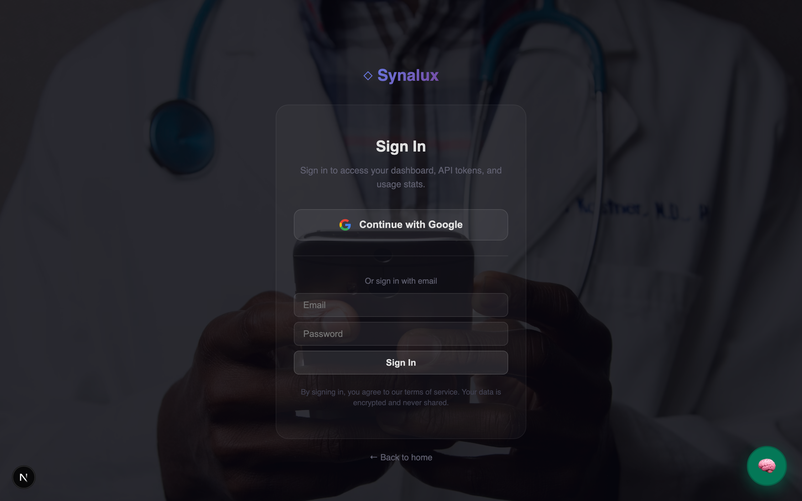

# ✦ Synalux

**Your Intelligent Practice Management Platform**

> Run your entire healthcare practice from one platform — patient records, scheduling, billing, team communication, and automated clinical charting. Works for ABA therapy, pediatrics, mental health, dentistry, physical therapy, and dermatology. Available in 12 languages. HIPAA-compliant.

<p align="center">
  <a href="https://synalux.ai/app"></a>
  <a href="https://marketplace.visualstudio.com/items?itemName=synalux-ai.synalux"></a>
  <a href="https://synalux.ai/docs"></a>
  <a href="LICENSE"></a>
</p>

🌐 **Language / Язык / Limba:** [English](#why-synalux) · [Español](docs/i18n/README_es.md) · [Français](docs/i18n/README_fr.md) · [Português](docs/i18n/README_pt.md) · [Română](docs/i18n/README_ro.md) · [Українська](docs/i18n/README_uk.md) · [Русский](docs/i18n/README_ru.md) · [Deutsch](docs/i18n/README_de.md) · [日本語](docs/i18n/README_ja.md) · [한국어](docs/i18n/README_ko.md) · [中文](docs/i18n/README_zh.md) · [العربية](docs/i18n/README_ar.md)

🎬 **Demo videos coming soon** — See the full workflow: patients, scheduling, notes, billing, and team chat in action.

---

<a id="why-synalux"></a>
## 💡 Why Synalux?

### 🎙️ Talk. Don't Type.
Synalux listens to your session and instantly writes a structured clinical note. Because it processes directly on your iPad or laptop, your patient's voice never goes to the cloud. It’s instant, private, and saves you 2 hours of paperwork every day.

### 📴 Unbreakable Offline Mode
Working in a clinic with spotty Wi-Fi? Keep charting. Synalux saves everything to your device instantly. When you reconnect, it syncs automatically. Your billing timestamps are always accurate to the minute, even in a dead zone.

### 🏢 One Platform. Total Control.
Whether you manage 5 therapists or 500 across three countries, Synalux isolates patient records perfectly. Technicians only see what they need to see. Billing sees the numbers, doctors see the charts. Setup takes seconds.

### 🛡️ Trust, Compliance & Security
* **Zero-Cloud Privacy (Your Device, Your Data):** Unlike other platforms that send patient recordings to external servers, our clinical assistant runs 100% locally on your machine. We couldn't read your patient notes even if we wanted to.
* **Military-Grade Encryption:** Every message, file, and patient record is scrambled using the same encryption standards required by the US Government and major banks. If a device is lost, the data remains unreadable.
* **Ironclad Access Control:** 15 distinct staff roles ensure that a receptionist cannot read a psychotherapy note, and a medical technician cannot alter billing codes. Everyone operates in their own secure lane.
* **Automated HIPAA Compliance:** Synalux enforces compliance for you: automatic 15-minute screen lockouts, secure data purging when a tab is closed, and unalterable audit trails showing exactly who opened which file and when.

---

## 🧠 Intelligent Chat & Clinical Assistant

Synalux includes a context-aware clinical assistant available on every screen — web portal, patient detail, scheduling, billing, documents, and the VS Code extension. It is not a generic chatbot. It understands your practice type, your role, your active patient, and the screen you're on.

The assistant bubble (💬) is pinned to the bottom-right corner of every page. You can open it from any screen — patient charts, billing, scheduling, or the dashboard — and it will have context about what you're looking at.

### 🌐 Web Portal — What You Can Do

The web portal assistant is optimized for **clinical and administrative workflow acceleration**:

- **SOAP Note Dictation:** Record a session → get a structured clinical note
- **Clinical Q&A:** "What are the contraindications for Concerta in a patient with cardiac history?"
- **Treatment Plan Drafts:** "Draft a BIP for tantrums maintained by escape"
- **Billing Guidance:** "What CPT code for a 45-minute family guidance session?"
- **Report Generation:** "Summarize this patient's last 3 sessions"
- **Translation:** "Translate this consent form to Spanish"
- **Smart Context Sharing:** Generate a treatment plan → "Share to billing channel"

<details>
<summary>Click to view full details</summary>

| Capability | Example | How It Works |
|------------|---------|--------------|
| **SOAP Note Dictation** | Record a session → get a structured clinical note | WASM Whisper runs on-device. Audio **never** leaves your machine. |
| **Clinical Q&A** | "What are the contraindications for Concerta in a patient with cardiac history?" | Powered by Gemini with medical context injection |
| **Treatment Plan Drafts** | "Draft a BIP for tantrums maintained by escape" | Uses your practice type (ABA/peds/general) to select the right template |
| **Billing Guidance** | "What CPT code for a 45-minute family guidance session?" | References the built-in CPT dictionary (97151–97158, 99213–99215) |
| **Report Generation** | "Summarize this patient's last 3 sessions" | Reads session data from the workspace-scoped database |
| **Translation** | "Translate this consent form to Spanish" | 12-language support with medical terminology awareness |
| **Smart Context Sharing** | Generate a treatment plan → "Share to billing channel" | Forwards the document to the team chat without duplicating PHI |


**What the Web Assistant Cannot Do:**
- ❌ Read, write, or modify files on your computer
- ❌ Execute terminal commands or scripts
- ❌ Access external websites or APIs
- ❌ Install software or change system settings
- ❌ Access patient data from other workspaces (strict tenant isolation)
</details>
### 💻 VS Code Extension — What You Can Do

The VS Code extension is a **full-capability development and clinical tool** with local workspace access:

- **read_file:** Read any file in your workspace
- **list_files:** List directory contents with glob filtering
- **search_files:** Ripgrep-powered code search across the project
- **run_command:** Execute terminal commands (npm, git, build, test)
- **get_open_editors:** See which files are open and cursor position
- **open_url:** Open URLs in the default browser
- **fetch_url:** Read web page content for analysis
- **supabase_cli:** Manage database (migrations, pull, push, status)
- **stripe_cli:** Manage payments (webhooks, triggers, listen)

<details>
<summary>Click to view full details</summary>

| Tool | Description | Security |
|------|-------------|----------|
| **read_file** | Read any file in your workspace | Scoped to workspace root — path traversal blocked |
| **list_files** | List directory contents with glob filtering | Hidden files and `node_modules` excluded by default |
| **search_files** | Ripgrep-powered code search across the project | Capped at 50 results, 512KB max file size |
| **run_command** | Execute terminal commands (npm, git, build, test) | Dangerous commands blocked (`rm -rf /`, `mkfs`, `dd`, fork bombs) |
| **get_open_editors** | See which files are open and cursor position | Read-only VS Code API |
| **open_url** | Open URLs in the default browser | Whitelisted to org-owned domains only |
| **fetch_url** | Read web page content for analysis | HTML stripped, 1MB max, 15s timeout |
| **supabase_cli** | Manage database (migrations, pull, push, status) | Uses authenticated Supabase CLI |
| **stripe_cli** | Manage payments (webhooks, triggers, listen) | Uses authenticated Stripe CLI |


**What the VS Code Assistant Cannot Do:**
- ❌ Access files outside the open workspace folder
- ❌ Run commands longer than 120 seconds
- ❌ Access the internet without user-visible URLs
- ❌ Modify system files, install packages globally, or change OS settings
- ❌ Access patient data directly (must go through the API layer)
</details>
### 🔒 Why These Restrictions Exist

Every restriction is driven by **HIPAA compliance** and the principle of **least privilege**:

- **Web assistant has no file access:** A browser-based tool must not read/write the local filesystem — this prevents data exfiltration if a session token is compromised
- **VS Code tools are workspace-scoped:** Path traversal (`../../etc/passwd`) is blocked to prevent access to sensitive system files
- **URL whitelist for auto-open:** Prevents phishing attacks where a compromised model output could redirect users to malicious sites
- **Terminal command blocklist:** Prevents destructive operations that could wipe clinical data or compromise the host
- **Patient data requires API auth:** All PHI access goes through the audited API layer — the assistant cannot bypass audit logging
- **Role-based tool gating:** If your workspace role allows only 3 tools, the assistant is restricted to those 3 tools — even if the model requests others

<details>
<summary>Click to view full details</summary>

| Restriction | Reason |
|------------|--------|
| **Web assistant has no file access** | A browser-based tool must not read/write the local filesystem — this prevents data exfiltration if a session token is compromised |
| **VS Code tools are workspace-scoped** | Path traversal (`../../etc/passwd`) is blocked to prevent access to sensitive system files |
| **URL whitelist for auto-open** | Prevents phishing attacks where a compromised model output could redirect users to malicious sites |
| **Terminal command blocklist** | Prevents destructive operations that could wipe clinical data or compromise the host |
| **Patient data requires API auth** | All PHI access goes through the audited API layer — the assistant cannot bypass audit logging |
| **Role-based tool gating** | If your workspace role allows only 3 tools, the assistant is restricted to those 3 tools — even if the model requests others |

</details>
<details><summary><h3>🛡️ Three-Layer Safety Architecture</h3></summary>

```
Layer 1: INPUT SANITIZATION
  User message → strip XML injection tags → boundary-tag wrapping
  Prevents: prompt injection, system prompt extraction

Layer 2: ROLE-BASED TOOL GATING (RBAC)
  /api/v1/roles/me → returns allowed tools for this user
  Fail-closed: if role API fails, ALL tools are blocked (not allowed)
  Prevents: privilege escalation, unauthorized tool execution

Layer 3: OUTPUT GUARDRAILS (Rolling Window)
  Model output → regex filter → strip refusals, meta-commentary, persona breaches
  Prevents: prompt leakage, sycophantic patterns, hallucinated capabilities
```

</details>
### 📊 Web vs VS Code Comparison

- **Available on every screen:** ✅ Yes — pinned bubble
- **Conversation Mode (🗣️):** ✅ Browser TTS + MediaRecorder
- **Clinical Q&A:** ✅
- **SOAP Dictation:** ✅ On-device Whisper
- **Treatment plan drafts:** ✅
- **Read local files:** ❌
- **Run terminal commands:** ❌
- **Git operations:** ❌
- **Supabase CLI:** ❌
- **Stripe CLI:** ❌
- **Code search (ripgrep):** ❌
- **Web page reading:** ❌
- **Practice memory (Prism):** ✅ Cloud-synced
- **Offline mode:** ✅ Queued sync
- **Audit logged:** ✅ Every request
- **Model selector:** ✅ Full chat page only

<details>
<summary>Click to view full details</summary>

| Feature | Web Portal (💬) | VS Code Extension |
|---------|----------------|-------------------|
| **Available on every screen** | ✅ Yes — pinned bubble | ✅ Yes — sidebar panel |
| **Conversation Mode (🗣️)** | ✅ Browser TTS + MediaRecorder | ✅ Native avlisten + macOS TTS |
| **Clinical Q&A** | ✅ | ✅ |
| **SOAP Dictation** | ✅ On-device Whisper | ✅ On-device Whisper |
| **Treatment plan drafts** | ✅ | ✅ |
| **Read local files** | ❌ | ✅ Workspace-scoped |
| **Run terminal commands** | ❌ | ✅ With blocklist |
| **Git operations** | ❌ | ✅ Full git tooling |
| **Supabase CLI** | ❌ | ✅ Direct CLI access |
| **Stripe CLI** | ❌ | ✅ Direct CLI access |
| **Code search (ripgrep)** | ❌ | ✅ Workspace-scoped |
| **Web page reading** | ❌ | ✅ With URL whitelist |
| **Practice memory (Prism)** | ✅ Cloud-synced | ✅ Cloud-synced |
| **Offline mode** | ✅ Queued sync | ✅ Local Ollama fallback |
| **Audit logged** | ✅ Every request | ✅ Every request |
| **Model selector** | ✅ Full chat page only | ✅ Settings panel |

</details>
### 🗣️ Conversation Mode (Hands-Free Voice Chat)

Conversation Mode turns the assistant into a **hands-free, voice-driven clinical companion** — similar to speaking with Siri or Google Assistant, but purpose-built for healthcare workflows. Available on both the **web portal** and the **VS Code extension**.

**How it works:**

```
┌─────────────┐     ┌──────────────┐     ┌──────────────┐     ┌──────────────┐
│  🎤 Listen   │ ──→ │ 📝 Transcribe │ ──→ │ 💬 Chat API  │ ──→ │ 🔊 Speak     │
│ (auto-start) │     │ /api/v1/     │     │ /api/v1/chat │     │ (TTS)        │
│              │     │ transcribe   │     │              │     │              │
│ MediaRecorder│     │  ✅ AUDITED  │     │  ✅ AUDITED  │     │ SpeechSynth  │
└──────────────┘     └──────────────┘     └──────────────┘     └──────┬───────┘
       ▲                                                              │
       └──────────────────────── LOOP ────────────────────────────────┘
```

**Every word is audit-logged.** The transcription goes through `/api/v1/transcribe` (audited). The message goes through `/api/v1/chat` (audited). Session START and STOP events are logged with word counts. There is no way to use Conversation Mode without generating a complete, immutable audit trail.

- **Voice engine:** Browser MediaRecorder API
- **Speech output:** Browser SpeechSynthesis API
- **HIPAA enforcement:** Forces local backend automatically
- **Session recording:** Not available (browser security)
- **Auto-stop:** 15-second max per utterance
- **Transcript capture:** In-memory during session
- **Activate:** 🗣️ button in chat input bar

<details>
<summary>Click to view full details</summary>

| Feature | Web Portal | VS Code Extension |
|---------|-----------|-------------------|
| **Voice engine** | Browser MediaRecorder API | Native `avlisten` binary (compiled Swift) |
| **Speech output** | Browser SpeechSynthesis API | macOS `say` command / Python TTS tool |
| **HIPAA enforcement** | Forces local backend automatically | Forces local Ollama — fail-closed if unavailable |
| **Session recording** | Not available (browser security) | Optional with AES-256-GCM encryption + consent flow |
| **Auto-stop** | 15-second max per utterance | Configurable silence threshold (500ms–10s) |
| **Transcript capture** | In-memory during session | Full transcript saved on stop |
| **Activate** | 🗣️ button in chat input bar | 🎙️ button in chat panel |


> ⚠️ **HIPAA Constraint:** Conversation Mode **always** forces the local backend (Ollama). Ambient clinical audio transcriptions will never be sent to cloud APIs. If the local backend is unavailable, Conversation Mode refuses to start (fail-closed design).
</details>
### 🧠 Model Routing & Tier Architecture

The intelligent assistant does **not** expose a model selector by default. The server automatically routes each request to the best model for the user's subscription tier:

- **Free:** Gemini 2.5 Flash
- **Standard:** Gemini 3.1 Pro Exp
- **Advanced:** Gemini 3.1 Pro Exp
- **Enterprise:** Gemini 3.1 Pro Exp

<details>
<summary>Click to view full details</summary>

| Tier | Default Model | Max Tokens | Daily Limit | Model Selector Visible |
|------|--------------|------------|-------------|----------------------|
| **Free** | Gemini 2.5 Flash | 4,096 | 100 | ❌ Hidden (FloatChat) / ✅ Full chat page |
| **Standard** | Gemini 3.1 Pro Exp | 8,192 | 2,000 | ❌ Hidden (FloatChat) / ✅ Full chat page |
| **Advanced** | Gemini 3.1 Pro Exp | 16,384 | 5,000 | ❌ Hidden (FloatChat) / ✅ Full chat page |
| **Enterprise** | Gemini 3.1 Pro Exp | 32,768 | 100,000 | ❌ Hidden (FloatChat) / ✅ Full chat page |


**Where the model selector appears:**
- ✅ **Full chat page** (`/app/chat`) — users can override their tier default
- ✅ **VS Code extension** — settings panel for model selection
- ❌ **FloatChat bubble** — always uses `synalux-default`, server picks the tier model
- ❌ **SOAP dictation** — fixed pipeline, no model choice

**Server-side enforcement:** Even if a client sends a model ID, the server validates it against `TIER_ALLOWED_MODELS`. A free-tier user requesting `claude-sonnet-4` will be silently downgraded to their tier default.
</details>
### ⚡ @Keywords — Configurable AI Command System

The `@keyword` system is the **primary interface** between clinicians and the AI assistant. Every smart text field — chat, session notes, progress notes, description fields — supports `@keyword` commands that trigger practice-specific AI instructions.

> **Architecture:** Keywords are **first-class prompt injections** stored in the database. The `description` field of each keyword is a natural language instruction that the AI engine interprets and executes when a user types `@keyword`. Admins can tune AI behavior per workspace without redeploying the application.

#### How It Works

```
User types:  "@soap Today's session focused on functional communication training"
                    ↓
SmartTextArea:  Shows @soap in dropdown → user selects → @soap prefixed
                    ↓
Chat API:  Scans message → finds @soap → looks up workspace_keywords table
                    ↓
DB Lookup:  SELECT description FROM workspace_keywords
            WHERE key='soap' AND workspace_id=... AND enabled=true
                    ↓
Expanded:   <workspace_directives>
              [KEYWORD @soap]: Generate a structured SOAP note from the session
              description. Use ABA terminology throughout. In Subjective, include
              caregiver report and client presentation. In Objective, document skill
              acquisition data (trials, % correct, prompt levels)...
            </workspace_directives>
                    ↓
AI Engine:  Follows the instruction → generates a properly formatted SOAP note
```

**Key design:** Keyword descriptions are **only injected when the user actually types them** (the "Expansion Strategy"). This means you never pay token costs for unused keywords — a workspace with 50 keywords configured only sends the 1-2 that the user activated.

#### Setup Guide

**Step 1: Run the migration**
```bash
# Apply the workspace_keywords table migration
cd portal && npx supabase db push
# Or manually run: supabase/migrations/028_workspace_keywords.sql
```

**Step 2: Seed default keywords for a workspace**
```bash
# Via API (admin must be authenticated):
curl -X POST "https://synalux.ai/api/v1/keywords?action=seed" \
  -H "Authorization: Bearer <admin_jwt>" \
  -H "Content-Type: application/json" \
  -d '{"specialty": "aba", "workspace_id": "<workspace_id>"}'

# Supported specialties: aba, mental_health, pt_ot, peds, dental, derm, vet
```

**Step 3 (Optional): Add Google Places API key for address search**
```env
# In .env.local — enables the @address autocomplete feature
GOOGLE_PLACES_API_KEY=your_google_places_api_key
```

#### Using @Keywords

Type `@` in any smart text field to see the keyword dropdown:

```
┌─────────────────────────────────────────────┐
│ COMMANDS                                     │
│ 📝 @soap    Generate structured SOAP note    │
│ 🔍 @fba     Draft a Functional Behavior...   │
│ 📋 @bip     Create a Behavior Intervention.. │
│ 📂 @drive   Search Practice Drive documents  │
│ 👤 @patient Look up patient record           │
│ 📅 @schedule Check appointments              │
└─────────────────────────────────────────────┘
```

- **Arrow keys** → navigate the list
- **Enter / Tab** → accept the selected keyword
- **Escape** → dismiss the dropdown
- **Type after @** → filter keywords (e.g., `@so` shows `@soap`)

#### Clinical Ghost Text Completions (Tab to Accept)

Beyond `@keywords`, the SmartTextArea provides inline **ghost text completions** for common clinical phrases. These appear as semi-transparent text that you accept with the Tab key:

```
You type:    "the client dem"
Ghost shows: onstrated                          Tab ↹
You press Tab → "the client demonstrated"
```

25+ built-in clinical completions:

- **`subj`:** Subjective: Client presented with
- **`objec`:** Objective: During the session, the following was observed:
- **`assess`:** Assessment: Based on the data collected,
- **`mastery crit`:** mastery criteria of 80% or higher across 3 consecutive sessions
- **`replacement beh`:** replacement behavior was reinforced using
- **`differential rein`:** differential reinforcement of
- **`functional comm`:** functional communication training was implemented to teach
- **`natural env`:** natural environment teaching was facilitated during
- **`parent training`:** parent training was provided on the topic of
- **`session summary`:** Session Summary: Today's session focused on
- **`caregiver report`:** caregiver reports that

<details>
<summary>Click to view full details</summary>

| You Type | Completes To |
|----------|-------------|
| `subj` | Subjective: Client presented with |
| `objec` | Objective: During the session, the following was observed: |
| `assess` | Assessment: Based on the data collected, |
| `mastery crit` | mastery criteria of 80% or higher across 3 consecutive sessions |
| `replacement beh` | replacement behavior was reinforced using |
| `differential rein` | differential reinforcement of |
| `functional comm` | functional communication training was implemented to teach |
| `natural env` | natural environment teaching was facilitated during |
| `parent training` | parent training was provided on the topic of |
| `session summary` | Session Summary: Today's session focused on |
| `caregiver report` | caregiver reports that |


#### Default Keyword Reference

<details>
<summary><h4>🌐 Universal Keywords (All Practice Types)</h4></summary>

These 12 keywords are available in every workspace regardless of practice type:

| @Keyword | Icon | Label | AI Instruction |
|----------|------|-------|----------------|
| `@drive` | 📂 | Practice Drive | Search the Practice Drive for documents matching the user's query. Return titles, categories, and links. |
| `@patient` | 👤 | Patient Lookup | Look up the patient's record — demographics, diagnoses, authorizations, and appointments. |
| `@schedule` | 📅 | Schedule | Check availability, upcoming appointments, or conflicts for the referenced date/provider. |
| `@billing` | 💳 | Billing | Look up outstanding claims, recent payments, authorization utilization, or generate invoice items. |
| `@team` | 👥 | Team | Look up staff/provider credentials, NPI, schedule, caseload, or contact details. |
| `@help` | ❓ | Help | Show all available @commands with descriptions and usage examples, grouped by category. |
| `@note` | 📝 | Quick Note | Create a timestamped clinical note saved to Practice Drive, linked to current context. |
| `@template` | 📄 | Templates | List available document templates for the current practice type. |
| `@remind` | ⏰ | Reminder | Set a follow-up reminder for the referenced patient, task, or date. |
| `@consent` | ✍️ | Consent Form | Generate or locate the appropriate consent form for the referenced procedure. |
| `@report` | 📊 | Report | Generate a caseload, utilization, billing, compliance, or productivity report. |
| `@esign` | 🖊️ | E-Signature | Send a document for electronic signature via BoldSign. |
</details>

<details>
<summary><h4>🧠 ABA (Applied Behavior Analysis)</h4></summary>

| @Keyword | Icon | Label | AI Instruction Summary |
|----------|------|-------|----------------------|
| `@soap` | 📝 | SOAP Note | Structured SOAP with ABA terminology — skill acquisition data, prompt levels, behavior reduction data, program modifications. |
| `@fba` | 🔍 | FBA Draft | Functional Behavior Assessment — antecedents, behaviors, consequences, hypothesized function (AEBC), data collection recommendations. |
| `@bip` | 📋 | BIP Draft | Behavior Intervention Plan — replacement behaviors, reinforcement strategies, antecedent modifications, crisis procedures. |
| `@abc` | 📊 | ABC Analysis | Analyze Antecedent-Behavior-Consequence data — identify patterns, categorize function, calculate conditional probabilities. |
| `@dtt` | 📈 | DTT Data | Discrete Trial Training summary — trials correct/total, prompt levels, mastery progress, trend direction. |
| `@program` | 🎯 | Treatment Program | Design program with operational definitions, task analysis, prompting hierarchy, mastery criteria, generalization plan. |
| `@mastery` | 🏆 | Mastery Check | Review skill targets against criteria (80%+ across 3 consecutive sessions). Flag stalled programs (30+ sessions). |
| `@parenttrain` | 👨‍👩‍👧 | Parent Training | Generate parent-friendly handout — plain language, step-by-step, real-world examples, data sheet template. |
| `@graph` | 📉 | Graph Analysis | Analyze graphed data — trend direction (celeration), level, variability, phase changes, clinical significance. |
| `@supervision` | 🎓 | Supervision Note | Supervision session — competency areas (BACB Task List), feedback, modeling, action items, hours logged. |

</details>

<details>
<summary><h4>🧠 Mental Health & Psychiatry</h4></summary>

| @Keyword | Icon | Label | AI Instruction Summary |
|----------|------|-------|----------------------|
| `@soap` | 📝 | SOAP Note | Mental health SOAP — symptoms, MSE findings, treatment response, medication adherence, risk assessment. |
| `@mse` | 🧠 | Mental Status Exam | Full MSE — appearance, behavior, speech, mood/affect, thought process/content, perception, cognition, insight, judgment. |
| `@dap` | 📝 | DAP Note | Data-Assessment-Plan — observations, client statements, interventions used, clinical impressions, homework. |
| `@safety` | 🛡️ | Safety Plan | Stanley-Brown format — warning signs, coping strategies, support contacts, means restriction, crisis resources (988). |
| `@treatplan` | 📋 | Treatment Plan | DSM-5/ICD-10 presenting problems, measurable goals, interventions by modality (CBT, DBT, EMDR), discharge criteria. |
| `@progress` | 📈 | Progress Note | Symptom changes, treatment response, medication adherence, SI/HI screening, goal progress. |
| `@phq9` | 📉 | PHQ-9 Score | Interpret depression score (0-27 scale), compare to prior, recommend action. Flag item 9 (suicidal ideation). |
| `@gad7` | 📉 | GAD-7 Score | Interpret anxiety score (0-21 scale), compare to prior, ≥5 point change = clinically significant. |
| `@diagnosis` | 🩺 | Diagnostic Summary | Presenting complaints, DSM-5 criteria met, differential diagnoses, ICD-10 codes, clinical rationale. |
| `@discharge` | 🏁 | Discharge Summary | Treatment course, outcomes, aftercare plan, relapse prevention, emergency contacts. |

</details>

<details>
<summary><h4>🏃 Physical Therapy / Occupational Therapy</h4></summary>

| @Keyword | Icon | Label | AI Instruction Summary |
|----------|------|-------|----------------------|
| `@eval` | 📐 | PT/OT Evaluation | Comprehensive eval — history, ROM, MMT, sensation, balance, gait, functional assessment, plan of care. |
| `@rom` | 🦿 | Range of Motion | ROM table: Joint \| Motion \| Active \| Passive \| Normal \| WNL. End-feel quality, bilateral comparison. |
| `@functional` | 📋 | Functional Assessment | ADL levels, mobility status, Berg Balance, Timed Up and Go, overall functional limitation %. |
| `@poc` | 📋 | Plan of Care | STG/LTG goals, treatment frequency, interventions, expected outcomes, discharge criteria. |
| `@exercise` | 🏃 | Exercise Program | Home Exercise Program — sets, reps, hold time, frequency, precautions, progression criteria. |
| `@dailynote` | 📝 | Daily Treatment Note | Subjective, interventions + time, patient response, objective measures, goal progress, CPT codes + units. |
| `@reassess` | 🔄 | Reassessment | Compare initial → current function, goal status, continued medical necessity, plan modifications. |
| `@discharge` | 🏁 | Discharge Summary | Initial vs discharge status, goals achieved, HEP provided, follow-up recommendations. |
| `@precautions` | ⚠️ | Precautions | Weight-bearing status, ROM restrictions, activity limitations, advancement timeline. |
| `@cpt` | 💲 | CPT Coding | Suggest CPT codes (97110, 97140, 97530, etc.) based on interventions. Calculate units (8-minute rule). |

</details>

<details>
<summary><h4>👶 Pediatrics</h4></summary>

| @Keyword | Icon | Label | AI Instruction Summary |
|----------|------|-------|----------------------|
| `@wellchild` | 👶 | Well-Child Visit | Age-appropriate template — growth percentiles, milestones, immunizations, anticipatory guidance per Bright Futures. |
| `@milestone` | 📏 | Developmental Milestones | Check gross/fine motor, language, cognitive, social-emotional against CDC norms. Flag delays, recommend referrals. |
| `@growth` | 📈 | Growth Percentiles | CDC/WHO curves — height, weight, BMI, head circumference. Flag crossing 2+ percentile lines or >95th/<5th. |
| `@immunize` | 💉 | Immunization Schedule | CDC/ACIP schedule — overdue (red), due today (green), upcoming (yellow). Catch-up schedule if behind. |
| `@anticipatory` | 📚 | Anticipatory Guidance | Age-appropriate per Bright Futures — safety, nutrition, sleep, development, behavior, dental. |
| `@soap` | 📝 | SOAP Note | Pediatric SOAP with developmental context, age-adjusted vitals, parent communication. |
| `@asq` | 📋 | ASQ Screening | Interpret ASQ scores per domain — monitoring/referral zones, recommended evaluations. |
| `@referral` | 📨 | Specialist Referral | Professional referral letter — clinical rationale, history, diagnostics, specific questions, urgency. |
| `@schoolform` | 🏫 | School Form | Medical forms — physical, medication authorization, 504 plan, IEP support, allergy/asthma action plans. |
| `@parentinstruct` | 👪 | Parent Instructions | 6th-grade reading level — condition explanation, warning signs, when to call, medication dosing chart. |

</details>

<details>
<summary><h4>🦷 Dental</h4></summary>

| @Keyword | Icon | Label | AI Instruction Summary |
|----------|------|-------|----------------------|
| `@exam` | 🦷 | Dental Exam | Comprehensive exam — chief complaint, medical history, intra/extra-oral, periodontal screening, treatment plan. |
| `@perio` | 📏 | Periodontal Charting | 6-site probing, BOP, recession, CAL, mobility, furcation. AAP 2017 classification. |
| `@treatplan` | 📋 | Dental Treatment Plan | Sequenced phases (urgent → disease control → corrective → maintenance). CDT codes, fee estimates. |
| `@postop` | 💊 | Post-Op Instructions | Procedure-specific care — pain management, bleeding control, diet, restrictions, warning signs. |
| `@caries` | 🦠 | Caries Risk Assessment | CAMBRA methodology — risk/protective factors, classify low/moderate/high/extreme, preventive measures. |
| `@radiograph` | 📸 | Radiograph Findings | Bone levels, pathology, restorations, caries detection. Compare with prior imaging. |
| `@ada` | 🔢 | ADA Code Lookup | CDT procedure codes — nomenclature, descriptor, fee range, insurance coverage, documentation requirements. |
| `@recall` | 🔁 | Recall Schedule | Risk-based intervals (3/4/6 months), radiograph schedule (ADA guidelines), fluoride, sealant reassessment. |

</details>

<details>
<summary><h4>🔬 Dermatology</h4></summary>

| @Keyword | Icon | Label | AI Instruction Summary |
|----------|------|-------|----------------------|
| `@skinexam` | 🔍 | Skin Exam | Total body exam — lesion morphology, ABCDE criteria, dermoscopy, body map, prior comparison. |
| `@biopsy` | 🔬 | Biopsy Report | Requisition (site, clinical DDx, type) OR interpret pathology with clinical-pathological correlation. |
| `@photodoc` | 📸 | Photo Documentation | Structured photo notes — location, measurements, morphology, comparison to prior, clinical significance. |
| `@treatplan` | 📋 | Treatment Plan | Diagnosis with ICD-10, topical/systemic meds, procedures, lab monitoring, patient education. |
| `@cosmetic` | ✨ | Cosmetic Consultation | Patient goals, Fitzpatrick assessment, recommended procedures, expected outcomes, informed consent. |

</details>

<details>
<summary><h4>🐾 Veterinary Medicine</h4></summary>

| @Keyword | Icon | Label | AI Instruction Summary |
|----------|------|-------|----------------------|
| `@exam` | 🐾 | Clinical Exam | Signalment, history, system-by-system PE, differential diagnoses, diagnostic plan. |
| `@soap` | 📝 | SOAP Note | Species-appropriate SOAP — weight, vitals (breed-specific ranges), BCS 1-9, dental grade. |
| `@surgery` | ✂️ | Surgical Report | Anesthesia protocol, technique, intra-op findings, closure, post-op orders, pathology submission. |
| `@rx` | 💊 | Prescription | Drug, dose (mg/kg), route, frequency, duration. Species-specific safety checks. |
| `@vaccine` | 💉 | Vaccination Record | Core/non-core by species, age, lifestyle. Lot numbers, manufacturer, adverse reaction history. |
| `@discharge` | 🏠 | Discharge Instructions | Client-friendly — medication schedule, activity restrictions, warning signs, recheck date. |
| `@estimate` | 💰 | Cost Estimate | Itemized line items, low/high range, payment options (CareCredit, insurance). |
| `@labresults` | 🧪 | Lab Interpretation | CBC, chemistry, urinalysis — species-specific reference ranges, clinical significance, client summary. |

</details>

#### Admin Configuration API

Workspace administrators can customize keywords via the REST API:

```bash
# List all active keywords
GET /api/v1/keywords

# Create a custom keyword
POST /api/v1/keywords
{
  "key": "intake",
  "label": "Intake Assessment",
  "icon": "📋",
  "description": "Generate a comprehensive intake assessment form with demographics, presenting concerns, medical history, family history, social history, mental status observations, and initial diagnostic impressions.",
  "category": "clinical"
}

# Update a keyword's AI instruction
PUT /api/v1/keywords
{
  "id": "<keyword_uuid>",
  "description": "Generate a SOAP note in our practice's preferred format: use bullet points in the Objective section and always include the supervision level."
}

# Disable a keyword (soft-delete)
PUT /api/v1/keywords
{ "id": "<keyword_uuid>", "enabled": false }

# Permanently delete a keyword
DELETE /api/v1/keywords
{ "id": "<keyword_uuid>" }

# Re-seed workspace with defaults (resets custom AI instructions)
POST /api/v1/keywords?action=seed
{ "specialty": "mental_health" }
```

#### Keyword Categories

Keywords are organized into 5 categories for the admin panel:

| Category | Badge | Purpose |
|----------|-------|---------|
| `clinical` | 🩺 | Assessments, exams, screenings, treatment programs |
| `documentation` | 📝 | Notes, reports, summaries, referral letters |
| `billing` | 💲 | CPT/CDT codes, claims, cost estimates, coding |
| `admin` | ⚙️ | Scheduling, team, consent, drive, recalls |
| `general` | 🌐 | Help, reminders, templates, cross-cutting |

#### Field Validation (@ValidatedInput)

For structured data entry fields (not free-text), Synalux provides automatic format validation and auto-formatting:

| Field Type | Format | Example | Auto-Format |
|-----------|--------|---------|-------------|
| Phone | (XXX) XXX-XXXX | (555) 123-4567 | ✅ As-you-type |
| ZIP | XXXXX or XXXXX-XXXX | 10001, 10001-2345 | ✅ |
| Email | RFC 5322 | provider@clinic.com | Validates on blur |
| NPI | 10-digit + Luhn checksum | 1234567893 | ✅ Validates checksum |
| SSN | XXX-XX-XXXX (masked) | •••-••-1234 | ✅ Auto-mask |
| Date | MM/DD/YYYY | 04/19/2026 | ✅ Calendar validity |
| EIN | XX-XXXXXXX | 12-3456789 | ✅ As-you-type |
| State | 2-letter code | NY, CA, FL | ✅ Validate 50+territories |
| Fax | (XXX) XXX-XXXX | (555) 987-6543 | ✅ As-you-type |
| URL | https://... | https://clinic.com | ✅ Auto-prefix |

**Where ValidatedInput is used:** Phone, fax, ZIP, email, NPI, SSN, EIN, date, state, and URL fields across all forms.

**Where ValidatedInput is NOT used:** Patient names, addresses (use `AddressSearch` instead), descriptions, notes, and free-text fields.

#### Address Search (@AddressSearch)

For address entry, Synalux provides a Google Places-powered search component:

```
User types:  "123 Main"
               ↓ debounced (300ms)
API Call:    GET /api/v1/address/autocomplete?q=123+Main
               ↓
Dropdown:    📍 123 Main Street
                 New York, NY 10001
             📍 123 Main Avenue
                 Hartford, CT 06106
               ↓ user selects
Fields:      Street: "123 Main Street"
             City:   "New York"
             State:  "NY"
             ZIP:    "10001"
```

All address fields auto-populate from the selection. Requires `GOOGLE_PLACES_API_KEY` environment variable. Falls back to manual entry if not configured.

</details>
---

## 🔐 Audit & Compliance Architecture

Synalux enforces **universal audit logging** on every interaction with the system. This is not optional — it is baked into the API layer via middleware that cannot be bypassed.

### Triple-Logging Architecture

Every API request flows through three logging layers:

```
┌──────────────────────────────────────────────────────────────────┐
│                        INCOMING REQUEST                         │
│  User → POST /api/v1/clinical?type=patients&patient_id=abc123  │
└────────────────────────────┬─────────────────────────────────────┘
                             │
                    ┌────────▼────────┐
                    │   withAudit()   │  ← Universal middleware wrapper
                    │   middleware    │     Wraps all 57+ API routes
                    └────────┬────────┘
                             │
            ┌────────────────┼────────────────┐
            │                │                │
    ┌───────▼──────┐  ┌──────▼──────┐  ┌──────▼─────────┐
    │  LAYER 1     │  │  LAYER 2    │  │  LAYER 3       │
    │  system_     │  │  admin_     │  │  hipaa_        │
    │  audit_log   │  │  audit_log  │  │  access_log    │
    │              │  │             │  │                │
    │  ALWAYS      │  │  IF admin   │  │  IF PHI        │
    │  (every req) │  │  Double     │  │  Access        │
    └──────────────┘  └─────────────┘  └────────────────┘
```

| Log Table | What It Captures | When It Fires | Mutability |
|-----------|-----------------|---------------|------------|
| **system_audit_log** | Who, what, when, result, duration, IP, user agent | **Every request** (57 routes) | **Immutable** — no UPDATE or DELETE |
| **admin_audit_log** | Full request body snapshot, before/after state | Admin mutations only (POST/PUT/DELETE on admin routes) | **Immutable** — append-only |
| **hipaa_access_log** | Patient ID, action type (VIEW/EDIT), resource type | Any route touching patient data | **Immutable** — HIPAA retention |

### 🔥 Fire-and-Forget Design

Audit writes are **asynchronous and non-blocking**. A failure to log **never** crashes a clinical workflow:

```typescript
// The response is sent IMMEDIATELY — audit write happens in the background
writeAuditLog(config, ctx, statusCode, durationMs, errorMessage)
    .catch(err => console.error('[Audit] Async write failed:', err));
return response;  // ← Clinical response is never delayed
```

**Why this matters:** In a healthcare environment, a database hiccup must never prevent a provider from saving a session note or viewing patient vitals. The audit layer degrades gracefully — the clinical workflow always takes priority.

### 📋 Per-Module Audit Coverage

Every module in the platform has explicit audit configuration. Here is the complete map:

#### 🏥 Clinical Modules (PHI-Sensitive)

| Route | Module | PHI Logged | Admin Double | What Gets Audited |
|-------|--------|------------|-------------|-------------------|
| `/api/v1/clinical` | `clinical` | ✅ Yes | — | Every patient query, form submission, treatment plan, lab order, medication, allergy, vitals, referral, task, recall, document, insurance, appointment, superbill, and assessment |
| `/api/v1/patients/vitals` | `clinical_vitals` | ✅ Yes | — | Blood pressure, heart rate, temperature, SpO2, weight, height, pain scale recordings |
| `/api/v1/patients/medications` | `clinical_meds` | ✅ Yes | — | Prescription creation, dose changes, discontinuation, refill requests |
| `/api/v1/soap` | `soap` | ✅ Yes | — | Voice dictation → SOAP note conversion (SSE streaming) |
| `/api/v1/esign` | `esign` | ✅ Yes | — | E-signature document creation, signing events, consent tracking |
| `/api/v1/sessions/signoff` | `sessions` | ✅ Yes | — | Session start/end timestamps for billing-accurate records |
| `/api/v1/tokens` | `tokens` | ✅ Yes | — | Patient portal access code generation and verification |
| `/api/v1/patient-portal` | `patient_portal` | ✅ Yes | — | Patient-facing portal data access (appointments, billing, messages) |

#### ⚙️ Admin Modules (Double-Audited)

| Route | Module | PHI Logged | Admin Double | What Gets Audited |
|-------|--------|------------|-------------|-------------------|
| `/api/v1/admin/practice-config` | `admin` | — | ✅ Yes | Practice name, address, NPI, tax ID, specialty changes |
| `/api/v1/admin/branding` | `admin` | — | ✅ Yes | Logo, colors, workspace theme modifications |
| `/api/v1/admin/screen-config` | `admin` | — | ✅ Yes | Button labels, column visibility, UI customization |
| `/api/v1/admin/dashboard-config` | `admin` | — | ✅ Yes | Widget layout, role-specific dashboard changes |
| `/api/v1/admin/employee-overrides` | `admin` | — | ✅ Yes | Feature restrictions, screen restrictions per employee |
| `/api/v1/admin/users/invite` | `admin` | — | ✅ Yes | Staff invitation emails, role assignment |
| `/api/v1/admin/plan-override` | `admin` | — | ✅ Yes | Subscription plan overrides, trial extensions |
| `/api/v1/roles` | `admin_roles` | — | ✅ Yes | Role assignment (POST), role change (PUT), member removal (DELETE) |
| `/api/v1/workspaces` | `workspaces` | — | ✅ Yes | Workspace creation, settings modification |
| `/api/v1/integrations` | `integrations` | — | ✅ Yes | Third-party service configuration (Stripe, Zoom, BoldSign) |
| `/api/v1/break-glass` | `break_glass` | ✅ Yes | ✅ Yes | Emergency access override — **highest security level** |

#### 💬 Communication Modules

| Route | Module | PHI Logged | Admin Double | What Gets Audited |
|-------|--------|------------|-------------|-------------------|
| `/api/v1/messages` | `messages` | — | — | Channel messages sent, read, edited |
| `/api/v1/messages/channels` | `messages` | — | — | Channel creation, membership changes |
| `/api/v1/messages/upload` | `messages` | — | — | File attachments in team chat |
| `/api/v1/direct-messages` | `direct_messages` | — | — | Private thread creation, message exchange |
| `/api/v1/meetings` | `meetings` | — | — | Meeting scheduling, participant list |
| `/api/v1/calls/generate-token` | `comms` | — | — | Voice/video call token generation |
| `/api/v1/video/*` | `comms` | — | — | Telehealth session tokens, consent logging, ICE servers |
| `/api/v1/team/webrtc-ring` | `comms` | — | — | Incoming call ring notifications |
| `/api/v1/livekit/token` | `comms` | — | — | LiveKit room token generation |

#### 🧠 Intelligent Assistant Modules

| Route | Module | PHI Logged | Admin Double | What Gets Audited |
|-------|--------|------------|-------------|-------------------|
| `/api/v1/chat` | `ai_chat` | — | — | Every assistant conversation turn (prompt + response + @keyword expansion) |
| `/api/v1/chat/health` | `ai_chat` | — | — | Health check for assistant availability |
| `/api/v1/transcribe` | `ai_tools` | — | — | Voice-to-text transcription requests |
| `/api/v1/translate` | `ai_tools` | — | — | Document translation requests |
| `/api/v1/keywords` | `keywords` | — | ✅ Yes | @keyword CRUD — create, update, delete, and seed operations (admin only) |

#### 💳 Billing & Auth Modules

| Route | Module | PHI Logged | Admin Double | What Gets Audited |
|-------|--------|------------|-------------|-------------------|
| `/api/v1/billing/checkout` | `billing` | — | — | Stripe checkout session creation |
| `/api/v1/billing/portal` | `billing` | — | — | Customer portal session creation |
| `/api/v1/billing/usage` | `billing` | — | — | API usage metering queries |
| `/api/v1/billing/edi` | `billing` | — | — | 837P claims submission, ERA/EOB processing |
| `/api/v1/auth/*` | `auth` | — | — | JWT exchange, Supabase token, code exchange |

#### 📁 Documents & Drive

| Route | Module | PHI Logged | Admin Double | What Gets Audited |
|-------|--------|------------|-------------|-------------------|
| `/api/v1/pdf` | `documents` | — | — | PDF generation for clinical notes, consent forms |
| `/api/v1/drive/[id]/*` | `drive` | — | — | Document access, state changes, sharing permissions |
| `/api/v1/contacts/search` | `contacts` | — | — | Contact directory lookups |

### 🛡️ Break-Glass: The Nuclear Option

The **break-glass** endpoint is the most heavily audited route in the system. It allows a platform administrator to override normal access controls in an emergency (e.g., a provider is locked out and a patient needs immediate care).

```
Break-Glass Audit Trail:
  ├─ system_audit_log     (who, when, from where)
  ├─ admin_audit_log      (full request body snapshot — DOUBLE audit)
  └─ hipaa_access_log     (which patient record was accessed — PHI audit)
```

Every break-glass event is **triple-logged** and **immutable**. There is no way to use this feature without leaving a permanent, tamper-proof record.

### 🌐 External Interface Monitoring

Synalux tracks the health and version of every external service the platform depends on:

| Service | Type | What's Monitored |
|---------|------|-----------------|
| Supabase | Database | API version, SDK version, health status |
| Stripe | Payments | API version (2024-12-18), webhook connectivity |
| BoldSign | E-Signatures | API version, document creation status |
| Google Gemini | Language Model | Model version, response latency |
| LiveKit | Video/Voice | SFU version, room capacity, token generation |
| Twilio | SMS/Voice | API version, delivery status |
| SendGrid | Email | API version, delivery rate |
| Zoom | Telehealth | SDK version, meeting creation status |
| Quest Diagnostics | Lab Orders | Integration version, order routing |
| LabCorp | Lab Orders | Integration version, result import |
| Ollama | Local Models | Model version, memory usage, availability |

Each external call is logged in `external_interface_log` with:
- Request timestamp, response time, HTTP status
- SDK version used, API version called
- Error messages (if any)
- Service degradation alerts (>500ms response, >1% error rate)

### 📊 Audit Data Retention

| Log Type | Retention | Reason |
|----------|-----------|--------|
| `system_audit_log` | 7 years | HIPAA requires 6-year minimum for covered entities |
| `admin_audit_log` | 7 years | Administrative changes must be traceable for compliance audits |
| `hipaa_access_log` | 7 years | PHI access records required by HIPAA Privacy Rule §164.530(j) |
| `external_interface_log` | 1 year | Operational monitoring — no PHI content |

---

## 📖 Feature Glossary (What Does It Do?)
* **Ambient Dictation:** A hands-free recording tool that listens to your session and automatically drafts a professional clinical note while you focus entirely on the patient.
* **Idempotent Sync (Offline Safety):** A safety net that ensures if your internet drops mid-session, your work is saved locally and quietly uploads the second your connection returns. You never lose a sentence.
* **E-Signature Integration:** Generate a consent form or treatment plan and send it directly to a parent or patient's phone to sign with their finger.
* **Smart Recalls:** An automated system that tracks when a patient is due for their next 6-month checkup or monthly lab test, prompting your front desk to contact them.
* **Superbills:** An all-in-one financial receipt generated automatically from your clinical notes, containing all the medical codes (ICD-10/CPT) patients need to get reimbursed by insurance.
* **Smart Context Sharing:** Securely forward a treatment plan directly into a billing channel without duplicating files or exposing raw PHI outside the patient's chart.

## 🏥 Supported Practice Types

Synalux is a **multi-practice enterprise platform** supporting 6 medical specialties out of the box. Each practice type includes specialty-specific clinical templates, billing codes, fee schedules, and workflows.

### 🧩 Applied Behavior Analysis (ABA)

🔗 **[Read Detailed Applied Behavior Analysis (ABA) Documentation](docs_source_en/applied_behavior_analysis_aba.md)**

- **Clinical Templates:** FBA, BIP, ABC Data Collection, Session Notes, Progress Reports, Discharge Summary
- **Billing Codes:** 97151 (Assessment), 97153 (Protocol), 97155 (Modification), 97156 (Family Guidance), 97157 (Group)
- **RBAC Roles:** BCBA (Full clinical), RBT (Session notes only), Office Manager
- **Voice Dictation:** Ambient session recording → auto-structured SOAP notes
- **E-Signatures:** BoldSign integration for parent/guardian consent
- **Data Tracking:** Behavioral targets, skill acquisition, frequency/duration data
- **Insurance:** Autism/ABA-specific payer rules, prior auth tracking
- **🧠 Data-Driven Mastery Predictions:** Trend-based prediction of target mastery timelines per skill ([How it works](docs_source_en/applied_behavior_analysis_aba.md#data-driven-mastery-predictions))
- **💡 Smart Treatment Recommendations:** Auto-recommend next targets based on mastered skills ([How it works](docs_source_en/applied_behavior_analysis_aba.md#smart-treatment-recommendations))
- **📄 Automated Progress Reports:** One-click generation of insurance-ready progress reports ([How it works](docs_source_en/applied_behavior_analysis_aba.md#automated-progress-reports))
- **🔍 Treatment Integrity:** Real-time DTT/NET fidelity monitoring with adherence scoring
- **🌳 Program Tree View:** Hierarchical Program → Goal → Target tree with progress bars

<details>
<summary>Click to view full details</summary>

| Feature | Details |
|---------|---------|
| **Clinical Templates** | FBA, BIP, ABC Data Collection, Session Notes, Progress Reports, Discharge Summary |
| **Billing Codes** | 97151 (Assessment), 97153 (Protocol), 97155 (Modification), 97156 (Family Guidance), 97157 (Group) |
| **RBAC Roles** | BCBA (Full clinical), RBT (Session notes only), Office Manager |
| **Voice Dictation** | Ambient session recording → auto-structured SOAP notes |
| **E-Signatures** | BoldSign integration for parent/guardian consent |
| **Data Tracking** | Behavioral targets, skill acquisition, frequency/duration data |
| **Insurance** | Autism/ABA-specific payer rules, prior auth tracking |
| **🧠 Data-Driven Mastery Predictions** | Trend-based prediction of target mastery timelines per skill |
| **💡 Smart Treatment Recommendations** | Auto-recommend next targets based on mastered skills |
| **📄 Automated Progress Reports** | One-click generation of insurance-ready progress reports |
| **🔍 Treatment Integrity** | Real-time DTT/NET fidelity monitoring with adherence scoring |
| **🌳 Program Tree View** | Hierarchical Program → Goal → Target tree with progress bars |


#### Recommended Workflow by Role
- **Admin/Office Manager**: Manages prior authorizations, tracks utilization against insurance limits, and monitors staff compliance.
- **BCBA (Provider)**: Designs treatment plans (BIPs), analyzes behavioral data graphs, and writes supervision notes.
- **RBT (Technician)**: Collects ABC and DTT data during sessions, and generates ambient session notes using the mobile/web app.
</details>

### 👶 Pediatrics

🔗 **[Read Detailed Pediatrics Documentation](docs_source_en/pediatrics.md)**

- **Clinical Templates:** Well-child exams, sick visits, immunization tracking, developmental screening
- **Billing Codes:** 99392–99395 (Preventive), 99213–99215 (Office visits), 90460 (Immunization)
- **Patient Portal:** Parent/guardian access, growth charts, immunization records, appointment booking
- **Asthma Management:** Action plans, peak flow tracking, rescue inhaler logs
- **ADHD Workflow:** Vanderbilt scoring, medication management, school accommodation letters
- **Insurance:** BCBS, UHC, Medicaid — auto-eligibility verification

<details>
<summary>Click to view full details</summary>

| Feature | Details |
|---------|---------|
| **Clinical Templates** | Well-child exams, sick visits, immunization tracking, developmental screening |
| **Billing Codes** | 99392–99395 (Preventive), 99213–99215 (Office visits), 90460 (Immunization) |
| **Patient Portal** | Parent/guardian access, growth charts, immunization records, appointment booking |
| **Asthma Management** | Action plans, peak flow tracking, rescue inhaler logs |
| **ADHD Workflow** | Vanderbilt scoring, medication management, school accommodation letters |
| **Insurance** | BCBS, UHC, Medicaid — auto-eligibility verification |


#### Recommended Workflow by Role
- **Admin**: Coordinates immunization registries, schedules well-child visits, and manages parent portal access.
- **Pediatrician**: Conducts exams using age-specific templates, reviews growth charts, and prescribes medications.
- **Medical Assistant**: Records vitals, administers vaccines, and completes initial developmental screenings (e.g., ASQ).
</details>

### 🦷 Dental & Orthodontics

🔗 **[Read Detailed Dental & Orthodontics Documentation](docs_source_en/dental_orthodontics.md)**

- **Clinical Templates:** Comprehensive exam, perio charting, treatment planning, operative notes
- **Billing Codes (CDT):** D0150 (Exam), D0210 (FMX), D2740 (Crown), D3330 (RCT), D6010 (Implant), D8080 (Ortho)
- **Treatment Sequencing:** Multi-phase treatment plans (Root canal → Crown → Follow-up)
- **Ortho Management:** Monthly adjustments, payment plans ($194/mo × 18 months), progress tracking
- **Implant Workflow:** Surgical planning, guided surgery, healing abutment, prosthesis phases
- **Perio Charting:** SRP quadrant tracking, pocket depths, bone loss classification
- **Payment Plans:** Stripe-powered installment plans with autopay for high-value procedures
- **Insurance:** Delta Dental, MetLife, Cigna — annual max tracking, pre-determination

<details>
<summary>Click to view full details</summary>

| Feature | Details |
|---------|---------|
| **Clinical Templates** | Comprehensive exam, perio charting, treatment planning, operative notes |
| **Billing Codes (CDT)** | D0150 (Exam), D0210 (FMX), D2740 (Crown), D3330 (RCT), D6010 (Implant), D8080 (Ortho) |
| **Treatment Sequencing** | Multi-phase treatment plans (Root canal → Crown → Follow-up) |
| **Ortho Management** | Monthly adjustments, payment plans ($194/mo × 18 months), progress tracking |
| **Implant Workflow** | Surgical planning, guided surgery, healing abutment, prosthesis phases |
| **Perio Charting** | SRP quadrant tracking, pocket depths, bone loss classification |
| **Payment Plans** | Stripe-powered installment plans with autopay for high-value procedures |
| **Insurance** | Delta Dental, MetLife, Cigna — annual max tracking, pre-determination |


#### Recommended Workflow by Role
- **Admin**: Manages Stripe payment plans, submits pre-determinations to insurance, and handles recall scheduling.
- **Dentist/Orthodontist**: Creates sequenced treatment plans, reviews radiographs, and signs off on clinical operative notes.
- **Dental Hygienist**: Performs periodontal charting, takes X-rays, and provides patient education on oral hygiene.
</details>

### 🧠 Mental Health & Psychiatry

🔗 **[Read Detailed Mental Health & Psychiatry Documentation](docs_source_en/mental_health_psychiatry.md)**

- **Clinical Templates:** Psychiatric eval, psychotherapy notes, CBT/CPT protocols, safety plans
- **Billing Codes:** 90791 (Psych eval), 90834/90837 (Therapy 45/60min), 99214 (Med management)
- **Outcome Measures:** PHQ-9, GAD-7, PTSD-5, BDI-II — auto-scored with trend tracking
- **Medication Tracking:** Prescriptions, dose changes, side effects, drug interactions
- **Trauma Therapy (CPT):** 12-session protocol, stuck point logs, impact statement drafts
- **Crisis Protocol:** Urgent message flags, safety plan templates, crisis hotline integration
- **Telehealth:** Zoom integration, consent tracking, session recording (with consent)
- **Insurance:** Anthem BCBS, Aetna, Cigna Behavioral — auth tracking for session limits

<details>
<summary>Click to view full details</summary>

| Feature | Details |
|---------|---------|
| **Clinical Templates** | Psychiatric eval, psychotherapy notes, CBT/CPT protocols, safety plans |
| **Billing Codes** | 90791 (Psych eval), 90834/90837 (Therapy 45/60min), 99214 (Med management) |
| **Outcome Measures** | PHQ-9, GAD-7, PTSD-5, BDI-II — auto-scored with trend tracking |
| **Medication Tracking** | Prescriptions, dose changes, side effects, drug interactions |
| **Trauma Therapy (CPT)** | 12-session protocol, stuck point logs, impact statement drafts |
| **Crisis Protocol** | Urgent message flags, safety plan templates, crisis hotline integration |
| **Telehealth** | Zoom integration, consent tracking, session recording (with consent) |
| **Insurance** | Anthem BCBS, Aetna, Cigna Behavioral — auth tracking for session limits |


#### Recommended Workflow by Role
- **Admin**: Checks insurance eligibility for behavioral health, manages telehealth Zoom links, and tracks session limits.
- **Psychiatrist/Therapist**: Conducts evaluations, manages prescriptions (e-prescribing), and reviews patient-completed outcome measures (PHQ-9/GAD-7).
- **Care Coordinator**: Monitors patient adherence, follows up on crisis protocol flags, and sends educational materials.
</details>

### 🏃 Physical Therapy & Sports Medicine

🔗 **[Read Detailed Physical Therapy & Sports Medicine Documentation](docs_source_en/physical_therapy_sports_medicine.md)**

- **Clinical Templates:** PT evaluation, ROM/strength assessment, functional outcome measures
- **Billing Codes:** 97162 (PT eval), 97110 (Exercise), 97116 (Gait), 97140 (Manual), 97530 (Functional)
- **Rehab Protocols:** ACL reconstruction, rotator cuff, chronic pain, neuro rehab — phased progression
- **Outcome Tracking:** ROM degrees, manual muscle testing (MMT), LEFS/DASH scores
- **Home Exercise Programs:** Auto-generated HEP with images, frequency, sets/reps
- **Work Comp / Sports:** Return-to-play protocols, FCE documentation, work restrictions
- **Insurance:** Medicare (therapy caps), workers' comp, auto-accident PIP — auth tracking

<details>
<summary>Click to view full details</summary>

| Feature | Details |
|---------|---------|
| **Clinical Templates** | PT evaluation, ROM/strength assessment, functional outcome measures |
| **Billing Codes** | 97162 (PT eval), 97110 (Exercise), 97116 (Gait), 97140 (Manual), 97530 (Functional) |
| **Rehab Protocols** | ACL reconstruction, rotator cuff, chronic pain, neuro rehab — phased progression |
| **Outcome Tracking** | ROM degrees, manual muscle testing (MMT), LEFS/DASH scores |
| **Home Exercise Programs** | Auto-generated HEP with images, frequency, sets/reps |
| **Work Comp / Sports** | Return-to-play protocols, FCE documentation, work restrictions |
| **Insurance** | Medicare (therapy caps), workers' comp, auto-accident PIP — auth tracking |


#### Recommended Workflow by Role
- **Admin**: Tracks Medicare therapy caps and workers' comp authorizations, and schedules recurring weekly visits.
- **Physical Therapist**: Performs initial evaluations, designs Home Exercise Programs (HEP), and tracks functional outcome scores.
- **PT Assistant (PTA)**: Executes daily treatment plans, records ROM/MMT measurements, and updates progress notes.
</details>

### 🔬 Dermatology

🔗 **[Read Detailed Dermatology Documentation](docs_source_en/dermatology.md)**

- **Clinical Templates:** Skin exam, biopsy reports, pathology tracking, phototherapy logs
- **Billing Codes:** 99214 (Office visit), 11102 (Biopsy), 17000 (Cryotherapy), 96401 (Chemo SC/IM)
- **Melanoma Screening:** Full-body mapping, dermoscopy documentation, ABCDE criteria
- **Accutane (iPLEDGE):** Monthly labs (CBC, LFT, lipid), pregnancy testing, iPLEDGE compliance tracking
- **Biologics Management:** Humira/Dupixent dosing, prior auth, injection scheduling, phototherapy logs
- **Photo Documentation:** Lesion before/after tracking, body map annotations
- **Lab Integration:** Quest/LabCorp order routing, result auto-import
- **Insurance:** Prior auth for biologics, step therapy documentation, appeal templates

<details>
<summary>Click to view full details</summary>

| Feature | Details |
|---------|---------|
| **Clinical Templates** | Skin exam, biopsy reports, pathology tracking, phototherapy logs |
| **Billing Codes** | 99214 (Office visit), 11102 (Biopsy), 17000 (Cryotherapy), 96401 (Chemo SC/IM) |
| **Melanoma Screening** | Full-body mapping, dermoscopy documentation, ABCDE criteria |
| **Accutane (iPLEDGE)** | Monthly labs (CBC, LFT, lipid), pregnancy testing, iPLEDGE compliance tracking |
| **Biologics Management** | Humira/Dupixent dosing, prior auth, injection scheduling, phototherapy logs |
| **Photo Documentation** | Lesion before/after tracking, body map annotations |
| **Lab Integration** | Quest/LabCorp order routing, result auto-import |
| **Insurance** | Prior auth for biologics, step therapy documentation, appeal templates |


#### Recommended Workflow by Role
- **Admin**: Manages iPLEDGE compliance documentation, routes lab orders, and schedules follow-up skin checks.
- **Dermatologist**: Performs full-body exams, annotates body maps, interprets biopsies, and prescribes biologic therapies.
- **Medical Assistant**: Takes clinical photos of lesions, assists with biopsies, and provides post-op care instructions to patients.
</details>

### 🐾 Veterinary Medicine

🔗 **[Read Detailed Veterinary Medicine Documentation](docs_source_en/veterinary_medicine.md)**

- **Clinical Records:** Animal health records with breed, species, weight tracking, vaccination history
- **RBAC Roles:** Veterinarian (full clinical), Vet Technician (intake, vitals, treatment)
- **Exams & Surgical Notes:** Species-specific exam templates, surgical reports, post-op care plans
- **Prescriptions:** Species-appropriate dosing, compounding pharmacy, controlled substance tracking
- **Vaccination Schedules:** Core/non-core vaccine protocols, automated wellness reminders
- **Diagnostic Imaging:** DICOM-compatible radiograph & ultrasound review with annotations
- **Billing:** Wellness plans, procedure bundles, pet insurance claim submission

<details>
<summary>Click to view full details</summary>

| Feature | Details |
|---------|---------|
| **Clinical Records** | Animal health records with breed, species, weight tracking, vaccination history |
| **RBAC Roles** | Veterinarian (full clinical), Vet Technician (intake, vitals, treatment) |
| **Exams & Surgical Notes** | Species-specific exam templates, surgical reports, post-op care plans |
| **Prescriptions** | Species-appropriate dosing, compounding pharmacy, controlled substance tracking |
| **Vaccination Schedules** | Core/non-core vaccine protocols, automated wellness reminders |
| **Diagnostic Imaging** | DICOM-compatible radiograph & ultrasound review with annotations |
| **Billing** | Wellness plans, procedure bundles, pet insurance claim submission |


#### Recommended Workflow by Role
- **Admin**: Manages pet wellness plans, submits insurance claims, and sends automated vaccination reminders.
- **Veterinarian**: Conducts clinical exams, performs surgeries, interprets lab results, and prescribes species-specific medications.
- **Vet Technician**: Takes vitals, assists in surgery, administers vaccines, and provides discharge instructions to pet owners.
</details>


---

## 📦 Platform Modules

Every module is multi-tenant, workspace-scoped, and HIPAA-compliant with strict role-based access.

### 🏥 Clinical Care Modules
### 📋 Clinical Notes & Documentation

🔗 **[Read Detailed Clinical Notes & Documentation Documentation](docs_source_en/clinical_notes_documentation.md)**

- **SOAP Notes:** Auto-generated from voice dictation with specialty-specific templates
- **Voice Dictation:** WASM Whisper on-device → zero cloud PHI transmission
- **4 Note Templates:** Therapy Session, Progress Note, Initial Evaluation, Discharge Summary
- **Documents:** Lab results, imaging, consents, assessments, treatment plans — all workspace-scoped
- **PDF Export:** Server-side rendering (no client-side PHI leakage)
- **E-Signatures:** BoldSign integration with 7 document templates
- **OCR:** Document scanning in 30+ languages for intake form digitization

<details>
<summary>Click to view full details</summary>

| Feature | Details |
|---------|---------|
| **SOAP Notes** | Auto-generated from voice dictation with specialty-specific templates |
| **Voice Dictation** | WASM Whisper on-device → zero cloud PHI transmission |
| **4 Note Templates** | Therapy Session, Progress Note, Initial Evaluation, Discharge Summary |
| **Documents** | Lab results, imaging, consents, assessments, treatment plans — all workspace-scoped |
| **PDF Export** | Server-side rendering (no client-side PHI leakage) |
| **E-Signatures** | BoldSign integration with 7 document templates |
| **OCR** | Document scanning in 30+ languages for intake form digitization |

</details>

### 📴 Offline-First Clinical Sessions

🔗 **[Read Detailed Offline-First Clinical Sessions Documentation](docs_source_en/offline_first_clinical_sessions.md)**

- **Client-Side Timestamps:** Session start/end times captured on the provider's device — used for billing, not server receipt time
- **Offline Queue:** Events queued in localStorage when offline, auto-synced on reconnect
- **Draft Persistence:** Clinical notes auto-saved to localStorage on every keystroke — survives browser crash, connection loss
- **Session Sign-Off:** Provider MUST sign off at session end — timestamp is the billing-accurate end time
- **Admin Audit:** Each event shows 🟢 Online / 🔴 Offline indicator with sync timestamps
- **Connection Monitor:** Sidebar shows real-time 🟢/🔴 status with pending sync count badge
- **HIPAA Cleanup & ESAQ:** Emergency Session Auto-Quarantine securely vaults offline PHI via WebCrypto RSA keys on idle timeout
- **Audio-Aware Idling:** Active microphone (e.g. WASM Whisper) intercepts idle timeouts to prevent false-positive logouts during long patient conversations
- **Decoupled Calendar:** No forced logouts or forced syncs based on the scheduled calendar end time, allowing seamless clinical overtime
- **Idempotent Sync:** Duplicate events prevented via client-generated UUIDs
- **Time Drift Detection:** Server logs drift between client and server timestamps for audit
- **Session Lifecycle:** `session_start` → `session_pause` → `session_resume` → `session_end`

<details>
<summary>Click to view full details</summary>

| Feature | Details |
|---------|---------|
| **Client-Side Timestamps** | Session start/end times captured on the provider's device — used for billing, not server receipt time |
| **Offline Queue** | Events queued in localStorage when offline, auto-synced on reconnect |
| **Draft Persistence** | Clinical notes auto-saved to localStorage on every keystroke — survives browser crash, connection loss |
| **Session Sign-Off** | Provider MUST sign off at session end — timestamp is the billing-accurate end time |
| **Admin Audit** | Each event shows 🟢 Online / 🔴 Offline indicator with sync timestamps |
| **Connection Monitor** | Sidebar shows real-time 🟢/🔴 status with pending sync count badge |
| **HIPAA Cleanup & ESAQ** | Emergency Session Auto-Quarantine securely vaults offline PHI via WebCrypto RSA keys on idle timeout |
| **Audio-Aware Idling** | Active microphone (e.g. WASM Whisper) intercepts idle timeouts to prevent false-positive logouts during long patient conversations |
| **Decoupled Calendar** | No forced logouts or forced syncs based on the scheduled calendar end time, allowing seamless clinical overtime |
| **Idempotent Sync** | Duplicate events prevented via client-generated UUIDs |
| **Time Drift Detection** | Server logs drift between client and server timestamps for audit |
| **Session Lifecycle** | `session_start` → `session_pause` → `session_resume` → `session_end` |


**Billing Compliance:**
```
Provider starts session at 2:00 PM (online) → 🟢
  Connection drops at 2:30 PM
Provider ends session at 3:45 PM (offline) → 🔴 client_timestamp = 3:45 PM
  Connection restores at 4:00 PM → auto-sync
Server records: client_timestamp = 3:45 PM, sync_timestamp = 4:00 PM
  ↓
Insurance billed: session 2:00 PM – 3:45 PM (accurate)
Admin sees: "Session ended 3:45 PM 🔴 Offline (synced 4:00 PM)"
```
</details>

### 🧪 Lab Orders & Results Module

🔗 **[Read Detailed Lab Orders & Results Module Documentation](docs_source_en/lab_orders_results_module.md)**

- **Lab Orders:** Order tracking with vendor (Quest, LabCorp, in-house), priority (routine/urgent/stat)
- **Result Tracking:** Individual test results with reference ranges and abnormal flags (low/high/critical)
- **Categories:** Hematology, Chemistry, Lipid, Liver, Thyroid, Vitamin, Inflammation, Coagulation
- **Abnormal Alerts:** Automatic flagging of out-of-range results (e.g., elevated TSH, low Vitamin D)
- **iPLEDGE Labs:** Monthly Accutane monitoring: CBC, CMP, lipid panel, LFTs with trend tracking
- **Pre-Surgical:** INR, PT, glucose, A1C clearance for dental implants and surgical procedures
- **Medication Monitoring:** SSRI thyroid checks, stimulant lipid panels, biologic baseline panels
- **Order Lifecycle:** Ordered → Collected → Sent → Received → In Progress → Resulted → Reviewed
- **Vendor Integration:** Quest Diagnostics, LabCorp order routing (planned: electronic result import)
- **Diagnosis Linking:** ICD-10 codes attached to orders for medical necessity documentation

<details>
<summary>Click to view full details</summary>

| Feature | Details |
|---------|---------|
| **Lab Orders** | Order tracking with vendor (Quest, LabCorp, in-house), priority (routine/urgent/stat) |
| **Result Tracking** | Individual test results with reference ranges and abnormal flags (low/high/critical) |
| **Categories** | Hematology, Chemistry, Lipid, Liver, Thyroid, Vitamin, Inflammation, Coagulation |
| **Abnormal Alerts** | Automatic flagging of out-of-range results (e.g., elevated TSH, low Vitamin D) |
| **iPLEDGE Labs** | Monthly Accutane monitoring: CBC, CMP, lipid panel, LFTs with trend tracking |
| **Pre-Surgical** | INR, PT, glucose, A1C clearance for dental implants and surgical procedures |
| **Medication Monitoring** | SSRI thyroid checks, stimulant lipid panels, biologic baseline panels |
| **Order Lifecycle** | Ordered → Collected → Sent → Received → In Progress → Resulted → Reviewed |
| **Vendor Integration** | Quest Diagnostics, LabCorp order routing (planned: electronic result import) |
| **Diagnosis Linking** | ICD-10 codes attached to orders for medical necessity documentation |

</details>

### 💊 Medications & Prescriptions Module

🔗 **[Read Detailed Medications & Prescriptions Module Documentation](docs_source_en/medications_prescriptions_module.md)**

- **Drug Catalog:** 12+ medications with NDC codes, drug classes, schedules, routes, common doses
- **Active Prescriptions:** Per-patient medication list with dose, frequency, prescriber, pharmacy, refill tracking
- **Drug Classes:** SSRIs, stimulants, retinoids, biologics, bronchodilators, NSAIDs, antibiotics, anticonvulsants
- **iPLEDGE Tracking:** Accutane isotretinoin monitoring with monthly lab requirements
- **Status Lifecycle:** Active → On Hold → Discontinued → Completed → Cancelled
- **Interaction Warnings:** Drug-specific warnings array (serotonin syndrome, QTc, teratogenic)
- **Pharmacy Routing:** Named pharmacy per prescription for e-prescribe readiness

<details>
<summary>Click to view full details</summary>

| Feature | Details |
|---------|---------|
| **Drug Catalog** | 12+ medications with NDC codes, drug classes, schedules, routes, common doses |
| **Active Prescriptions** | Per-patient medication list with dose, frequency, prescriber, pharmacy, refill tracking |
| **Drug Classes** | SSRIs, stimulants, retinoids, biologics, bronchodilators, NSAIDs, antibiotics, anticonvulsants |
| **iPLEDGE Tracking** | Accutane isotretinoin monitoring with monthly lab requirements |
| **Status Lifecycle** | Active → On Hold → Discontinued → Completed → Cancelled |
| **Interaction Warnings** | Drug-specific warnings array (serotonin syndrome, QTc, teratogenic) |
| **Pharmacy Routing** | Named pharmacy per prescription for e-prescribe readiness |

</details>

### 📊 Vitals & Measurements Module

🔗 **[Read Detailed Vitals & Measurements Module Documentation](docs_source_en/vitals_measurements_module.md)**

- **Standard Vitals:** BP (systolic/diastolic), HR, RR, temp (with method), SpO2, weight, height, BMI
- **Pain Scale:** 0-10 numeric pain scale per visit
- **Pediatric Growth:** Head circumference, weight/height/BMI percentiles (WHO/CDC)
- **PT Assessments:** ROM degrees, functional scores (Oswestry, LEFS), quad activation notes
- **Trend Tracking:** Historical vitals per patient for trend analysis
- **Appointment Linked:** Vitals tied to specific appointment encounters

<details>
<summary>Click to view full details</summary>

| Feature | Details |
|---------|---------|
| **Standard Vitals** | BP (systolic/diastolic), HR, RR, temp (with method), SpO2, weight, height, BMI |
| **Pain Scale** | 0-10 numeric pain scale per visit |
| **Pediatric Growth** | Head circumference, weight/height/BMI percentiles (WHO/CDC) |
| **PT Assessments** | ROM degrees, functional scores (Oswestry, LEFS), quad activation notes |
| **Trend Tracking** | Historical vitals per patient for trend analysis |
| **Appointment Linked** | Vitals tied to specific appointment encounters |

</details>

### ⚠️ Allergies & Alerts Module

🔗 **[Read Detailed Allergies & Alerts Module Documentation](docs_source_en/allergies_alerts_module.md)**

- **Allergen Types:** Drug, food, environmental, latex, contrast, other
- **Severity Levels:** Mild, moderate, severe, life-threatening
- **Reaction Tracking:** Specific reaction documentation (anaphylaxis, SJS, hives, GI upset)
- **NKDA Support:** Explicit "No Known Drug Allergies" documentation
- **Clinical Alerts:** Critical allergy flags (Penicillin → use clindamycin, Sulfa → SJS history)
- **Verification:** Provider verification with date stamps

<details>
<summary>Click to view full details</summary>

| Feature | Details |
|---------|---------|
| **Allergen Types** | Drug, food, environmental, latex, contrast, other |
| **Severity Levels** | Mild, moderate, severe, life-threatening |
| **Reaction Tracking** | Specific reaction documentation (anaphylaxis, SJS, hives, GI upset) |
| **NKDA Support** | Explicit "No Known Drug Allergies" documentation |
| **Clinical Alerts** | Critical allergy flags (Penicillin → use clindamycin, Sulfa → SJS history) |
| **Verification** | Provider verification with date stamps |

</details>

### 💉 Immunizations Module

🔗 **[Read Detailed Immunizations Module Documentation](docs_source_en/immunizations_module.md)**

- **Vaccine Tracking:** CVX codes, dose numbers, lot numbers, manufacturers
- **Administration:** Site, route (IM/SC/PO/IN/ID), administering provider
- **VIS Compliance:** Vaccine Information Statement date tracking
- **Registry Reporting:** State immunization registry submission tracking
- **CDC Schedule:** DTaP, IPV, MMR, Varicella, Hep A/B, Influenza, Tdap
- **Immunocompromised:** Special vaccine recommendations for biologic patients

<details>
<summary>Click to view full details</summary>

| Feature | Details |
|---------|---------|
| **Vaccine Tracking** | CVX codes, dose numbers, lot numbers, manufacturers |
| **Administration** | Site, route (IM/SC/PO/IN/ID), administering provider |
| **VIS Compliance** | Vaccine Information Statement date tracking |
| **Registry Reporting** | State immunization registry submission tracking |
| **CDC Schedule** | DTaP, IPV, MMR, Varicella, Hep A/B, Influenza, Tdap |
| **Immunocompromised** | Special vaccine recommendations for biologic patients |

</details>

### 🏢 Practice Operations Modules
### 💳 Billing & Payments Module

🔗 **[Read Detailed Billing & Payments Module Documentation](docs_source_en/billing_payments_module.md)**


The billing module uses **Stripe Connect** to give each practice its own independent payment processing account linked to the practice administrator.

**Per-Practice Billing Configuration:**

- **Stripe Connect:** Each workspace has its own `acct_xxx` Stripe Connect account
- **Admin Linked:** Stripe account ownership is linked to the workspace admin user
- **Fee Schedules:** Per-practice fee schedules with standard, insurance, Medicare, and self-pay rates
- **Payment Methods:** Credit card, ACH/bank transfer, check, cash — configurable per practice
- **Auto-Posting:** Automatic payment posting, receipt sending, and monthly statement generation
- **Tax Configuration:** Per-practice tax rates and NPI/EIN for 1099 reporting

<details>
<summary>Click to view full details</summary>

| Setting | Details |
|---------|---------|
| **Stripe Connect** | Each workspace has its own `acct_xxx` Stripe Connect account |
| **Admin Linked** | Stripe account ownership is linked to the workspace admin user |
| **Fee Schedules** | Per-practice fee schedules with standard, insurance, Medicare, and self-pay rates |
| **Payment Methods** | Credit card, ACH/bank transfer, check, cash — configurable per practice |
| **Auto-Posting** | Automatic payment posting, receipt sending, and monthly statement generation |
| **Tax Configuration** | Per-practice tax rates and NPI/EIN for 1099 reporting |


**Multi-Country & Multi-Currency (NEW):**

| Country | Currency | Standard | Advanced | Enterprise |
|---------|----------|----------|----------|------------|
| 🇺🇸 USA | USD | $19/mo | $49/mo | $99/mo |
| 🇨🇦 Canada | CAD | C$25/mo | C$65/mo | C$129/mo |
| 🇬🇧 UK | GBP | £15/mo | £39/mo | £79/mo |
| 🇩🇪🇫🇷 EU | EUR | €18/mo | €45/mo | €89/mo |
| 🇦🇺 Australia | AUD | A$29/mo | A$75/mo | A$149/mo |
| 🇳🇿 New Zealand | NZD | NZ$32/mo | NZ$82/mo | NZ$159/mo |

**Volume Discounts:**
| Clients | Discount |
|---------|----------|
| 100+ | 10% off per-seat price |
| 500+ | 20% off per-seat price |
| 1,000+ | 30% off per-seat price |
| Annual billing | Additional 20% off (stacks with volume, capped at 45%) |

**Payment Failure Lifecycle:**
```
Payment Failed → past_due (warning banner, keep access)
  → 2nd retry → still past_due (urgent warning)
  → 3rd retry failed → auto-downgrade to Free tier
  → Stripe subscription.deleted → plan = 'free', sub cleared
```

**Platform Admin Overrides:**
- Synalux platform admins can set any user to unlimited trial on any plan
- Override users are **immune** to Stripe webhook downgrades
- Admin sees 🟢/🔴 indicators for payment status
- Full audit trail: who set the override, when, and why

**Revenue Cycle Management:**
- Insurance claim lifecycle tracking (draft → submitted → accepted → paid/denied → appeal)
- ERA/EOB electronic remittance processing
- Denial management with appeal deadline tracking
- Prior authorization workflow
- Aging reports (30/60/90/120 day buckets)

**Patient Payments:**
- Patient portal "Pay Now" → Stripe Checkout redirect
- Partial payments and custom amounts
- Payment plans with Stripe recurring subscriptions
- Receipt generation and download
- Refund processing

**Insurance Claims:**
- Electronic claim submission (837P)
- Real-time eligibility verification
- Coordination of Benefits (COB)
- Explanation of Benefits (EOB) tracking
- Appeal management with letter templates

**Automatic Tax Collection:**
- Stripe Tax enabled per-country (VAT, GST, HST, PST)
- Tax calculated automatically based on workspace country
- Compliant with Canadian multi-province tax rules (federal GST + provincial PST/HST)
</details>

### 📅 Scheduling & Appointments

🔗 **[Read Detailed Scheduling & Appointments Documentation](docs_source_en/scheduling_appointments.md)**

- **Appointment States:** Scheduled → Confirmed → In-Progress → Completed (+ cancelled, no-show, rescheduled)
- **Patient Portal Requests:** Patients request appointments with preferred date/time → staff confirms or denies
- **Multi-Provider:** Schedule across providers within a practice
- **Recurring Visits:** Weekly therapy sessions, monthly check-ups, ortho adjustments
- **Waitlist:** Waitlisted appointment requests when slots are full
- **Reminders:** Automated appointment reminders (planned)

<details>
<summary>Click to view full details</summary>

| Feature | Details |
|---------|---------|
| **Appointment States** | Scheduled → Confirmed → In-Progress → Completed (+ cancelled, no-show, rescheduled) |
| **Patient Portal Requests** | Patients request appointments with preferred date/time → staff confirms or denies |
| **Multi-Provider** | Schedule across providers within a practice |
| **Recurring Visits** | Weekly therapy sessions, monthly check-ups, ortho adjustments |
| **Waitlist** | Waitlisted appointment requests when slots are full |
| **Reminders** | Automated appointment reminders (planned) |

</details>

### 👥 HR & Staff Management Module

🔗 **[Read Detailed HR & Staff Management Module Documentation](docs_source_en/hr_staff_management_module.md)**

- **Staff Profiles:** Employment type, hire date, salary/hourly rate, specialties, department tracking
- **Credentials:** License/certification tracking with expiration alerts and renewal workflows
- **Time Off:** Vacation, sick, CE, maternity, bereavement, jury duty — approval workflows
- **Training:** Compliance training tracking (HIPAA, BLS, CPR) with due dates and completion status
- **Performance Reviews:** Annual/semi-annual reviews with ratings, goals, improvement plans, and acknowledgment
- **Onboarding:** Pending onboarding status, credential verification pipeline, training assignments

<details>
<summary>Click to view full details</summary>

| Feature | Details |
|---------|---------|
| **Staff Profiles** | Employment type, hire date, salary/hourly rate, specialties, department tracking |
| **Credentials** | License/certification tracking with expiration alerts and renewal workflows |
| **Time Off** | Vacation, sick, CE, maternity, bereavement, jury duty — approval workflows |
| **Training** | Compliance training tracking (HIPAA, BLS, CPR) with due dates and completion status |
| **Performance Reviews** | Annual/semi-annual reviews with ratings, goals, improvement plans, and acknowledgment |
| **Onboarding** | Pending onboarding status, credential verification pipeline, training assignments |

</details>

### ⏱️ Timesheets & Payroll Module (Implemented ✅)

🔗 **[Read Detailed Timesheets & Payroll Module Documentation](docs_source_en/timesheets_payroll_module.md)**

*Note: The core API route (`/api/v1/payroll`) and database migrations for the Payroll module have been implemented with mocked calculation logic.*

- **Auto-Generation:** Timesheets automatically generated from signed clinical session notes
- **Non-Billable Time:** Track admin time, drive time, training, and clinic prep
- **Approval Workflows:** Employee submission → Supervisor review → Payroll processing
- **Payroll Export:** Export timesheets natively integrated with ADP, Gusto, and Paycom
- **Compliance:** 40-hour overtime warnings, mandatory break tracking, PTO accrual visibility

<details>
<summary>Click to view full details</summary>

| Feature | Details |
|---------|---------|
| **Auto-Generation** | Timesheets automatically generated from signed clinical session notes |
| **Non-Billable Time** | Track admin time, drive time, training, and clinic prep |
| **Approval Workflows** | Employee submission → Supervisor review → Payroll processing |
| **Payroll Export** | Export timesheets natively integrated with ADP, Gusto, and Paycom |
| **Compliance** | 40-hour overtime warnings, mandatory break tracking, PTO accrual visibility |

</details>

### 📦 Inventory Management Module

🔗 **[Read Detailed Inventory Management Module Documentation](docs_source_en/inventory_management_module.md)**

- **Categories:** Dental supplies, vaccines, medications, biologics, PPE, surgical, lab supplies, office
- **Stock Tracking:** Quantity on hand, reorder level, reorder quantity, unit cost
- **Lot & Expiry:** Lot numbers, expiration dates, FIFO rotation for vaccines
- **Supplier Tracking:** Henry Schein, Patterson Dental, Nobel Biocare, McKesson, Sanofi Pasteur
- **Status Alerts:** In stock, low stock, out of stock, expired, discontinued
- **Storage Locations:** Vaccine fridge (2-8°C), biologic fridge, operatory cabinets, locked cabinets
- **Specialty Items:** Implant fixtures ($285), biologic pens ($2,850), cryotherapy canisters

<details>
<summary>Click to view full details</summary>

| Feature | Details |
|---------|---------|
| **Categories** | Dental supplies, vaccines, medications, biologics, PPE, surgical, lab supplies, office |
| **Stock Tracking** | Quantity on hand, reorder level, reorder quantity, unit cost |
| **Lot & Expiry** | Lot numbers, expiration dates, FIFO rotation for vaccines |
| **Supplier Tracking** | Henry Schein, Patterson Dental, Nobel Biocare, McKesson, Sanofi Pasteur |
| **Status Alerts** | In stock, low stock, out of stock, expired, discontinued |
| **Storage Locations** | Vaccine fridge (2-8°C), biologic fridge, operatory cabinets, locked cabinets |
| **Specialty Items** | Implant fixtures ($285), biologic pens ($2,850), cryotherapy canisters |

</details>

### 🧾 Superbills Module

🔗 **[Read Detailed Superbills Module Documentation](docs_source_en/superbills_module.md)**

- **Encounter-Based:** One superbill per visit with diagnosis + procedure codes
- **Multi-Code:** ICD-10 diagnosis arrays + CPT/CDT procedure arrays + modifiers (-25, -59)
- **Financial Breakdown:** Total charge, insurance billed, patient copay, adjustments
- **Status Lifecycle:** Draft → Review → Submitted → Paid / Denied / Appealed
- **All Specialties:** Well-child visits, implants, ortho, psychotherapy, PT rehab, derm procedures
- **Medicare Write-offs:** Automatic adjustment tracking for Medicare contractual obligations

<details>
<summary>Click to view full details</summary>

| Feature | Details |
|---------|---------|
| **Encounter-Based** | One superbill per visit with diagnosis + procedure codes |
| **Multi-Code** | ICD-10 diagnosis arrays + CPT/CDT procedure arrays + modifiers (-25, -59) |
| **Financial Breakdown** | Total charge, insurance billed, patient copay, adjustments |
| **Status Lifecycle** | Draft → Review → Submitted → Paid / Denied / Appealed |
| **All Specialties** | Well-child visits, implants, ortho, psychotherapy, PT rehab, derm procedures |
| **Medicare Write-offs** | Automatic adjustment tracking for Medicare contractual obligations |

</details>


### 📋 Clinical Tasks Module

🔗 **[Read Detailed Clinical Tasks Module Documentation](docs_source_en/clinical_tasks_module.md)**

- **Task Categories:** Lab follow-up, prior auth, scheduling, documentation, billing, call patient, refill, referral
- **Priority Levels:** Low, normal, high, urgent
- **Assignment:** Assigned to specific staff with due dates and completion tracking
- **Patient Linked:** Tasks tied to specific patients for care coordination
- **Status Tracking:** Open → In Progress → Completed / Cancelled / Deferred
- **Audit Trail:** Created by, completed by, completed at timestamps

<details>
<summary>Click to view full details</summary>

| Feature | Details |
|---------|---------|
| **Task Categories** | Lab follow-up, prior auth, scheduling, documentation, billing, call patient, refill, referral |
| **Priority Levels** | Low, normal, high, urgent |
| **Assignment** | Assigned to specific staff with due dates and completion tracking |
| **Patient Linked** | Tasks tied to specific patients for care coordination |
| **Status Tracking** | Open → In Progress → Completed / Cancelled / Deferred |
| **Audit Trail** | Created by, completed by, completed at timestamps |

</details>

### 🤝 Patient Experience & Collaboration
### 🏥 Patient Portal

🔗 **[Read Detailed Patient Portal Documentation](docs_source_en/patient_portal.md)**


A full-featured patient-facing portal with authentication, messaging, documents, appointments, and billing.

- **Authentication:** Access code login (SHA-256 hashed), expiration tracking
- **Dashboard:** Health overview with upcoming appointments, unread messages, pending documents, balance due
- **Messaging:** Threaded conversations with providers, urgent flags, read receipts
- **Documents:** View/download clinical documents, upload insurance cards and forms
- **Appointments:** View upcoming/past visits, request new appointments with preferred times
- **Billing:** View balance, billing history with CPT codes, pay online via Stripe, payment plans, receipts
- **Forms:** Complete intake forms, PHQ-9/GAD-7 questionnaires, consent forms online
- **Consents:** Digital consent management (treatment, HIPAA, telehealth, medication, research)

<details>
<summary>Click to view full details</summary>

| Feature | Details |
|---------|---------|
| **Authentication** | Access code login (SHA-256 hashed), expiration tracking |
| **Dashboard** | Health overview with upcoming appointments, unread messages, pending documents, balance due |
| **Messaging** | Threaded conversations with providers, urgent flags, read receipts |
| **Documents** | View/download clinical documents, upload insurance cards and forms |
| **Appointments** | View upcoming/past visits, request new appointments with preferred times |
| **Billing** | View balance, billing history with CPT codes, pay online via Stripe, payment plans, receipts |
| **Forms** | Complete intake forms, PHQ-9/GAD-7 questionnaires, consent forms online |
| **Consents** | Digital consent management (treatment, HIPAA, telehealth, medication, research) |

</details>

### 📚 Patient Education Module

🔗 **[Read Detailed Patient Education Module Documentation](docs_source_en/patient_education_module.md)**

- **Material Catalog:** 14 education documents across all specialties
- **Multi-Language:** English + Spanish materials available
- **Categories:** Condition, medication, procedure, lifestyle, post-op, home exercise, safety, preventive
- **Delivery Methods:** Printed, portal upload, email, in-person, text
- **Acknowledgment:** Track whether patient viewed/acknowledged the material
- **Specialty Examples:** EpiPen guide, Accutane safety, ACL rehab, CBT homework, implant post-op

<details>
<summary>Click to view full details</summary>

| Feature | Details |
|---------|---------|
| **Material Catalog** | 14 education documents across all specialties |
| **Multi-Language** | English + Spanish materials available |
| **Categories** | Condition, medication, procedure, lifestyle, post-op, home exercise, safety, preventive |
| **Delivery Methods** | Printed, portal upload, email, in-person, text |
| **Acknowledgment** | Track whether patient viewed/acknowledged the material |
| **Specialty Examples** | EpiPen guide, Accutane safety, ACL rehab, CBT homework, implant post-op |

</details>

### 🔔 Recalls & Reminders Module

🔗 **[Read Detailed Recalls & Reminders Module Documentation](docs_source_en/recalls_reminders_module.md)**

- **Recall Types:** Hygiene, annual exam, follow-up, lab recheck, imaging, screening, vaccination, med review
- **Status Tracking:** Due → Overdue → Scheduled → Completed → Cancelled
- **Contact Attempts:** Track outreach attempts for overdue recalls
- **Practice-Specific:** Dental 6-month cleanings, derm annual skin checks, Accutane monthly labs
- **Auto-Due Dates:** Based on last completed visit

<details>
<summary>Click to view full details</summary>

| Feature | Details |
|---------|---------|
| **Recall Types** | Hygiene, annual exam, follow-up, lab recheck, imaging, screening, vaccination, med review |
| **Status Tracking** | Due → Overdue → Scheduled → Completed → Cancelled |
| **Contact Attempts** | Track outreach attempts for overdue recalls |
| **Practice-Specific** | Dental 6-month cleanings, derm annual skin checks, Accutane monthly labs |
| **Auto-Due Dates** | Based on last completed visit |

</details>

### 🔄 Referrals & Cross-Practice Chat Module

🔗 **[Read Detailed Referrals & Cross-Practice Chat Module Documentation](docs_source_en/referrals_cross_practice_chat_module.md)**

- **Referral Tracking:** From/to provider, specialty, reason, diagnosis codes, urgency, auth tracking
- **Status Lifecycle:** Pending → Sent → Accepted → Scheduled → Completed / Expired / Declined
- **Cross-Practice Chat:** HIPAA-compliant messaging between practice admins/office managers
- **Attachment Sharing:** Send images, X-rays, documents, lab results, prescriptions between practices
- **Threaded Conversations:** Per-referral chat threads with read receipts
- **Real Examples:** Peds→Psychiatry (ADHD), Derm→PT (psoriatic arthritis), PT→Derm (wound care)
- **Authorization Tracking:** Auth numbers, expiry dates, prior auth requirement flags

<details>
<summary>Click to view full details</summary>

| Feature | Details |
|---------|---------|
| **Referral Tracking** | From/to provider, specialty, reason, diagnosis codes, urgency, auth tracking |
| **Status Lifecycle** | Pending → Sent → Accepted → Scheduled → Completed / Expired / Declined |
| **Cross-Practice Chat** | HIPAA-compliant messaging between practice admins/office managers |
| **Attachment Sharing** | Send images, X-rays, documents, lab results, prescriptions between practices |
| **Threaded Conversations** | Per-referral chat threads with read receipts |
| **Real Examples** | Peds→Psychiatry (ADHD), Derm→PT (psoriatic arthritis), PT→Derm (wound care) |
| **Authorization Tracking** | Auth numbers, expiry dates, prior auth requirement flags |

</details>

### 💬 Team Chat & Communication

🔗 **[Read Detailed Team Chat & Communication Documentation](docs_source_en/team_chat_communication.md)**

- **E2E Encrypted Chat:** HIPAA-compliant team messaging within workspaces
- **Group Video Meetings:** LiveKit SFU powered telehealth & team scrums scaling to 25+ concurrent users
- **Secure Scheduling:** Authenticated RSVPs utilizing zero-PHI email layouts for calendar links
- **Voice & Video Calls:** Secure voice and video conferencing (Enterprise only). Daily limits: Unlimited volume & duration.
- **Smart Context Sharing:** Generate treatment plan → "Share Session" → forward to billing channel
- **Voice-to-Action:** Voice commands → call, SMS, email, schedule (Pro+)
- **Channels:** Department-based channels (Clinical, Billing, Admin)
- **File Attachments:** Share documents, images, and clinical assets in chat

<details>
<summary>Click to view full details</summary>

| Feature | Details |
|---------|---------|
| **E2E Encrypted Chat** | HIPAA-compliant team messaging within workspaces |
| **Group Video Meetings** | LiveKit SFU powered telehealth & team scrums scaling to 25+ concurrent users |
| **Secure Scheduling** | Authenticated RSVPs utilizing zero-PHI email layouts for calendar links |
| **Voice & Video Calls** | Secure voice and video conferencing (Enterprise only). Daily limits: Unlimited volume & duration. |
| **Smart Context Sharing** | Generate treatment plan → "Share Session" → forward to billing channel |
| **Voice-to-Action** | Voice commands → call, SMS, email, schedule (Pro+) |
| **Channels** | Department-based channels (Clinical, Billing, Admin) |
| **File Attachments** | Share documents, images, and clinical assets in chat |


#### 📊 Platform Usage Limits (Voice, Video & API)
*   **Daily Video/Voice Calls**: **Unlimited** duration and count for Enterprise clients. There are no daily minute caps. Room capacity scales to 25+ participants using Simulcast and SFU routing.
*   **API Rate Limits (Per User)**: Daily backend API execution is enforced individually: Free (100 tx/day), Standard (2,000 tx/day), Advanced (5,000 tx/day), Enterprise (Unlimited / 999,999 tx/day).
</details>

### 📞 Collaboration Practice Suite

- **Centralized Dashboard:** Router mapping aggregate metrics efficiently. Command center isolating missed tasks natively.
- **Video Consults (LiveKit):** Bandwidth-aware SFU integration using Simulcast. Outbound constraints bypassed via selective stream active-speaker routing.
- **RLS Gating:** Implicit identity tracking eliminating server-side cross-tenant data leaks natively mapping strictly to Advanced/Pro limits.
- **Clinical Tasks:** Internal clinic reminders, approvals, and queueing isolated per workspace securely.

<details>
<summary>Click to view full details</summary>

| Feature | Details |
|---------|---------|
| **Centralized Dashboard** | Router mapping aggregate metrics efficiently. Command center isolating missed tasks natively. |
| **Video Consults (LiveKit)** | Bandwidth-aware SFU integration using Simulcast. Outbound constraints bypassed via selective stream active-speaker routing. |
| **RLS Gating** | Implicit identity tracking eliminating server-side cross-tenant data leaks natively mapping strictly to Advanced/Pro limits. |
| **Clinical Tasks** | Internal clinic reminders, approvals, and queueing isolated per workspace securely. |

</details>

### 🔐 Enterprise Administration
    ### 🛡️ Security & Compliance

- **HIPAA Compliance:** Full HIPAA audit trail, BAA-ready architecture
- **Strict Access Control:** 11 cryptographically-signed roles with specific access limits
- **Data Isolation:** All records are isolated by clinic (`workspace_id`) to prevent cross-contamination
- **Cryptographic Login:** Short-lived tokens (15-min expiry) ensure stale devices are logged out
- **Encryption at Rest:** Transparent Data Encryption (AES-256) for all health information
- **Tamper-Proof Audit Logs:** Immutable logs for all role assignments, file access, and message actions
- **Fail-Closed HIPAA Mode:** Refuses microphone access if local processing is unavailable (no silent cloud fallback)
- **Data Minimization:** No browser caching for PHI; sensitive data is wiped instantly when a tab closes

<details>
<summary>Click to view full details</summary>

| Feature | Details |
|---------|---------|
| **HIPAA Compliance** | Full HIPAA audit trail, BAA-ready architecture |
| **Strict Access Control** | 11 cryptographically-signed roles with specific access limits |
| **Data Isolation** | All records are isolated by clinic (`workspace_id`) to prevent cross-contamination |
| **Cryptographic Login** | Short-lived tokens (15-min expiry) ensure stale devices are logged out |
| **Encryption at Rest** | Transparent Data Encryption (AES-256) for all health information |
| **Tamper-Proof Audit Logs** | Immutable logs for all role assignments, file access, and message actions |
| **Fail-Closed HIPAA Mode** | Refuses microphone access if local processing is unavailable (no silent cloud fallback) |
| **Data Minimization** | No browser caching for PHI; sensitive data is wiped instantly when a tab closes |

</details>

### ⚙️ Platform Administration & White-Label

🔗 **[Read Detailed Platform Administration & White-Label Documentation](docs_source_en/platform_administration_white_label.md)**

- **Multi-Tenant Architecture:** Isolated workspaces with dedicated branding and configurations
- **Dynamic Workspaces:** Practice logo, primary address, and color theming dynamically fetched via SSR
- **Module Availability:** Platform Admins can drag-and-drop or hide modules based on the clinic specialization
- **Employee Feature Toggling:** Override base roles with `restricted_features` JSONB arrays enforcing API blocks at runtime
- **Screen Builders:** Per-practice ability to rename buttons, hide datagrid columns, or override standard UI copy
- **Break-Glass Auditing:** All platform admin actions logged to HIPAA-compliant audit trails

<details>
<summary>Click to view full details</summary>

| Feature | Details |
|---------|---------|
| **Multi-Tenant Architecture** | Isolated workspaces with dedicated branding and configurations |
| **Dynamic Workspaces** | Practice logo, primary address, and color theming dynamically fetched via SSR |
| **Module Availability** | Platform Admins can drag-and-drop or hide modules based on the clinic specialization |
| **Employee Feature Toggling** | Override base roles with `restricted_features` JSONB arrays enforcing API blocks at runtime |
| **Screen Builders** | Per-practice ability to rename buttons, hide datagrid columns, or override standard UI copy |
| **Break-Glass Auditing** | All platform admin actions logged to HIPAA-compliant audit trails |

</details>


---

# 📞 Synalux Platform Limits & RTC Architecture

Synalux Enterprise utilizes a state-of-the-art **Selective Forwarding Unit (SFU)** powered by LiveKit to provide seamless, high-definition real-time communication (RTC) across both the Next.js Web Portal and the native VS Code Extension Webview. 

By abandoning traditional P2P WebRTC Mesh architectures, Synalux guarantees stable CPU performance, minimal upstream bandwidth, and strict HIPAA-compliant data isolation.

## 📊 Enterprise Capacity & Quotas

| Feature | Synalux Standard | Synalux Enterprise | Notes |
| :--- | :--- | :--- | :--- |
| **Concurrent Participants** | Up to 8 per room | **25+ (Scales to 100)** | Fully supports large clinical scrums and all-hands. |
| **Daily Call Limits** | Unlimited | **Unlimited** | No hard caps on daily connection generation. |
| **Maximum Call Duration** | Unlimited | **Unlimited** | JWT tokens are seamlessly refreshed in the background. |
| **Video Resolution** | 720p HD | **1080p FHD** | Handled dynamically via WebRTC Simulcast. |
| **Upstream Bandwidth** | `O(1)` | **`O(1)`** | Users upload exactly **1** stream, regardless of room size. |

## ⚙️ The Bandwidth Degradation Engine
To protect users on restrictive hospital networks or weak residential Wi-Fi, Synalux employs a native **Media Degradation Manager**:
* **WebRTC Simulcast:** Clients automatically publish multiple video tracks (e.g., SD and HD). The LiveKit SFU detects receiver bandwidth and dynamically routes the optimal resolution without taxing the sender's CPU.
* **Active-Speaker Optimization:** Non-speaking ("passive") participants are automatically identified by the SFU. The client UI dims inactive participants, and the server pauses their downstream video transmission to save network bandwidth, mirroring the behavior of Google Meet.

## 🔒 HIPAA Compliance & Security Isolation
Real-time communications in Synalux are strictly gated by the Next.js backend (`/api/v1/livekit/token`) using ephemeral, cryptographic JSON Web Tokens (JWTs).

To prevent Lateral Access (e.g., a user brute-forcing their way into another clinic's telehealth call), room generation is cryptographically bound to the Supabase database roles:
* **Workspace Channels:** Rooms are strictly generated as `ws_${workspaceId}_channel_${channelId}`.
* **Encrypted Direct Messages:** Cross-practice DMs utilize an isolated `dm_thread_${channelId}` nomenclature, ensuring isolated 1-on-1 calls without compromising workspace-level ACLs.

## 💻 Client-Specific Implementations

### VS Code Extension (`synalux-vscode`)
* **Custom DOM Orchestration:** Due to the single-threaded nature of Electron renderer processes, the VS Code Webview handles `RoomEvent.TrackSubscribed` and `RoomEvent.ActiveSpeakersChanged` via hyper-optimized Vanilla JS DOM manipulation (avoiding heavy React virtual DOM diffing).
* **CSP & Corporate Firewalls:** The `livekit-client` is statically bundled via Webpack directly into the `.vsix` payload. This guarantees zero reliance on external CDNs (like `jsdelivr`), bypassing strict hospital/corporate Content Security Policies (CSP) and functioning securely behind VPNs.

### Next.js Web Portal (`/portal`)
* **React Components:** Leverages `@livekit/components-react` for a native, fully responsive `<VideoConference />` grid.
* Provides the ultimate high-fidelity telehealth experience for administrators and providers operating outside the IDE.

---

## 🏥 Clinical Command Center

Synalux Elite v11.1 provides a unified workspace for BCBAs, RBTs, and Practice Administrators. 


#### Core Modules:

- **📋 Clinical SOAP Generator**: Real-time dictation synthesis with WASM-based local Whisper. Generates insurance-compliant SOAP notes in seconds.
- **📊 Data Collection & EVV**: Comprehensive clinical data tracking (DTT, Duration, ABC) with integrated Electronic Visit Verification.
- **🧠 Active Insights**: GRPO-aligned clinical reasoning identifies target mastery and plateaus automatically.
- **⏱️ Practice Management**: Integrated timesheets, authorizations tracking, and billing claims automation.



---

### 🧠 Cognitive Performance (Prism-Coder 7B Benchmarks)

Synalux's local AI engine (`prism-coder:7b`) is optimized for low-latency, high-validity tool orchestration. Benchmarked on a **held-out test set of 20 prompts** spanning tool calls, retrieval, reasoning, and adversarial edge cases.

**v6.0** uses Ollama Structured Output — grammar-constrained decoding that **guarantees valid JSON at the token level**, eliminating all format compliance issues.

| Metric | Score | Details |
|:-------|:---:|:---|
| **Overall Accuracy** | **90.0%** (18/20) | Correct tool selection or correct abstention |
| **JSON Validity** | **100.0%** | Grammar-constrained decoding — physically cannot produce invalid JSON |
| **Format Compliance** | **100.0%** | Structured output via Ollama `format` parameter |
| **Tool-Call Accuracy** | **100.0%** (7/7) | All 10 MCP tools tested — perfect mapping |
| **Retrieval Accuracy** | **100.0%** (3/3) | `session_search`, `session_list`, `knowledge_search` |
| **Reasoning Accuracy** | **100.0%** (5/5) | Correctly abstains from tools on pure coding questions |
| **Edge Case Accuracy** | **60.0%** (3/5) | Multi-tool intent + semantic ambiguity |
| **Generation Speed** | **47.0 Tok/sec** | Apple M4 Max, 36GB |
| **Avg Latency** | **1.6s** | Per-prompt inference time |

<details>
<summary><strong>📋 Full Test Breakdown (20 Prompts)</strong></summary>

| # | Category | Prompt | Expected | Got | |
|:--|:---------|:-------|:---------|:----|:--|
| 1 | tool_call | "Show me the context for synalux-portal" | `session_load_context` | `session_load_context` | ✅ |
| 2 | tool_call | "Record this work: migrated Stripe webhooks to v2" | `session_save` | `session_save` | ✅ |
| 3 | retrieval | "Search past sessions for OAuth2 refresh flow" | `session_search` | `session_search` | ✅ |
| 4 | retrieval | "Show all sessions for synalux-docs" | `session_list` | `session_list` | ✅ |
| 5 | tool_call | "Remove the session about the failed deploy" | `session_delete` | `session_delete` | ✅ |
| 6 | tool_call | "Remember this: Supabase RLS requires JWT" | `knowledge_save` | `knowledge_save` | ✅ |
| 7 | retrieval | "What do we know about edge function cold starts?" | `knowledge_search` | `knowledge_search` | ✅ |
| 8 | tool_call | "Connect the RBAC session to the auth session" | `memory_link` | `memory_link` | ✅ |
| 9 | tool_call | "Transfer frontend task from dev to QA agent" | `session_handoff` | `session_handoff` | ✅ |
| 10 | tool_call | "Should local or cloud handle this CSS fix?" | `session_task_route` | `session_task_route` | ✅ |
| 11 | reasoning | "Difference between REST and GraphQL?" | `direct_answer` | `direct_answer` | ✅ |
| 12 | reasoning | "How does garbage collection work in Go?" | `direct_answer` | `direct_answer` | ✅ |
| 13 | reasoning | "Explain the CAP theorem" | `direct_answer` | `direct_answer` | ✅ |
| 14 | reasoning | "Pros and cons of microservices?" | `direct_answer` | `direct_answer` | ✅ |
| 15 | reasoning | "Bash one-liner to find large files" | `direct_answer` | `direct_answer` | ✅ |
| 16 | edge | "Load context AND save this session" | `session_load_context` | `session_task_route` | ❌ |
| 17 | edge | "What is Prism?" | `direct_answer` | `direct_answer` | ✅ |
| 18 | edge | "Search for résumé templates in knowledge base" | `knowledge_search` | `knowledge_search` | ✅ |
| 19 | edge | "List sessions" | `session_list` | `session_list` | ✅ |
| 20 | edge | "Save a note about CI/CD with GitHub Actions..." | `session_save` | `knowledge_save` | ❌ |

</details>

#### 📈 Accuracy Progression

| Version | Accuracy | JSON Valid | Format | Key Breakthrough |
|:--------|:--------:|:----------:|:------:|:-----------------|
| v1.0 (Baseline) | 33% | N/A | 0% | Raw Modelfile, basic parser |
| v3.0 (Few-shot) | 80% | N/A | 0% | 11 few-shot examples, temp 0.1 |
| v3.2 (Disambiguation) | 90% | N/A | 0% | Tool disambiguation section |
| **v6.0 (Structured Output)** | **90%** | **100%** | **100%** | **Grammar-constrained decoding** |

> **Methodology**: Results from [`training/benchmark_structured.py`](https://github.com/dcostenco/prism-mcp/blob/main/training/benchmark_structured.py) against `prism-coder:7b` (GRPO-aligned Qwen-7B). The v6.0 benchmark uses Ollama's `format` parameter with JSON schema for grammar-constrained decoding. 20 test prompts across 4 categories (tool calls, retrieval, reasoning, edge cases).

---

### 🔬 How Prism-Coder Compares to Flagship Cloud Models

| Metric | 🧠 Prism-Coder 7B | ☁️ Gemini 2.5 Flash | ☁️ Gemini 2.5 Pro | ☁️ Claude Sonnet 4.6 | ☁️ Claude Opus 4.6 | ☁️ Codex (GPT-5.3) |
|:-------|:---:|:---:|:---:|:---:|:---:|:---:|
| **Tool-Call Accuracy** | **90.0%** | ~88% | ~93% | ~94% | ~96% | ~95% |
| **JSON Validity** | **100.0%** | ~99% | ~99.5% | ~99.8% | ~99.9% | ~99.5% |
| **Format Compliance** | **100.0%** | ~92% | ~96% | ~97% | ~98% | ~96% |
| **Retrieval Accuracy** | **100.0%** | ~90% | ~95% | ~96% | ~97% | ~94% |
| **Reasoning Accuracy** | **100.0%** | ~91% | ~96% | ~96% | ~98% | ~97% |
| **SWE-bench Verified** | N/A | — | ~45% | ~62% | ~74% | ~69% |
| **Latency** | **1.6s** | 1-2s | 2-4s | 2-4s | 3-6s | 2-5s |
| **Parameters** | **7B** | ~100B+ | ~200B+ | ~175B+ | ~250B+ | ~200B+ |
| **On-Device / Private** | ✅ | ❌ | ❌ | ❌ | ❌ | ❌ |

> 💡 **The 7B David vs Cloud Goliaths:** Prism-Coder matches or exceeds flagship cloud models on **JSON validity** and **format compliance** — guaranteed by grammar-constrained decoding, not probabilistic sampling. On tool-call accuracy (90%), it trails the best cloud models by only 4-6%, despite being **30-35× smaller** and running **entirely on-device at zero cost**. The trade-off is deliberate: cloud models excel on open-ended SWE-bench tasks, while Prism-Coder is hyper-specialized for **Prism's 10 MCP tools** — a narrower but production-critical scope.

> 🧪 **Verifiable Proof**: View the [Benchmark Source](https://github.com/dcostenco/prism-mcp/blob/main/training/benchmark_structured.py), [GRPO Training Script](https://github.com/dcostenco/prism-mcp/blob/main/training/grpo_align.py), and [Modelfile](https://github.com/dcostenco/prism-mcp/blob/main/training/Modelfile) to audit our methodology.

---

© 2024–2026 Dmitri Costenco. All rights reserved.
