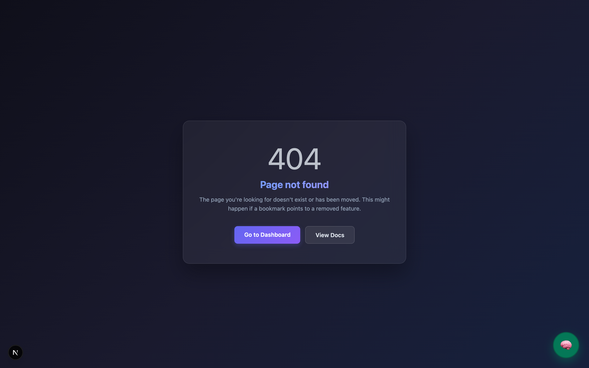

# ✦ Synalux

**The High-Performance Practice Management & Practice Automation Platform**

> Synalux is the first "Local-First" practice management system. It handles your entire clinic — patient records, scheduling, billing, and team chat — while ensuring that sensitive clinical data never leaves your device. Engineered for high-compliance healthcare environments (ABA, Pediatrics, Mental Health, Specialist Care).

  
  
  
  

🌐 **Global Ready:** [🇺🇸 🇬🇧 🇦🇺](README.md) | [🇪🇸 🇲🇽](docs/i18n/README_es.md) | [🇫🇷](docs/i18n/README_fr.md) | [🇧🇷 🇵🇹](docs/i18n/README_pt.md) | [🇷🇴](docs/i18n/README_ro.md) | [🇺🇦](docs/i18n/README_uk.md) | [🇷🇺](docs/i18n/README_ru.md) | [🇩🇪](docs/i18n/README_de.md) | [🇯🇵](docs/i18n/README_ja.md) | [🇰🇷](docs/i18n/README_ko.md) | [🇨🇳](docs/i18n/README_zh.md) | [🇸🇦](docs/i18n/README_ar.md)

---

## 🏗️ Elite Architecture & Clinical Logic

### 🏥 1. Intelligent Clinical Drafting (Provider-Controlled Documentation)
Synalux utilizes local-first intelligence to eliminate the documentation burden. Licensed providers retain 100% control over final signatures while gaining extreme administrative velocity.
- **WASM-Powered Transcription:** Record → Generate. Processes clinical audio 100% on-device using private, high-fidelity transcription engines.
- **Evidence-Based treatment Drafts:** "Draft a BIP for tantrums" — generates 80% complete drafts based on verified behavioral protocols.
- **Billing Intelligence:** Automated CPT code mapping (97151–97158) derived from exact session duration and clinical intensity.

### 🛡️ 2. Zero-Cloud HIPAA Enforcement (Security by Design)
Unlike traditional SaaS platforms, Synalux isolates Protected Health Information (PHI) to the local compute environment.
- **Local Computer Vision:** Multimodal analysis (LLaVA) for screenshots and clinical imagery is executed on-device, bypassing cloud API transit.
- **Ollama Integration:** Support for high-parameter reasoning models (32B/70B) for offline clinical decision support.
- **Fail-Closed Privacy:** Cloud processing is disabled by default; PHI is never sent to external servers for documentation generation.

### ⚡ 3. O(1) Cognitive Memory (Mathematically Direct Retrieval)
Synalux features a revolutionary **"Mind Palace"** memory architecture that recovers clinical facts without search.
- **Constant-Time Recall:** Structured patient history is bound into 1024-dimensional vectors using Holographic Reduced Representations (HRR). Facts are recovered in $O(1)$ time regardless of record count.
- **Contextual Precision:** The system maintains active awareness of current patients, open documents, and historical session notes for instant, accurate recall.

### 🔬 4. Deep Research Intelligence (v11.0 Elite Discovery)
The v11.0 engine transforms the assistant into a clinical scientist by grounding reasoning in real-time academic discovery.

| Provider | Type | Strategic Utility |
| :--- | :--- | :--- |
| **Tavily AI** | Advanced | Elite discovery engine that extracts evidence directly from clinical PDFs and web sources. |
| **PubMed (NCBI)** | Academic | Integration with the world's largest biomedical database for empirical clinical citations. |
| **ERIC (IES)** | Behavioral | Definitive database for ABA, Speech, and Pediatric educational interventions. |
| **Semantic Scholar** | AI-Academic | Provides high-signal "TLDR" scientific summaries for rapid reasoning. |

---

## 🛠️ Security Specification (Adversarial Hardened)

Synalux has undergone a 21-round adversarial security audit, resulting in 90+ identified and resolved findings.

### 🏜️ Terminal Sandbox & Execution
The execution engine uses an **11-layer defense-in-depth** strategy:
- **Executable Allowlist:** Only verified read-only tools and linters are permitted. Interpreters (`python3`, `node`) are blocked to prevent RCE.
- **Shell Metacharacter Blocking:** Strict regex-based rejection of pipes (`|`), redirection (`>`), and command substitution (`$()`).
- **Environment Sanitization:** Blocks 14 critical variables (e.g., `LD_PRELOAD`, `PYTHONPATH`) to prevent execution hijacking.

### 🕷️ SSRF Prevention (Web Scraper)
- **IPv4/v6 Resolution:** Comprehensive blocking of private, loopback, and link-local address space.
- **DNS Rebinding Protection:** Implements **IP Pinning** via a custom per-session `HTTPAdapter` to prevent TOCTOU attacks.
- **Redirect Enforcement:** Blocks 301/302 redirects to internal resources.

### 🔐 Clinical Data Integrity (Zod Validation)
- **Server-Side Enforcement:** Every clinical write operation (Vitals, Medications, Allergies) is validated against strict Zod schemas in the API layer.
- **Clinical Range Checks:** Enforces medical reality (e.g., heart rate limits, BP ranges) before database insertion.
- **XSS-Safe Processing:** Automatic stripping of `javascript:` URIs and HTML-safe string handling.

---

## ⚖️ Regulatory & Compliance Transparency

- **Non-ONC EHR:** Synalux is designed as a specialized practice management and clinical drafting tool. It is **not** an ONC-certified EHR and cannot be used for federal "Meaningful Use" incentive programs.
- **Clinical Decision Support (Administrative Aid):** Synalux is **not** an FDA-cleared Software as a Medical Device (SaMD). All AI-generated drafts must be independently reviewed and signed by a licensed provider.

---

## 📸 Product Specification

| 📊 1. Patient Dashboard | 🧠 2. Clinical SOAP Notes | 💬 3. Secure Team Chat |
|:---:|:---:|:---:|
|  |  |  |

| 👶 4. Pediatrics | 🦴 5. Physical Therapy | 🦷 6. Dental & Orthodontics |
|:---:|:---:|:---:|
|  |  |  |

---

## License
MIT / BSL-1.1

© 2024–2026 Dmitri Costenco. All rights reserved.
