# ✦ Synalux

**The Modular EHR Platform — AI-Native, HIPAA-Compliant, Specialty-Agnostic**

> Synalux is an open, modular Electronic Health Record platform that morphs its clinical language, data models, and AI behavior to match any healthcare specialty — from ABA therapy to pediatrics to dermatology. Powered by persistent knowledge graphs, 26+ multimodal tools, stateless JWT→RLS multi-tenancy, and a "Clinician-in-the-Loop" AI sandbox where **no AI output touches your data without your explicit signature**.

<p align="center">
  <a href="https://synalux.ai/app"></a>
  <a href="https://marketplace.visualstudio.com/items?itemName=synalux-ai.synalux"></a>
  <a href="https://synalux.ai/docs"></a>
  <a href="LICENSE"></a>
</p>

🌐 **Language / Язык / Limba:** [English](#-key-capabilities) · [Español](https://synalux.ai/docs?lang=es) · [Français](https://synalux.ai/docs?lang=fr) · [Português](https://synalux.ai/docs?lang=pt) · [Română](https://synalux.ai/docs?lang=ro) · [Українська](https://synalux.ai/docs?lang=uk) · [Русский](https://synalux.ai/docs?lang=ru) · [Deutsch](https://synalux.ai/docs?lang=de) · [日本語](https://synalux.ai/docs?lang=ja) · [한국어](https://synalux.ai/docs?lang=ko) · [中文](https://synalux.ai/docs?lang=zh) · [العربية](https://synalux.ai/docs?lang=ar)

🎬 **[▶ Watch the Demo (5 min, narrated in 11 languages)](synalux_demo.mp4)** — Full ABA therapy workflow: Patient Dashboard → Voice Dictation → SOAP Notes → FBA → BIP → ABC Data → Progress Reports → E-Signatures → Team Chat → RBAC Roles

---

## ⚡ The "Wow" Factors

* **🛡️ AI Sandbox — "Clinician-in-the-Loop":** Synalux is the first EHR where the AI **can't touch your data without your signature**. Every AI-generated clinical change (medications, vitals, diagnoses) is presented as a `ProposedChange` with a red/green Before→After diff. The clinician must explicitly **Apply** or **Reject** each change before it writes to the database. This prevents prompt injection from ever modifying clinical records.
* **🔐 Stateless RLS — Horizontal Scaling Without Session Overhead:** Multi-tenant data isolation uses signed JWTs mapped to Postgres Row-Level Security policies — no session variables, no connection pools per tenant. This means Synalux scales horizontally without the typical Postgres connection overhead that cripples legacy EHRs.
* **🧠 Persistent Semantic Memory:** Built on the [Prism MCP](https://github.com/dcostenco/prism-mcp), Synalux never suffers from "context amnesia." It remembers patient treatment histories across sessions and project architectures across IDE reloads, isolated securely by `workspace_id`.
* **🏥 Instant Specialty Morphing:** The entire UI changes its clinical language, data models, and module layout based on the selected specialty. ABA practices see ABC data sheets and behavior interval tracking. Pediatricians see growth percentiles and immunization schedules. Dermatologists see body mapping and lesion tracking — all from the same platform.
* **🎙️ Zero-Click Ambient Intake:** Clinicians hit "Record" on their iPad. Synalux uses in-browser **WASM Whisper** (PHI never leaves the device) to detect utterance boundaries via VAD and silently builds structured SOAP/FBA/BIP reports in real-time.
* **⚡ Prompt-Level RBAC:** Synalux doesn't just hide UI buttons — it cryptographically signs Tool ACLs. If an RBT asks the AI to run a terminal command, the Next.js API strips the tool from the execution context before the LLM even sees it.

---

## 🏥 Supported Practice Types

Synalux is a **multi-practice enterprise platform** supporting 6 medical specialties out of the box. Each practice type includes specialty-specific clinical templates, billing codes, fee schedules, and workflows.

<details>
<summary><h3>🧩 Applied Behavior Analysis (ABA)</h3></summary>

| Feature | Details |
|---------|---------|
| **Clinical Templates** | FBA, BIP, ABC Data Collection, Session Notes, Progress Reports, Discharge Summary |
| **Billing Codes** | 97151 (Assessment), 97153 (Protocol), 97155 (Modification), 97156 (Family Guidance), 97157 (Group) |
| **RBAC Roles** | BCBA (Full clinical), RBT (Session notes only), Office Manager |
| **Voice Dictation** | Ambient session recording → auto-structured SOAP notes |
| **E-Signatures** | BoldSign integration for parent/guardian consent |
| **Data Tracking** | Behavioral targets, skill acquisition, frequency/duration data |
| **Insurance** | Autism/ABA-specific payer rules, prior auth tracking |

</details>

<details>
<summary><h3>👶 Pediatrics</h3></summary>

| Feature | Details |
|---------|---------|
| **Clinical Templates** | Well-child exams, sick visits, immunization tracking, developmental screening |
| **Billing Codes** | 99392–99395 (Preventive), 99213–99215 (Office visits), 90460 (Immunization) |
| **Patient Portal** | Parent/guardian access, growth charts, immunization records, appointment booking |
| **Asthma Management** | Action plans, peak flow tracking, rescue inhaler logs |
| **ADHD Workflow** | Vanderbilt scoring, medication management, school accommodation letters |
| **Insurance** | BCBS, UHC, Medicaid — auto-eligibility verification |

</details>

<details>
<summary><h3>🦷 Dental & Orthodontics</h3></summary>

| Feature | Details |
|---------|---------|
| **Clinical Templates** | Comprehensive exam, perio charting, treatment planning, operative notes |
| **Billing Codes (CDT)** | D0150 (Exam), D0210 (FMX), D2740 (Crown), D3330 (RCT), D6010 (Implant), D8080 (Ortho) |
| **Treatment Sequencing** | Multi-phase treatment plans (Root canal → Crown → Follow-up) |
| **Ortho Management** | Monthly adjustments, payment plans ($194/mo × 18 months), progress tracking |
| **Implant Workflow** | Surgical planning, guided surgery, healing abutment, prosthesis phases |
| **Perio Charting** | SRP quadrant tracking, pocket depths, bone loss classification |
| **Payment Plans** | Stripe-powered installment plans with autopay for high-value procedures |
| **Insurance** | Delta Dental, MetLife, Cigna — annual max tracking, pre-determination |

</details>

<details>
<summary><h3>🧠 Mental Health & Psychiatry</h3></summary>

| Feature | Details |
|---------|---------|
| **Clinical Templates** | Psychiatric eval, psychotherapy notes, CBT/CPT protocols, safety plans |
| **Billing Codes** | 90791 (Psych eval), 90834/90837 (Therapy 45/60min), 99214 (Med management) |
| **Outcome Measures** | PHQ-9, GAD-7, PTSD-5, BDI-II — auto-scored with trend tracking |
| **Medication Tracking** | Prescriptions, dose changes, side effects, drug interactions |
| **Trauma Therapy (CPT)** | 12-session protocol, stuck point logs, impact statement drafts |
| **Crisis Protocol** | Urgent message flags, safety plan templates, crisis hotline integration |
| **Telehealth** | Zoom integration, consent tracking, session recording (with consent) |
| **Insurance** | Anthem BCBS, Aetna, Cigna Behavioral — auth tracking for session limits |

</details>

<details>
<summary><h3>🏃 Physical Therapy & Sports Medicine</h3></summary>

| Feature | Details |
|---------|---------|
| **Clinical Templates** | PT evaluation, ROM/strength assessment, functional outcome measures |
| **Billing Codes** | 97162 (PT eval), 97110 (Exercise), 97116 (Gait), 97140 (Manual), 97530 (Functional) |
| **Rehab Protocols** | ACL reconstruction, rotator cuff, chronic pain, neuro rehab — phased progression |
| **Outcome Tracking** | ROM degrees, manual muscle testing (MMT), LEFS/DASH scores |
| **Home Exercise Programs** | Auto-generated HEP with images, frequency, sets/reps |
| **Work Comp / Sports** | Return-to-play protocols, FCE documentation, work restrictions |
| **Insurance** | Medicare (therapy caps), workers' comp, auto-accident PIP — auth tracking |

</details>

<details>
<summary><h3>🔬 Dermatology</h3></summary>

| Feature | Details |
|---------|---------|
| **Clinical Templates** | Skin exam, biopsy reports, pathology tracking, phototherapy logs |
| **Billing Codes** | 99214 (Office visit), 11102 (Biopsy), 17000 (Cryotherapy), 96401 (Chemo SC/IM) |
| **Melanoma Screening** | Full-body mapping, dermoscopy documentation, ABCDE criteria |
| **Accutane (iPLEDGE)** | Monthly labs (CBC, LFT, lipid), pregnancy testing, iPLEDGE compliance tracking |
| **Biologics Management** | Humira/Dupixent dosing, prior auth, injection scheduling, phototherapy logs |
| **Photo Documentation** | Lesion before/after tracking, body map annotations |
| **Lab Integration** | Quest/LabCorp order routing, result auto-import |
| **Insurance** | Prior auth for biologics, step therapy documentation, appeal templates |

</details>

---

## 📦 Platform Modules

Every module is multi-tenant, workspace-scoped, and HIPAA-compliant with strict row-level security.

<details>
<summary><h3>💳 Billing & Payments Module</h3></summary>

The billing module uses **Stripe Connect** to give each practice its own independent payment processing account linked to the practice administrator.

**Per-Practice Billing Configuration:**
| Setting | Details |
|---------|---------|
| **Stripe Connect** | Each workspace has its own `acct_xxx` Stripe Connect account |
| **Admin Linked** | Stripe account ownership is linked to the workspace admin user |
| **Fee Schedules** | Per-practice fee schedules with standard, insurance, Medicare, and self-pay rates |
| **Payment Methods** | Credit card, ACH/bank transfer, check, cash — configurable per practice |
| **Auto-Posting** | Automatic payment posting, receipt sending, and monthly statement generation |
| **Tax Configuration** | Per-practice tax rates and NPI/EIN for 1099 reporting |

**Revenue Cycle Management:**
- Insurance claim lifecycle tracking (draft → submitted → accepted → paid/denied → appeal)
- ERA/EOB electronic remittance processing
- Denial management with appeal deadline tracking
- Prior authorization workflow
- Aging reports (30/60/90/120 day buckets)

**Patient Payments:**
- Patient portal "Pay Now" → Stripe Checkout redirect
- Partial payments and custom amounts
- Payment plans with Stripe recurring subscriptions
- Receipt generation and download
- Refund processing

**Insurance Claims:**
- Electronic claim submission (837P)
- Real-time eligibility verification
- Coordination of Benefits (COB)
- Explanation of Benefits (EOB) tracking
- Appeal management with letter templates

</details>

<details>
<summary><h3>🏥 Patient Portal</h3></summary>

A full-featured patient-facing portal with authentication, messaging, documents, appointments, and billing.

| Feature | Details |
|---------|---------|
| **Authentication** | Access code login (SHA-256 hashed), expiration tracking |
| **Dashboard** | Health overview with upcoming appointments, unread messages, pending documents, balance due |
| **Messaging** | Threaded conversations with providers, urgent flags, read receipts |
| **Documents** | View/download clinical documents, upload insurance cards and forms |
| **Appointments** | View upcoming/past visits, request new appointments with preferred times |
| **Billing** | View balance, billing history with CPT codes, pay online via Stripe, payment plans, receipts |
| **Forms** | Complete intake forms, PHQ-9/GAD-7 questionnaires, consent forms online |
| **Consents** | Digital consent management (treatment, HIPAA, telehealth, medication, research) |

</details>

<details>
<summary><h3>👥 HR & Staff Management Module</h3></summary>

| Feature | Details |
|---------|---------|
| **Staff Profiles** | Employment type, hire date, salary/hourly rate, specialties, department tracking |
| **Credentials** | License/certification tracking with expiration alerts and renewal workflows |
| **Time Off** | Vacation, sick, CE, maternity, bereavement, jury duty — approval workflows |
| **Training** | Compliance training tracking (HIPAA, BLS, CPR) with due dates and completion status |
| **Performance Reviews** | Annual/semi-annual reviews with ratings, goals, improvement plans, and acknowledgment |
| **Onboarding** | Pending onboarding status, credential verification pipeline, training assignments |

</details>

<details>
<summary><h3>📋 Clinical Notes & Documentation</h3></summary>

| Feature | Details |
|---------|---------|
| **SOAP Notes** | AI-generated from voice dictation with specialty-specific templates |
| **Voice Dictation** | WASM Whisper on-device → zero cloud PHI transmission |
| **4 Note Templates** | Therapy Session, Progress Note, Initial Evaluation, Discharge Summary |
| **Documents** | Lab results, imaging, consents, assessments, treatment plans — all workspace-scoped |
| **PDF Export** | Server-side rendering (no client-side PHI leakage) |
| **E-Signatures** | BoldSign integration with 7 document templates |
| **OCR** | Document scanning in 30+ languages for intake form digitization |

</details>

<details>
<summary><h3>📅 Scheduling & Appointments</h3></summary>

| Feature | Details |
|---------|---------|
| **Appointment States** | Scheduled → Confirmed → In-Progress → Completed (+ cancelled, no-show, rescheduled) |
| **Patient Portal Requests** | Patients request appointments with preferred date/time → staff confirms or denies |
| **Multi-Provider** | Schedule across providers within a practice |
| **Recurring Visits** | Weekly therapy sessions, monthly check-ups, ortho adjustments |
| **Waitlist** | Waitlisted appointment requests when slots are full |
| **Reminders** | Automated appointment reminders (planned) |

</details>

<details>
<summary><h3>🧪 Lab Orders & Results Module</h3></summary>

| Feature | Details |
|---------|---------|
| **Lab Orders** | Order tracking with vendor (Quest, LabCorp, in-house), priority (routine/urgent/stat) |
| **Result Tracking** | Individual test results with reference ranges and abnormal flags (low/high/critical) |
| **Categories** | Hematology, Chemistry, Lipid, Liver, Thyroid, Vitamin, Inflammation, Coagulation |
| **Abnormal Alerts** | Automatic flagging of out-of-range results (e.g., elevated TSH, low Vitamin D) |
| **iPLEDGE Labs** | Monthly Accutane monitoring: CBC, CMP, lipid panel, LFTs with trend tracking |
| **Pre-Surgical** | INR, PT, glucose, A1C clearance for dental implants and surgical procedures |
| **Medication Monitoring** | SSRI thyroid checks, stimulant lipid panels, biologic baseline panels |
| **Order Lifecycle** | Ordered → Collected → Sent → Received → In Progress → Resulted → Reviewed |
| **Vendor Integration** | Quest Diagnostics, LabCorp order routing (planned: electronic result import) |
| **Diagnosis Linking** | ICD-10 codes attached to orders for medical necessity documentation |

</details>

<details>
<summary><h3>💊 Medications & Prescriptions Module</h3></summary>

| Feature | Details |
|---------|---------|
| **Drug Catalog** | 12+ medications with NDC codes, drug classes, schedules, routes, common doses |
| **Active Prescriptions** | Per-patient medication list with dose, frequency, prescriber, pharmacy, refill tracking |
| **Drug Classes** | SSRIs, stimulants, retinoids, biologics, bronchodilators, NSAIDs, antibiotics, anticonvulsants |
| **iPLEDGE Tracking** | Accutane isotretinoin monitoring with monthly lab requirements |
| **Status Lifecycle** | Active → On Hold → Discontinued → Completed → Cancelled |
| **Interaction Warnings** | Drug-specific warnings array (serotonin syndrome, QTc, teratogenic) |
| **Pharmacy Routing** | Named pharmacy per prescription for e-prescribe readiness |

</details>

<details>
<summary><h3>📊 Vitals & Measurements Module</h3></summary>

| Feature | Details |
|---------|---------|
| **Standard Vitals** | BP (systolic/diastolic), HR, RR, temp (with method), SpO2, weight, height, BMI |
| **Pain Scale** | 0-10 numeric pain scale per visit |
| **Pediatric Growth** | Head circumference, weight/height/BMI percentiles (WHO/CDC) |
| **PT Assessments** | ROM degrees, functional scores (Oswestry, LEFS), quad activation notes |
| **Trend Tracking** | Historical vitals per patient for trend analysis |
| **Appointment Linked** | Vitals tied to specific appointment encounters |

</details>

<details>
<summary><h3>⚠️ Allergies & Alerts Module</h3></summary>

| Feature | Details |
|---------|---------|
| **Allergen Types** | Drug, food, environmental, latex, contrast, other |
| **Severity Levels** | Mild, moderate, severe, life-threatening |
| **Reaction Tracking** | Specific reaction documentation (anaphylaxis, SJS, hives, GI upset) |
| **NKDA Support** | Explicit "No Known Drug Allergies" documentation |
| **Clinical Alerts** | Critical allergy flags (Penicillin → use clindamycin, Sulfa → SJS history) |
| **Verification** | Provider verification with date stamps |

</details>

<details>
<summary><h3>💉 Immunizations Module</h3></summary>

| Feature | Details |
|---------|---------|
| **Vaccine Tracking** | CVX codes, dose numbers, lot numbers, manufacturers |
| **Administration** | Site, route (IM/SC/PO/IN/ID), administering provider |
| **VIS Compliance** | Vaccine Information Statement date tracking |
| **Registry Reporting** | State immunization registry submission tracking |
| **CDC Schedule** | DTaP, IPV, MMR, Varicella, Hep A/B, Influenza, Tdap |
| **Immunocompromised** | Special vaccine recommendations for biologic patients |

</details>

<details>
<summary><h3>🔄 Referrals & Cross-Practice Chat Module</h3></summary>

| Feature | Details |
|---------|---------|
| **Referral Tracking** | From/to provider, specialty, reason, diagnosis codes, urgency, auth tracking |
| **Status Lifecycle** | Pending → Sent → Accepted → Scheduled → Completed / Expired / Declined |
| **Cross-Practice Chat** | HIPAA-compliant messaging between practice admins/office managers |
| **Attachment Sharing** | Send images, X-rays, documents, lab results, prescriptions between practices |
| **Threaded Conversations** | Per-referral chat threads with read receipts |
| **Real Examples** | Peds→Psychiatry (ADHD), Derm→PT (psoriatic arthritis), PT→Derm (wound care) |
| **Authorization Tracking** | Auth numbers, expiry dates, prior auth requirement flags |

</details>

<details>
<summary><h3>📋 Clinical Tasks Module</h3></summary>

| Feature | Details |
|---------|---------|
| **Task Categories** | Lab follow-up, prior auth, scheduling, documentation, billing, call patient, refill, referral |
| **Priority Levels** | Low, normal, high, urgent |
| **Assignment** | Assigned to specific staff with due dates and completion tracking |
| **Patient Linked** | Tasks tied to specific patients for care coordination |
| **Status Tracking** | Open → In Progress → Completed / Cancelled / Deferred |
| **Audit Trail** | Created by, completed by, completed at timestamps |

</details>

<details>
<summary><h3>🏥 Patient Insurance Module</h3></summary>

| Feature | Details |
|---------|---------|
| **Plan Details** | Payer, plan name, member ID, group number, subscriber relationship |
| **Cost Sharing** | Copay amount, coinsurance %, deductible, deductible met, out-of-pocket max |
| **Primary/Secondary** | Multi-payer support with primary/secondary designation |
| **Verification** | Verification status with verified date |
| **Medicare/Medicaid** | MBI tracking, therapy cap tracking, remaining benefit amounts |
| **All Major Payers** | BCBS, UHC, Anthem, Aetna, Delta Dental, MetLife, Cigna, Humana, Medicare |

</details>

<details>
<summary><h3>🔔 Recalls & Reminders Module</h3></summary>

| Feature | Details |
|---------|---------|
| **Recall Types** | Hygiene, annual exam, follow-up, lab recheck, imaging, screening, vaccination, med review |
| **Status Tracking** | Due → Overdue → Scheduled → Completed → Cancelled |
| **Contact Attempts** | Track outreach attempts for overdue recalls |
| **Practice-Specific** | Dental 6-month cleanings, derm annual skin checks, Accutane monthly labs |
| **Auto-Due Dates** | Based on last completed visit |

</details>

<details>
<summary><h3>📦 Inventory Management Module</h3></summary>

| Feature | Details |
|---------|---------|
| **Categories** | Dental supplies, vaccines, medications, biologics, PPE, surgical, lab supplies, office |
| **Stock Tracking** | Quantity on hand, reorder level, reorder quantity, unit cost |
| **Lot & Expiry** | Lot numbers, expiration dates, FIFO rotation for vaccines |
| **Supplier Tracking** | Henry Schein, Patterson Dental, Nobel Biocare, McKesson, Sanofi Pasteur |
| **Status Alerts** | In stock, low stock, out of stock, expired, discontinued |
| **Storage Locations** | Vaccine fridge (2-8°C), biologic fridge, operatory cabinets, locked cabinets |
| **Specialty Items** | Implant fixtures ($285), biologic pens ($2,850), cryotherapy canisters |

</details>

<details>
<summary><h3>🧾 Superbills Module</h3></summary>

| Feature | Details |
|---------|---------|
| **Encounter-Based** | One superbill per visit with diagnosis + procedure codes |
| **Multi-Code** | ICD-10 diagnosis arrays + CPT/CDT procedure arrays + modifiers (-25, -59) |
| **Financial Breakdown** | Total charge, insurance billed, patient copay, adjustments |
| **Status Lifecycle** | Draft → Review → Submitted → Paid / Denied / Appealed |
| **All Specialties** | Well-child visits, implants, ortho, psychotherapy, PT rehab, derm procedures |
| **Medicare Write-offs** | Automatic adjustment tracking for Medicare contractual obligations |

</details>

<details>
<summary><h3>📚 Patient Education Module</h3></summary>

| Feature | Details |
|---------|---------|
| **Material Catalog** | 14 education documents across all specialties |
| **Multi-Language** | English + Spanish materials available |
| **Categories** | Condition, medication, procedure, lifestyle, post-op, home exercise, safety, preventive |
| **Delivery Methods** | Printed, portal upload, email, in-person, text |
| **Acknowledgment** | Track whether patient viewed/acknowledged the material |
| **Specialty Examples** | EpiPen guide, Accutane safety, ACL rehab, CBT homework, implant post-op |

</details>

<details>
<summary><h3>📊 Quality Measures Module (HEDIS/MIPS)</h3></summary>

| Feature | Details |
|---------|---------|
| **Measure Types** | HEDIS, MIPS, CMS Star Ratings, Joint Commission, custom |
| **8 Core Measures** | Well-child visits, immunizations, depression screening, tobacco screening, antidepressant management, referral loop, BMI screening, MH follow-up |
| **Performance Tracking** | Numerator, denominator, exclusions, performance rate calculation |
| **Benchmarking** | Below / At / Above / Top Performer ratings vs national benchmarks |
| **Reporting Periods** | Annual and quarterly reporting support |
| **Practice Results** | Per-workspace compliance tracking with trend analysis |

</details>

<details>
<summary><h3>🔐 Security & Compliance</h3></summary>

| Feature | Details |
|---------|---------|
| **HIPAA Compliance** | Full HIPAA audit trail, BAA-ready architecture |
| **RBAC** | 11 cryptographically-signed roles with tool-level ACLs |
| **Multi-Tenant Isolation** | All records scoped by `workspace_id` with row-level security |
| **EdDSA Authentication** | Ed25519 signed JWTs (15-min expiry) |
| **Encryption at Rest** | Transparent Data Encryption for all PHI |
| **Audit Logs** | Immutable `rbac_audit_log` for all role assignments, file access, and message actions |
| **HITL Safety Gate** | Dangerous tools require explicit user approval modal |
| **Fail-Closed HIPAA Mode** | Refuses mic access if local LLM unavailable (no silent cloud fallback) |
| **Data Minimization** | No `localStorage` for PHI, explicit React state nulling, `Cache-Control: no-store` |

</details>

<details>
<summary><h3>💬 Team Chat & Communication</h3></summary>

| Feature | Details |
|---------|---------|
| **E2E Encrypted Chat** | HIPAA-compliant team messaging within workspaces |
| **AI Context Sharing** | Generate treatment plan → "Share Session" → forward to billing channel |
| **Voice-to-Action** | Voice commands → call, SMS, email, schedule (Pro+) |
| **Channels** | Department-based channels (Clinical, Billing, Admin) |
| **File Attachments** | Share documents, images, and clinical assets in chat |

</details>

---

## 🏥 Synalux Health: The Clinical Web App

*Access anywhere via iPad, Chromebook, or Desktop at [`synalux.ai/app`](https://synalux.ai/app).*

<details>
<summary><strong>The "Intake Room"</strong> — A zero-install PWA designed for ABA therapists</summary>

* **Smart Mic:** Uses the Page Visibility API + `window.onblur` to automatically pause recording if the clinician switches tabs or windows, preventing accidental ambient capture of other patients.
* **SOAP & BIP Generation:** Speak naturally. Synalux automatically categorizes your dictation into Subjective, Objective, Assessment, and Plan fields using 4 specialized templates.
* **Document Builder:** Edit the generated markdown, attach a patient intake template, and push it directly to BoldSign for parent/guardian E-Signatures in one click.
* **Server-Side PDF:** Documents are rendered server-side to prevent client-side PHI memory leakage — no `html2pdf.js` artifacts.
* **HIPAA-Hardened:** 15-minute idle timeout, no `localStorage` for PHI, explicit React state nulling on session clear, `Cache-Control: no-store` on all API responses.

**Templates:**

| Template | Use Case |
|----------|----------|
| 🧩 Therapy Session | ABA/behavioral therapy session notes |
| 📈 Progress Note | Ongoing treatment progress tracking |
| 📝 Initial Evaluation | First assessment and intake documentation |
| 🏁 Discharge Summary | Treatment completion and transition planning |

</details>

---

## 🧑‍💻 Synalux Dev: The VS Code Extension

*The ultimate memory-augmented IDE assistant.*

<details>
<summary><strong>Multi-Agent Orchestrator</strong> — Don't just chat; delegate</summary>

Describe a task (e.g., *"Add Stripe checkout and write tests"*), and Synalux will spawn a `planner` agent to break it down, a `coder` agent to write the implementation, and a `tester` agent to run Vitest in your terminal until the build passes.

* **Safe Mode Sandbox:** High-risk shell commands (`terminal`, `git_tool`, `browser`) require explicit user approval via a modal confirmation dialog before execution.
* **Dependency Audits:** Built-in tools scan your `package.json` against CVE databases automatically.
* **Prism Integration:** Synalux reads your codebase architecture and previous architectural decisions before writing a single line of code.

**17 Integrated Tools:**

| Category | Tools |
|----------|-------|
| 🖥️ Development | `terminal`, `git_tool`, `vitest`, `node_tool`, `browser` |
| 📝 Documentation | `soap_templates`, `boldsign`, `ocr`, `file_manager` |
| 🎙️ Multimodal | `voice`, `tts`, `screenshot`, `image_analyze` |
| 🔌 Integrations | `jira`, `confluence`, `slack`, `webhooks` |

</details>

---

<details>
<summary><h2>🔐 11 RBAC Roles</h2></summary>

Each role has a cryptographically signed Tool ACL and a server-injected system prompt:

| Role | Tools | Target |
|------|-------|--------|
| 🧑‍💻 `coder` | terminal, git, vitest, node, browser | Software engineers |
| 🏥 `bcba` | soap, voice, boldsign, file_manager | Board Certified Behavior Analysts |
| 🧑‍⚕️ `rbt` | soap, voice, file_manager | Registered Behavior Technicians |
| 🏢 `office` | file_manager, boldsign, slack | Office Managers |
| 📋 `manager` | jira, confluence, slack, file_manager | Project Managers |
| ✍️ `writer` | file_manager, browser, screenshot | Technical Writers |
| 🔒 `security` | terminal, git, browser | Security Engineers |
| 🧪 `tester` | vitest, terminal, browser | QA Engineers |
| ⚙️ `devops` | terminal, git, webhooks | DevOps/SRE |
| 📊 `planner` | jira, confluence, webhooks | Product Managers |
| 🚫 `restricted` | *(none)* | Read-only observers |

</details>

---

<details>
<summary><h2>🛡️ Enterprise Security & HIPAA Architecture</h2></summary>

Synalux is engineered for zero-trust environments.

### Security Architecture — Multi-Tenant Request Flow

```mermaid
flowchart LR
    subgraph Client
        A["Browser / VS Code"]
    end

    subgraph Edge ["Vercel Edge (Next.js Middleware)"]
        B["Auth Check\n(NextAuth Session)"]
        C["JWT Signing\n(Ed25519 / 15 min TTL)"]
    end

    subgraph API ["Next.js API Routes"]
        D["Tool ACL Enforcement\n(RBAC from workspace_roles)"]
        E["AI Sandbox\n(ProposedChange)"]
        F["HIPAA Audit Log\n(Immutable)"]
    end

    subgraph DB ["Supabase PostgreSQL"]
        G["RLS Policies\n(JWT → set_config)"]
        H["Multi-Tenant Data\n(workspace_id isolation)"]
    end

    A -->|"1. Google OAuth"| B
    B -->|"2. Sign JWT with Ed25519"| C
    C -->|"3. JWT in Authorization header"| D
    D -->|"4. Stripped tool context"| E
    E -->|"5. ProposedChange (Apply/Reject)"| F
    F -->|"6. Audit trail written"| G
    G -->|"7. RLS filters by workspace_id"| H
```



**Key insight:** Because JWTs carry `workspace_id` claims and Postgres RLS policies read them via `current_setting('request.jwt.claims')`, there are **no server-side session variables** and **no per-tenant connection pools**. This is what makes Synalux horizontally scalable — a critical advantage over legacy EHRs that use connection-per-session models.

### Security Controls

* **EdDSA (Ed25519) Authentication:** Static API tokens are demoted to refresh-only status. All API requests are authenticated via short-lived (15 min) JWTs signed with asymmetric cryptography.
* **Transparent Data Encryption (TDE):** All team messages, generated documents, and session histories are encrypted at rest.
* **Strict Data Minimization:** Web App transcripts live strictly in React state memory and are garbage-collected the moment a tab is closed. `localStorage` is never used for PHI.
* **MIME-Gated File Storage:** Clinical attachments are restricted by strict server-side MIME verification and served exclusively via 15-minute signed URLs with IDOR prevention.
* **Immutable Audit Logs:** Every role assignment, file download, and message deletion is permanently recorded in the `rbac_audit_log` for compliance non-repudiation. Audit rows are append-only — even database admins cannot modify historical entries.
* **HITL Safety Gate:** Dangerous tools (`terminal`, `git_tool`, `browser`) require explicit user approval via a modal dialog before execution — preventing zero-click RCE via prompt injection.
* **Fail-Closed HIPAA Mode:** If the local LLM (Ollama) is unavailable during clinical voice intake, the system refuses to open the microphone rather than silently falling back to cloud processing.
* **StaleDataBanner (Patient Safety):** If clinical data hasn't been refreshed in the current session, a banner alerts the clinician, preventing treatment decisions based on outdated information.

### HIPAA Compliance Statement

| HIPAA Requirement | Synalux Implementation |
|---|---|
| **§164.312(a)(1)** Access Control | JWT-based RBAC with per-tool ACLs; RLS enforces tenant isolation at the database layer |
| **§164.312(b)** Audit Controls | Immutable `hipaa_audit_log` + `rbac_audit_log` — every PHI access is recorded with user, action, resource, and timestamp |
| **§164.312(c)(1)** Integrity | AI Sandbox (`ProposedChange`) ensures no automated writes to clinical data without clinician signature |
| **§164.312(d)** Authentication | Ed25519 asymmetric JWTs (15 min TTL); Google OAuth with MFA for clinical roles |
| **§164.312(e)(1)** Transmission Security | TLS 1.3 enforced on all endpoints; Supabase connections use SSL; no PHI in URL parameters |
| **§164.310(d)(1)** Data Encryption | AES-256 at rest (Supabase TDE); WASM Whisper for on-device transcription (PHI never transmitted) |
| **§164.308(a)(1)** Risk Analysis | Adversarial security reviews (`REVIEW_PROMPT.md`); automated output guardrails with rolling-window SSE scanning |
| **No LocalStorage** | All clinical data lives in React state (garbage-collected on tab close) or Postgres (RLS-protected). Zero browser persistence of PHI |

> **BAA Coverage:** Full HIPAA compliance with BAA requires Vercel Enterprise + Supabase Team tier. See [Infrastructure & Cloud Services](#-infrastructure--cloud-services) for pricing.

</details>

---

---

## 🚀 Getting Started

### For Healthcare & Clinics (Web App)
1. Go to [synalux.ai/app](https://synalux.ai/app).
2. Sign in with Google (MFA required for clinical roles).
3. Select **Therapy Session** from the template dropdown.
4. Type or dictate your clinical notes.
5. Click **📤 Generate SOAP Note** and review the streamed output.

### For Developers (VS Code)
1. Install the extension: `ext install synalux-ai.synalux`
2. Press `Cmd+Shift+P` → **Synalux: Sign In with Google**
3. Open the chat panel and type: `@coder Scaffold a new Next.js route for user profiles.`

### For Clinics Wanting 100% Local
```bash
# 1. Install Ollama
brew install ollama     # macOS

# 2. Pull a model
ollama pull qwen2.5-coder:14b

# 3. Enable CORS for the web app
OLLAMA_ORIGINS="https://synalux.ai" ollama serve

# 4. Open synalux.ai/app → toggle backend to "Local"
```

---

<details>
<summary><h2>☁️ Infrastructure & Cloud Services</h2></summary>

Synalux runs on a **serverless-first architecture** using 6 cloud services. No Azure, AWS, or GCP VMs are needed.

### Current Stack (All Free Tiers)

| Service | Role | Current Plan | Cost | Free Tier Limit |
|---------|------|-------------|------|-----------------|
| **Vercel** | Hosting + Edge + CDN | Hobby | $0/mo | 100GB bandwidth, 100GB-hrs serverless |
| **Supabase** | PostgreSQL + Auth + RLS | Free | $0/mo | 500MB DB, 50K MAU, 1GB storage |
| **Stripe** | Payments + Subscriptions | Standard | 2.9% + 30¢/txn | No monthly fee, unlimited products |
| **Google Cloud** | Gemini AI + OAuth + Transcription | Free tier | $0/mo | 15 RPM Gemini, unlimited OAuth |
| **OpenRouter** | Multi-model LLM routing | Free models | $0/mo | Unlimited `:free` model requests |
| **GitHub** | Source control + CI/CD | Free | $0/mo | Unlimited private repos, 2000 CI min/mo |

### AI Models & Routing

Synalux routes AI requests through a **dual-backend architecture**:

**Cloud Backend (via OpenRouter + Gemini fallback)**
| User Plan | Default Model | Max Tokens | Daily Limit |
|-----------|---------------|-----------|-------------|
| Free | Gemma 3 12B `:free` | 2,048 | 10K tokens |
| Standard | Gemma 3 27B `:free` | 4,096 | 100K tokens |
| Pro | Gemma 4 31B `:free` | 8,192 | 500K tokens |
| Enterprise | Gemma 4 31B `:free` | 16,384 | 5M tokens |

**Selectable Models (by tier)**
| Model | Free | Standard | Pro | Enterprise |
|-------|------|----------|-----|-----------|
| Gemma 3 12B | ✅ | ✅ | ✅ | ✅ |
| Gemini 2.5 Flash | — | ✅ | ✅ | ✅ |
| Claude Sonnet 4 | — | — | ✅ | ✅ |
| GPT-4.1 | — | — | ✅ | ✅ |
| Gemini 2.5 Pro | — | — | ✅ | ✅ |
| Claude Opus 4 | — | — | — | ✅ |
| o3-pro | — | — | — | ✅ |

**Local Backend (Ollama — 100% on-device, no tier gating)**
| Model | RAM Required |
|-------|-------------|
| Qwen 2.5 Coder 14B | 18GB |
| DeepSeek R1 14B | 18GB |
| Qwen 2.5 Coder 32B | 36GB |
| DeepSeek R1 32B | 36GB |

**Google Gemini (Free Tier — Direct Fallback)**
| Feature | Limit |
|---------|-------|
| Model | `gemini-2.5-flash` |
| Rate limit | 15 requests/minute |
| Input context | 1M tokens |
| Voice transcription | Gemini-powered, free tier |

> **Why Gemini as fallback?** When OpenRouter is down or rate-limited, the chat API
> falls back to Google's Gemini API directly. This gives us a free, reliable safety net
> with tool-calling support. No API key cost — Google's free tier is generous.

### Scaling Thresholds

| Clients | Action Required | Monthly Cost |
|---------|----------------|-------------|
| **1–100** | ⚠️ Upgrade Vercel to Pro (commercial use required) | **$20** |
| **100–1,000** | Upgrade Supabase to Pro (8GB DB, daily backups) | **$45** |
| **1,000–10,000** | Add Vercel Pro + Supabase Pro + CDN for videos | **$50–100** |
| **10,000+** | Vercel Pro + Supabase Team + custom Stripe rate | **$650+** |
| **HIPAA Required** | Vercel Enterprise + Supabase Team (BAA) | **$1,100+** |

### Enterprise Tier Pricing

| Service | Enterprise Plan | Price | What You Get |
|---------|----------------|-------|-------------|
| **Vercel** | Enterprise | ~$500+/mo (custom) | BAA, SSO/SAML, SLA, dedicated support, WAF |
| **Supabase** | Team | $599/mo | BAA, SOC2, HIPAA, 100GB DB, priority support |
| **Supabase** | Enterprise | Custom | HIPAA+BAA, dedicated infra, custom SLA |
| **Stripe** | Custom | Negotiated | 2.5% + 25¢ at $50K+/mo volume |
| **OpenRouter** | Pay-per-token | ~$0.001–0.03/1K tokens | Non-free models (Claude Opus, GPT-4.1, o3) |
| **Google Cloud** | Pay-as-you-go | $0 (free tier sufficient) | Upgrade only if exceeding 15 RPM |

### Why Not Azure or AWS?

Synalux deliberately avoids Azure, AWS, and traditional IaaS:

| Concern | How Synalux Handles It | Why Not Azure/AWS |
|---------|----------------------|-------------------|
| **Hosting** | Vercel (zero-config Next.js, global CDN, auto-scaling) | Azure App Service requires manual scaling, SSL config, CI/CD setup |
| **Database** | Supabase (managed Postgres + built-in RLS + Auth + Realtime) | Azure SQL/RDS requires manual RLS policies, separate auth service |
| **AI/LLM** | OpenRouter + Gemini (multi-model routing, free tiers) | Azure OpenAI requires $200+/mo commitment, limited model selection |
| **Auth** | NextAuth + Google OAuth (zero cost, built-in) | Azure AD B2C is $0.00325/auth, complex setup |
| **Payments** | Stripe (industry standard, PCI-compliant) | No Azure/AWS equivalent |
| **CI/CD** | GitHub Actions (free for private repos) | Azure DevOps adds complexity |
| **Total ops burden** | **Zero servers to manage** | Azure/AWS = VMs, VPCs, security groups, patching |

> **Bottom line:** Azure/AWS would cost **$200–500+/mo** for equivalent infrastructure with
> significantly more operational complexity. Our serverless stack runs at **$0/mo** on free
> tiers and scales to **$45/mo** for 1,000 clients — with zero server management.

### Current Database Stats (Live)

| Metric | Value |
|--------|-------|
| Database size | 17 MB / 500 MB (3%) |
| Tables | ~30 |
| Patients | 27 |
| Appointments | 61 |
| Documents | 78 |
| Cache hit rate | 99–100% |
| WAL size | 80 MB |

</details>

---

<details>
<summary><h2>📁 Project Structure</h2></summary>

```
synalux-private/
├── portal/                   # Next.js web portal + clinical web app
│   ├── src/app/app/          # 🏥 Synalux Health (Web App)
│   │   ├── page.tsx          # SOAP Notes workspace
│   │   ├── chat/page.tsx     # AI Chat
│   │   ├── team/page.tsx     # Team Chat (Pro+)
│   │   └── layout.tsx        # App shell + sidebar
│   ├── src/app/patient-portal/  # 🏥 Patient Portal
│   │   └── page.tsx          # Dashboard, Documents, Appointments, Billing, Messages
│   ├── src/app/api/v1/       # REST APIs
│   │   ├── chat/route.ts     # Streaming chat (SSE)
│   │   ├── soap/route.ts     # SOAP note generation
│   │   ├── pdf/route.ts      # Server-side PDF export
│   │   ├── messages/         # Team Chat API
│   │   ├── roles/            # RBAC management
│   │   ├── billing/          # Stripe integration + checkout
│   │   └── webhooks/stripe/  # Stripe webhook handler
│   ├── src/lib/              # Auth, DB, i18n, SOAP templates
│   │   ├── stripe.ts         # Stripe Connect + Checkout + Portal
│   │   ├── db.ts             # Supabase client + user management
│   │   └── auth-options.ts   # NextAuth + Google OAuth
│   └── supabase/             # Database migrations + seed data
│       ├── seed_poc_part1.sql          # Core users/workspaces
│       ├── seed_poc_part2b_*.sql       # HR tables + clinical catalogs
│       ├── seed_poc_part2c.sql         # Cross-practice links + payers
│       ├── seed_poc_part2d.sql         # Appointments (61 records)
│       ├── seed_poc_part2e.sql         # Treatment plans (16 records)
│       ├── seed_poc_part2f.sql         # HR module (staff/credentials/reviews)
│       ├── seed_poc_part2g.sql         # Billing entries, SOAP notes, documents
│       ├── seed_poc_part2h.sql         # Portal data (messages, consents, forms)
│       └── seed_poc_part2i_*.sql       # Per-practice billing config + Stripe Connect
├── synalux-vscode/           # 🧑‍💻 VS Code extension
│   ├── src/chat-panel.ts     # Agentic chat + tool execution
│   ├── src/mcp-server.ts     # Local MCP tool dispatcher
│   └── tools/                # Python tool implementations
├── README.md                 # This file
├── LICENSE                   # BSL-1.1
└── REVIEW_PROMPT.md          # Adversarial security review
```

</details>

---

<details>
<summary><h2>📊 Database Census</h2></summary>

The production database contains **1,400+ records** across 71 tables:

| Module | Table | Records |
|--------|-------|---------|
| **Infrastructure** | Workspaces | 6 |
| | Users | 19 |
| | Workspace Members | 21 |
| | Medical Fields | 37 |
| | Workspace Roles | 54 |
| | Role Field Links | 104 |
| **Auth & Security** | JWT Auth Log | 261 |
| | API Tokens | 14 |
| | Processed Webhook IDs | 11 |
| **Clinical Catalogs** | Diagnosis Codes (ICD-10) | 63 |
| | Billing Codes (CPT/CDT) | 61 |
| | Insurance Payers | 16 |
| | Medications Catalog | 12 |
| **Patient Care** | Patients | 27 |
| | Appointments | 61 |
| | Treatment Plans | 16 |
| | Session Notes | 18 |
| | Documents | 78 |
| | Patient Vitals | 10 |
| | Patient Allergies | 10 |
| | Patient Medications | 10 |
| | Immunizations | 10 |
| | Clinical Tasks | 10 |
| **Billing & Revenue** | Billing Entries | 34 |
| | Fee Schedules | 26 |
| | Patient Payments | 15 |
| | Payment Plans | 3 |
| | Insurance Claims | 7 |
| | Workspace Billing Configs | 6 |
| | Patient Insurance | 15 |
| **HR Module** | Staff Profiles | 16 |
| | Staff Credentials | 14 |
| | Staff Time Off | 10 |
| | Staff Training | 13 |
| | Performance Reviews | 6 |
| **Patient Portal** | Portal Messages | 18 |
| | Patient Consents | 21 |
| | Patient Forms | 14 |
| | Appointment Requests | 10 |
| | Portal Access Codes | 9 |
| **Lab Module** | Lab Orders | 9 |
| | Lab Results | 29 |
| **Referral System** | Referrals | 5 |
| | Referral Chat Threads | 3 |
| | Referral Chat Messages | 15 |
| | Patient Recalls | 11 |

</details>

---

<details>
<summary><strong>🌐 Supported Languages</strong></summary>

The portal, documentation, and AI interface are available in 12 languages:

| Language | Code | Status |
|----------|------|--------|
| 🇺🇸 English | `en` | ✅ Full |
| 🇪🇸 Español | `es` | ✅ Full |
| 🇫🇷 Français | `fr` | ✅ Full |
| 🇵🇹 Português | `pt` | ✅ Full |
| 🇷🇴 Română | `ro` | ✅ Full |
| 🇺🇦 Українська | `uk` | ✅ Full |
| 🇷🇺 Русский | `ru` | ✅ Full |
| 🇩🇪 Deutsch | `de` | ✅ Full |
| 🇯🇵 日本語 | `ja` | ✅ Full |
| 🇰🇷 한국어 | `ko` | ✅ Full |
| 🇨🇳 中文 | `zh` | ✅ Full |
| 🇸🇦 العربية | `ar` | ✅ Full (RTL) |

</details>

---

<p align="center">
  <br>
  <b>© 2024–2026 Dmitri Costenco.</b><br>
  Licensed under the <a href="LICENSE">Business Source License 1.1 (BSL-1.1)</a>.<br>
  <a href="https://synalux.ai/docs/disclaimer">Legal & Medical Disclaimer</a>
</p>
