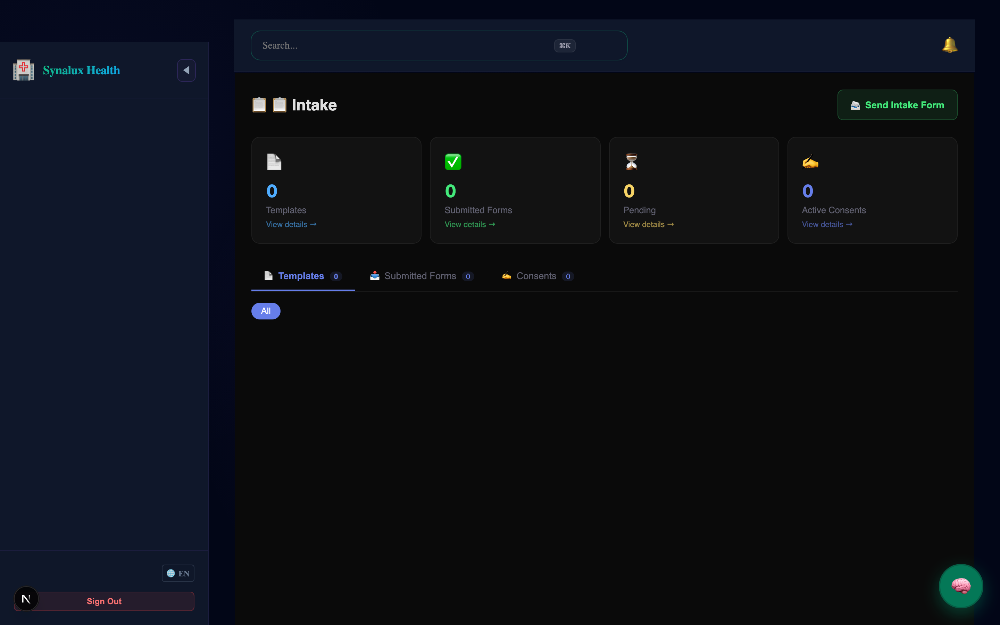
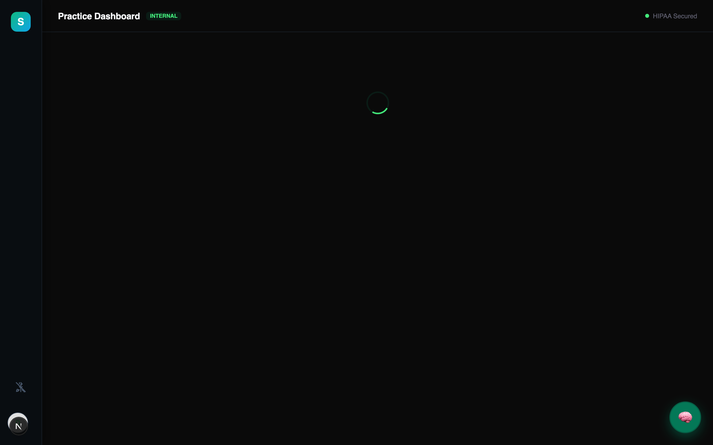
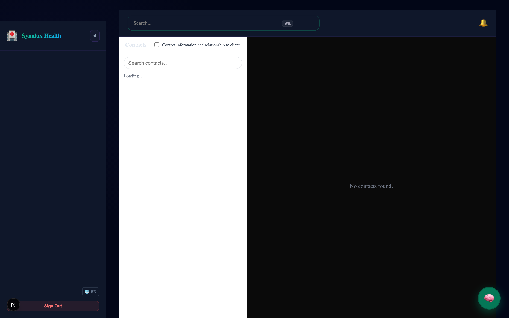
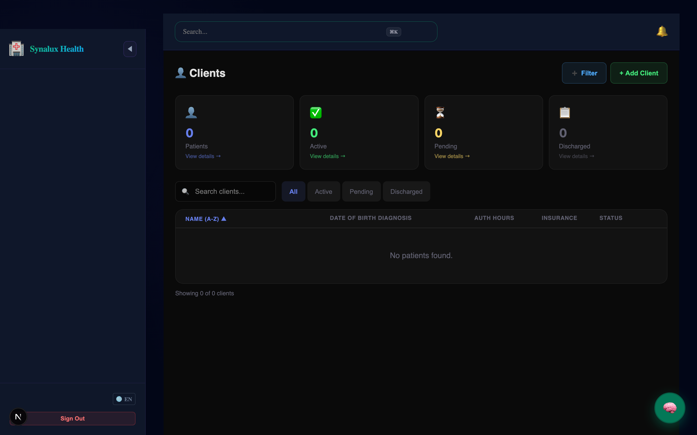
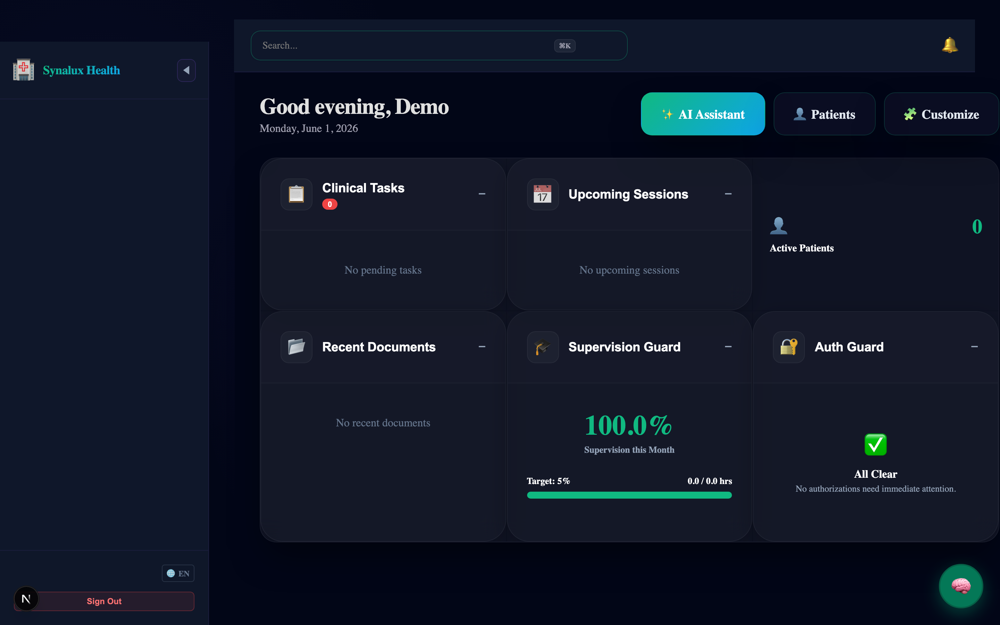
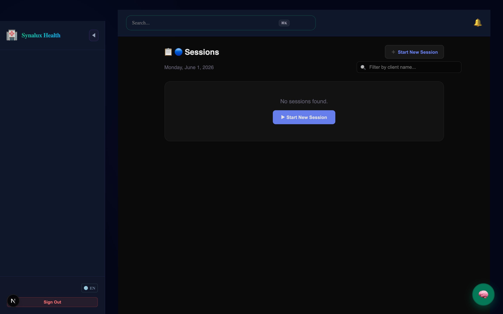
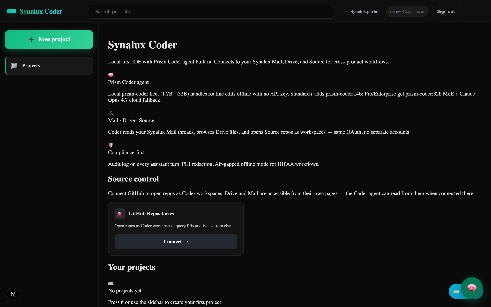

# ✦ Synalux

**Ihre KI-gestützte Praxismanagement-Plattform**

> Verwalten Sie Ihre gesamte Arztpraxis von einer Plattform — Patientenakten, Terminplanung, Abrechnung, Teamkommunikation und KI-Dokumentation. Verfügbar in 12 Sprachen. HIPAA-konform.

<p align="center">
  <a href="https://synalux.ai/app"></a>
  <a href="https://marketplace.visualstudio.com/items?itemName=synalux-ai.synalux"></a>
  <a href="https://synalux.ai/docs"></a>
  <a href="LICENSE"></a>
</p>

🌐 **Language / Язык / Limba:** [English](../../README.md) · [Español](README_es.md) · [Français](README_fr.md) · [Português](README_pt.md) · [Română](README_ro.md) · [Українська](README_uk.md) · [Русский](README_ru.md) · [Deutsch](README_de.md) · [日本語](README_ja.md) · [한국어](README_ko.md) · [中文](README_zh.md) · [العربية](README_ar.md)

📌 **[← Zurück zur englischen Version](../../README.md)**

🎬 **Demo-Videos folgen in Kürze** — Der komplette Workflow: Patienten, Terminplanung, Notizen, Abrechnung und Team-Chat.

---

## 💡 Warum Synalux?

### Für Kliniker
* **🎙️ Sprechen statt tippen.** Diktieren Sie Ihre Sitzungsnotizen und Synalux wandelt sie sofort in strukturierte SOAP-Notizen um — alles auf Ihrem Gerät verarbeitet.
* **📴 Funktioniert offline.** Starten und Beenden Sie Sitzungen auch ohne Internet. Ihre Notizen werden lokal gespeichert und automatisch synchronisiert.
* **🛡️ KI der Sie vertrauen können.** Jeder KI-Vorschlag zeigt einen Vorher/Nachher-Vergleich. Nichts ändert sich ohne Ihre Zustimmung.
* **📝 Weniger Papierkram.** Generieren Sie FBAs, BIPs, Fortschrittsberichte — und senden Sie zur E-Signatur mit einem Klick.

### Für Praxisinhaber und Administratoren
* **🏥 Eine Plattform für jede Fachrichtung.**
* **🌍 Internationale Abrechnung.** Akzeptieren Sie Zahlungen in USD, CAD, GBP, EUR, AUD und NZD. Mengenrabatte ab 100+ Klienten.
* **💳 Verlieren Sie nie Einnahmen.** Fehlgeschlagene Zahlungen werden automatisch wiederholt.
* **👥 Kontrollieren Sie den Zugriff.** 15 Rollen.

### Für IT und Compliance
* **📴 Sichere Offline-Sitzungen.** Zeitstempel werden auf dem Gerät des Klinikers erfasst. Admins sehen 🟢/🔴 Indikatoren.
* **🔐 HIPAA integriert.** 15-Min-Timeout, keine Patientendaten im Browser, Verschlüsselung.
* **📊 89 automatisierte Tests.**

---


### 📸 Product Tour

| 📊 1. Patient Dashboard | 🧠 2. AI Clinical SOAP Notes | 💬 3. Secure Team Chat |
|:---:|:---:|:---:|
|  |  |  |

| 💉 4. Immunizations | 📦 5. Inventory Management | 🧪 6. Lab Orders & Results |
|:---:|:---:|:---:|
|  |  |  |

| 👶 7. Pediatrics | 🐾 8. Veterinary Medicine | ❤️ 9. Vitals & Measurements |
|:---:|:---:|:---:|
|  |  |  |

| 🤖 10. Intelligent Clinical Assistant |
|:---:|
|  |

## 📦 Platform Modules

Every module is multi-tenant, workspace-scoped, and HIPAA-compliant with strict role-based access.

### 🏥 Clinical Care Modules
<details>
<summary><h3>📋 Patientenakte & Dokumentation</h3></summary>

🔗 **[Detaillierte Patientenakten & Dokumentation](../../docs_source_en/clinical_notes_documentation.md)**


| Funktion | Details |
|---------|---------|
| **SOAP-Arbeitsblätter** | Automatisch von Sprachbefehlen mit spezialisierten Vorlagen generiert |
| **Sprachbefehle** | WASM Whisper auf Gerät → keine Übertragung von PHI an den Cloud |
| **4 Arbeitsblattvorlagen** | Therapienachweis, Fortschrittsbericht, Anamnese, Entlassungsbericht |
| **Dokumente** | Laborergebnisse, Bilder, Einwilligungen, Bewertungen, Behandlungspläne — alle im Arbeitsbereichsbezirk |
| **PDF-Export** | Serverseitige Generierung (keine PHI-Lecks auf dem Client) |
| **E-Signaturen** | BoldSign-Integration mit 7 Dokumentvorlagen |
| **Optische Zeichenerkennung (OCR)** | Dokumentenabfrage in über 30 Sprachen für die Digitalisierung von Einwilligungsformularen |

</details>

<details>
<summary><h3>📴 Vor Ort-zuerst klinische Sitzungen</h3></summary>

🔗 **[Weitere Informationen zu Vor Ort-zuerst klinischen Sitzungen](../../docs_source_en/offline_first_clinical_sessions.md)**


| Funktion | Details |
|---------|---------|
| **Clientseitige Zeitstempel** | Beginn/Ende der Sitzung auf dem Anbietersgerät erfasst — für die Rechnung, nicht die Zeit des Servers |
| **Offline-Schlangenwarteschlange** | Ereignisse werden im localStorage gespeichert, wenn offline und werden automatisch synchronisiert, sobald eine Verbindung wiederhergestellt wird |
| **Entwurfspersistenz** | Klinische Notizen werden bei jedem Tastendruck automatisch im localStorage gespeichert — überlebt einen Browserabsturz oder eine Verbindungsverlust |
| **Sitzungsschlussbestätigung** | Der Anbieter muss die Sitzung beenden — der Zeitstempel ist der genaue Rechnungsaufschlusszeitpunkt |
| **Admin-Audit** | Jedes Ereignis zeigt einen 🟢 Online / 🔴 Offline-Anzeiger mit synchronen Zeitstempeln an |
| **Verbindungsüberwachung** | Die Seitenleiste zeigt den realen 🟢/🔴 Status mit einem Ausstößchen der wartenden Synchronisationsanzahl |
| **HIPAA-Cleanup** | Alle lokalen Daten werden bei Abmeldung und nach dem Leerlauf gelöscht |
| **Idempotente Synchronisierung** | Duplikate Ereignisse werden durch clientseitig generierte UUIDs verhindert |
| **Zeitschießungserkennung** | Der Server protokolliert die Schießung zwischen Client und Server-Zeitstempeln für den Überwachungsfall |
| **Lebenszyklus der Sitzung** | `session_start` → `session_pause` → `session_resume` → `session_end` |

**Rechnungsgemäße Konformität:**
```
Der Anbieter beginnt die Sitzung um 14:00 Uhr (online) → 🟢
  Die Verbindung bricht um 14:30 Uhr ab
Der Anbieter endet die Sitzung um 15:45 Uhr (offline) → 🔴 client_timestamp = 15:45 Uhr
  Die Verbindung wird wiederhergestellt um 16:00 Uhr → automatische Synchronisierung
Der Server protokolliert: client_timestamp = 15:45 Uhr, sync_timestamp = 16:00 Uhr
  ↓
Die Versicherung wird bezahlt: Sitzung von 14:00 Uhr bis 15:45 Uhr (genau)
Der Admin sieht: "Sitzung beendet um 15:45 Uhr 🔴 Offline (synchronisiert um 16:00 Uhr)"
```

</details>

<details>
<summary><h3>🧪 Lab Orders &amp; Results Modul</h3></summary>

🔗 **[Lab Orders &amp; Results Modul detaillierte Dokumentation lesen](../../docs_source_en/lab_orders_results_module.md)**


| Funktion | Details |
|---------|---------|
| **Lab Orders** | Bestellverfolgung mit Lieferanten (Quest, LabCorp, intern), Priorität (regelmäßig/Dringend/Kritisch) |
| **Ergebnisverfolgung** | Einzelne Testergebnisse mit Referenzbereichen und Abnormalflags (niedrig/hoch/kritisch) |
| **Kategorien** | Hematologie, Chemie, Lipide, Leber, Thyroxine, Vitaminen, Inflammation, Kautionsfähigkeit |
| **Abnormalwarnungen** | Automatische Kennzeichnung von Ergebnissen außerhalb des Bereichs (z. B. erhöhter TSH, niedriger Vitamin D) |
| **iPLEDGE Labs** | Monatliche Überwachung von Accutane: CBC, CMP, Lipidpanel, LFTs mit Trendverfolgung |
| **Vor chirurgischem Prozedere** | INR, PT, Glucose, A1C für Zahnteilkauter und chirurgische Verfahren |
| **Medikamentenüberwachung** | SSRI Thyroxinprüfungen, Stimmulant-Lipidpanel, biologisches Grundlage-Panel |
| **Bestelllebenszyklus** | Bestellt → Sammelt → Sendet → Empfängt → In Bearbeitung → Geprüft → Überprüft |
| **Lieferantenintegration** | Quest Diagnostics, LabCorp-Bestellrouting (geplant: elektronische Ergebnisimport) |
| **Diagnoseverknüpfung** | ICD-10-Codes an Bestellungen für medizinische Notwendigkeit-Dokumentation |

</details>

<details>
<summary><h3>💊 Medikamente & Rezepte Modul</h3></summary>

🔗 **[Detaillierte Dokumentation zum Medikamente & Rezepte Modul](../../docs_source_en/medications_prescriptions_module.md)**


| Funktion | Details |
|---------|---------|
| **Medikamentenkatalog** | 12+ Medikamente mit NDC-Codes, Medikamentengruppen, Zeitpunkte, Wege der Anwendung, häufige Dosierungen |
| **Aktive Rezepte** | Patientenspezifische Medikamentenliste mit Dosis, Häufigkeit, Arzt, Apotheken, Fortlaufendes Nachverfolgen von Verschuldungen |
| **Medikamentengruppen** | SSRIs, Stimmstoffe, Retinoidien, Biologika, Bronchodilatoren, NSAIDs, Antibiotika, Antikonvulsiva |
| **iPLEDGE-Überwachung** | Überwachung von Acutane mit Isotretinoin im Monatsablauf der Laboruntersuchungen |
| **Statuslebenszyklus** | Aktiv → Auf Halt → Beendet → Abgeschlossen → Storniert |
| **Wechselwirkungswarnungen** | Medikamentenspezifische Warnungsmatrix (Serotonin-Syndrom, QTc, teratogen) |
| **Apothekenrouting** | Namhafte Apotheken pro Rezept für die Bereitschaft zur elektronischen Vorschriftenabgabe |

</details>

<details>
<summary><h3>📊 Vitalzeichen & Messwerte-Modul</h3></summary>

🔗 **[Detaillierte Dokumentation zum Vitalzeichen & Messwerte-Modul](../../docs_source_en/vitals_measurements_module.md)**


| Funktion | Details |
|---------|---------|
| **Standard-Vitalzeichen** | BP (systolisch/diastolis), HR, RR, temp (mit Methode), SpO2, Gewicht, Größe, BMI |
| **Schmerzskala** | 0-10 numerische Schmerzskala pro Besuch |
| **Pediatrisches Wachstum** | Kopfumfang, Gewicht/Größe/BMI-Percentile (WHO/CDC) |
| **PT-Bewertungen** | ROM-Degree, funktionalen Punkte (Oswestry, LEFS), Quadaktivierungsinformationen |
| **Trendverfolgung** | Historische Vitalzeichen pro Patient für Trendanalyse |
| **Termin verbunden** | Vitalzeichen an spezifische Terminbegegnungen gebunden |

</details>

<details>
<summary><h3>⚠️ Allergien & Warnungen-Modul</h3></summary>

🔗 **[Detaillierte Dokumentation des Allergien & Warnungen-Moduls](../../docs_source_en/allergies_alerts_module.md)**


| Funktion | Details |
|---------|---------|
| **Allergentypen** | Medikament, Lebensmittel, Umwelt, Latex, Kontrast, anderer |
| **Schweregradstufen** | Leicht, mittel, schwer, lebensbedrohlich |
| **Reaktionsverfolgung** | Spezifische Reaktionsdokumentation (anaphylaxis, SJS, Schuppenröteln, Verdauungsstörungen) |
| **NKDA-Unterstützung** | Explizite Dokumentation von "keinen bekannten Medikamentenallergien" |
| **Klinische Warnungen** |kritische Allergieflags (Penicillin → clindamycin verwenden, Sulfa → SJS-Geschichte) |
| **Überprüfung** | Überprüfung durch Arzt mit Datumsmarkierung |

</details>

<details>
<summary><h3>💉 Immunizations-Modul</h3></summary>

🔗 **[Detaillierte Dokumentation des Immunizations-Moduls](../../docs_source_en/immunizations_module.md)**


| Funktion | Details |
|---------|---------|
| **Impfungstracking** | CVX-Codes, Dosennummern, Lotnummern, Hersteller |
| **Verabreichung** | Standort, Route (IM/SC/PO/IN/ID), Verabreicher |
| **VIS-Konformität** | Tracking der Datumseingabe des Impfinformationsscheins |
| **Registrierungsberichterstattung** | Überwachung der Abgabe an die Bundesimmunisierungsinstitutionen |
| **CDC-Schichtplanung** | DTaP, IPV, MMR, Varicella, Hep A/B, Influenza, Tdap |
| **Immunsupprimierte Patienten** | Besondere Impfempfehlungen für biologische Patienten |

</details>

### 🏢 Practice Operations Modules
<details>
<summary><h3>💳 Abrechnung & Zahlungenmodul</h3></summary>

🔗 **[Abruf der detaillierten Dokumentation zum Abrechnung & Zahlungenmodul](../../docs_source_en/billing_payments_module.md)**


Das Abrechnungsmodul verwendet **Stripe Connect**, um jedem Büro seine eigene unabhängige Zahlungsverarbeitungsaccount zu geben, der mit dem Büroadministrator verbunden ist.

**Bürospezifische Abrechnungskonfiguration:**
| Einstellung | Details |
|---------|---------|
| **Stripe Connect** | Jedes Arbeitsbereich hat seinen eigenen `acct_xxx` Stripe Connect Account |
| **Admin verknüpft** | Besitzer des Stripe-Kontos ist der Workspace-Admin-Benutzer |
| **Gebührenpläne** | Bürospezifische Gebührenpläne mit Standard-, Versicherungs-, Medicare- und Selbstzahlungsraten |
| **Zahlungsmethoden** | Kreditkarte, ACH/Banküberweisung, Überweisung, Bargeld — konfigurierbar pro Büro |
| **Automatische Buchung** | Automatische Zahlungsbuchung, Rechnungsendung und Monatsberichtsgenerierung |
| **Steuerkonfiguration** | Bürospezifische Steuersätze und NPI/EIN für 1099-Berichte |

**Mehrere Länder & Währungen (NEU):**

| Land | Währung | Standard | Fortgeschritten | Unternehmensklasse |
|---------|----------|----------|----------|------------|
| 🇺🇸 USA | USD | $19/mo | $49/mo | $99/mo |
| 🇨🇦 Kanada | CAD | C$25/mo | C$65/mo | C$129/mo |
| 🇬🇧 UK | GBP | £15/mo | £39/mo | £79/mo |
| 🇩🇪🇫🇷 EU | EUR | €18/mo | €45/mo | €89/mo |
| 🇦🇺 Australien | AUD | A$29/mo | A$75/mo | A$149/mo |
| 🇳🇿 Neuseeland | NZD | NZ$32/mo | NZ$82/mo | NZ$159/mo |

**Mengenrabatte:**
| Kunden | Rabatt |
|---------|----------|
| 100+ | 10% pro Sitzungspreis abzug |
| 500+ | 20% pro Sitzungspreis abzug |
| 1.000+ | 30% pro Sitzungspreis abzug |
| Jährliche Abrechnung | zusätzlicher 20% abzug (stapft mit Mengenrabatten, begrenzt auf 45%) |

**Lebenszyklus der Zahlungsfehler:**
```
Zahlung fehlgeschlagen → past_due (Warnbanner, Zugriff beibehalten)
  → 2. Versuch → immer noch past_due (dringliche Warnung)
  → 3. Versuch fehlgeschlagen → automatische Abstufung auf Free-Tier
  → Stripe subscription.deleted → plan = 'free', Subklarierung
```

**Plattformadministratoren:**
- Synalux-Plattformadministratoren können jeden Benutzer für jedes Angebot unbeschränkten Versuchszeitraums setzen
- Überladene Benutzer sind **unbefugt**, von Stripe-Webhook-Abstufungen zu betroffen
- Admin sieht 🟢/🔴 Indikatoren für Zahlungsstatus
- Vollständige Auditverlauf: Wer den Überzug gesetzt hat, wann und warum

**Rechtmachungskette:**
- Lebenszyklus der Versicherungsaufträge (Entwurf → eingereicht → akzeptiert → bezahlt/abgelehnt → Antrag)
- elektronische Reimbursementverarbeitung von ERA/EOB
- Verwaltung abgelehnter Aufträge mit Ablaufdatum der Antragsstellung
- Vorbehaltserklärungsworkflow
- Alterungsberichte (30/60/90/120 Tage)

**Patientenzahlungen:**
- Patientenportal "Jetzt bezahlen" → Weiterleitung zu Stripe Checkout
- Teilzahlungen und benutzerdefinierte Beträge
- Zahlungspläne mit wiederkehrenden Abonnements von Stripe
- Rechnungsstellung und Download
- Rückforderungsverarbeitung

**Versicherungsaufträge:**
- elektronische Versicherungsauftragsabgabe (837P)
- Echtzeit-Berechtigungsprüfung
- Koordinierung der Vorteile (COB)
- Überwachung von Erklärungen der Leistungen (EOB)
- Verwaltung von Anträgen mit Vorbehaltserklärungsvorlagen

**Automatische Steuerabholung:**
- Stripe Tax pro Land aktiviert (USt, GST, HST, PST)
- Steuer automatisch basierend auf dem Arbeitsbereichsland berechnet
- Konform mit kanadischen Mehrprovinzsteuerregeln (federal GST + provincial PST/HST)

</details>

<details>
<summary><h3>📅 Terminplanung & Termine</h3></summary>

🔗 **[Detaillierte Terminplanung & Termine Dokumentation](../../docs_source_en/scheduling_appointments.md)**


| Funktion | Details |
|---------|---------|
| **Terminzustände** | Geplant → Bestätigt → Im Gange → Abgeschlossen (+ storniert, nicht erschienen, neu geplant) |
| **Patientenportale Anfragen** | Patienten beantragen Termine mit bevorzugter Datum/Zeit → Mitarbeiter bestätigen oder ablehnen |
| **Mehrere Anbieter** | Termine über mehrere Anbieter in einer Praxis vereinbaren |
| **Regelmäßige Besuche** | Wöchentliche Therapien, monatliche Kontrollbesuche, Ortho-Anpassungen |
| **Warteliste** | Terminanfragen auf der Warteliste bei vollständigen Terminketten |
| **Erinnerungen** | Automatische Terminerinnerungen (geplant) |

</details>

<details>
<summary><h3>👥 HR & Mitarbeiterverwaltung-Modul</h3></summary>

🔗 **[Detaillierte Dokumentation zum HR & Mitarbeiterverwaltung-Modul](../../docs_source_en/hr_staff_management_module.md)**


| Funktion | Details |
|---------|---------|
| **Mitarbeiterprofile** | Beschäftigungsart, Eintrittsdatum, Gehalt/Stundensatz, Spezialfertigkeiten, Abteilungstracking |
| **Qualifikationen** | Lizenz/Zertifizierungstracking mit Ablaufbenachrichtigungen und Neuerlassungsabläufe |
| **Zeitferien** | Urlaubsferien, Krankheitstage, CE-Ferien, Maternity- und Bereitschaftsferien, Justitia - Genehmigungsabläufe |
| **Schulungen** | Konformitäts-Schulungstracking (HIPAA, BLS, CPR) mit Fälligkeitsdaten und Abschlussstatus |
| **Leistungsüberwachung** | Jahres- oder Halbjährliche Bewertungen mit Bewertungen, Ziele, Verbesserungspläne und Bestätigung |
| **Onboarding** | Ausstehender Onboarding-Zustand, Qualifikationsprüfungsaufbau, Schulungsausrichtungen |

</details>

<details>
<summary><h3>⏱️ Zeiterfassung & Lohnabrechnungsmodule</h3></summary>

🔗 **[Detaillierte Dokumentation zum Zeiterfassung & Lohnabrechnungsmodule](../../docs_source_en/timesheets_payroll_module.md)**


| Funktion | Details |
|---------|---------|
| **Automatische Generierung** | Zeiterfassungen werden automatisch aus verfassten klinischen Sitzungsnoten generiert |
| **Nicht-berechnete Zeit** | Verfolgen Sie Admin-Zeit, Fahrzeit, Schulung und Klinikvorbereitung |
| **Genehmigungsabläufe** | Mitarbeiterabgabe → Abteilungsleiterprüfung → Lohnverarbeitung |
| **Lohnabrechnungsexport** | Zeiterfassungen werden nativ mit ADP, Gusto und Paycom integriert exportiert |
| **Konformität** | 40-Stunden-Overtime-Warnungen, Pflichtpausenverfolgung, Sichtbarkeit der PTO-Akkretion |

</details>

<details>
<summary><h3>📦 Inventarverwaltungsmodul</h3></summary>

🔗 **[Detaillierte Dokumentation zum Inventarverwaltungsmodul](../../docs_source_en/inventory_management_module.md)**


| Funktion | Details |
|---------|---------|
| **Kategorien** | Zahnaerztliche Zubehör, Impfstoffe, Medikamente, Biologika, PPE, chirurgisches Gerät, Laborversorgung, Büro |
| **Bestandsverfolgung** | Lagerbestand, Bestellniveau, Bestellmenge, Einheitskosten |
| **Lot & Ablaufdatum** | Lotnummern, Ablaufdaten, FIFO-Rotation für Impfstoffe |
| **Lieferantenverfolgung** | Henry Schein, Patterson Dental, Nobel Biocare, McKesson, Sanofi Pasteur |
| **Status-Warnungen** | In Lagerhaltung, Niedrigbestand, Ausverkauft, Verfallen, Abgeschafft |
| **Speicherorte** | Impfstoffkühlschrank (2-8°C), Biologik-Kühlschrank, Praxiskabinett, verschlossene Kabinett |
| **Sonderelemente** | Implantationsvorrichtungen ($285), biologische Stift ($2.850), Cryotherapiekanister |

</details>

<details>
<summary><h3>🧾 Superbills-Modul</h3></summary>

🔗 **[Detaillierte Dokumentation zum Superbills-Modul](../../docs_source_en/superbills_module.md)**


| Funktion | Details |
|---------|---------|
| **Aufenthaltsbasiert** | Ein Superbill pro Besuch mit Diagnose- und Prozedurcodes |
| **Mehrere Codes** | ICD-10-Diagnosearray + CPT/CDT-Prozedurarray + Modifizierer (-25, -59) |
| **Finanzliche Aufschlüsselung** | Gesamtkosten, versicherte Rechnung, Patienten-Kopfzahl, Abgleiche |
| **Lebenszyklus des Status** | Entwurf → Überprüfung → eingereicht → bezahlt / abgelehnt / angefochten |
| **Alle Fachrichtungen** | Kinderbesuche, Implante, Ortho, Psychotherapie, PT-Rehabilitation, Dermatologische Prozeduren |
| **Medikar-Abschreibungen** | Automatische Verfolgung von Versicherungsverpflichtungen |

</details>


<details>
<summary><h3>📋 Medizinische Aufgabenmodul</h3></summary>

🔗 **[Detaillierte Dokumentation zum Medizinischen Aufgabenmodul](../../docs_source_en/clinical_tasks_module.md)**


| Funktion | Details |
|---------|---------|
| **Aufgabenkategorien** | Laborbefragung, Vorabgenehmigung, Terminplanung, Dokumentation, Abrechnung, Anrufen des Patienten, Erneuerung, Weiterverweis |
| **Prioritätsniveaus** | Niedrig, Normal, Hoch, Dringend |
| **Zuordnung** | Zu bestimmten Mitarbeitern mit Fälligkeitsdaten und Fortschrittsverfolgung |
| **Patient verknüpft** | Aufgaben sind mit spezifischen Patienten verbunden für die Versorgungskoordination |
| **Statusverfolgung** | Offen → In Bearbeitung → Abgeschlossen / Storniert / Verzögert |
| **Auditprotokoll** | Erstellt von, abgeschlossen von, abgeschlossen am Zeitpunkt |

</details>

### 🤝 Patient Experience & Collaboration
<details>
<summary><h3>Patientenportal</h3></summary>

🔗 **[Patientenportal-Dokumentation lesen](../../docs_source_en/patient_portal.md)**


Ein voll funktionaler Patientenportals mit Authentifizierung, Nachrichtenversand, Dokumentenverwaltung, Terminplanung und Rechnungsabrechnung.

| Funktion | Details |
|---------|---------|
| **Authentifizierung** | Zugangscode-Login (SHA-256 gehasht), Ablaufverfolgung |
| **Dashboard** | Gesundheitsübersicht mit bevorstehenden Terminen, ungelesenen Nachrichten, ausstehenden Dokumenten, offener Rechnungsbetrag |
| **Nachrichtenversand** | Themenförmige Konversationen mit Arzten, Notfallflags, Bestätigungsbestätigungen |
| **Dokumente** | Klinische Dokumente ansehen/downloaden, Versicherungskarten und Formulare hochladen |
| **Terminplanung** | bevorstehende/vergangene Besuche anzeigen, neue Terminanfragen mit gewünschten Zeiten stellen |
| **Rechnungsabrechnung** | offener Rechnungsbetrag ansehen, Rechnungsgeschichte mit CPT-Codes, Online-Zahlung über Stripe, Zahlungsmöglichkeiten, Rechnungen |
| **Formulare** | Intake-Formulare abschließen, PHQ-9/GAD-7 Fragebögen online beantworten, Zustimmungsformulare online abgeben |
| **Zustimmungen** | Digitale Zustimmungsinformationen (Behandlung, HIPAA, Telemedizin, Medikamente, Forschung) verwalten |

</details>

<details>
<summary><h3>📚 Patientenbildungsmodul</h3></summary>

🔗 **[Lesen Sie die detaillierte Dokumentation zum Patientenbildungsmodul](../../docs_source_en/patient_education_module.md)**


| Funktion | Details |
|---------|---------|
| **Materialkatalog** | 14 Bildungsunterlagen über alle Fachgebiete |
| **Mehrere Sprachen** | Materialien auf Englisch und Spanischen verfügbar |
| **Kategorien** | Erkrankung, Medikament, Verfahren, Lebensstil, nach chirurgischer Behandlung, Hausübung, Sicherheit, Prävention |
| **Liefermethoden** | gedruckt, Hochladen in das Portal, E-Mail, persönlich, SMS |
| **Bestätigung** | Nachvollziehen, ob der Patient das Material gelesen hat oder bestätigt hat |
| **Beispiele für Fachgebiete** | Anleitung zum EpiPen, Sicherheitsinformationen zu Accutane, ACL-Rehabilitation, Übungsaufgaben zu CBT, nach chirurgischer Behandlung von Implantaten |

</details>

<details>
<summary><h3>🔔 Austrufungen & Erinnerungen-Modul</h3></summary>

🔗 **[Detaillierte Dokumentation zum Austrufungen & Erinnerungen-Modul](../../docs_source_en/recalls_reminders_module.md)**


| Funktion | Details |
|---------|---------|
| **Austrufungstypen** | Hygiene, jährliche Prüfung, Nachsorge, Laborneueprüfung, Bildgebung, Screening, Impfung, Medikamenteneinsprache |
| **Statusverfolgung** | Fällig → Verzögerung → Geplant → Abgeschlossen → Storniert |
| **Kontaktaufnahmen verfolgen** | Nachwirksamkeitsversuche für veraltete Austrufe verfolgen |
| **Praxisspezifisch** | Zahnschutz 6-Monatsreinigungen, Dermatologie jährliche Hautuntersuchungen, Accutane monatliche Laboruntersuchungen |
| **Automatische Fälligkeitsdatum** | Basierend auf dem letzten abgeschlossenen Besuch |

</details>

<details>
<summary><h3>🔄 Weiterleitungen & Interpraktionschat-Modul</h3></summary>

🔗 **[Weitere Informationen zum Weiterleitungs- und Interpraktionschat-Modul](../../docs_source_en/referrals_cross_practice_chat_module.md)**


| Funktion | Details |
|---------|---------|
| **Weiterleitungsverfolgung** | Von/Bis Anbieter, Fachrichtung, Grund, Diagnosecodes, Dringlichkeit, Authentifizierungstracking |
| **Lebenszyklus des Status** | Ausstehend → Gesendet → Akzeptiert → Geplant → Abgeschlossen / Verfallen / Ablehnt |
| **Interpraktionschat** | HIPAA-konformes Messaging zwischen Praxisadministratoren/Arbeitsverwaltungen |
| **Dateiübertragung** | Bilder, Röntgenaufnahmen, Dokumente, Laborergebnisse, Rezepte zwischen Praxen senden |
| **Themenförderte Diskussionen** | Chat-Themen pro Weiterleitung mit Lesebestätigungen |
| **Praktische Beispiele** | Peds→Psychiatry (ADHD), Derm→PT (psoriatische Arthritis), PT→Derm (Wundpflege) |
| **Authentifizierungstracking** | Auth-Nummern, Ablaufdatum, Vorbehaltliche Authentifizierungsanforderungen |

</details>

<details>
<summary><h3>💬 Team-Chat & Kommunikation</h3></summary>

🔗 **[Read Detailed Team Chat & Communication Documentation](../../docs_source_en/team_chat_communication.md)**
- [Collaborative Editor Suite](../../docs_source_en/collaborative_editors_module.md)


| Funktion | Details |
|---------|---------|
| **E2E-verschlüsselte Chat** | HIPAA-konforme Teamnachrichten innerhalb von Arbeitsbereichen |
| **Gruppenvideoveranstaltungen** | Skalierbare 6-Peer-mesh WebRTC HIPAA-konforme Telemedizin & Team-Statusmитtelung |
| **Sichere Terminvereinbarung** | Authentifizierte RSVPs mit null-PHI-E-Mail-Vorlagen für Kalenderlinks |
| **Sprach- und Videokonferenzen** | Sichere Sprach- und Videokonferenzen (nur für Unternehmen) |
| **Künstliche Intelligenz-Kontextteilen** | Behandlungsplan generieren → "Sitzung teilen" → an die Rechnungskanäle weiterleiten |
| **Sprach-zu-Aktion** | Sprachbefehle → Anrufen, SMS senden, E-Mail senden, Termin vereinbaren (Pro+) |
| **Kanäle** | Abteilungsorientierte Kanäle (Klinik, Rechnungskontrolle, Verwaltung) |
| **Dateianhänge teilen** | Dokumente, Bilder und klinische Ressourcen im Chat teilen |

</details>

<details>
<summary><h3>Kollaborationspraktikens Suite</h3></summary>

| Funktion | Details |
|---------|---------|
| **zentraler Dashboard** | Router-Mapping von Aggregatmetriken effizient. Kommandozentrum isoliert verpasste Aufgaben nativ. |
| **Videoberatungen (WebRTC)** | Fortgeschrittene sichere P2P-Videoübertragung mit Twilio TURN/STUN-Knoten, um Mittelboxen zu vermeiden. |
| **RLS-Gatekeeper** | Implizite Identitätstracking ohne Serverseitige Datenlecks zwischen Mandanten nativ auf Advanced/Pro-Begrenzungen abgebildet. |
| **Klinische Aufgaben** | Interne Klinik-Warnungen, Genehmigungen und Warteschlangen isoliert pro Arbeitsbereich sicher. |

</details>

### 🔐 Enterprise Administration
    <details>
    <summary><h3>🛡️ Sicherheit & Konformität</h3></summary>

| Funktion | Details |
|---------|---------|
| **HIPAA-Konformität** | Vollständiger HIPAA-Auditverlauf, BAA-bereitschaftige Architektur |
| ** strenge Zugriffssteuerung** | 11 kryptografisch signierte Rollen mit spezifischen Zugriffsgrenzen |
| **Datenisolation** | Alle Datensätze werden durch Klinik (`workspace_id`) isoliert, um Kreuzkontamination zu vermeiden |
| **Kryptographische Anmeldung** | Kurzlebige Token (15-minütliche Ablaufzeit) stellen sicher, dass abgelaufene Geräte ausgeloggt werden |
| **Verschlüsselung im Ruhezustand** | Transparente Datenverschlüsselung (AES-256) für alle Gesundheitsinformationen |
| **Unveränderliche Auditprotokolle** | Unveränderliche Protokolle für alle Rollenzuweisungen, Dateizugriffe und Nachrichtenaktionen |
| **Fail-Closed HIPAA-Modus** | Verweigert Mikrofonzugriff, wenn lokale Verarbeitung nicht verfügbar ist (kein stilles Cloud-Fallback) |
| **Datenreduktion** | Keine Browser-Caching für PHI; sensible Daten werden sofort gelöscht, wenn ein Tab geschlossen wird |
</details>

<details>
<summary><h3>⚙️ Plattformverwaltung & White-Labeling</h3></summary>

🔗 **[Weitere Informationen zur Plattformverwaltung und White-Labeling](../../docs_source_en/platform_administration_white_label.md)**


| Funktion | Details |
|---------|---------|
| **Mehrfachmietarchitektur** | Trennte Arbeitsbereiche mit dedizierter Markenidentität und Konfigurationen |
| **Dynamische Arbeitsbereiche** | Praxislogo, primäre Adresse und Farbschemata dynamisch über SSR abgerufen |
| **Modulverfügbarkeit** | Plattformadministratoren können Module basierend auf der Klinikspecialisierung ziehen oder verstecken |
| **Funktionsumstellung für Mitarbeiter** | Basissrollen mit `restricted_features` JSONB-Arrays überschreiben, um API-Bereiche zur Laufzeit zu blockieren |
| **Bildschirmkonstruktoren** | Praxisübergreifende Möglichkeit, Schaltflächen umbenannt zu lassen, Spalten in der Datengrid-Tabelle zu verstecken oder Standard-UI-Kopien zu überschreiben |
| **Break-Glass-Auditing** | Alle Aktionen von Plattformadministratoren werden in HIPAA-konforme Auditräume protokolliert |

</details>


---

## 🏥 Synalux Health: Die klinische Web-App

*Access anywhere via iPad, Chromebook, or Desktop at [`synalux.ai/app`](https://synalux.ai/app).*

<details>
<summary><strong>The "Intake Room"</strong> — A zero-install PWA designed for ABA therapists</summary>

* **Smart Mic:** Uses the Page Visibility API + `window.onblur` to automatically pause recording if the clinician switches tabs or windows, preventing accidental ambient capture of other patients.
* **SOAP & BIP Generation:** Speak naturally. Synalux automatically categorizes your dictation into Subjective, Objective, Assessment, and Plan fields using 4 specialized templates.
* **Document Builder:** Edit the generated markdown, attach a patient intake template, and push it directly to BoldSign for parent/guardian E-Signatures in one click.
* **Server-Side PDF:** Documents are rendered server-side to prevent client-side PHI memory leakage — no `html2pdf.js` artifacts.
* **HIPAA-Hardened:** 15-minute idle timeout, no `localStorage` for PHI, explicit React state nulling on session clear, `Cache-Control: no-store` on all API responses.

**Templates:**

| Template | Use Case |
|----------|----------|
| 🧩 Therapy Session | ABA/behavioral therapy session notes |
| 📈 Progress Note | Ongoing treatment progress tracking |
| 📝 Initial Evaluation | First assessment and intake documentation |
| 🏁 Discharge Summary | Treatment completion and transition planning |

</details>

---

## 🧑‍💻 Synalux Dev: Die VS Code-Erweiterung

*The ultimate memory-augmented IDE assistant.*

<details>
<summary><strong>Multi-Agent Orchestrator</strong> — Don't just chat; delegate</summary>

Describe a task (e.g., *"Add Stripe checkout and write tests"*), and Synalux will spawn a `planner` agent to break it down, a `coder` agent to write the implementation, and a `tester` agent to run Vitest in your terminal until the build passes.

* **Safe Mode Sandbox:** High-risk shell commands (`terminal`, `git_tool`, `browser`) require explicit user approval via a modal confirmation dialog before execution.
* **Dependency Audits:** Built-in tools scan your `package.json` against CVE databases automatically.
* **Prism Integration:** Synalux reads your codebase architecture and previous architectural decisions before writing a single line of code.

**17 Integrated Tools:**

| Category | Tools |
|----------|-------|
| 🖥️ Development | `terminal`, `git_tool`, `vitest`, `node_tool`, `browser` |
| 📝 Documentation | `soap_templates`, `boldsign`, `ocr`, `file_manager` |
| 🎙️ Multimodal | `voice`, `tts`, `screenshot`, `image_analyze` |
| 🔌 Integrations | `jira`, `confluence`, `slack`, `webhooks` |

</details>

---

<details>
<summary><h2>🔐 11 RBAC Roles</h2></summary>

Each role has a cryptographically signed Tool ACL and a server-injected system prompt:

| Role | Tools | Target |
|------|-------|--------|
| 🧑‍💻 `coder` | terminal, git, vitest, node, browser | Software engineers |
| 🏥 `bcba` | soap, voice, boldsign, file_manager | Board Certified Behavior Analysts |
| 🧑‍⚕️ `rbt` | soap, voice, file_manager | Registered Behavior Technicians |
| 🏢 `office` | file_manager, boldsign, slack | Office Managers |
| 📋 `manager` | jira, confluence, slack, file_manager | Project Managers |
| ✍️ `writer` | file_manager, browser, screenshot | Technical Writers |
| 🔒 `security` | terminal, git, browser | Security Engineers |
| 🧪 `tester` | vitest, terminal, browser | QA Engineers |
| ⚙️ `devops` | terminal, git, webhooks | DevOps/SRE |
| 📊 `planner` | jira, confluence, webhooks | Product Managers |
| 🚫 `restricted` | *(none)* | Read-only observers |

</details>

---

<details>
<summary><h2>🛡️ Unternehmenssicherheit & HIPAA-Architektur</h2></summary>

Synalux ist für Zero-Trust-Umgebungen konzipiert.

### Sicherheitsarchitektur — Multi-Tenant-Anfragefluss

```
┌─────────────────┐     ┌──────────────────────────────┐     ┌──────────────────────────────┐     ┌─────────────────────────────┐
│   Client        │     │   Vercel Edge (Middleware)    │     │   Next.js API Routes         │     │   Supabase PostgreSQL       │
│                 │     │                              │     │                              │     │                             │
│  Browser /      │────▶│  1. Authentifizierung (NextAuth)│────▶│  3. Tool-Zugriffssteuerung    │────▶│  6. RLS-Richtlinien            │
│  VS Code        │     │  2. JWT-Signatur (Ed25519)   │     │  4. AI Sandbox               │     │     (JWT → set_config)      │
│                 │     │     (15 min TTL)             │     │     (ProposedChange)         │     │  7. Multi-Tenant-Daten        │
│                 │     │                              │     │  5. HIPAA-Auditprotokoll       │     │     (workspace_id-Isolation)  │
└─────────────────┘     └──────────────────────────────┘     └──────────────────────────────┘     └─────────────────────────────┘
                              Google OAuth                    Entfernter Werkzeugkontext                   RLS-Filter nach workspace_id
```

**Wichtiger Punkt:** Da JWTs `workspace_id`-Claims tragen und Postgres-RLS-Richtlinien diese über `current_setting('request.jwt.claims')` lesen, gibt es **keine serverseitigen Sitzungsvariablen** und **keine Verbindungspools pro Mandant**. Das macht Synalux horizontal skalierbar.

### Sicherheitskontrollen

* **EdDSA (Ed25519) Authentifizierung:** Statische API-Token werden zum Aktualisierungsstatus degradiert. Alle API-Anfragen werden über kurze Lebensdauer-JWTs mit asymmetrischer Kryptografie durchgeführt, die von Google OAuth mit MFA für medizinische Rollen verifiziert werden.
* **Transparente Datenverschlüsselung (TDE):** Alle Teamnachrichten, generierte Dokumente und Sitzungsverläufe werden im Ruhezustand verschlüsselt.
* ** strenge Datenminimalisierung:** Web-App-Aufzeichnungen leben strikt in der React State-Memory und werden beim Schließen eines Tabs durch den Müllsammler gelöscht. `localStorage` wird niemals für PHI verwendet.
* **MIME-gesteuerter Datei Speicher:** Klinische Anhänge werden durch strenge serverseitige MIME-Überprüfung eingeschränkt und werden ausschließlich über 15-minütige signierte URLs mit IDOR-Schutz zur Verfügung gestellt.
* **unveränderliche Auditprotokolle:** Jede Rollenzuweisung, Dateiherunterladen und Nachrichtenlöschung wird im `rbac_audit_log` für die Konformität nicht-repudiierbar dauerhaft aufgezeichnet. Auditzeilen sind anhängbar — sogar Datenbankadministratoren können historische Einträge nicht ändern.
* **HITL-Sicherheitsgate:** Gefährliche Werkzeuge (`terminal`, `git_tool`, `browser`) erfordern explizite Benutzerbestätigung durch ein Modaldialog vor der Ausführung, um einen Null-Klick-RCE über Anforderungsinjektion zu verhindern.
* **Schließe-Hoch HIPAA-Modus:** Wenn die lokale LLM (Ollama) während der klinischen Stimmeingabe nicht verfügbar ist, schließt das System den Mikrofon anstelle einer sanften Rückfallung zum Cloudverarbeitung ab.
* **StaleDataBanner (Patientensicherheit):** Wenn klinische Daten in der aktuellen Sitzung nicht aktualisiert wurden, wird ein Banner angezeigt, um den Arzt zu informieren und Entscheidungen aufgrund veralteter Informationen zu verhindern.

### HIPAA-Konformitätserklärung

| HIPAA-Anforderung | Synalux-Implementierung |
|---|---|
| **§164.312(a)(1)** Zugriffskontrolle | JWT-basierte RBAC mit Werkzeug-zu-Zugriffssteuerungen; RLS erzwungen die Mandantenisolation auf der Datenbankebene |
| **§164.312(b)** Auditkontrolle | Unveränderliches `hipaa_audit_log` + `rbac_audit_log` — jede PHI-Zugriff wird mit Benutzer, Aktion, Ressource und Zeitstempel protokolliert |
| **§164.312(c)(1)** Integrität | AI Sandbox (`ProposedChange`) stellt sicher, dass keine automatischen Schreibvorgänge auf klinische Daten durchgeführt werden, ohne die Unterschrift des Arztes |
| **§164.312(d)** Authentifizierung | Kurze Lebensdauer-JWTs mit asymmetrischer Kryptografie (15 min TTL); Google OAuth mit MFA für medizinische Rollen |
| **§164.312(e)(1)** Übertragungssicherheit | TLS 1.3 auf allen Endpunkten erzwungen; Supabase-Verbindungen verwenden SSL; keine PHI in URL-Parametern |
| **§164.308(a)(1)** Risikobewertung | Feindliche Sicherheitsüberprüfungen (`REVIEW_PROMPT.md`); automatische Ausgabe-Grenzen mit rollierendem Fenster SSE-Scannen |
| Kein localStorage | Alle klinischen Daten leben im React State (wird beim Schließen eines Tabs durch den Müllsammler gelöscht) oder in Postgres (geschützt durch RLS). Keine Browser持久isierung von PHI |

> **BAA-Umfang:** Vollständige HIPAA-Konformität mit BAA erfordert Vercel Enterprise + Supabase Team-Tier. Weitere Informationen finden Sie unter [Infrastruktur & Cloud-Dienste](#platform-modules).

---

---

## 🚀 Erste Schritte

### For Healthcare & Clinics (Web App)
1. Go to [synalux.ai/app](https://synalux.ai/app).
2. Sign in with Google (MFA required for clinical roles).
3. Select **Therapy Session** from the template dropdown.
4. Type or dictate your clinical notes.
5. Click **📤 Generate SOAP Note** and review the streamed output.

### For Developers (VS Code)
1. Install the extension: `ext install synalux-ai.synalux`
2. Press `Cmd+Shift+P` → **Synalux: Sign In with Google**
3. Open the chat panel and type: `@coder Scaffold a new Next.js route for user profiles.`

### For Clinics Wanting 100% Local
```bash
# 1. Install Ollama
brew install ollama     # macOS

# 2. Pull a model
ollama pull qwen2.5-coder:14b

# 3. Enable CORS for the web app
OLLAMA_ORIGINS="https://synalux.ai" ollama serve

# 4. Open synalux.ai/app → toggle backend to "Local"
```

---

<details>
<a name="platform-modules"></a>
<summary><h2>☁️ Infrastructure & Cloud Services</h2></summary>

Synalux runs on a **serverless-first architecture** using 6 cloud services. No Azure, AWS, or GCP VMs are needed.

### Current Stack (All Free Tiers)

| Service | Role | Current Plan | Cost | Free Tier Limit |
|---------|------|-------------|------|-----------------|
| **Vercel** | Hosting + Edge + CDN | Hobby | $0/mo | 100GB bandwidth, 100GB-hrs serverless |
| **Supabase** | PostgreSQL + Auth + RLS | Free | $0/mo | 500MB DB, 50K MAU, 1GB storage |
| **Stripe** | Payments + Subscriptions | Standard | 2.9% + 30¢/txn | No monthly fee, unlimited products |
| **Google Cloud** | Gemini AI + OAuth + Transcription | Free tier | $0/mo | 15 RPM Gemini, unlimited OAuth |
| **OpenRouter** | Multi-model LLM routing | Free models | $0/mo | Unlimited `:free` model requests |
| **GitHub** | Source control + CI/CD | Free | $0/mo | Unlimited private repos, 2000 CI min/mo |

### AI Models & Routing

Synalux routes AI requests through a **dual-backend architecture**:

**Cloud Backend (via OpenRouter + Gemini fallback)**
| User Plan | Default Model | Max Tokens | Daily Limit |
|-----------|---------------|-----------|-------------|
| Free | Gemma 3 12B `:free` | 2,048 | 10K tokens |
| Standard | Gemma 3 27B `:free` | 4,096 | 100K tokens |
| Pro | Gemma 4 31B `:free` | 8,192 | 500K tokens |
| Enterprise | Gemma 4 31B `:free` | 16,384 | 5M tokens |

**Selectable Models (by tier)**
| Model | Free | Standard | Pro | Enterprise |
|-------|------|----------|-----|-----------|
| Gemma 3 12B | ✅ | ✅ | ✅ | ✅ |
| Gemini 2.5 Flash | — | ✅ | ✅ | ✅ |
| Claude Sonnet 4 | — | — | ✅ | ✅ |
| GPT-4.1 | — | — | ✅ | ✅ |
| Gemini 2.5 Pro | — | — | ✅ | ✅ |
| Claude Opus 4 | — | — | — | ✅ |
| o3-pro | — | — | — | ✅ |

**Local Backend (Ollama — 100% on-device, no tier gating)**
| Model | RAM Required |
|-------|-------------|
| Qwen 2.5 Coder 14B | 18GB |
| DeepSeek R1 14B | 18GB |
| Qwen 2.5 Coder 32B | 36GB |
| DeepSeek R1 32B | 36GB |

**Google Gemini (Free Tier — Direct Fallback)**
| Feature | Limit |
|---------|-------|
| Model | `gemini-2.5-flash` |
| Rate limit | 15 requests/minute |
| Input context | 1M tokens |
| Voice transcription | Gemini-powered, free tier |

> **Why Gemini as fallback?** When OpenRouter is down or rate-limited, the chat API
> falls back to Google's Gemini API directly. This gives us a free, reliable safety net
> with tool-calling support. No API key cost — Google's free tier is generous.

### Scaling Thresholds

| Clients | Action Required | Monthly Cost |
|---------|----------------|-------------|
| **1–100** | ⚠️ Upgrade Vercel to Pro (commercial use required) | **$20** |
| **100–1,000** | Upgrade Supabase to Pro (8GB DB, daily backups) | **$45** |
| **1,000–10,000** | Add Vercel Pro + Supabase Pro + CDN for videos | **$50–100** |
| **10,000+** | Vercel Pro + Supabase Team + custom Stripe rate | **$650+** |
| **HIPAA Required** | Vercel Enterprise + Supabase Team (BAA) | **$1,100+** |

### Enterprise Tier Pricing

| Service | Enterprise Plan | Price | What You Get |
|---------|----------------|-------|-------------|
| **Vercel** | Enterprise | ~$500+/mo (custom) | BAA, SSO/SAML, SLA, dedicated support, WAF |
| **Supabase** | Team | $599/mo | BAA, SOC2, HIPAA, 100GB DB, priority support |
| **Supabase** | Enterprise | Custom | HIPAA+BAA, dedicated infra, custom SLA |
| **Stripe** | Custom | Negotiated | 2.5% + 25¢ at $50K+/mo volume |
| **OpenRouter** | Pay-per-token | ~$0.001–0.03/1K tokens | Non-free models (Claude Opus, GPT-4.1, o3) |
| **Google Cloud** | Pay-as-you-go | $0 (free tier sufficient) | Upgrade only if exceeding 15 RPM |

### Why Not Azure or AWS?

Synalux deliberately avoids Azure, AWS, and traditional IaaS:

| Concern | How Synalux Handles It | Why Not Azure/AWS |
|---------|----------------------|-------------------|
| **Hosting** | Vercel (zero-config Next.js, global CDN, auto-scaling) | Azure App Service requires manual scaling, SSL config, CI/CD setup |
| **Database** | Supabase (managed Postgres + built-in RLS + Auth + Realtime) | Azure SQL/RDS requires manual RLS policies, separate auth service |
| **AI/LLM** | OpenRouter + Gemini (multi-model routing, free tiers) | Azure OpenAI requires $200+/mo commitment, limited model selection |
| **Auth** | NextAuth + Google OAuth (zero cost, built-in) | Azure AD B2C is $0.00325/auth, complex setup |
| **Payments** | Stripe (industry standard, PCI-compliant) | No Azure/AWS equivalent |
| **CI/CD** | GitHub Actions (free for private repos) | Azure DevOps adds complexity |
| **Total ops burden** | **Zero servers to manage** | Azure/AWS = VMs, VPCs, security groups, patching |

> **Bottom line:** Azure/AWS would cost **$200–500+/mo** for equivalent infrastructure with
> significantly more operational complexity. Our serverless stack runs at **$0/mo** on free
> tiers and scales to **$45/mo** for 1,000 clients — with zero server management.

### Current Database Stats (Live)

| Metric | Value |
|--------|-------|
| Database size | 17 MB / 500 MB (3%) |
| Tables | ~30 |
| Patients | 27 |
| Appointments | 61 |
| Documents | 78 |
| Cache hit rate | 99–100% |
| WAL size | 80 MB |

</details>

---

<details>
<summary><h2>📁 Project Structure</h2></summary>

```
synalux-private/
├── portal/                   # Next.js web portal + clinical web app
│   ├── src/app/app/          # 🏥 Synalux Health (Web App)
│   │   ├── page.tsx          # SOAP Notes workspace
│   │   ├── chat/page.tsx     # AI Chat
│   │   ├── team/page.tsx     # Team Chat (Pro+)
│   │   └── layout.tsx        # App shell + sidebar
│   ├── src/app/patient-portal/  # 🏥 Patient Portal
│   │   └── page.tsx          # Dashboard, Documents, Appointments, Billing, Messages
│   ├── src/app/api/v1/       # REST APIs
│   │   ├── chat/route.ts     # Streaming chat (SSE)
│   │   ├── soap/route.ts     # SOAP note generation
│   │   ├── pdf/route.ts      # Server-side PDF export
│   │   ├── messages/         # Team Chat API
│   │   ├── roles/            # RBAC management
│   │   ├── billing/          # Stripe integration + checkout
│   │   └── webhooks/stripe/  # Stripe webhook handler
│   ├── src/lib/              # Auth, DB, i18n, SOAP templates
│   │   ├── stripe.ts         # Stripe Connect + Checkout + Portal
│   │   ├── db.ts             # Supabase client + user management
│   │   └── auth-options.ts   # NextAuth + Google OAuth
│   └── supabase/             # Database migrations + seed data
│       ├── seed_poc_part1.sql          # Core users/workspaces
│       ├── seed_poc_part2b_*.sql       # HR tables + clinical catalogs
│       ├── seed_poc_part2c.sql         # Cross-practice links + payers
│       ├── seed_poc_part2d.sql         # Appointments (61 records)
│       ├── seed_poc_part2e.sql         # Treatment plans (16 records)
│       ├── seed_poc_part2f.sql         # HR module (staff/credentials/reviews)
│       ├── seed_poc_part2g.sql         # Billing entries, SOAP notes, documents
│       ├── seed_poc_part2h.sql         # Portal data (messages, consents, forms)
│       └── seed_poc_part2i_*.sql       # Per-practice billing config + Stripe Connect
├── synalux-vscode/           # 🧑‍💻 VS Code extension
│   ├── src/chat-panel.ts     # Agentic chat + tool execution
│   ├── src/mcp-server.ts     # Local MCP tool dispatcher
│   └── tools/                # Python tool implementations
├── README.md                 # This file
├── LICENSE                   # BSL-1.1
└── REVIEW_PROMPT.md          # Adversarial security review
```

</details>

---

<details>
<summary><h2>📊 Database Census</h2></summary>

The production database contains **1,400+ records** across 71 tables:

| Module | Table | Records |
|--------|-------|---------|
| **Infrastructure** | Workspaces | 6 |
| | Users | 19 |
| | Workspace Members | 21 |
| | Medical Fields | 37 |
| | Workspace Roles | 54 |
| | Role Field Links | 104 |
| **Auth & Security** | JWT Auth Log | 261 |
| | API Tokens | 14 |
| | Processed Webhook IDs | 11 |
| **Clinical Catalogs** | Diagnosis Codes (ICD-10) | 63 |
| | Billing Codes (CPT/CDT) | 61 |
| | Insurance Payers | 16 |
| | Medications Catalog | 12 |
| **Patient Care** | Patients | 27 |
| | Appointments | 61 |
| | Treatment Plans | 16 |
| | Session Notes | 18 |
| | Documents | 78 |
| | Patient Vitals | 10 |
| | Patient Allergies | 10 |
| | Patient Medications | 10 |
| | Immunizations | 10 |
| | Clinical Tasks | 10 |
| **Billing & Revenue** | Billing Entries | 34 |
| | Fee Schedules | 26 |
| | Patient Payments | 15 |
| | Payment Plans | 3 |
| | Insurance Claims | 7 |
| | Workspace Billing Configs | 6 |
| | Patient Insurance | 15 |
| **HR Module** | Staff Profiles | 16 |
| | Staff Credentials | 14 |
| | Staff Time Off | 10 |
| | Staff Training | 13 |
| | Performance Reviews | 6 |
| **Patient Portal** | Portal Messages | 18 |
| | Patient Consents | 21 |
| | Patient Forms | 14 |
| | Appointment Requests | 10 |
| | Portal Access Codes | 9 |
| **Lab Module** | Lab Orders | 9 |
| | Lab Results | 29 |
| **Referral System** | Referrals | 5 |
| | Referral Chat Threads | 3 |
| | Referral Chat Messages | 15 |
| | Patient Recalls | 11 |

</details>

---

<details>
<summary><strong>🌐 Supported Languages</strong></summary>

The portal, documentation, and AI interface are available in 16 languages:

| Language | Code | Status |
|----------|------|--------|
| 🇺🇸 English | `en` | ✅ Full |
| 🇪🇸 Español | `es` | ✅ Full |
| 🇫🇷 Français | `fr` | ✅ Full |
| 🇵🇹 Português | `pt` | ✅ Full |
| 🇷🇴 Română | `ro` | ✅ Full |
| 🇺🇦 Українська | `uk` | ✅ Full |
| 🇷🇺 Русский | `ru` | ✅ Full |
| 🇩🇪 Deutsch | `de` | ✅ Full |
| 🇯🇵 日本語 | `ja` | ✅ Full |
| 🇰🇷 한국어 | `ko` | ✅ Full |
| 🇨🇳 中文 | `zh` | ✅ Full |
| 🇸🇦 العربية | `ar` | ✅ Full (RTL) |

</details>

---

<p align="center">
  <br>
  <b>© 2024–2026 Dmitri Costenco.</b><br>
  Licensed under the <a href="LICENSE">Business Source License 1.1 (BSL-1.1)</a>.<br>
  <a href="https://synalux.ai/docs/disclaimer">Legal & Medical Disclaimer</a>
</p>
