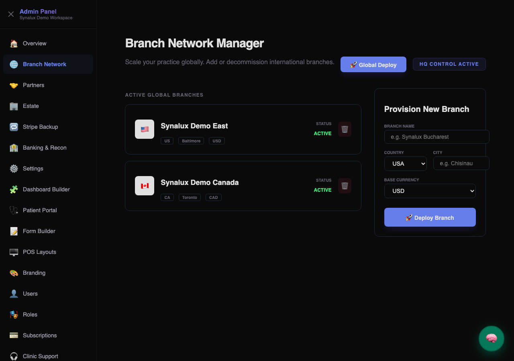
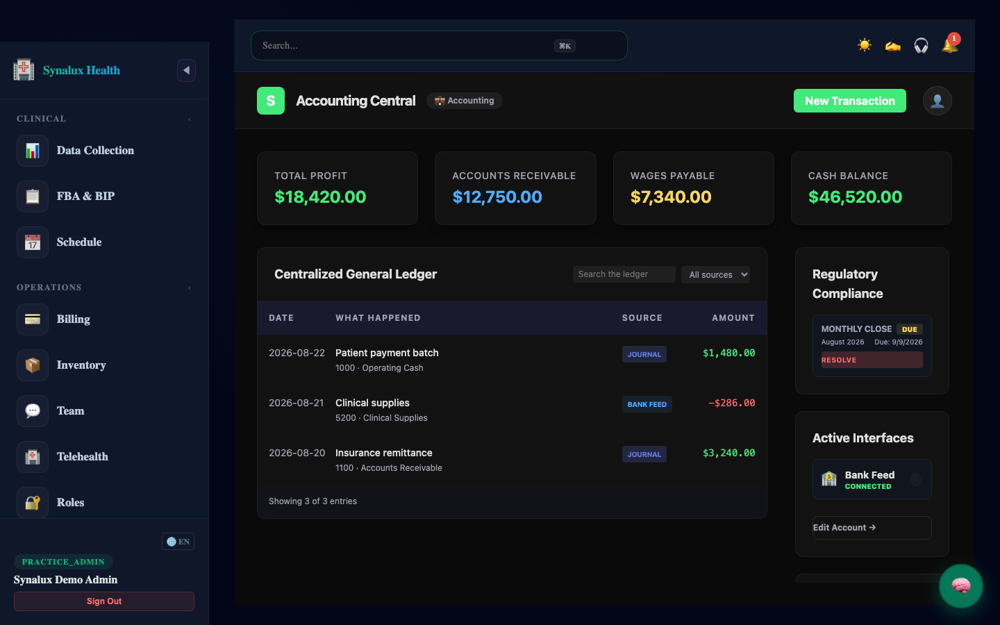
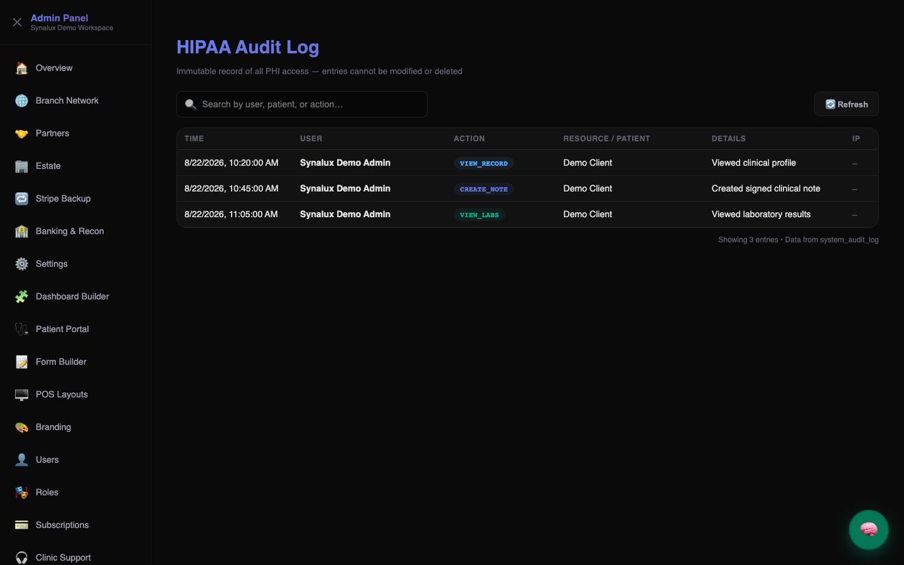

# ✦ Synalux

**Votre Plateforme de Gestion de Cabinet Propulsée par l'IA**

  
  
  
  

🌐 **Language / Язык / Limba:** [English](../../README.md) · [Español](README_es.md) · [Français](README_fr.md) · [Português](README_pt.md) · [Română](README_ro.md) · [Українська](README_uk.md) · [Русский](README_ru.md) · [Deutsch](README_de.md) · [日本語](README_ja.md) · [한국어](README_ko.md) · [中文](README_zh.md) · [العربية](README_ar.md)

📌 **[← Retour à la version anglaise](../../README.md)**

---

## 🏥 Types de pratique supportés

Synalux est une **plateforme d'entreprise multi-pratique** supportant 6 spécialités médicales de série. Chaque type de pratique comprend des modèles cliniques spécifiques, des codes de facturation, des barèmes et des flux de travail.

<h3>🧩 Analyse du comportement appliqué (ABA)</h3>

🔗 **[Open the current customer documentation index](../../README.md)**

<h3>👶 Pédiatrie</h3>

🔗 **[Open the current customer documentation index](../../README.md)**

<h3>🦷 Dentaire et Orthodontie</h3>

🔗 **[Open the current customer documentation index](../../README.md)**

<h3>🧠 Santé mentale et psychiatrie</h3>

🔗 **[Open the current customer documentation index](../../README.md)**

<h3>🏃 Physiothérapie et Médecine du Sport</h3>

🔗 **[Open the current customer documentation index](../../README.md)**

<h3>🔬 Dermatologie</h3>

🔗 **[Open the current customer documentation index](../../README.md)**

---

## 📦 Modules de la plateforme

The sections below summarize customer workflows. Use the linked guides for current behavior; availability varies by workspace, role, subscription, and configured integration.

<h3>💳 Billing & Payments</h3>

🔗 **[Open the current Billing & Payments customer guide](../../docs_source_en/billing_payments_module.md)**

<h3>🏥 Portail Patient</h3>

🔗 **[Open the current customer documentation index](../../README.md)**

<h3>👥 Gestion des ressources humaines et du personnel</h3>

🔗 **[Open the current customer documentation index](../../README.md)**

<h3>📋 Notes cliniques et documentation</h3>

🔗 **[Open the current customer documentation index](../../README.md)**

<h3>📅 Planification et Rendez-vous</h3>

🔗 **[Open the current customer documentation index](../../README.md)**

<h3>🧪 Module des commandes et résultats de laboratoire</h3>

🔗 **[Open the current customer documentation index](../../README.md)**

<h3>💊 Module des médicaments et des ordonnances</h3>

🔗 **[Open the current customer documentation index](../../README.md)**

<h3>📊 Module des vitales et des mesures</h3>

🔗 **[Open the current customer documentation index](../../README.md)**

<h3>⚠️ Module Allergies & Alerts</h3>

🔗 **[Open the current customer documentation index](../../README.md)**

<h3>💉 Module des vaccinations</h3>

🔗 **[Open the current customer documentation index](../../README.md)**

<h3>🔄 Module de renvois et de messagerie inter-pratique</h3>

🔗 **[Open the current customer documentation index](../../README.md)**

<h3>📋 Module des tâches cliniques</h3>

🔗 **[Open the current customer documentation index](../../README.md)**

<h3>🏥 Module d'Assurance Patient</h3>

🔗 **[Open the current customer documentation index](../../README.md)**

<h3>🔔 Module des rappels et des alertes</h3>

🔗 **[Open the current customer documentation index](../../README.md)**

<h3>Gestion des stocks</h3>

🔗 **[Open the current customer documentation index](../../README.md)**

<h3>🧾 Module des Superbills</h3>

🔗 **[Open the current customer documentation index](../../README.md)**

<h3>📚 Module d'éducation des patients</h3>

🔗 **[Open the current customer documentation index](../../README.md)**

<h3>📊 Module des Mesures de Qualité (HEDIS/MIPS)</h3>

🔗 **[Open the current customer documentation index](../../README.md)**

<h3>🔐 Security & Compliance</h3>

🔗 **[Open the current Security & Compliance customer guide](../../docs_source_en/security_compliance.md)**

<h3>💬 Équipe Chat & Communication</h3>

🔗 **[Open the current customer documentation index](../../README.md)**

---

### 📸 Product Tour

| 📊 1. Patient Dashboard | 🧠 2. AI Clinical SOAP Notes | 💬 3. Secure Team Chat |
|:---:|:---:|:---:|
|  |  |  |

| 💉 4. Immunizations | 📦 5. Inventory Management | 🧪 6. Lab Orders & Results |
|:---:|:---:|:---:|
|  |  |  |

| 👶 7. Pediatrics | 🐾 8. Veterinary Medicine | ❤️ 9. Vitals & Measurements |
|:---:|:---:|:---:|
|  |  |  |

| 🌍 11. Tableau de Bord Global | 💱 12. Finance Elite (Consolidation) | 🛡️ 13. Audit de Conformité |
|:---:|:---:|:---:|
|  |  |  |

## Current detailed guides

- [Clinical customer guide](../../docs_source_en/clinical.md)
- [Clinical notes and documentation](../../docs_source_en/clinical_notes_documentation.md)
- [Prism Coder developer guide](../../docs_source_en/coder.md)

## Getting started

1. Open [Synalux](https://synalux.ai/app) and sign in with the account supplied by your organization.
2. Confirm the active workspace and your role before opening a record or module.
3. Follow the relevant guide and verify the visible result before continuing.

---

<strong>🌐 Supported Languages</strong>

Use the language links at the top of this page for the translated customer overview. The linked English guides are the current detailed documentation.

---

   
  <b>© 2024–2026 Dmitri Costenco.</b> 
  Licensed under the <a href="../../LICENSE">Business Source License 1.1 (BSL-1.1)</a>. 
  <a href="https://synalux.ai/legal/privacy">Privacy Policy</a>

