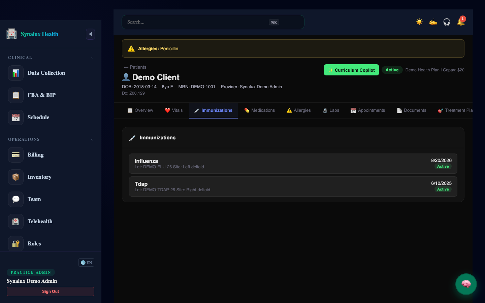
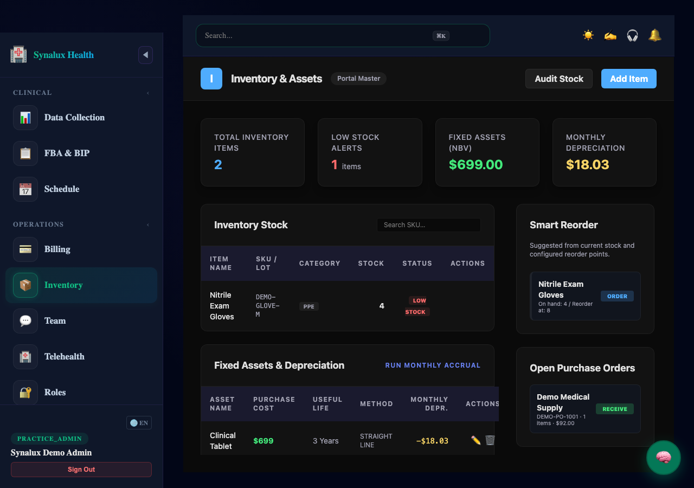
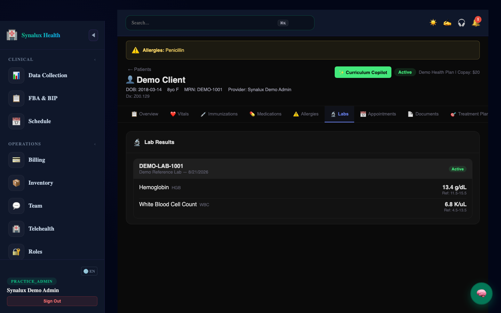
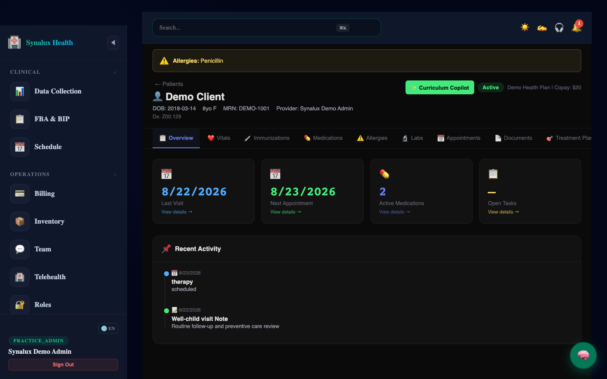
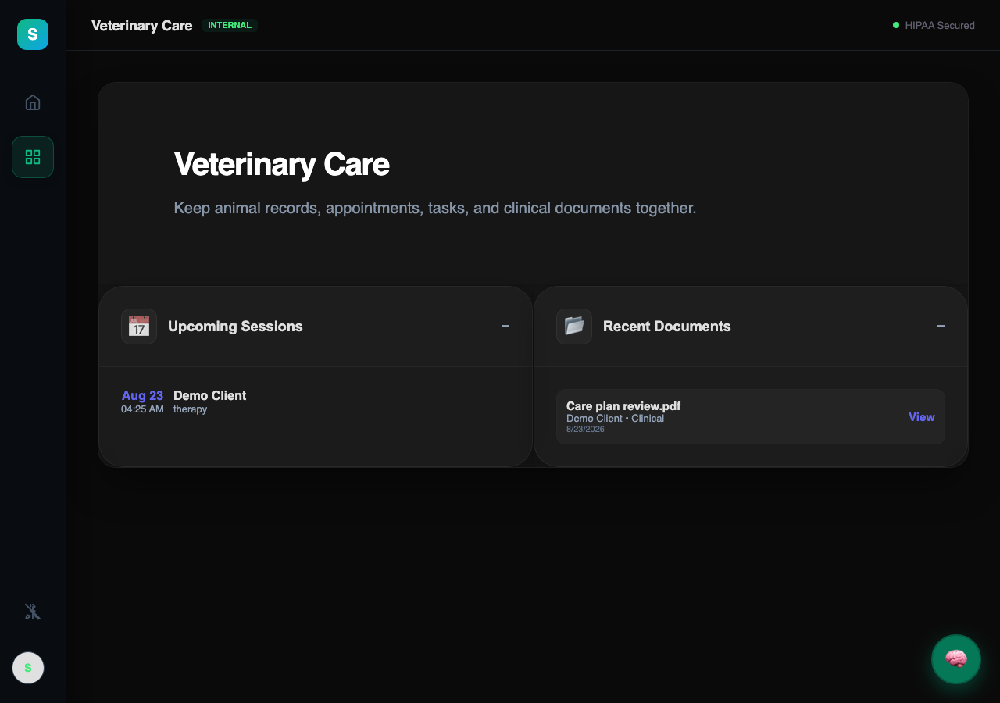
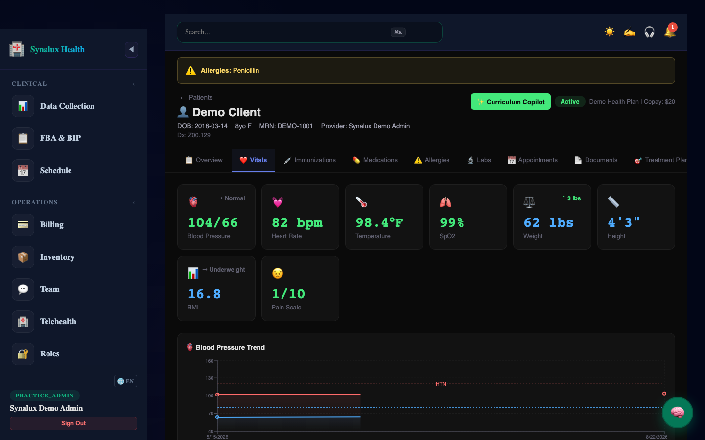

# ✦ Synalux

**AIを活用した診療管理プラットフォーム**

  
  
  
  

🌐 **Language / Язык / Limba:** [English](../../README.md) · [Español](README_es.md) · [Français](README_fr.md) · [Português](README_pt.md) · [Română](README_ro.md) · [Українська](README_uk.md) · [Русский](README_ru.md) · [Deutsch](README_de.md) · [日本語](README_ja.md) · [한국어](README_ko.md) · [中文](README_zh.md) · [العربية](README_ar.md)

📌 **[← 英語版に戻る](../../README.md)**

---

### 📸 Product Tour

| 📊 1. Patient Dashboard | 🧠 2. AI Clinical SOAP Notes | 💬 3. Secure Team Chat |
|:---:|:---:|:---:|
|  |  |  |

| 💉 4. Immunizations | 📦 5. Inventory Management | 🧪 6. Lab Orders & Results |
|:---:|:---:|:---:|
|  |  |  |

| 👶 7. Pediatrics | 🐾 8. Veterinary Medicine | ❤️ 9. Vitals & Measurements |
|:---:|:---:|:---:|
|  |  |  |

## 📦 Platform Modules

The sections below summarize customer workflows. Use the linked guides for current behavior; availability varies by workspace, role, subscription, and configured integration.

### 🏥 Clinical Care Modules

<h3>📋 クリニカル・ノートとドキュメント</h3>

🔗 **[詳細なクライニカル・ノートとドキュメントのドキュメント](../../docs_source_en/clinical_notes_documentation.md)**

<h3>📴 Offline clinical sessions</h3>

🔗 **[Open the current Offline Clinical Sessions customer guide](../../docs_source_en/offline_first_clinical_sessions.md)**

<h3>🧪 ラボオーダーと結果モジュール</h3>

🔗 **[ラボオーダーと結果モジュールの詳細ドキュメントを読む](../../docs_source_en/lab_orders_results_module.md)**

<h3>💊薬剤・処方箋モジュール</h3>

🔗 **[詳細な薬剤・処方箋モジュールドキュメンテーションを読む](../../docs_source_en/medications_prescriptions_module.md)**

<h3>📊 体調管理・測定モジュール</h3>

🔗 **[詳しい体調管理・測定モジュールのドキュメンテーションを読む](../../docs_source_en/vitals_measurements_module.md)**

<h3>⚠️ すべての過敏症と警告モジュール</h3>

🔗 **[詳細なすべての過敏症と警告モジュールドキュメンテーションを読む](../../docs_source_en/allergies_alerts_module.md)**

<h3>💉 接種管理モジュール</h3>

🔗 **[詳細な接種管理モジュールドキュメンテーションを読む](../../docs_source_en/immunizations_module.md)**

### 🏢 Practice Operations Modules

<h3>💳 Billing & Payments</h3>

🔗 **[Open the current Billing & Payments customer guide](../../docs_source_en/billing_payments_module.md)**

<h3>👥 HR & Staff Management モジュール</h3>

🔗 **[HR & Staff Management モジュールの詳細ドキュメントを読む](../../docs_source_en/hr_staff_management_module.md)**

<h3>⏱️ タイムシートと給与モジュール</h3>

🔗 **[詳細なタイムシートと給与モジュールのドキュメンテーションを読む](../../docs_source_en/timesheets_payroll_module.md)**

<h3>📦 在庫管理モジュール</h3>

🔗 **[在庫管理モジュールの詳細ドキュメントを読む](../../docs_source_en/inventory_management_module.md)**

<h3>🧾 超請求モジュール</h3>

🔗 **[詳細な超請求モジュールドキュメンテーションを読む](../../docs_source_en/superbills_module.md)**

<h3>📋 クリニカルタスクモジュール</h3>

🔗 **[詳細なクリニカルタスクモジュールドキュメンテーションを読む](../../docs_source_en/clinical_tasks_module.md)**

### 🤝 Patient Experience & Collaboration

<h3>🏥 パートナー</h3>

🔗 **[パートナーの詳細ドキュメントを読む](../../docs_source_en/patient_portal.md)**

<h3>📚 患者教育モジュール</h3>

🔗 **[患者教育モジュールの詳細ドキュメントを読む](../../docs_source_en/patient_education_module.md)**

<h3>🔔 再発とリマインダーモジュール</h3>

🔗 **[再発とリマインダーモジュールの詳細ドキュメントを読む](../../docs_source_en/recalls_reminders_module.md)**

<h3>🔄 参考と跨学科チャットモジュール</h3>

🔗 **[詳細な参考と跨学科チャットモジュールドキュメンテーションを読む](../../docs_source_en/referrals_cross_practice_chat_module.md)**

<h3>💬 チームチャットとコミュニケーション</h3>

🔗 **[チームチャットとコミュニケーションの詳細ドキュメントを読む](../../docs_source_en/team_chat_communication.md)**

<h3>📞 コラボレーションプラクティス・スイート</h3>

🔗 **[Open the current customer documentation index](../../README.md)**

### 🔐 Enterprise Administration

<h3>🔐 Security & Compliance</h3>

🔗 **[Open the current Security & Compliance customer guide](../../docs_source_en/security_compliance.md)**

<h3>⚙️ Platform Administration</h3>

🔗 **[Open the current Platform Administration customer guide](../../docs_source_en/platform_administration_white_label.md)**

---

## Current detailed guides

- [Clinical customer guide](../../docs_source_en/clinical.md)
- [Clinical notes and documentation](../../docs_source_en/clinical_notes_documentation.md)
- [Prism Coder developer guide](../../docs_source_en/coder.md)

## Getting started

1. Open [Synalux](https://synalux.ai/app) and sign in with the account supplied by your organization.
2. Confirm the active workspace and your role before opening a record or module.
3. Follow the relevant guide and verify the visible result before continuing.

---

<strong>🌐 Supported Languages</strong>

Use the language links at the top of this page for the translated customer overview. The linked English guides are the current detailed documentation.

---

   
  <b>© 2024–2026 Dmitri Costenco.</b> 
  Licensed under the <a href="../../LICENSE">Business Source License 1.1 (BSL-1.1)</a>. 
  <a href="https://synalux.ai/legal/privacy">Privacy Policy</a>

