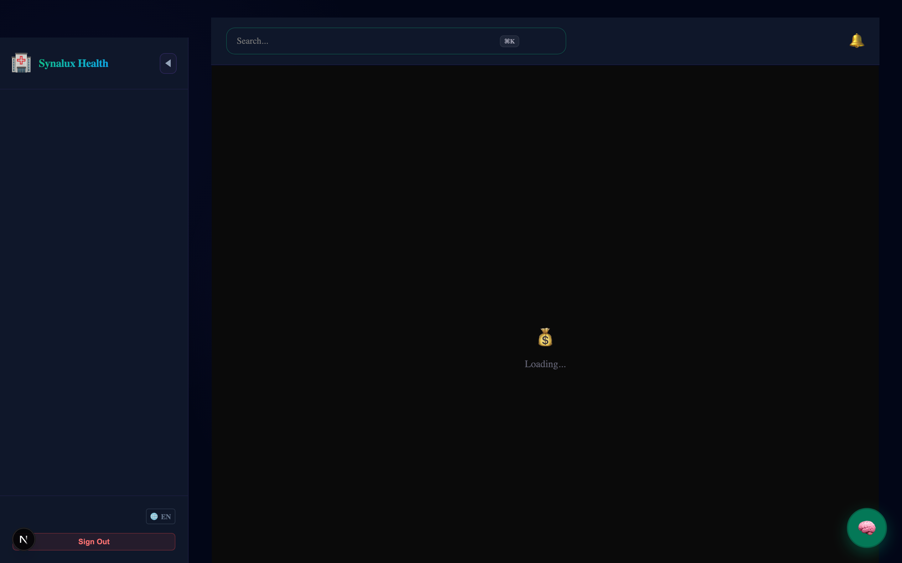

# ✦ Synalux

**Platforma Ta de Management al Practicii Medicale cu IA**

> Gestionează întreaga ta practică medicală dintr-o singură platformă — fișe medicale, programări, facturare, comunicare în echipă și documentație asistată de IA. Funcționează pentru terapia ABA, pediatrie, sănătate mintală, stomatologie, kinetoterapie și dermatologie. Disponibilă în 12 limbi. Conformă cu HIPAA.

<p align="center">
  <a href="https://synalux.ai/app"></a>
  <a href="https://marketplace.visualstudio.com/items?itemName=synalux-ai.synalux"></a>
  <a href="https://synalux.ai/docs"></a>
  <a href="LICENSE"></a>
</p>

🌐 **Language / Язык / Limba:** [English](../../README.md) · [Español](README_es.md) · [Français](README_fr.md) · [Português](README_pt.md) · [Română](README_ro.md) · [Українська](README_uk.md) · [Русский](README_ru.md) · [Deutsch](README_de.md) · [日本語](README_ja.md) · [한국어](README_ko.md) · [中文](README_zh.md) · [العربية](README_ar.md)

📌 **[← Înapoi la versiunea în engleză](../../README.md)**

🎬 **Videoclipuri demo în curând** — Vezi fluxul complet: pacienți, programări, note, facturi și chat de echipă în acțiune.

---

## 💡 De ce Synalux?

### Pentru Clinicieni
* **🎙️ Vorbește, nu scrie.** Dictează notele de sesiune și Synalux le transformă în note SOAP structurate instant — totul procesat pe dispozitivul tău.
* **📴 Funcționează offline.** Începe și termină sesiuni chiar și fără internet. Notele tale sunt salvate local și se sincronizează automat când revii online.
* **🛡️ IA de încredere.** Fiecare sugestie IA îți arată o comparație înainte/după. Nimic nu se schimbă în fișa pacientului până nu aprobi explicit.
* **📝 Mai puțin birou.** Generează FBA-uri, BIP-uri, rapoarte de progres și rezumate de externare — apoi trimite pentru semnătură electronică cu un clic.

### Pentru Proprietari și Administratori
* **🏥 O platformă pentru orice specialitate.** Sistemul se adaptează la tipul tău de practică — ABA, pediatrie, sănătate mintală, stomatologie, kinetoterapie sau dermatologie.
* **🌍 Facturare internațională.** Acceptă plăți în USD, CAD, GBP, EUR, AUD și NZD. Reduceri de volum automate la 100, 500 și 1.000+ clienți.
* **💳 Nu pierde niciodată venituri.** Plățile eșuate sunt reîncercate automat. Administratorii pot acorda perioadă de probă nelimitată.
* **👥 Controlează cine vede ce.** 15 roluri — de la medici la specialiști în facturare și HR.

### Pentru IT și Conformitate
* **📴 Sesiuni sigure offline.** Marcajele de timp sunt capturate pe dispozitivul clinicianului. Adminii văd indicatori 🟢/🔴.
* **🔐 HIPAA integrat.** Timeout de 15 min, fără date de pacient în browser, criptare în repaus.
* **📊 89 teste automate.** Motor de prețuri, flux de plată, sesiuni offline și conformitate — toate acoperite.

---


### 📸 Product Tour

| 📊 1. Patient Dashboard | 🧠 2. AI Clinical SOAP Notes | 💬 3. Secure Team Chat |
|:---:|:---:|:---:|
|  |  |  |

| 💉 4. Immunizations | 📦 5. Inventory Management | 🧪 6. Lab Orders & Results |
|:---:|:---:|:---:|
|  |  |  |

| 👶 7. Pediatrics | 🐾 8. Veterinary Medicine | ❤️ 9. Vitals & Measurements |
|:---:|:---:|:---:|
|  |  |  |

| 🤖 10. Intelligent Clinical Assistant |
|:---:|
|  |

| 🌍 11. Tabloul de Bord Global | 💱 12. Finanțe Elite (Consolidare) | 🛡️ 13. Audit de Conformitate |
|:---:|:---:|:---:|
|  |  |  |

| 📍 14. Managementul Sucursalelor |
|:---:|
|  |

## 📦 Platform Modules

Every module is multi-tenant, workspace-scoped, and HIPAA-compliant with strict role-based access.

### 🏥 Clinical Care Modules
<details>
<summary><h3>📋 Notele clinice și documentația</h3></summary>

🔗 **[Citiți detaliile despre Notele clinice și documentația](../../docs_source_en/clinical_notes_documentation.md)**


| Funcție | Detalii |
|---------|---------|
| **Note SOAP** | Generate automat din dictat vocal cu templatelor specifice ale specialităților |
| **Dictat vocal** | WASM Whisper pe dispozitiv → transmisie nulă de PHI către cloud |
| **4 modele de note** | Sesizare terapeutică, Notă de progres, Evaluare inițială, Rezumat la ieșire |
| **Documente** | Rezultatele laboratoriale, imagini, consente, evaluări, planuri de tratament — toate în cadrul spațiului de lucru |
| **Export PDF** | Renderare server-side (fără fugă de PHI la client) |
| **Semnăturile electronice** | Integrare cu BoldSign pentru 7 modele de documente |
| **OCR** | Scanning a documentelor în 30+ limbaje pentru digitalizarea formularului de admitere |

</details>

<details>
<summary><h3>📴 Sesții clinice offline-first</h3></summary>

🔗 **[Citiți documentația detaliată despre sesții clinice offline-first](../../docs_source_en/offline_first_clinical_sessions.md)**


| Funcție | Detalii |
|---------|---------|
| **Timestamp-uri la client** | Timpul de început/încheiere al sesiunilor capturat pe dispozitivul furnizorului — utilizat pentru facturare, nu timpul de primire a receipt-ului de la server |
| **Coada offline** | Evenimentele sunt enqueued în localStorage atunci când este offline și se sincronizează automat la reconectare |
| **Persistență a bocșelilor temporare** | Notările clinice sunt salvate automat în localStorage pe fiecare tastatură — supraviețuiesc o pereche de crash al browserului sau pierderea conexiunii |
| **Finalizarea sesiunilor** | Furnizorul trebuie să finalizeze sesiunea prin semnare — timpul este acuratatul în ceea ce privește facturarea |
| **Audit administtrativ** | fiecare eveniment arată un indicator verde/roșu pentru online/offline cu timestamp-uri de sincronizare |
| **Monitorul conexiunii** | bara laterală arată statutul real-time verde/roșu cu pictograma de badge a numărului de sincronizări în așteptare |
| **Curatarea HIPAA** | toate datele locale sunt șterse la logout și la expirarea temporară |
| **Sincronizare idempotenta** | Evită duplicarea evenimentelor prin UUID-uri generate de client |
| **Detectarea deviației în timp** | serverul își loghează deviația între timestamp-urile clientului și serverului pentru audit |
| **Ciclu de viață al sesiunilor** | `session_start` → `session_pause` → `session_resume` → `session_end` |

**Conformitatea cu facturarea:**
```
Furnizorul începe sesiunea la 14:00 (online) → 🟢
  Conexiunea se pierde la 14:30
Furnizorul finalizează sesiunea la 15:45 (offline) → 🔴 client_timestamp = 15:45
  Conexiunea se restabilește la 16:00 → sincronizare automată
Server-ul înregistrează: client_timestamp = 15:45, sync_timestamp = 16:00
  ↓
Asigurarea își este facturată: sesiunea de la 14:00 - 15:45 (acuratat)
Admin vede: "Sesiunea s-a încheiat la 15:45 🔴 Offline (sincronizată la 16:00)"
```

<details>
<summary><h3>🧪 Modul Comenzi și Rezultate Laboratoriale</h3></summary>

🔗 **[Citește Documentația Detaliată a Modulului Comenzi și Rezultate Laboratoriale](../../docs_source_en/lab_orders_results_module.md)**


| Funcție | Detalii |
|---------|---------|
| **Comenzi Laboratoriale** | Urmărire comenzi cu furnizori (Quest, LabCorp, intern), prioritate (routine/urgent/stat) |
| **Urmărire Rezultate** | Rezultate individuale de test cu zone referință și semnale abnormale (low/high/critical) |
| **Categorii** | Hematologie, Chemistrie, Lipid, Fizionemă, Tiroxina, Vitamine, Inflamație, Coagulație |
| **Alerți Abnormale** | Marcare automată a rezultatelor în afara zonei de referință (ex: TSH ridicată, vitamina D scăzută) |
| **iPLEDGE Labs** | Monitorizare lunar Accutane: CBC, CMP, panel lipide, LFT cu urmărire a trendului |
| **Pre-Surgical** | INR, PT, glicemie, clarificarea A1C pentru implanturi dentare și proceduri chirurgice |
| **Urmărire Medicamentelor** | Verificări tiroxine SSRIs, paneli lipide stimulante, panouri de bază biologice |
| **Viitorul Comenzii** | Plasată → Colectată → Trimisă → Recepută → În progres → Rezultatată → Examinată |
| **Integrare cu Furnizori** | Quest Diagnostics, rutele de comandă LabCorp (planificat: import automat rezultate electronice) |
| **Legături la Diagnosă** | Codurile ICD-10 atașate comenzilor pentru documentația necesară medicală |

</details>

<details>
<summary><h3>💊 Modul de Medicamente și Prescripții</h3></summary>

🔗 **[Citește Documentația Detaliată a Modulului de Medicamente și Prescripții](../../docs_source_en/medications_prescriptions_module.md)**


| Funcție | Detalii |
|---------|---------|
| **Catalog al medicamentelor** | 12+ medicamente cu coduri NDC, clase de medicament, reglementări, rute, dosi comune |
| **Prescripțiile active** | Lista per-patient a medicamentelor cu dosa, frecvența, prescrise de, farmacie, urmărire a renouărilor |
| **Clase de medicamente** | SSRIs, stimulante, retinoidi, biologice, bronchodilatoare, NSAIDs, antibioce, anticonvulsantii |
| **Urmărirea iPLEDGE** | Monitorizarea isotretinoinei Accutane cu cerințele de laborator lunare |
| **Ciclu de statut** | Activ → În așteptare → Discontinuat → Completat → Anulat |
| **Avertismente de interacțiune** | Avertismentii specifice medicamentelor (sindromul serotonin, QTc, teratogenice) |
| **Rutele ale farmaciei** | Farmacie numită per prescriție pentru pregătirea e-prescripciei |

</details>

<details>
<summary><h3>📊 Modul Vital & Măsurări</h3></summary>

🔗 **[Citește Documentația Detaliată a Modulului Vital & Măsurări](../../docs_source_en/vitals_measurements_module.md)**


| Funcție | Detalii |
|---------|---------|
| **Vitale Standard** | BP (sistolic/diastolic), HR, RR, temp (cu metodă), SpO2, greutate, înălțime, BMI |
| **Scara de Dolor** | Scara numerică de dolor de la 0-10 pe vizită |
| **Crescerea Pediatrică** | Circumferința crânului, procentile de greutate/înălțime/BMI (WHO/CDC) |
| **Evaluările PT** | Grade ROM, notele de funcție (Oswestry, LEFS), observațiile legate de activarea cuadriceps |
| **Urmărire a Trendurilor** | Vitale istorice pe pacient pentru analiză a trendurilor |
| **Încheiările la Consultări** | Vitale legate de întâlniri specifice ale consultărilor |

</details>

<details>
<summary><h3>⚠️ Modul Allergii și Alerte</h3></summary>

🔗 **[Citește Documentația Detaliată a Modulului Allergii și Alerte](../../docs_source_en/allergies_alerts_module.md)**


| Funcție | Detalii |
|---------|---------|
| **Tipuri de Allergeni** | Medicament, aliment, mediu, lămâie, contrast, altă |
| **Niveluri de Severitate** | Mild, moderat, sever, amenințant pentru viața |
| **Urmărire a Reacțiilor** | Documentare specifică a reacțiilor (anafilaxie, SJS, urci, pericolositate intestinală) |
| **Sprijin NKDA** | Documentare explicită "Nicio Allergie la Medicamente Cunoscută" |
| **Alerte Cliniči** | Semnale critică de alergie (Penicillin → folosiți clindamicina, Sulfa → istoric SJS) |
| **Verificare** | Verificare a medicului cu marcajuri datelor |

</details>

<details>
<summary><h3>💉 Modul de Vaccinări</h3></summary>

🔗 **[Citește Documentația Detaliată a Modulului de Vaccinări](../../docs_source_en/immunizations_module.md)**


| Funcție | Detalii |
|---------|---------|
| **Urmărire a Vaccinelor** | Coduri CVX, numere de dosi, numere de lot, fabricante |
| **Administrare** | Locație, cale (IM/SC/PO/IN/ID), medic care administrează vaccinul |
| **Conformitate cu VIS** | Urmărire a datelor declarațiilor de informații despre vaccin |
| **Raportare în Registru** | Urmărire a trimitărilor în registru de vacinări la nivel statal |
| **Program CDC** | DTaP, IPV, MMR, Varicella, Hep A/B, Influenza, Tdap |
| **Immunocompromisi** | Recomandări speciale pentru pacienți biologici |

</details>

### 🏢 Practice Operations Modules
<details>
<summary><h3>💳 Modul de Facturare și Plăți</h3></summary>

🔗 **[Citește Documentația Detaliată a Modulului de Facturare și Plăți](../../docs_source_en/billing_payments_module.md)**


Modulul de facturare folosește **Stripe Connect** pentru a oferi fiecărui practică propriul cont independent de procesare a platilor legat de administratorul practicii.

**Configurația Per-Practică:**
| Setare | Detalii |
|---------|---------|
| **Stripe Connect** | Fiecare spațiu de lucru are propriul cont `acct_xxx` Stripe Connect |
| **Admin Ligat** | Proprietatea contului Stripe este legată de utilizatorul admin al spațiului de lucru |
| **Scheleme de Taxe** | Scheleme de taxe per-practică cu tarife standard, asigurare, medicamentar și plata propriu |
| **Metode de Plată** | Carduri de credit, transfer bancar ACH, chitante, efectuat — configurabil pe practică |
| **Plata Automată** | Postarea automată a platilor, trimiterea de facturi și generarea rapoartelor lunare |
| **Configurație a Taxelor** | Tarife per-practică de taxe și NPI/EIN pentru raportarea 1099 |

**Multicountry și Multimonetar (NOU):**

|Țară|Monedă|Standard|Avansat|Enterprise|
|---------|----------|----------|----------|------------|
| 🇺🇸 USA | USD | $19/lună | $49/lună | $99/lună |
| 🇨🇦 Canada | CAD | C$25/lună | C$65/lună | C$129/lună |
| 🇬🇧 UK | GBP | £15/lună | £39/lună | £79/lună |
| 🇩🇪🇫🇷 UE | EUR | €18/lună | €45/lună | €89/lună |
| 🇦🇺 Australia | AUD | A$29/lună | A$75/lună | A$149/lună |
| 🇳🇿 New Zealand | NZD | NZ$32/lună | NZ$82/lună | NZ$159/lună |

**Reduceri Volume:**
| Clienți | Reducere |
|---------|----------|
| 100+ | 10% reducere pe preț per loc |
| 500+ | 20% reducere pe preț per loc |
| 1.000+ | 30% reducere pe preț per loc |
| Facturare anuală | Reducere suplimentară de 20% (acumulează cu volum, limitat la 45%) |

**Ciclu de viazări a platilor:**
```
Plata eșuată → past_due (bannere de avertisment, mențin accesul)
  → 2-a încercare → încă past_due (avertisment urgent)
  → 3-a încercare eșuată → demote automat la nivel gratuit
  → Stripe subscription.deleted → plan = 'free', sub ștergut
```

**Suprascrieri Admin Platform:**
- Adminii platformei Synalux pot seta orice utilizator pe o probă nesfaturită fără limită pe orice plan
- Utilizatorii suprascrisi sunt **imunizați** la diminuarea plăților prin webhooks Stripe
- Adminul vede indicatoare verde/roșu pentru starea platii
- Trajectorie completă: cine a setat suprascrierea, când și de ce

**Gestionarea Ciclului Facturării:**
- Urmărire a ciclului vieții asigurărilor (blocată → depozitată → acceptată → platit/refuzat → apel)
- Procesare electronică a remiterilor de plata (ERA/EOB)
- Gestionarea refuzelor cu urmărire a termenului de apel
- Lucrul cu autorizările antecipate
- Rapoarte de vechime (bucketuri de 30/60/90/120 zile)

**Platii ale Pacientilor:**
- Portal pacient "Plată acum" → redirectionare către Stripe Checkout
- Plăți parțiale și sume personalizate
- Planuri de plată cu abonamente recurrente Stripe
- Generarea și descărcarea facturilor
- Procesarea refundărilor

**Asigurări:**
- Submitare electronică a asigurărilor (837P)
- Verificare în timp real a eligibilității
- Coordonarea beneficiilor (COB)
- Urmărire a explicațiilor de beneficii (EOB)
- Gestionarea apelurilor cu sablonuri de lașuri

**Colectarea Automată a Taxelor:**
- Stripe Tax activat pe țară (VAT, GST, HST, PST)
- Calcul automat al taxei în funcție de țara spațiului de lucru
- Conform cu regulile multistatelor canadene (federale GST + provinciale PST/HST)

</details>

<details>
<summary><h3>📅 Planificare & Călătorii Medicali</h3></summary>

🔗 **[Citește Documentația Detaliată a Planificării și Călătoriilor Medicali](../../docs_source_en/scheduling_appointments.md)**


| Funcție | Detalii |
|---------|---------|
| **Stări ale Călătoriilor Medicali** | Programat → Confirmat → În desfășurare → Complet (+ anulat, nesemnat, reprogramat) |
| **Cereri din Portalul Pacientului** | Pacienții solicitez călătorii medicali cu o dată și oră preferate → personalul își confirme sau respinge |
| **Multiprovocatori** | Programare între mai mulți practicieni în același practicen |
| **Vizite Recurente** | Sesiuni terapeutice săptămâne, consultări lunare, ajustări ortopedice |
| **Lista de Așteptare** | Cereri de călătorii medicali din lista de așteptare când spațiile sunt pline |
| **Reamintiri Automatice** | Reamintiri automatice pentru călătorii medicali (programate) |

</details>

<details>
<summary><h3>👥 Modul HR și Management al Personalului</h3></summary>

🔗 **[Citește Documentația Detaliată a Modulului HR și Management al Personalului](../../docs_source_en/hr_staff_management_module.md)**


| Funcție | Detalii |
|---------|---------|
| **Profilurile de Personal** | Tipul angajatului, data angajării, salariu/tarif orar, specialități, urmărire a departamentelor |
| **Credențiale** | Urmărire a licenților/certificărilor cu alerte de expirare și fluxuri de renovare |
| **Timpul liber** | Vacanță, bolnavie, CE, maternitate, tristețe, judecătoria — fluxuri de aprobare |
| **Formațiune** | Urmărire a formei de conformitate (HIPAA, BLS, CPR) cu termenii limitării și starea completării |
| **Evaluările de Performanță** | Evaluări anuale/semianuale cu note, obiective, planuri de îmbunătățire și acordare |
| **Bineînțeles** | Stare în așteptare pentru oprimerea, pipeline verificare credențiale, atribuiri de formare |

</details>

<details>
<summary><h3>⏱️ Modulele Timesheets & Salariu</h3></summary>

🔗 **[Citiți Documentația Detaliată a Modulului Timesheets & Salariu](../../docs_source_en/timesheets_payroll_module.md)**


| Funcție | Detalii |
|---------|---------|
| **Generare Automată** | Timesheets generat automat din notele clinice semnate |
| **Timp Necodificabil** | Monitorizarea timpului admin, timp de călătorie, formarea și pregătirea cliniică |
| **Fluxuri de Aprobare** | Împreună cu angajații → Verificare supervisorului → Procesare salariu |
| **Export Salariu** | Export automat integrat cu ADP, Gusto și Paycom |
| **Conformitate** | Avertismente pentru timp suplimentar de 40 ore, urmărire obligatorie a pauzilor, vizibilitatea acruțirii PTO |

</details>

<details>
<summary><h3>📦 Modul de Management al Inventarului</h3></summary>

🔗 **[Citește Documentația Detaliată a Modulului de Management al Inventarului](../../docs_source_en/inventory_management_module.md)**


| Funcție | Detalii |
|---------|---------|
| **Categorii** | Suplimente dentare, vaccinuri, medicamente, biologice, PPE, chirurgicală, echipamente laboratoriale, birou |
| **Urmărire a Stocului** | Cantitatea pe stoc, nivelul de reînordonare, cantitatea de reînordonare, cost unitar |
| **Lot & Expirare** | Numerele de lot, datele de expirare, rotatia FIFO pentru vaccinuri |
| **Urmărire a Fornitorilor** | Henry Schein, Patterson Dental, Nobel Biocare, McKesson, Sanofi Pasteur |
| **Alerți de Statut** | În stoc, stoc scăzut, iesit din stoc, expirat, discontinuat |
| **Locații de Stocare** | Frig pentru vaccinuri (2-8°C), frig biologic, cajetarii chirurgicali, cajetarii închise |
| **Articole Esențiale** | Fixuri implantare ($285), peni biologice ($2.850), canisteri de cryoterapie |

</details>

<details>
<summary><h3>🧾 Modul Superbills</h3></summary>

🔗 **[Citează Documentația Detaliată a Modulului Superbills](../../docs_source_en/superbills_module.md)**


| Funcție | Detalii |
|---------|---------|
| **Pe bază de întâlnire** | O superbilă pe vizită cu codificarea diagnosticului + codificările procedurale |
| **Codificare Multicodificată** | Arrays de diagnose ICD-10 + arrays de proceduri CPT/CDT + modifieri (-25, -59) |
| **Descompunere financiară** | Totalul cheltuielilor, achitarea asigurării, copay al pacientului, ajustările |
| **Ciclu de statut** | Proiectare → Verificare → Transmisie → Plată / Refuzat / În apel |
| **Toate specializările** | Consultări pentru copii boli, implanturi, ortopedie, terapie psihologică, rehabilitație PT, proceduri dermatologice |
| **Scutiri medicare automate** | Monitorizarea automată a ajustărilor pentru obligațiile contractuale de medicare |

</details>


<details>
<summary><h3>📋 Modulul de sarcini clinice</h3></summary>

🔗 **[Citiți documentația detaliată a modulului de sarcini clinice](../../docs_source_en/clinical_tasks_module.md)**


| Funcție | Detalii |
|---------|---------|
| **Categorii ale sarcinilor** | urmărire laborator, autorizare anterioară, programare, documentare, facturare, apel la pacient, reîncărcare, referință |
| **Niveluri de prioritate** | scăzut, normal, înalt, urgent |
| **Atribuirea** | atribuită personalului specific cu termeni limită și urmărire a finalizărilor |
| **Pacient legat** | sarcini legate de pacienți specifice pentru coordonarea îngrijirii |
| **Urmărire a stării** | deschis → în curs → complet / anulat / șters |
| **Trațeala auditivă** | creat de, finalizat de, ora finalizări |

</details>

### 🤝 Patient Experience & Collaboration
<details>
<summary><h3>🏥 Portal Pacient</h3></summary>

🔗 **[Citiți Documentația Detaliată a Portalului Pacient](../../docs_source_en/patient_portal.md)**


Un portal pacient complet cu autentificare, mesaje, documente, întâlniri și facturare.

| Funcție | Detalii |
|---------|---------|
| **Autentificare** | Login prin cod de acces (hash SHA-256), urmărire a expirării |
| **Tablou de bord** | Panou cu o perspectivă asupra sănătății, întâlniri imediat înainte, mesaje nesemnate, documente în așteptare, echilibru datorat |
| **Mesaje** | Conversații thread-uri cu practicieni, indicatoare urgente, acorduri de citire |
| **Documente** | Consultări/download documente clinice, încarcă cardurile de asigurare și formule |
| **Întâlniri** | Consultări imediat înainte/pasătoare, cerere de noi întâlniri cu ore preferate |
| **Facturare** | Consultări echilibru, istoric facturare cu coduri CPT, plată online prin Stripe, planuri de plată, receipt-uri |
| **Formule** | Completă formulele de admiție, questionare PHQ-9/GAD-7, formule de acord online |
| **Acorduri** | Management digital al acordurilor (tratament, HIPAA, telemedicină, medicamente, cercetare) |

</details>

<details>
<summary><h3>📚 Modul de Educație a Pacientului</h3></summary>

🔗 **[Citește Documentația Detaliată al Modulului de Educație a Pacientului](../../docs_source_en/patient_education_module.md)**


| Funcție | Detalii |
|---------|---------|
| **Catalog de Materiale** | 14 documente educaționale pe toate specialitățile |
| **Multilingvă** | Materiale în engleză și spaniolă disponibile |
| **Categorii** | Stare, medicament, procedură, stil de viață, pos-operativ, exerciții la domiciliu, siguranță, prevenție |
| **Metode de Livrare** | Impresionat, încărcare prin portal, e-mail, în presență, text |
| **Apreciere** | Monitorizează dacă pacientul a văzut/acknowledged materialul |
| **Exemple de Specialități** | Guiă EpiPen, siguranța Accutane, rehabilitare ACL, teme de lucru pentru CBT, pos-operativ implant |

</details>

<details>
<summary><h3>🔔 Modul de Recall-uri și Recordări</h3></summary>

🔗 **[Citește Documentația Detaliată a Modulului de Recall-uri și Recordări](../../docs_source_en/recalls_reminders_module.md)**


| Funcție | Detalii |
|---------|---------|
| **Tipuri de Recall** | Higiene, examen anual, urmărire, recheck laborator, imagistic, screening, vaccinare, revizuire medicamentară |
| **Urmărire Statutului** | Încheiat → Trecut → Programat → Completat → Anulat |
| **Încercări de Contact** | Urmărește încercările de contact pentru recall-uri trecute |
| **Specificale Practicii** | Dental 6-luni de curățenie, derm annual verificare piel, laborator Accutane lunar |
| **Datele Automatice de Expirare** | Bazează-și pe ultimul vizită completat |

</details>

<details>
<summary><h3>🔄 Modul Referințe și Chat Cross-Practică</h3></summary>

🔗 **[Citiți Documentația Detaliată a Modulului de Referințe și Chat Cross-Practică](../../docs_source_en/referrals_cross_practice_chat_module.md)**


| Funcție | Detalii |
|---------|---------|
| **Urmărire Referințe** | Provoasă/destinatar, specialitate, motiv, coduri de diagnostic, urgență, urmărire autorizare |
| **Ciclu Stare** | În așteptare → Trimis → Acceptat → Programat → Complet / Expirat / Refuzat |
| **Chat Cross-Practică** | Mesajare HIPAA-compliant între administrații practicii/managerii birouri |
| **Compartimentalizare a Fișierelor Atașate** | Trimite imagini, rații, documente, rezultate laboratoriale, prescriziuni între practicii |
| **Conversații Threaded** | Threaduri de chat pe referință cu acordări de citere |
| **Exemple Reale** | Peds→Psychiatry (ADHD), Derm→PT (artrita psoriatică), PT→Derm (curățenie cutanată) |
| **Urmărire Autorizare** | Numere de autorizare, date de expirare, indicatoare de necesitate pentru autorizare anterioară |

</details>

<details>
<summary><h3>💬 Chat și comunicare echipă</h3></summary>

🔗 **[Citiți documentația detaliată despre Chat și comunicare echipă](../../docs_source_en/team_chat_communication.md)**
- [Collaborative Editor Suite](../../docs_source_en/collaborative_editors_module.md)


| Funcție | Detalii |
|---------|---------|
| **Chat criptat pe nivelul întregului sistem (E2E)** | Mesajare în cadrul echipelor de lucru, conform standardelor HIPAA |
| **Reuniri video grup** | Reuniuni WebRTC mesh scalabile pentru 6 participanți, compatibile cu telemedicină și standup-uri echipale (HIPAA) |
| **Programare sigură** | RSVP autentificat utilizând formatele de email zero-PHI pentru legături călendare |
| **Câlligările vocale și video** | Conferenciuni vocale și video sigure (doar pentru echipa) |
| **Compartează contextul prin AI** | Generarea planului de tratament → "Comparteți sesiunea" → împreună cu billing channel |
| **Comandă vocală → acțiune** | Comenzi vocale → apel, SMS, e-mail, programare (Pro+) |
| **Canale** | Canale bazate pe departament (clinice, facturare, admin) |
| **Atașamente de fișiere** | Împărtășiți documente, imagini și resurse clinice în chat |

</details>

<details>
<summary><h3>📞 Suite de practică de colaborare</h3></summary>

| Funcție | Detalii |
|---------|---------|
| **Tabloul centralizat** | Rutează mapele metrice agregate eficient. Centru comandă izolând sarcinile nerezolvate în mod nativ. |
| **Consultații video (WebRTC)** | Stream video P2P avansată și sigură folosind noduri TURN/STUN Twilio, evitând intermediarii. |
| **RLS Gating** | Urmărire implicită a identității eliminând fugă date între-tenanți la server natively, mapezând strict la limitele Advanced/Pro. |
| ** sarcini clinice** | Amintiri internale ale clinciei, aprobări și ștergerea izolate pe per workspace în mod sigur. |

</details>

### 🔐 Enterprise Administration
    <details>
    <summary><h3>🛡️ Securitate și Conformitate</h3></summary>

| Funcție | Detalii |
|---------|---------|
| **Conformitatea HIPAA** | Traiul audit HIPAA complet, arhitectură pregătită pentru BAA |
| **Controlul Accesului Riguros** | 11 roluri semnate criptografic cu limite specifice de acces |
| **Isolarea Datelor** | Toate registrele sunt izolate după clincă (`workspace_id`) pentru a preveni contaminarea cruzată |
| **Autentificare Criptografică** | Tokene temporare (expirare în 15 minute) asigură logout automatizat pentru dispozitive obsolete |
| **Criptografia la Repositoriul de Date** | Transparent Data Encryption (AES-256) pentru toate informațiile medicale |
| **Jurnali Audit Imutabile** | Jurnali imutabile pentru toate atribuiriile rolurilor, accesul la fișiere și acțiunile mesajelor |
| **Modul Securității HIPAA în Mod Faill Closed** | Refuză accesul la microfon dacă procesarea locală nu este disponibilă (fără fallback silențios cloud) |
| **Minimizare a Datelor** | Nicio memorie cache browser pentru PHI; date sensibile sunt șterse imediat atunci când o fereastră se închide |
</details>

<details>
<summary><h3>⚙️ Platform Administration & White-Label</h3></summary>

🔗 **[Read Detailed Platform Administration & White-Label Documentation](../../docs_source_en/platform_administration_white_label.md)**


| Feature | Details |
|---------|---------|
| **Arhitectura Multitenant** | Spațiuri de lucru izolate cu branding și configurații dedicate |
| **Workspace dinamic** | Logo, adresă principală și tematizare în timp real prin SSR |
| **Disponibilitatea modulurilor** | Administrația Platform poate glisăza sau ascunde module pe baza specializării clinice |
| **Comutarea caracteristicilor angajaților** | Suprascrie rolurile de bază cu `restricted_features` JSONB arrays aplicând blocare API la runtime |
| **Constructori de ecrane** | Capacitatea practicii de a redenumi butoane, ascunde coloanele datagrid sau suprascrie copia standard UI |
| **Audit Break-Glass** | Toate acțiunile administrației platformă sunt înregistrate în urmări audituale HIPAA-compatibile |

</details>


---

## 🏥 Synalux Health: Aplicația web clinică

*Access anywhere via iPad, Chromebook, or Desktop at [`synalux.ai/app`](https://synalux.ai/app).*

<details>
<summary><strong>The "Intake Room"</strong> — A zero-install PWA designed for ABA therapists</summary>

* **Smart Mic:** Uses the Page Visibility API + `window.onblur` to automatically pause recording if the clinician switches tabs or windows, preventing accidental ambient capture of other patients.
* **SOAP & BIP Generation:** Speak naturally. Synalux automatically categorizes your dictation into Subjective, Objective, Assessment, and Plan fields using 4 specialized templates.
* **Document Builder:** Edit the generated markdown, attach a patient intake template, and push it directly to BoldSign for parent/guardian E-Signatures in one click.
* **Server-Side PDF:** Documents are rendered server-side to prevent client-side PHI memory leakage — no `html2pdf.js` artifacts.
* **HIPAA-Hardened:** 15-minute idle timeout, no `localStorage` for PHI, explicit React state nulling on session clear, `Cache-Control: no-store` on all API responses.

**Templates:**

| Template | Use Case |
|----------|----------|
| 🧩 Therapy Session | ABA/behavioral therapy session notes |
| 📈 Progress Note | Ongoing treatment progress tracking |
| 📝 Initial Evaluation | First assessment and intake documentation |
| 🏁 Discharge Summary | Treatment completion and transition planning |

</details>

---

## 🧑‍💻 Synalux Dev: Extensia VS Code

*The ultimate memory-augmented IDE assistant.*

<details>
<summary><strong>Multi-Agent Orchestrator</strong> — Don't just chat; delegate</summary>

Describe a task (e.g., *"Add Stripe checkout and write tests"*), and Synalux will spawn a `planner` agent to break it down, a `coder` agent to write the implementation, and a `tester` agent to run Vitest in your terminal until the build passes.

* **Safe Mode Sandbox:** High-risk shell commands (`terminal`, `git_tool`, `browser`) require explicit user approval via a modal confirmation dialog before execution.
* **Dependency Audits:** Built-in tools scan your `package.json` against CVE databases automatically.
* **Prism Integration:** Synalux reads your codebase architecture and previous architectural decisions before writing a single line of code.

**17 Integrated Tools:**

| Category | Tools |
|----------|-------|
| 🖥️ Development | `terminal`, `git_tool`, `vitest`, `node_tool`, `browser` |
| 📝 Documentation | `soap_templates`, `boldsign`, `ocr`, `file_manager` |
| 🎙️ Multimodal | `voice`, `tts`, `screenshot`, `image_analyze` |
| 🔌 Integrations | `jira`, `confluence`, `slack`, `webhooks` |

</details>

---

<details>
<summary><h2>🔐 11 RBAC Roles</h2></summary>

Each role has a cryptographically signed Tool ACL and a server-injected system prompt:

| Role | Tools | Target |
|------|-------|--------|
| 🧑‍💻 `coder` | terminal, git, vitest, node, browser | Software engineers |
| 🏥 `bcba` | soap, voice, boldsign, file_manager | Board Certified Behavior Analysts |
| 🧑‍⚕️ `rbt` | soap, voice, file_manager | Registered Behavior Technicians |
| 🏢 `office` | file_manager, boldsign, slack | Office Managers |
| 📋 `manager` | jira, confluence, slack, file_manager | Project Managers |
| ✍️ `writer` | file_manager, browser, screenshot | Technical Writers |
| 🔒 `security` | terminal, git, browser | Security Engineers |
| 🧪 `tester` | vitest, terminal, browser | QA Engineers |
| ⚙️ `devops` | terminal, git, webhooks | DevOps/SRE |
| 📊 `planner` | jira, confluence, webhooks | Product Managers |
| 🚫 `restricted` | *(none)* | Read-only observers |

</details>

---

<details>
<summary><h2>🛡️ Securitatea Enterprise și Arhitectura HIPAA</h2></summary>

Synalux este proiectat pentru mediile de securitate zero-trust.

### Arhitectura de securitate — Fluxul cererilor multi-tenant

```
┌─────────────────┐     ┌──────────────────────────────┐     ┌──────────────────────────────┐     ┌─────────────────────────────┐
│   Client        │     │   Vercel Edge (Middleware)    │     │   Next.js API Routes         │     │   Supabase PostgreSQL       │
│                 │     │                              │     │                              │     │                             │
│  Browser /      │────▶│  1. Verificare autenticație (NextAuth)    │────▶│  3. Aplicarea drepturilor de acces la instrumente (ACL)     │────▶│  6. Politici RLS            │
│  VS Code        │     │  2. Semnare JWT (Ed25519)    │     │  4. Sandbox AI               │     │     (JWT → set_config)      │
│                 │     │     (TTL de 15 minute)             │     │     (ProposedChange)         │     │  7. Datele multi-tenant       │
│                 │     │                              │     │  5. Jurnal audit HIPAA          │     │     (izolare workspace_id)   │
└─────────────────┘     └──────────────────────────────┘     └──────────────────────────────┘     └─────────────────────────────┘
                              Google OAuth                    Contextul instrument răspins                   Filtre RLS după workspace_id
```

**Perspectivă cheie:** Deoarece JWT-urile au claim-uri `workspace_id` și politicile RLS PostgreSQL le citesc prin `current_setting('request.jwt.claims')`, nu există **variabile de sesiune server-side** și nici **pool-uri de conexiuni per tenant**. Aceasta face Synalux scalabil orizontal.

### Controale de securitate

* **Autentificare cu EdDSA (Ed25519):** Token-urile API statice sunt demote la starea de doar actualizare. Toate cererile API sunt autentificate prin JWT-uri scurte (15 minute) semnate cu criptografia asimetrică.
* **Criptografie transparentă a datelor (TDE):** Toate mesajele, documentele generate și istoricii sesiunilor sunt criptate în repos.
* **Minimizarea strictă a datelor:** Transcripturile Web App live doar în memorie React state și sunt colectate de garbage collector la închiderea unui tab. `localStorage` nu este folosit pentru PHI.
* **Stocare cu verificare MIME:**
  - Atașamentele clinice sunt restricționate prin verificarea server-side strictă a tipurilor MIME și sunt servite exclusiv prin URL-uri semnate cu IDOR prevenită (15 minute).
* **Jurnali audit imutabile:** Toate atribuiriile rolului, descărcările de fișiere și ștergerile de mesaje sunt înregistrate permanent în `rbac_audit_log` pentru non-repudiație conformitatei. Rândurile din jurnalul audit sunt append-only — chiar adminii bazei de date nu pot modifica istoricul.
* **Portughești de siguranță HITL:** Instrumentele periculoase (`terminal`, `git_tool`, `browser`) necesită o aprobare explicită utilizatorului prin un dialog modal înainte de executare — prevenind zero-click RCE prin injecție de prompt.
* **Modul HIPAA fail-closed:** Dacă LLM local (Ollama) nu este disponibil în timpul intake-ului vocal clinic, sistemul rafușează deschiderea microfonului în loc să renunțe silențios la procesarea cloud.
* **Bannere de siguranță ale datelor obsolete (Siguranța pacienților):** Dacă datele clinice nu au fost rafușate în sesiunea curentă, o banner îl avertizează clinicianul, prevenind deciziile terapeutice bazate pe informații obsolete.

### Declarația de conformitate HIPAA

| Cerință HIPAA | Implementare Synalux |
|---|---|
| **§164.312(a)(1)** Controlul accesului | RBAC bazat pe JWT cu ACL-uri per-instrument; RLS asigură izolare tenant la nivelul bazei de date |
| **§164.312(b)** Controlele auditului | Jurnal audit imutabil `hipaa_audit_log` + `rbac_audit_log` — toate accesurile cu PHI sunt înregistrate cu utilizator, acțiune, resursă și timestamp |
| **§164.312(c)(1)** Integritatea | Sandbox AI (`ProposedChange`) asigură nicio scriere automatizată la datele clinice fără semnatura a unui clinician |
| **§164.312(d)** Autentificare | JWT-uri asymmetrice (TTL de 15 minute); Google OAuth cu MFA pentru rolurile clinice |
| **§164.312(e)(1)** Securitatea transmisiei | TLS 1.3 aplicat pe toate endpoint-urile; conexiunile Supabase folosesc SSL; nu există PHI în parametri URL |
| **§164.308(a)(1)** Analiza riscurilor | Reviewuri de securitate adversariale (`REVIEW_PROMPT.md`); barriere automatice cu verificare SSE pe ferestre glisante |
| **Nicio persistență a localStorage** | Toate datele clinice live în React state (colectate de garbage collector la închiderea unui tab) sau Postgres (protejate prin RLS). Zero persistență a PHI în browser |

> **Covrind BAA:** Complianța totală cu HIPAA necesită Vercel Enterprise + Supabase Team tier. Consultați [Modulele de infrastructură și servicii cloud](#platform-modules) pentru prețuri.

</details>

---

---

## 🚀 Primii pași

### For Healthcare & Clinics (Web App)
1. Go to [synalux.ai/app](https://synalux.ai/app).
2. Sign in with Google (MFA required for clinical roles).
3. Select **Therapy Session** from the template dropdown.
4. Type or dictate your clinical notes.
5. Click **📤 Generate SOAP Note** and review the streamed output.

### For Developers (VS Code)
1. Install the extension: `ext install synalux-ai.synalux`
2. Press `Cmd+Shift+P` → **Synalux: Sign In with Google**
3. Open the chat panel and type: `@coder Scaffold a new Next.js route for user profiles.`

### For Clinics Wanting 100% Local
```bash
# 1. Install Ollama
brew install ollama     # macOS

# 2. Pull a model
ollama pull qwen2.5-coder:14b

# 3. Enable CORS for the web app
OLLAMA_ORIGINS="https://synalux.ai" ollama serve

# 4. Open synalux.ai/app → toggle backend to "Local"
```

---

<details>
<a name="platform-modules"></a>
<summary><h2>☁️ Infrastructure & Cloud Services</h2></summary>

Synalux runs on a **serverless-first architecture** using 6 cloud services. No Azure, AWS, or GCP VMs are needed.

### Current Stack (All Free Tiers)

| Service | Role | Current Plan | Cost | Free Tier Limit |
|---------|------|-------------|------|-----------------|
| **Vercel** | Hosting + Edge + CDN | Hobby | $0/mo | 100GB bandwidth, 100GB-hrs serverless |
| **Supabase** | PostgreSQL + Auth + RLS | Free | $0/mo | 500MB DB, 50K MAU, 1GB storage |
| **Stripe** | Payments + Subscriptions | Standard | 2.9% + 30¢/txn | No monthly fee, unlimited products |
| **Google Cloud** | Gemini AI + OAuth + Transcription | Free tier | $0/mo | 15 RPM Gemini, unlimited OAuth |
| **OpenRouter** | Multi-model LLM routing | Free models | $0/mo | Unlimited `:free` model requests |
| **GitHub** | Source control + CI/CD | Free | $0/mo | Unlimited private repos, 2000 CI min/mo |

### AI Models & Routing

Synalux routes AI requests through a **dual-backend architecture**:

**Cloud Backend (via OpenRouter + Gemini fallback)**
| User Plan | Default Model | Max Tokens | Daily Limit |
|-----------|---------------|-----------|-------------|
| Free | Gemma 3 12B `:free` | 2,048 | 10K tokens |
| Standard | Gemma 3 27B `:free` | 4,096 | 100K tokens |
| Pro | Gemma 4 31B `:free` | 8,192 | 500K tokens |
| Enterprise | Gemma 4 31B `:free` | 16,384 | 5M tokens |

**Selectable Models (by tier)**
| Model | Free | Standard | Pro | Enterprise |
|-------|------|----------|-----|-----------|
| Gemma 3 12B | ✅ | ✅ | ✅ | ✅ |
| Gemini 2.5 Flash | — | ✅ | ✅ | ✅ |
| Claude Sonnet 4 | — | — | ✅ | ✅ |
| GPT-4.1 | — | — | ✅ | ✅ |
| Gemini 2.5 Pro | — | — | ✅ | ✅ |
| Claude Opus 4 | — | — | — | ✅ |
| o3-pro | — | — | — | ✅ |

**Local Backend (Ollama — 100% on-device, no tier gating)**
| Model | RAM Required |
|-------|-------------|
| Qwen 2.5 Coder 14B | 18GB |
| DeepSeek R1 14B | 18GB |
| Qwen 2.5 Coder 32B | 36GB |
| DeepSeek R1 32B | 36GB |

**Google Gemini (Free Tier — Direct Fallback)**
| Feature | Limit |
|---------|-------|
| Model | `gemini-2.5-flash` |
| Rate limit | 15 requests/minute |
| Input context | 1M tokens |
| Voice transcription | Gemini-powered, free tier |

> **Why Gemini as fallback?** When OpenRouter is down or rate-limited, the chat API
> falls back to Google's Gemini API directly. This gives us a free, reliable safety net
> with tool-calling support. No API key cost — Google's free tier is generous.

### Scaling Thresholds

| Clients | Action Required | Monthly Cost |
|---------|----------------|-------------|
| **1–100** | ⚠️ Upgrade Vercel to Pro (commercial use required) | **$20** |
| **100–1,000** | Upgrade Supabase to Pro (8GB DB, daily backups) | **$45** |
| **1,000–10,000** | Add Vercel Pro + Supabase Pro + CDN for videos | **$50–100** |
| **10,000+** | Vercel Pro + Supabase Team + custom Stripe rate | **$650+** |
| **HIPAA Required** | Vercel Enterprise + Supabase Team (BAA) | **$1,100+** |

### Enterprise Tier Pricing

| Service | Enterprise Plan | Price | What You Get |
|---------|----------------|-------|-------------|
| **Vercel** | Enterprise | ~$500+/mo (custom) | BAA, SSO/SAML, SLA, dedicated support, WAF |
| **Supabase** | Team | $599/mo | BAA, SOC2, HIPAA, 100GB DB, priority support |
| **Supabase** | Enterprise | Custom | HIPAA+BAA, dedicated infra, custom SLA |
| **Stripe** | Custom | Negotiated | 2.5% + 25¢ at $50K+/mo volume |
| **OpenRouter** | Pay-per-token | ~$0.001–0.03/1K tokens | Non-free models (Claude Opus, GPT-4.1, o3) |
| **Google Cloud** | Pay-as-you-go | $0 (free tier sufficient) | Upgrade only if exceeding 15 RPM |

### Why Not Azure or AWS?

Synalux deliberately avoids Azure, AWS, and traditional IaaS:

| Concern | How Synalux Handles It | Why Not Azure/AWS |
|---------|----------------------|-------------------|
| **Hosting** | Vercel (zero-config Next.js, global CDN, auto-scaling) | Azure App Service requires manual scaling, SSL config, CI/CD setup |
| **Database** | Supabase (managed Postgres + built-in RLS + Auth + Realtime) | Azure SQL/RDS requires manual RLS policies, separate auth service |
| **AI/LLM** | OpenRouter + Gemini (multi-model routing, free tiers) | Azure OpenAI requires $200+/mo commitment, limited model selection |
| **Auth** | NextAuth + Google OAuth (zero cost, built-in) | Azure AD B2C is $0.00325/auth, complex setup |
| **Payments** | Stripe (industry standard, PCI-compliant) | No Azure/AWS equivalent |
| **CI/CD** | GitHub Actions (free for private repos) | Azure DevOps adds complexity |
| **Total ops burden** | **Zero servers to manage** | Azure/AWS = VMs, VPCs, security groups, patching |

> **Bottom line:** Azure/AWS would cost **$200–500+/mo** for equivalent infrastructure with
> significantly more operational complexity. Our serverless stack runs at **$0/mo** on free
> tiers and scales to **$45/mo** for 1,000 clients — with zero server management.

### Current Database Stats (Live)

| Metric | Value |
|--------|-------|
| Database size | 17 MB / 500 MB (3%) |
| Tables | ~30 |
| Patients | 27 |
| Appointments | 61 |
| Documents | 78 |
| Cache hit rate | 99–100% |
| WAL size | 80 MB |

</details>

---

<details>
<summary><h2>📁 Project Structure</h2></summary>

```
synalux-private/
├── portal/                   # Next.js web portal + clinical web app
│   ├── src/app/app/          # 🏥 Synalux Health (Web App)
│   │   ├── page.tsx          # SOAP Notes workspace
│   │   ├── chat/page.tsx     # AI Chat
│   │   ├── team/page.tsx     # Team Chat (Pro+)
│   │   └── layout.tsx        # App shell + sidebar
│   ├── src/app/patient-portal/  # 🏥 Patient Portal
│   │   └── page.tsx          # Dashboard, Documents, Appointments, Billing, Messages
│   ├── src/app/api/v1/       # REST APIs
│   │   ├── chat/route.ts     # Streaming chat (SSE)
│   │   ├── soap/route.ts     # SOAP note generation
│   │   ├── pdf/route.ts      # Server-side PDF export
│   │   ├── messages/         # Team Chat API
│   │   ├── roles/            # RBAC management
│   │   ├── billing/          # Stripe integration + checkout
│   │   └── webhooks/stripe/  # Stripe webhook handler
│   ├── src/lib/              # Auth, DB, i18n, SOAP templates
│   │   ├── stripe.ts         # Stripe Connect + Checkout + Portal
│   │   ├── db.ts             # Supabase client + user management
│   │   └── auth-options.ts   # NextAuth + Google OAuth
│   └── supabase/             # Database migrations + seed data
│       ├── seed_poc_part1.sql          # Core users/workspaces
│       ├── seed_poc_part2b_*.sql       # HR tables + clinical catalogs
│       ├── seed_poc_part2c.sql         # Cross-practice links + payers
│       ├── seed_poc_part2d.sql         # Appointments (61 records)
│       ├── seed_poc_part2e.sql         # Treatment plans (16 records)
│       ├── seed_poc_part2f.sql         # HR module (staff/credentials/reviews)
│       ├── seed_poc_part2g.sql         # Billing entries, SOAP notes, documents
│       ├── seed_poc_part2h.sql         # Portal data (messages, consents, forms)
│       └── seed_poc_part2i_*.sql       # Per-practice billing config + Stripe Connect
├── synalux-vscode/           # 🧑‍💻 VS Code extension
│   ├── src/chat-panel.ts     # Agentic chat + tool execution
│   ├── src/mcp-server.ts     # Local MCP tool dispatcher
│   └── tools/                # Python tool implementations
├── README.md                 # This file
├── LICENSE                   # BSL-1.1
└── REVIEW_PROMPT.md          # Adversarial security review
```

</details>

---

<details>
<summary><h2>📊 Database Census</h2></summary>

The production database contains **1,400+ records** across 71 tables:

| Module | Table | Records |
|--------|-------|---------|
| **Infrastructure** | Workspaces | 6 |
| | Users | 19 |
| | Workspace Members | 21 |
| | Medical Fields | 37 |
| | Workspace Roles | 54 |
| | Role Field Links | 104 |
| **Auth & Security** | JWT Auth Log | 261 |
| | API Tokens | 14 |
| | Processed Webhook IDs | 11 |
| **Clinical Catalogs** | Diagnosis Codes (ICD-10) | 63 |
| | Billing Codes (CPT/CDT) | 61 |
| | Insurance Payers | 16 |
| | Medications Catalog | 12 |
| **Patient Care** | Patients | 27 |
| | Appointments | 61 |
| | Treatment Plans | 16 |
| | Session Notes | 18 |
| | Documents | 78 |
| | Patient Vitals | 10 |
| | Patient Allergies | 10 |
| | Patient Medications | 10 |
| | Immunizations | 10 |
| | Clinical Tasks | 10 |
| **Billing & Revenue** | Billing Entries | 34 |
| | Fee Schedules | 26 |
| | Patient Payments | 15 |
| | Payment Plans | 3 |
| | Insurance Claims | 7 |
| | Workspace Billing Configs | 6 |
| | Patient Insurance | 15 |
| **HR Module** | Staff Profiles | 16 |
| | Staff Credentials | 14 |
| | Staff Time Off | 10 |
| | Staff Training | 13 |
| | Performance Reviews | 6 |
| **Patient Portal** | Portal Messages | 18 |
| | Patient Consents | 21 |
| | Patient Forms | 14 |
| | Appointment Requests | 10 |
| | Portal Access Codes | 9 |
| **Lab Module** | Lab Orders | 9 |
| | Lab Results | 29 |
| **Referral System** | Referrals | 5 |
| | Referral Chat Threads | 3 |
| | Referral Chat Messages | 15 |
| | Patient Recalls | 11 |

</details>

---

<details>
<summary><strong>🌐 Supported Languages</strong></summary>

The portal, documentation, and AI interface are available in 16 languages:

| Language | Code | Status |
|----------|------|--------|
| 🇺🇸 English | `en` | ✅ Full |
| 🇪🇸 Español | `es` | ✅ Full |
| 🇫🇷 Français | `fr` | ✅ Full |
| 🇵🇹 Português | `pt` | ✅ Full |
| 🇷🇴 Română | `ro` | ✅ Full |
| 🇺🇦 Українська | `uk` | ✅ Full |
| 🇷🇺 Русский | `ru` | ✅ Full |
| 🇩🇪 Deutsch | `de` | ✅ Full |
| 🇯🇵 日本語 | `ja` | ✅ Full |
| 🇰🇷 한국어 | `ko` | ✅ Full |
| 🇨🇳 中文 | `zh` | ✅ Full |
| 🇸🇦 العربية | `ar` | ✅ Full (RTL) |

</details>

---

<p align="center">
  <br>
  <b>© 2024–2026 Dmitri Costenco.</b><br>
  Licensed under the <a href="LICENSE">Business Source License 1.1 (BSL-1.1)</a>.<br>
  <a href="https://synalux.ai/docs/disclaimer">Legal & Medical Disclaimer</a>
</p>
