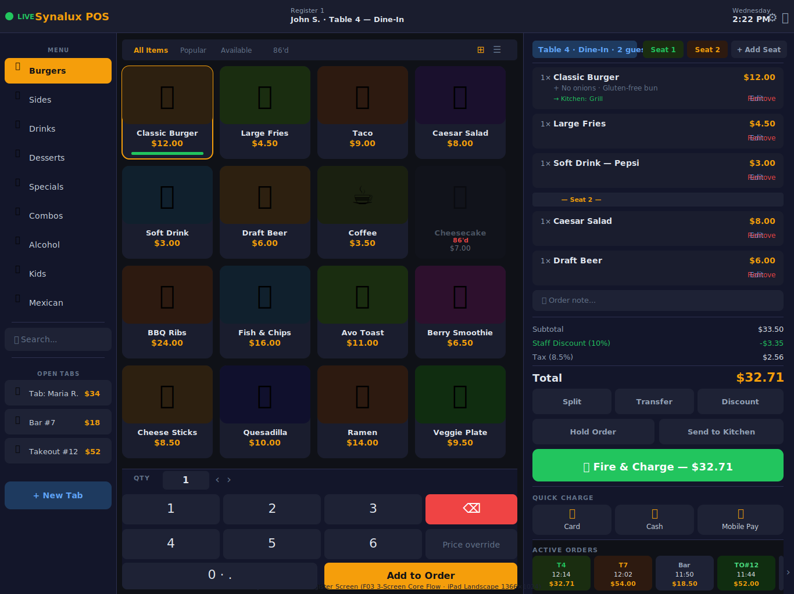
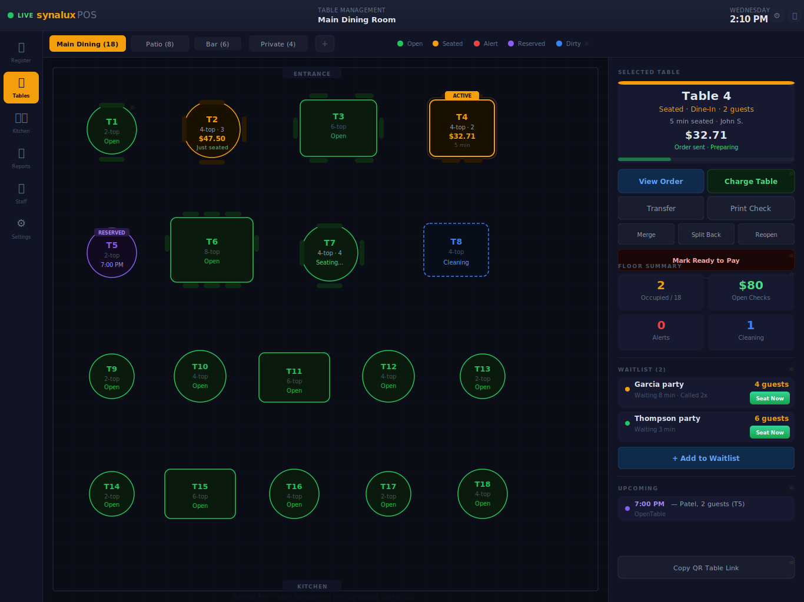
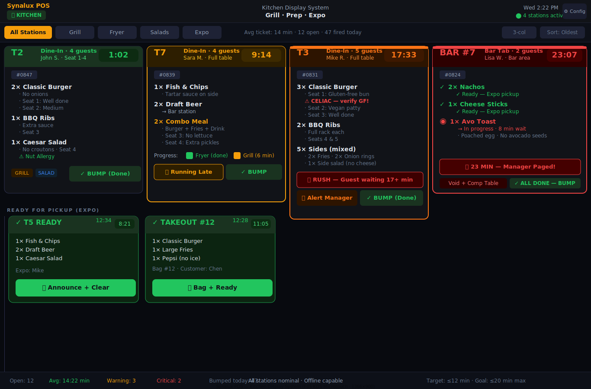
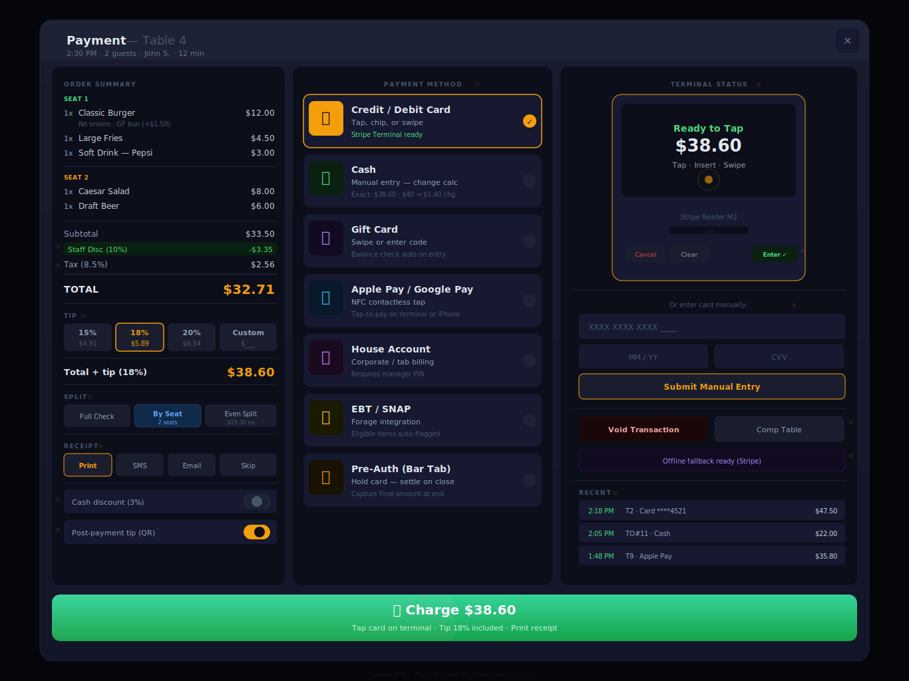

# Synalux POS

**El sistema POS para restaurantes que no te cobra de más.**

Todas las funciones incluidas. Sin cargos adicionales. Sin hardware propietario. Sin contratos a largo plazo. Usa tu propio iPad — o cualquier dispositivo con navegador.

---

## Screenshots

---

## ¿Por qué cambiar?

Tu POS actual cuesta demasiado. Toast cobra $400–600/mes. Square cobra $250–350/mes. Clover te ata a contratos de 3 años con hardware de $2,000+.

**Synalux: Gratis para siempre con 1 terminal. $49/mes Pro con 14 días de prueba. Tu propio iPad. Cancela cuando quieras.**

---

## Funciones

- **Caja Registradora — diseño de 3 paneles, escaneo de código de barras, asignación de asientos, verificación de edad**
- **Pantalla de Cocina (KDS) — tablero de tickets, conteo diario, código de colores por tipo de pedido**
- **Pagos — 6 métodos: tarjeta, efectivo, tarjeta de regalo, cuenta de casa, cuenta dividida, cuenta de bar**
- **Reportes — 8 pestañas: ventas, PMIX, ingeniería de menú, velocidad de servicio, servidor, pagos, anulaciones, laboral**
- **Personal — autenticación PIN, 7 niveles RBAC, reloj, descansos, horarios, propinas, nómina**

---

## Precios

| | Free | Pro | Business | Enterprise |
|---|:---:|:---:|:---:|:---:|
| | **Gratis para siempre** | **$49/mes** | **$99/mes** | **$199/ubicación** |
| | 14 días de prueba gratis | 14 días de prueba gratis | 14 días de prueba gratis | 14 días de prueba gratis |

**Sin contrato. Sin penalización por cancelación. Cancela cuando quieras.**

25 idiomas con soporte RTL.
