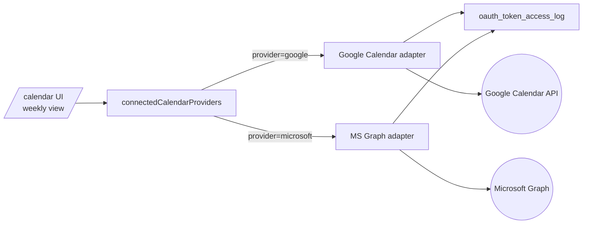

# 📅 Calendar

**Google Calendar + Microsoft Outlook in one view.** Schedule appointments with **Google Meet, Microsoft Teams, or Zoom** in one click — never bounces you out to another tab. Lives at [synalux.ai/calendar](https://synalux.ai/calendar).

---

## 🌐 Multi-Provider Aggregation
Connect Google + Microsoft accounts; events from all calendars render in a single weekly view. The provider routing is invisible to the user — pick a slot, click create, the right provider gets the API call.



---

## 🎥 In-Click Conferencing — Tier-Gated
Every calendar event creator includes a conferencing toggle. The available providers depend on the user's tier.

| Conferencing | Free | Standard | Advanced | Enterprise |
|---|---|---|---|---|
| Google Meet | ✅ | ✅ | ✅ | ✅ |
| Microsoft Teams | — | ✅ | ✅ | ✅ |
| Zoom | — | — | ✅ | ✅ |
| Auto-route (`conference: 'auto'`) | — | ✅ | ✅ | ✅ |

`conference: 'auto'` picks Google Meet if the host is on Google, Teams if on Microsoft, Zoom if explicitly preferred. Tested via the prod verifier with a Zoom fixture.

---

## ✏️ In-Place CRUD — One Route, Four Methods
The `/api/v1/calendar/events` endpoint serves all four CRUD operations on the same route file:

| HTTP | Action | Behaviour |
|---|---|---|
| `GET` | List events in a calendar | Best-effort: returns `[]` if the adapter fails (so the UI degrades to "no events" instead of red error) |
| `POST` | Create event | Returns `{ ok, eventId }` or maps `WriteResult.code → HTTP status` |
| `PATCH` | Update existing event | Partial update via `Partial<EventDraft>` |
| `DELETE` | Delete event | `410 Gone` on the upstream is treated as success (idempotent) |

Why one route? All four operations share auth, provider resolution, and audit semantics. Splitting would just be churn. Next.js routes the file by HTTP method via named exports.

---

## 🔒 Audit & OAuth Token Isolation
*   **Every operation** flows through `resolveProviderToken(...)` which writes an `oauth_token_access_log` row.
*   **Reason field is operation-specific** so an auditor can distinguish "list" from "delete" in the chain.
*   **Pattern C OAuth token isolation** — full audit-ready spec at `portal/docs/security/oauth-token-isolation.md` (private repo).
*   **Workspace-scoped** — calendar tokens are bound to a workspace; cross-workspace access denied at the adapter layer.

---

## 🔄 No-Redirect UX
Following the same pattern as [Mail](mail.md), [Drive](drive.md), and [Chat](team_chat_communication.md): clicking on a calendar event keeps you on the page. Modal opens; in-place CRUD; close without losing your context.

This was a deliberate UX shift from the original "redirect to provider" pattern — the prior version would bounce users to calendar.google.com, breaking flow.

---

## 🏗️ Architecture

```
GET    /api/v1/calendar/calendars       List connected calendars (per workspace)
GET    /api/v1/calendar/capabilities    Per-tier conferencing matrix (UI uses this)
GET    /api/v1/calendar/events          List events (?provider=&calendar=&timeMin=&timeMax=)
POST   /api/v1/calendar/events          Create event (body: { provider, calendar, draft })
PATCH  /api/v1/calendar/events          Update event
DELETE /api/v1/calendar/events?event=   Delete event (410-Gone treated as success)
```

| Layer | Tech |
|---|---|
| Frontend | Next.js 15 App Router, modal-only navigation |
| Provider adapters | `lib/calendar-providers/google.ts`, `microsoft.ts` |
| OAuth | NextAuth + AES-256-GCM token vault |
| Conferencing routing | `lib/conference-router.ts` (Meet / Teams / Zoom auto-pick) |
| Audit | Per-call via `oauth_token_access_log` (operation-tagged) |

---

## 💳 Plans

| | Free | Standard | Advanced | Enterprise |
|---|---|---|---|---|
| Connect 1 calendar | ✅ | ✅ | ✅ | ✅ |
| Connect Google + Microsoft | — | ✅ | ✅ | ✅ |
| Google Meet | ✅ | ✅ | ✅ | ✅ |
| Microsoft Teams | — | ✅ | ✅ | ✅ |
| Zoom | — | — | ✅ | ✅ |
| Conference auto-route | — | ✅ | ✅ | ✅ |
| Recurring events | ✅ | ✅ | ✅ | ✅ |
| Patient-aware scheduling (conflict + provider matching) | — | — | ✅ | ✅ |
| Multi-workspace HQ view | — | — | — | ✅ |

[See full pricing →](https://synalux.ai/pricing)

---

## 🧰 Setup Guide
1. Open `/calendar` and click **Connect Google** or **Connect Microsoft**.
2. Approve the OAuth consent screen (`calendar.events`, `calendar.readonly`).
3. Calendars appear immediately; events sync within ~10 seconds.
4. Click any time slot to create an event with conferencing.

---

## 🔄 Inter-Module Integration
*   **Telehealth** — when an event is created with conferencing, the Telehealth module pre-warms the LiveKit room and attaches the join link.
*   **Patients** — recurring sessions can be auto-created from a patient's authorized units.
*   **Mail** — calendar invites are sent + parsed via the Mail module.
*   **Tasks** — events with associated tasks surface them on the day-view sidebar.
