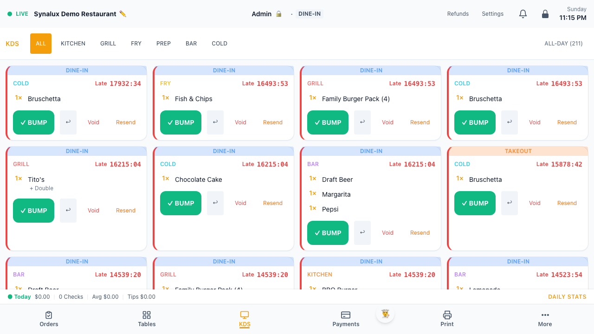
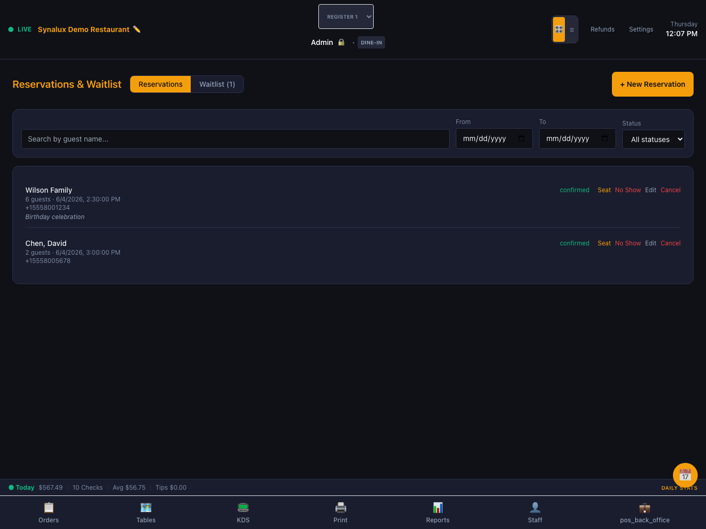

# Synalux POS

**Full-featured restaurant POS — runs on any device with a browser.**

Every feature included. No hardware lock-in. No multi-year contracts.
Use your own iPad — or any device with a browser.

  

🌐 **Translations:** [Español](../docs/i18n/pos_es.md) · [Français](../docs/i18n/pos_fr.md) · [Português](../docs/i18n/pos_pt.md) · [Română](../docs/i18n/pos_ro.md) · [Українська](../docs/i18n/pos_uk.md) · [Русский](../docs/i18n/pos_ru.md) · [Deutsch](../docs/i18n/pos_de.md) · [日本語](../docs/i18n/pos_ja.md) · [한국어](../docs/i18n/pos_ko.md) · [中文](../docs/i18n/pos_zh.md) · [العربية](../docs/i18n/pos_ar.md)

## Why Synalux POS

| Feature | **Synalux** | **Toast** | **Square** | **Clover** | **Lightspeed** | **Aloha** |
|---|:---:|:---:|:---:|:---:|:---:|:---:|
| Runs on any device (BYOD) | ✅ | ❌ | ❌ | ❌ | ❌ | ❌ |
| No hardware lock-in | ✅ | ❌ | ❌ | ❌ | ❌ | ❌ |
| Month-to-month (no contract) | ✅ | ❌ | ✅ | ❌ | ❌ | ❌ |
| Online Ordering + QR Table | ✅ | ❌ | ❌ | ❌ | ❌ | ❌ |
| Kitchen Display (KDS) | ✅ | ❌ | ❌ | ❌ | ❌ | ✅ |
| Drive-Thru Lane Management | ✅ | ❌ | ❌ | ❌ | ❌ | ❌ |
| Catering + BEO | ✅ | ❌ | ❌ | ❌ | ❌ | ❌ |
| Delivery (In-House + 3PD) | ✅ | ❌ | ❌ | ❌ | ❌ | ❌ |
| Coursing (Fire-on-Demand) | ✅ | ❌ | ❌ | ❌ | ❌ | ❌ |
| Reservations + Webhooks | ✅ | ❌ | ❌ | ❌ | ❌ | ❌ |
| Multi-Location + Franchise | ✅ | ❌ | ❌ | ❌ | ❌ | ❌ |
| EBT/SNAP Payments | ✅ | ❌ | ❌ | ❌ | ❌ | ❌ |
| Tap-to-Pay on iPhone | ✅ | ❌ | ✅ | ❌ | ❌ | ❌ |
| Customer-Facing Display | ✅ | ❌ | ❌ | ✅ | ❌ | ❌ |
| Offline Mode (PWA) | ✅ | ❌ | ❌ | ❌ | ❌ | ✅ |
| QuickBooks + Xero Sync | ✅ | ❌ | ❌ | ❌ | ❌ | ❌ |
| 25 Languages + RTL | ✅ | ❌ | ❌ | ❌ | ❌ | ❌ |
| | | | | | | |
| **Only Synalux** | | | | | | |
| AI Chat on 15 POS Screens | ✅ | ❌ | ❌ | ❌ | ❌ | ❌ |
| AI Voice Ordering (Phone) | ✅ | ❌ | ❌ | ❌ | ❌ | ❌ |
| Pizza Builder (Visual Half/Half) | ✅ | ❌ | ❌ | ❌ | ❌ | ❌ |
| Payroll + CA 226.7 Compliance | ✅ | ❌ | ❌ | ❌ | ❌ | ❌ |
| 3-Mode Tip Pooling (FLSA) | ✅ | ❌ | ❌ | ❌ | ❌ | ❌ |

❌ = not included (add-on or not available)

---

## Table of Contents

- [Try the demo](#try-the-demo)
- [Features](#features)
  - [Staff Login](#staff-login)
  - [Register](#register)
  - [Tables & Floor Plan](#tables--floor-plan)
  - [Kitchen Display (KDS)](#kitchen-display-kds)
  - [Payment](#payment)
  - [Staff & Labor](#staff--labor)
  - [Online Ordering & QR Table](#online-ordering--qr-table)
  - [Delivery Management](#delivery-management)
  - [AI Chat Assistant](#ai-chat-assistant)
  - [AI Voice Ordering (Phone)](#ai-voice-ordering-phone)
  - [Pizza Builder & Modifiers](#pizza-builder--modifiers)
  - [Customer Display](#customer-display)
  - [Reports](#reports)
  - [Inventory & Recipes](#inventory--recipes)
  - [Gift Cards & Loyalty](#gift-cards--loyalty)
  - [Compliance](#compliance)
  - [End of Day](#end-of-day)
  - [Reservations](#reservations)
  - [Catering](#catering)
  - [Drive-Thru](#drive-thru)
  - [Handheld Server](#handheld-server)
  - [Refunds](#refunds)
  - [Multi-Location & Franchise](#multi-location--franchise)
  - [Accounting & Ledger](#accounting--ledger)
  - [Coursing](#coursing)
  - [Order Throttling](#order-throttling)
  - [HR & Timesheets](#hr--timesheets)
  - [More](#more)
- [25 Languages](#25-languages)
- [Developer Guide](#developer-integration-setup-guide)

---

## Try the demo

**For customers (no login needed):**

| | |
|---|---|
| **Order Online** | [synalux-pos.vercel.app/pos/order](https://synalux-pos.vercel.app/pos/order?v=00000000-0000-0000-0000-000000000100) |
| **Order by Phone (AI)** | Call **+1 (256) 787-0815** — press 1 for English, 2 for Spanish |
| **Order via WhatsApp** | [Open WhatsApp](https://wa.me/14155238886?text=join%20bat-come) — send the join message, then text your order |

**For staff — POS login:**

Open [synalux-pos.vercel.app/auth](https://synalux-pos.vercel.app/auth) with `demo@synalux.ai` / `demo1234`, then enter a staff PIN:

| Role | Name | PIN | Screens |
|---|---|---|---|
| **Cashier** | Cashier | `5555` | Register, Payment |
| **Host** | Host | `4444` | Tables, Waitlist, Reservations |
| **Server** | Server 1 | `1111` | Register, Tables, Payment, Handheld |
| **Server** | Server 2 | `2222` | Register, Tables, Payment, Handheld |
| **Bartender** | Bartender | `3333` | Bar Register, Payment, Age Verification |
| **Supervisor** | Supervisor | `6666` | Register, Tables, Reports, Voids, Discounts, KDS |
| **Manager** | Manager | `5678` | All screens + EOD + Staff |
| **Admin** | Admin | `1234` | All screens + Settings |

**Demo data can be re-seeded anytime with `node seed_demo_data.mjs`.**

---

## Features

### Staff Login

PIN login with clock-in, 7-level role-based access, and automatic screen routing per role.

<strong>Setup</strong>

1. Add staff in **Settings > Staff Management** — name, PIN, role
2. Assign roles: cashier, host, server, bartender, supervisor, manager, admin
3. Multi-role staff see a role picker; single-role staff go straight to their screen

---

### Register

Ring orders in seconds. Categories, product grid, and order ticket — all on one screen.

<strong>Setup</strong>

1. **Settings > Menu Builder** — add categories and items
2. Set prices, modifiers, KDS stations, and barcodes per item
3. Items appear on the register automatically

---

### Tables & Floor Plan

Visual floor plan with color-coded table status. Tap a table to start or view its order.

<strong>Setup</strong>

1. **Settings > Floor Plan** — add tables with name, section, capacity, shape
2. Create sections (Main, Patio, Bar) for quick filtering
3. Merge, split-back, transfer, or reopen closed checks from the table detail panel

---

### Kitchen Display (KDS)

Ticket board with color-coded timing. Bump, recall, void. All-day count per item.

<strong>Setup</strong>

1. Open `/pos/kds` on any tablet or TV
2. Filter by station: Grill, Fry, Prep, Expo, Bar, Cold
3. Configure routing rules in **Settings > Printers & KDS**

---

### Payment

Card, cash, gift card, mobile pay, house account, EBT, bar tabs, Tap-to-Pay on iPhone, and cash discount/dual pricing. Split check, tips, and post-payment tip via QR.

<strong>Setup</strong>

1. **Card** — add Stripe keys in **Settings > Integrations**. Pair a Stripe Reader M2
2. **Tap-to-Pay on iPhone** — enable in Stripe Dashboard, then tap "📱 Tap to Pay" on the payment screen. Uses your iPhone as a contactless card reader — no additional hardware
3. **Cash discount / Dual pricing** — configure the cash discount percentage in **Settings > Venue > Cash Discount**. Customers see both card and cash prices at checkout (e.g. Card: $100 | Cash: $96.50)
4. **Bar tabs** — tap "🍺 Start Tab" at payment to pre-authorize a card and hold the check open. Open tabs show in the register sidebar with a one-tap "Close" button to capture the final amount
5. **Gift cards** — issue from the Gift Cards page
6. **House accounts** — create in **Settings > House Accounts**, then charge at payment
7. **EBT/SNAP** — add Forage API key in Settings > Integrations. Eligible items are automatically calculated
8. **Split check** — split by even, custom amount, or per-seat. Each split can pay by different method (card/cash)

---

### Staff & Labor

Scheduling, break tracking, overtime alerts, tip pooling (3 modes), and payroll with FLSA compliance.

<strong>Setup</strong>

1. **Settings > Staff Management** — add employees with name, PIN, role
2. Configure pay periods, break rules, and overtime thresholds
3. Tip pool mode: by hours, percentage, or points

---

### Online Ordering & QR Table

Customers browse your menu, order, and pay — no app needed. Pickup and delivery channels. QR codes per table go straight to KDS. Scheduled orders, loyalty points, promo codes, AI chat assistant, and order tracking.

<strong>Setup</strong>

1. **Enable** — turn on online ordering in **Settings > Online Ordering**
2. **Business hours** — set per-day open/close times. Orders are blocked outside hours
3. **Channels** — enable Pickup and/or Delivery independently with separate min-order amounts and prep times
4. **Delivery zones** — define radius zones with per-zone fees and minimums. Set venue lat/lng coordinates
5. **Closed dates** — add holidays when the venue is closed
6. **Share your link** — customers order at `https://your-slug.synalux.ai` or your custom domain
7. **QR table ordering** — print QR tents from **Settings > Floor Plan**. Customer scans, orders, and the ticket goes straight to KDS
8. **Scheduled orders** — customers pick a future date/time at checkout. Orders appear on KDS at the scheduled time
9. **Promo codes** — one-time-use codes validated server-side. Duplicates are rejected
10. **AI chat** — customer-facing AI understands your full menu including modifiers and pizza builder. Supports 14 languages with voice input/output

---

### Delivery Management

In-house drivers, 3PD delegation (DoorDash Drive, Uber Direct), or hybrid mode. Route optimization, driver GPS tracking, auto-dispatch, and menu sync to 3PD platforms.

<strong>Setup</strong>

1. **Choose mode** in **Settings > Delivery**: 3PD Only, In-House, or Hybrid (try in-house first, fall back to 3PD)
2. **3PD providers** — add DoorDash Drive or Uber Direct API credentials. The system creates deliveries via the provider API and tracks status
3. **In-house drivers** — add drivers with name, phone, vehicle type (car/bike/scooter/walk), and max concurrent orders
4. **Menu sync** — tap "Sync to DoorDash" / "Sync to Uber Eats" to upload your menu. Enable auto-sync to push changes automatically when you edit menu items
5. **Driver mobile page** — drivers open `/pos/delivery/driver` on their phone. They see assigned orders, tap to navigate, mark picked up / delivered / failed, and auto-report GPS every 30s
6. **Route optimization** — batch dispatch clusters nearby deliveries and assigns the optimal driver using proximity scoring
7. **Order status sync** — when KDS bumps an order to "ready", the system notifies the 3PD provider and triggers auto-dispatch for in-house drivers

---

### AI Chat Assistant

Context-aware AI assistant on every POS page (15 surfaces) and on the online ordering page for customers. Voice input, 14 languages, quick prompts, and Prism memory for learning patterns.

<strong>How it works</strong>

**POS Staff Chat** — appears on every page, auto-loads live data for that screen:
- **Register** — "What's the most popular item today?", "Find order with 3 cokes", "Customer last name Garcia"
- **KDS** — "What's the oldest ticket?", "Any allergens on ticket 4?", "Grill count?"
- **Tables** — "Any 4-tops available?", "How long has table 12 been seated?"
- **Inventory** — "What's low on stock?", "How many cases of Bud Light?"
- **Reports** — "Compare lunch vs dinner sales", "Top 5 items this week", "Labor % today?"
- **EOD** — "Start closing", "What's the tip pool?", "Any cash variance?"
- **Delivery** — "Where is driver Maria?", "How many pending deliveries?"
- **+ 8 more surfaces** (Staff, Reservations, Catering, Loyalty, Gift Cards, Disputes, Scheduling, Table Ops)

**OO Customer Chat** — customers ask "Make me a half pepperoni half mushroom pizza" and the AI builds the order with correct modifiers and pricing:
- Voice input (microphone) + voice output (speaker) with adjustable speed/pitch/gender
- 14 languages with locale picker
- Returning customer greeting via cookie
- Tool calls: add_to_cart, remove_from_cart, filter_menu, suggest_combo

---

### AI Voice Ordering (Phone)

Customers call your venue's phone number and place orders through natural AI conversation. Best-in-class voice stack: Deepgram Flux (STT) + ElevenLabs (TTS) + Gemini 3.5 Flash (LLM). Streaming architecture via Twilio ConversationRelay. Returning customer recognition, phonetic correction, and automatic SMS confirmation.

<strong>Setup & Configuration</strong>

1. **Enable** in Settings > Integrations > Voice Ordering
2. Set your **Twilio phone number** in Settings > Venue
3. Configure the **Twilio console** — Phone Number > Voice > Webhook POST > `https://your-domain.com/api/v1/pos/webhooks/voice`

**Customizable settings:**

| Setting | Description |
|---------|-------------|
| Custom Greeting | Opening message with `{venue}` and `{name}` placeholders |
| AI Persona | Tone and style — "friendly server", "professional concierge", etc. |
| Today's Specials | AI proactively suggests these when asked "what's good?" |
| Supported Languages | 15 languages. Single = no menu. 2+ = IVR: "For English press 1..." |
| Fallback Number | Transfer to human after repeated AI failures |

<strong>How a call works</strong>

1. Customer calls venue phone number
2. If 2+ languages configured: IVR menu ("For English press 1, Para Español oprima 2")
3. Real-time streaming connection (Twilio ConversationRelay → WebSocket server on Railway)
4. Returning customers auto-recognized by phone — AI greets by name, knows past orders
5. Free-form conversation — Deepgram Flux transcribes in real-time, Gemini 3.5 Flash responds in ~1s, ElevenLabs speaks naturally
6. Customer can interrupt AI mid-sentence (neural turn detection)
7. AI adds items immediately, confirms with price: "Added a Classic Burger for twelve dollars. What else?"
8. Phonetic correction: garbled phone audio auto-matched to menu items
9. "Change burger to family pack" → removes old + adds new in one turn
10. "Repeat my order" → AI reads back all items with prices
11. "That's all" → asks for customer name → reads back order with total
12. "Yes" → order created → KDS kitchen ticket → SMS confirmation
13. Session saved to database for analytics

**Customer commands:**

| Say | What happens |
|-----|-------------|
| Any menu item name | Added immediately with price confirmation |
| "Change X to Y" | Removes X, adds Y |
| "Remove the fries" | Item removed |
| "What do you have?" | Top items listed |
| "Repeat my order" | Current order read back with prices |
| "My usual" | Adds items from last order (returning customers) |
| "That's all" / "Done" | Starts confirmation flow |
| "Yes" / "Confirm" | Places order |
| "No" / "Wait" | Returns to ordering |

**Online ordering** is also available at the same time:

<strong>Voice Stack Architecture</strong>

| Layer | Technology | Latency |
|-------|-----------|---------|
| **Speech-to-Text** | Deepgram Flux via ConversationRelay | Real-time streaming |
| **AI/LLM** | Gemini 3.5 Flash (thinking disabled) | ~1s |
| **Text-to-Speech** | ElevenLabs via Twilio (included) | Real-time streaming |
| **Transport** | Twilio ConversationRelay → WebSocket | Streaming |
| **Turn Detection** | Neural (Deepgram Flux) | Natural |
| **Server** | Railway (Node.js WebSocket) | Low cost |
| **Phonetic Correction** | Gemini prompt-based | Zero added latency |
| **Customer Memory** | Supabase (past orders + loyalty) | ~20ms |

**Total response latency: ~1.3s** from speech to hearing AI response.

**Fallback:** Gemini fails → Claude Sonnet. WebSocket unavailable → Gather/Say IVR mode.

---

### Pizza Builder & Modifiers

Visual half/half pizza builder with per-topping placement and intensity. Standard modifiers with qty, nested groups, forced/optional, and max-quantity limits.

<strong>Setup</strong>

1. **Standard modifiers** — create modifier groups in **Settings > Menu Builder**. Set min/max selections, price deltas, and max quantity per option
2. **Pizza builder** — set a modifier group's display mode to "🍕 Pizza Builder" in the menu builder. This triggers the visual half/half UI instead of checkboxes
3. **Placement** — customers choose Whole, Left Half, or Right Half for each topping. Half placement = 50% of the topping price
4. **Intensity** — None (not selected), Light (75% price), Regular (100%), Extra (150% price)
5. **3PD compatibility** — pizza toppings sync to DoorDash/UberEats as standard modifiers (placement/intensity are stripped since 3PD doesn't support halves). This is logged as an incompatibility
6. **AI chat** — "Make me a half pepperoni half mushroom pizza" works without the visual builder. The AI maps to the correct modifiers and prices

---

### Customer Display

Second screen facing the customer with live order, running total, and idle promos.

<strong>Setup</strong>

1. Open `/pos/display` on a second iPad or monitor facing the customer
2. The display auto-syncs with the active register order in real time
3. Configure idle promo images in **Settings > Venue**

---

### Reports

Sales, PMIX, menu engineering, speed of service, server leaderboard, payments, voids, and labor. CSV export on every report.

<strong>Setup</strong>

1. Access from the **Reports** page — all reports are auto-generated from order data
2. **Sales** — hourly heatmap, daily/weekly/monthly totals
3. **PMIX** — product mix by category, item, and modifier
4. **Menu engineering** — Star/Dog/Puzzle/Workhorse quadrant analysis
5. **Speed of service** — per-station ticket times at `/pos/reports/speed`
6. **Server leaderboard** — staff performance ranking at `/pos/reports/leaderboard`
7. **CSV export** — every report has a one-click CSV download

---

### Inventory & Recipes

Stock tracking, low-stock alerts, vendor management, and recipe builder with food cost %.

<strong>Setup</strong>

- Add items with SKU, qty, unit, cost, and reorder threshold
- Link recipes to menu items — food cost % auto-calculates

---

### Gift Cards & Loyalty

Issue gift cards ($25–$250). Loyalty with points, auto-tier (Bronze/Silver/Gold), and referrals.

<strong>Setup</strong>

---

### Compliance

Age verification, RBS cert tracking, tax-exempt orders, CCPA/GDPR, and full audit trail.

<strong>Setup</strong>

---

### End of Day

Count cash, distribute tip pool, export GL journal, print Z-Report, close register.

---

### Reservations

Timeline view with party size, table assignment, and webhook integration for Google Reserve, OpenTable, and Yelp.

<strong>Setup</strong>

1. Open the **Reservations** page to see the timeline view
2. Add reservations manually with party size, date/time, and table assignment
3. **Webhook integration** — configure webhooks in **Settings > Integrations** for Google Reserve, OpenTable, or Yelp. Incoming reservations auto-create in the system
4. Waitlist mode available for walk-ins

---

### Catering

Large-order entry with Banquet Event Orders, delivery scheduling, and deposit tracking.

<strong>Setup</strong>

1. Open the **Catering** page to create catering events
2. Build a Banquet Event Order (BEO) with menu items, headcount, and timeline
3. Set delivery date/time and assign a driver or 3PD provider
4. Track deposits (partial payments) against the event total

---

### Drive-Thru

Lane management with color-coded timing and auto-advance to the next station.

<strong>Setup</strong>

1. Open `/pos/drive-thru` on a dedicated screen per lane
2. Orders flow through stations: Order → Prep → Window
3. Color-coded timing (green < 3 min, yellow < 5 min, red > 5 min)
4. Auto-advance when KDS bumps the ticket

---

### Handheld Server

Tableside ordering on any iPhone. Same menu, same modifiers, same KDS routing.

<strong>Setup</strong>

1. Open `/pos/handheld` on any iPhone or small tablet
2. Server logs in with their PIN — same role-based access as the register
3. Tap a table → add items → send to KDS. Full modifier support including pizza builder

---

### Refunds

Partial or full refund with reason codes. Reopen closed checks for corrections.

<strong>Setup</strong>

1. Open the **Refunds** page or tap "Refund" on any completed order
2. Choose partial (specific items) or full refund
3. Select a reason code (wrong item, quality, customer request, etc.)
4. Stripe refund is processed automatically. Cash refunds are recorded for drawer reconciliation
5. **Reopen check** — managers can reopen a closed order for corrections, then re-close

---

### Multi-Location & Franchise

Per-venue KPIs, consolidated P&L, config push, and franchise reporting.

<strong>Setup</strong>

1. Create additional venues under the same workspace in **Settings > Multi-Location**
2. Push menu, tax, and discount configs from a template venue to all locations
3. View consolidated P&L, sales, and labor reports across all venues
4. Franchise reporting with per-location royalty calculations

---

### Accounting & Ledger

Journal entries, general ledger, and banking integration. QuickBooks and Xero auto-sync at EOD.

<strong>Setup</strong>

1. Open `/pos/accounting` for the main accounting dashboard
2. `/pos/accounting/ledger` for journal entries and GL
3. `/pos/accounting/banking` for bank feed integration
4. Configure QuickBooks or Xero sync in **Settings > Integrations** — GL journal auto-exports at end of day

---

### Coursing

Multi-course meal sequencing with per-item course assignment and fire-on-demand.

<strong>Setup</strong>

1. Assign course numbers (1–6) to each item in the order ticket
2. Course 0 = fire immediately. Courses 1–6 fire in sequence when the server taps "Fire Next Course"
3. KDS shows course badges on each ticket item

---

### Order Throttling

Rate-limit incoming online orders during peak times to prevent kitchen overwhelm.

<strong>Setup</strong>

1. Configure throttle limits in **Settings > Online Ordering**
2. Set max orders per 15-minute window
3. When the limit is reached, new customers see "We're busy — try again in a few minutes"

---

### HR & Timesheets

Leave management, timesheet review, and employee document tracking.

<strong>Setup</strong>

1. Open `/pos/hr` for timesheet review and leave management
2. Staff submit time-off requests; managers approve/deny
3. Timesheets auto-populate from clock-in/out records
4. Export to payroll (Gusto/ADP) from the Payroll page

---

### Training Mode

Isolated sandbox. Orders excluded from reports. Staff can practice without affecting live data.

<strong>Setup</strong>

1. Enable training mode in **Settings > Venue** — toggle "Training Mode"
2. All orders created while training mode is active are tagged `[TRAINING]`
3. Training orders are excluded from sales reports, EOD, and payroll calculations
4. Disable training mode when done — real orders resume immediately

---

### Offline Mode (PWA)

Core pages precached for offline use. Orders queue locally and sync on reconnect. Card payments require network.

<strong>Setup</strong>

1. Open the POS in Chrome or Safari and add to home screen — installs as a PWA
2. When network drops, an offline indicator appears in the top bar
3. Orders are queued in local storage and auto-sync when connectivity returns
4. Cash payments work offline. Card payments require network and show an error if attempted offline

---

### Integrations

Stripe, DoorDash Drive, Uber Direct, Uber Eats, Grubhub, QuickBooks, Xero, Gusto, ADP, OpenTable, Google Reserve, Yelp, Twilio, SendGrid, Forage (EBT), Ollama (local AI).

<strong>Setup</strong>

1. Open **Settings > Integrations** — all integrations activate by adding credentials
2. **Stripe** — paste `STRIPE_SECRET_KEY` to enable card payments, Tap-to-Pay, and online checkout
3. **DoorDash / Uber** — add API credentials for delivery dispatch and menu sync
4. **Twilio / SendGrid** — add keys for SMS order-ready notifications and email receipts
5. **QuickBooks / Xero** — connect via OAuth for automatic EOD GL journal sync

---

### Operational Forms

Cash Count, Void Auth, Tax-Exempt Cert, Catering BEO, Tip Declaration, Inventory Count, Time-Off, Purchase Order, Incident Log, Daily Specials, Prep List, Server Checkout.

<strong>Setup</strong>

1. Open `/pos/forms` to access all 12 pre-built operational forms
2. Forms auto-fill venue name, date, and staff info from the current session
3. Print or export as PDF from the form builder

---

### Digital Menu Board

Configure layout, sections, and pricing display. Assign to any TV or display.

<strong>Setup</strong>

1. Open `/pos/board` on any TV or large display
2. Configure sections, layout, and which categories to show in **Settings > Menu Board**
3. Prices and availability auto-sync from the menu builder

---

### Marketing & Campaigns

Email/SMS blasts, promo codes, audience segments, and send history.

<strong>Setup</strong>

1. Open the **Marketing** page to create email or SMS campaigns
2. Build audience segments by visit count, loyalty tier, or last-visit date
3. Create promo codes with percentage or fixed discounts
4. Requires Twilio (SMS) or SendGrid (email) credentials in **Settings > Integrations**

---

### Customer Feedback

Post-visit surveys, star ratings, comment review, and response templates.

<strong>Setup</strong>

1. Open `/pos/feedback` to view submitted customer surveys
2. QR codes on receipts link to the survey form
3. Star ratings and comments are aggregated per server and per time period

---

### Label Printer

ZPL-compatible (Zebra, Brother). Price/SKU/prep labels from any menu or inventory item.

<strong>Setup</strong>

1. Add your Zebra or Brother printer IP in **Settings > Printers**
2. Tap the label icon on any menu item or inventory item to print a ZPL label
3. Labels include item name, price, SKU, barcode, and expiry date

---

### Equipment Tracking

Device registry with serial numbers, warranty, maintenance schedule, and depreciation.

<strong>Setup</strong>

1. Add devices in the equipment registry with serial number, purchase date, and warranty info
2. Set maintenance schedules — the system alerts when service is due
3. Track depreciation for accounting purposes

---

### Manager Mobile

iPhone access to reports, KPIs, and quick actions — same data as the desktop, optimized for mobile.

<strong>Setup</strong>

1. Open `/pos/reports` on any iPhone or mobile browser
2. Pin to home screen for quick access
3. Live KPIs: today's sales, open checks, labor %, voids, and average ticket size

---

---

## 25 languages

English, Spanish, French, Chinese, Arabic, Romanian, Portuguese, German, Italian, Japanese, Korean, Vietnamese, Russian, Ukrainian, Polish, Turkish, Dutch, Swedish, Hebrew, Thai, Hindi, Indonesian, Malay, Filipino, Greek. RTL supported.

---

<strong>Developer: Integration Setup Guide</strong>

Every integration activates by adding credentials in **Settings > Integrations**. No code changes needed.

| Integration | Env var | What activates |
|---|---|---|
| **Stripe** (card payments) | `STRIPE_SECRET_KEY` | Card tap/chip/swipe, Tap-to-Pay on iPhone, online payments |
| **DoorDash Drive** (delivery dispatch) | `DOORDASH_DEVELOPER_ID`, `DOORDASH_KEY_ID`, `DOORDASH_SIGNING_SECRET` | 3PD delivery delegation, menu sync |
| **Uber Direct** (delivery dispatch) | `UBER_CLIENT_ID`, `UBER_CLIENT_SECRET` | 3PD delivery delegation, menu sync |
| **DoorDash / Uber Eats / Grubhub** (marketplace) | Webhook URL | Inbound 3PD orders on KDS with purple badge |
| **SendGrid** (email) | `SENDGRID_API_KEY` | Email receipts, order confirmations |
| **Twilio** (SMS) | `TWILIO_ACCOUNT_SID`, `TWILIO_AUTH_TOKEN`, `TWILIO_PHONE_NUMBER` | SMS receipts, order-ready notifications |
| **Google Reserve / OpenTable / Yelp** | Webhook URL | Auto-created reservations |
| **QuickBooks / Xero** | `QUICKBOOKS_ACCESS_TOKEN` or `XERO_ACCESS_TOKEN` | EOD GL journal auto-sync |
| **Forage** (EBT/SNAP) | `FORAGE_API_KEY` | EBT payment, eligible item flagging |
| **Dwolla / Stripe Treasury** | `DWOLLA_API_KEY` or `STRIPE_TREASURY_KEY` | ACH payroll direct deposit |
| **Ollama** (local AI) | `NEXT_PUBLIC_LOCAL_LLM_URL` | Natural language order parsing (local, no cloud) |
| **Prism MCP** (AI memory) | `PRISM_MCP_URL` | Per-staff and per-customer AI memory and context |
| **Apple / Google Wallet** | Pass Type ID + signing cert | Loyalty "Add to Wallet" |
| **Zebra / Brother** (labels) | Printer IP in Settings | ZPL price/SKU/prep labels |

**Required env vars:** `NEXT_PUBLIC_POS_SUPABASE_URL`, `NEXT_PUBLIC_POS_SUPABASE_ANON_KEY`, `POS_SUPABASE_SERVICE_ROLE_KEY`

---

## License

BUSL-1.1 — see [`LICENSE`](../LICENSE).
