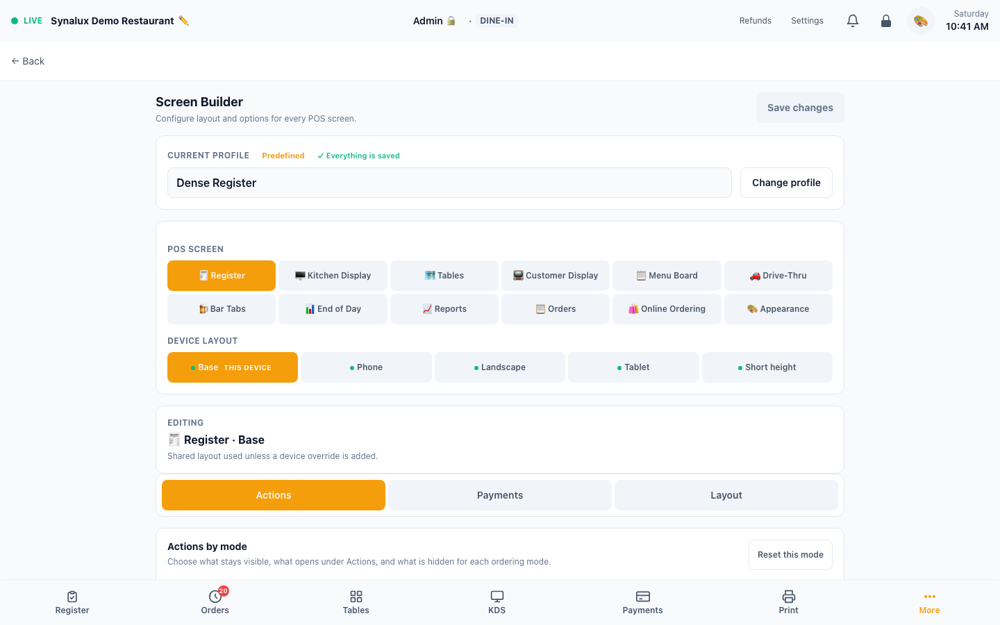

# Synalux POS

**Customer guide for setting up and operating Synalux POS.**

Synalux POS brings register, table service, kitchen routing, payments, online ordering, and venue administration into one browser-based workspace. It is designed for touch devices and computers, with layouts that can be adjusted for each service model and screen size.

> Features shown to your team depend on your subscription, region, staff permissions, station assignment, and connected providers. If an option in this guide is not visible, ask your venue administrator or Synalux support before changing another area to work around it.

## Start here

Use this guide in order when setting up a new venue:

1. [Sign in and confirm your venue](#1-sign-in-and-confirm-your-venue)
2. [Configure venue basics](#2-configure-venue-basics)
3. [Create taxes and revenue centers](#3-create-taxes-and-revenue-centers)
4. [Build the menu](#4-build-the-menu)
5. [Add staff and permissions](#5-add-staff-and-permissions)
6. [Create and assign stations](#6-create-and-assign-stations)
7. [Configure printers and kitchen routing](#7-configure-printers-and-kitchen-routing)
8. [Configure payments, tips, and receipts](#8-configure-payments-tips-and-receipts)
9. [Choose screen layouts](#9-choose-screen-layouts)
10. [Configure ordering channels](#10-configure-ordering-channels)
11. [Validate before go-live](#11-validate-before-go-live)

For daily use, jump to [Run service](#run-service). For a quick administrative reference, see the [Settings guide](#settings-guide).

## Register at a glance

The Register keeps menu browsing, quantity, the active order, and the primary service action within reach. On smaller screens, **View Order** opens the check without shrinking menu items into an unusable desktop layout.

  

*Current US production demo at an 820 × 1180 tablet viewport. Menu content varies by venue.*

The default dense layout is a hybrid: frequent actions remain visible and secondary actions open from **Actions**. Your venue can reproduce an expanded layout or streamline it by service mode in Screen Builder.

---

## Set up a venue

### 1. Sign in and confirm your venue

Use the account and region supplied by Synalux or your venue administrator:

- **United States:** [pos.synalux.ai/auth](https://pos.synalux.ai/auth)
- **European Union:** [pos-eu.synalux.ai/auth](https://pos-eu.synalux.ai/auth)

Do not share account passwords or staff PINs in public documents, group messages, or screenshots.

Synalux POS uses two access layers:

- **Account sign-in** connects the browser to an authorized venue.
- **Staff sign-in** identifies the employee using a shared terminal and applies that employee's role permissions.

After signing in, confirm the venue name and region before entering prices, taxes, or staff records. If your account can access more than one venue, select the intended venue first.

### 2. Configure venue basics

Open **Settings > Venue Settings** and review:

- Venue name, address, phone number, and time zone
- Country, currency, and regional tax behavior
- Enabled order types, such as dine-in, takeout, delivery, and bar tab
- Revenue centers and price levels
- Table occupancy rules
- Payment processor and service preferences
- Automatic gratuity, cash-discount, and cash-overpayment behavior when applicable

Save the venue basics before configuring stations. Stations inherit venue-level choices, so correcting the venue first prevents repeated work.

### 3. Create taxes and revenue centers

#### Tax zones

Open **Settings > Tax Zones** and create the taxes that apply to the venue. Confirm each rate, jurisdiction, and taxable item type with the venue's accountant or tax adviser.

Before go-live, ring one taxable item and one non-taxable item and compare the check calculation with the approved expected values.

#### Revenue centers

Revenue centers let one venue use different menus and workflows for areas such as Main Dining, Bar, Patio, Counter, Takeout, or Delivery.

In **Settings > Venue Settings**:

1. Add each revenue center.
2. Choose its menu categories and price level.
3. Select its default order type and post-login screen when available.
4. Review payment behavior and tip limits for that service area.
5. Save before assigning the revenue center to a station.

Use a separate revenue center only when an area needs a meaningful operational difference. Creating one for every physical device makes configuration harder to maintain.

### 4. Build the menu

Open **Settings > Menu Builder**. Configure the menu in this order:

1. **Categories** — create the groups staff and guests browse.
2. **Items** — enter the name, price, category, item type, tax behavior, and status.
3. **Modifiers** — create reusable choices such as temperature, sides, toppings, or preparation notes.
4. **Modifier Sets** — group modifiers, set minimum and maximum selections, and assign them to items.
5. **Combos** — define bundled choices when used by the venue.
6. **Availability** — set item days and times when an item has a limited schedule.
7. **Routing and details** — confirm kitchen routing, receipt name, barcode, allergens, and other enabled fields.
8. **Images** — use clear, consistently framed images so the responsive menu grid remains easy to scan.

*Current US production demo with populated categories and items.*

Use **Cards**, **Table**, or **Images** to review the menu from different perspectives. CSV import and export can help with larger catalogs, but always review imported prices, categories, tax settings, and modifier assignments before publishing.

For long item names, enter a concise customer-facing name and use the item's detail fields for additional information. Do not rely on an image to communicate required choices or allergens.

### 5. Add staff and permissions

Open **Settings > Staff Management** to create the people who will use the POS. Assign a unique PIN or supported credential to each employee; never reuse a shared manager PIN.

Standard roles include cashier, host, server, bartender, supervisor, manager, and admin. Open **Settings > Role Permissions** to review what each role can access.

Recommended practice:

- Give staff the least access needed for their job.
- Reserve settings, refunds, overrides, and sensitive reports for approved roles.
- Deactivate former staff promptly instead of reassigning their PIN.
- Test one account from each role before go-live.
- Verify that manager approval prompts require an authorized employee.

Signing out at the register ends the current staff session while keeping the venue account ready for the next employee on that shared terminal.

### 6. Create and assign stations

A station represents how a device is used, not only where it sits. Examples include Front Register, Bar POS, Patio Handheld, Expo KDS, or Takeout Counter.

Open **Settings > Stations**:

1. Select **Add Station**.
2. Name the station by its operational purpose.
3. Choose the station type.
4. Assign the default revenue center and allowed roles.
5. Save the station.
6. On the physical device, use **Assign** to bind that browser to the station.

Device assignment is the preferred approach because it remains stable when a network address changes. Use IP-based assignment only when your network and browser deployment require it and the network is managed accordingly.

After assignment, reload the POS and verify the venue, station, revenue center, menu, printer routing, and available screens.

### 7. Configure printers and kitchen routing

Open **Settings > Printers & KDS** to configure receipt printers, kitchen printers, labels, cash drawers, and kitchen-display stations that are available to your venue.

For each destination:

1. Add the printer or KDS station.
2. Assign the menu categories it should receive.
3. Confirm the printer purpose or KDS station and its category-routing rules.
4. Save and run a test order.
5. Confirm that each item appears once at the correct destination.

Test dine-in, takeout, void, refire, modifier, and multi-course examples when those workflows are used. A successful browser save does not prove that a physical printer or kitchen device received the ticket.

### 8. Configure payments, tips, and receipts

Payment choices depend on the venue's configured processor and hardware. Complete provider onboarding with Synalux or the provider before treating a payment option as ready.

Review these settings:

- Venue payment processor and any station-specific assignment
- Visible tender actions in Screen Builder
- Tip percentages, custom-tip availability, and tip timing
- Automatic gratuity party-size threshold and rate
- Cash-discount configuration, if used and legally permitted
- Cash rounding for the venue currency
- Cash overpayment behavior: return change, add the excess as tip, or prompt the cashier
- Receipt header, footer, logo, and enabled delivery choices
- Refund, void, discount, and comp permissions

For each enabled payment method, test the complete path from an open check through the processor response, receipt, order status, and reporting. Do not perform a second charge if the terminal reports success but the POS is waiting for confirmation; follow your payment-reconciliation procedure.

Automatic gratuity and an optional additional tip are separate concepts. Train staff to show the guest both amounts before completing payment and confirm that the receipt describes them clearly.

### 9. Choose screen layouts

Open **Settings > Screen Builder** to configure layouts without crowding every control onto the register.

*Current US production demo showing the venue profile, POS screens, and responsive device layouts.*

#### Select a profile

Start with the profile closest to the venue's workflow. Profiles are editable starting points, not locked product modes.

The current profile applies a venue-level base. Register presentation can then be refined by revenue center and station. Device layouts provide separate presentation variants for phone, landscape, tablet, and short-height screens.

#### Configure each POS screen

Screen Builder includes layout controls for Register, Kitchen Display, Tables, Customer Display, Menu Board, Drive-Thru, Bar Tabs, End of Day, Reports, Orders, Online Ordering, and Appearance.

Change only the screen currently selected in the editor, then choose the relevant device layout. Use the base layout for shared behavior and a device variant only where the smaller or shorter screen needs a different presentation.

#### Configure Register actions by mode

Register action profiles are separate for:

- Dine-in
- Bar tab
- Quick service
- Takeout
- Delivery

Each action can be placed in one of three areas:

- **Persistent** — remains visible on the register and is appropriate for frequent, time-critical actions.
- **Actions** — remains reachable from the Actions menu without occupying the primary row.
- **Hidden** — is not shown for that mode.

The recommended hybrid defaults keep common send and payment paths visible while placing lower-frequency functions in **Actions**. Venues can reorder actions, change button size, edit the default button name, and add locale-specific names.

Safety rules preserve a usable service path: **Send to Kitchen** cannot be hidden, and at least one payment action must remain reachable. Role permissions still control authorization even when a locked action remains visible.

Recommended starting priorities:

| Service mode | Keep persistent first | Good candidates for Actions |
|---|---|---|
| Dine-in | Send, Charge, Split | Refire, Transfer, Merge, Move, Hold, Discount, Payments, Print, QR Pay, No Sale, Void |
| Bar tab | Send, Charge, Hold, Split | Refire, Transfer, Merge, Move, Discount, Payments, Print, QR Pay, No Sale, Void |
| Quick service | Quick Cash, Quick Card, Send, Charge | Split, Hold, Discount, Payments, Print, QR Pay, No Sale, Void, table actions |
| Takeout | Send, Charge, Print | Refire, Hold, Discount, Payments, QR Pay, Void, split and table actions |
| Delivery | Send, Charge, Print | Refire, Hold, Discount, Payments, QR Pay, Void, split and table actions |

These are recommendations, not hardcoded rules. Keep critical actions persistent when speed matters, but do not place every available action on the primary row.

#### Configure the menu and order panels

Use the Register layout controls to balance:

- Order/check width
- Menu grid density and image presentation
- Menu/category panel placement
- Order-list visibility and switching behavior
- Bottom navigation and action presentation
- Guest, seat, and daily-stat sections

On a smaller display, preserve a clear **View Order** control. Staff should never have to guess whether an order exists after tapping **Orders** or changing from menu browsing to the check.

#### Save and test every target device

After saving:

1. Reload the register.
2. Test every enabled order mode.
3. Confirm the order list and total remain discoverable.
4. Add enough seats and items to force the longest expected layout.
5. Open Actions and confirm all required secondary functions are reachable.
6. Verify the payment path and Send to Kitchen path.
7. Repeat on the actual desktop, iPad/tablet, phone, and short-height devices used by the venue.

### 10. Configure ordering channels

Open **Settings > Online Ordering** to configure customer ordering when included for your venue.

Review:

- Pickup and delivery availability
- Operating hours and closed dates
- Prep times and order minimums
- Delivery zones and fees
- Customer instructions and confirmation behavior
- Menu availability and price presentation

Use **Settings > Integrations** for provider connections such as payments, messaging, accounting, delivery, calendar, or voice services. A visible integration card means the workflow is available to configure; it does not confirm that an account is connected or that live delivery has been tested.

Before publishing a customer link, place a test order during open hours and verify payment, confirmation, Register/Orders visibility, kitchen routing, taxes, and fulfillment status.

### 11. Validate before go-live

Use training mode or an approved test venue when available. Complete this checklist on each physical device:

- [ ] Correct venue, station, revenue center, time zone, and currency
- [ ] Correct categories, item names, prices, images, and modifiers
- [ ] Correct tax on representative taxable and non-taxable items
- [ ] Correct dine-in, takeout, delivery, bar-tab, and quick-service behavior used by the venue
- [ ] Correct seat, course, split, transfer, merge, and reopen behavior used by staff
- [ ] Correct kitchen and receipt routing with no duplicate tickets
- [ ] Correct cash, card, tip, gratuity, discount, void, refund, and receipt behavior
- [ ] Correct permissions for every staff role
- [ ] Correct Register layout at every supported viewport
- [ ] Correct online-order hours, availability, confirmation, and fulfillment
- [ ] Manager knows how to reconcile an uncertain payment instead of charging again

Record the approved settings and who performed the go-live test. Provider dashboards, physical printers, and payment terminals require their own confirmation; a green POS screen alone is not sufficient evidence.

---

## Run service

### Start a shift

1. Open the POS on the assigned station.
2. Confirm the venue and station name.
3. Sign in with your own staff credential.
4. Clock in if your venue uses POS timekeeping.
5. Check the network, printer/KDS, and payment-device status.
6. Open the Register, Tables, Bar Tabs, or other screen used by your role.

### Create and send an order

1. Select the order type, table, tab, or customer context.
2. Choose the seat when seat service is enabled.
3. Select an item and complete required modifiers.
4. Review quantity, item price, modifiers, and special instructions.
5. Repeat for the remaining items.
6. Open the order panel and review subtotal, tax, gratuity, and total.
7. Select **Send to Kitchen**.

New items can be sent without re-sending items already routed. Use **Refire** only when the kitchen must prepare an item again and follow the venue's approval policy.

### Manage tables, seats, and checks

Use the Tables screen to locate the table visually. From an open check, authorized staff can use available actions such as:

- Add or select seats
- Move items between seats or shared items
- Split the check
- Transfer the table or order
- Merge compatible open checks
- Move an order to another table or tab
- Reopen a completed check when permitted

Before a transfer or merge, confirm the source, destination, open-check status, guest name or table, amount, and item count. If a reopened table is already occupied, move the reopened check to a suitable table, tab, or order context before continuing service.

### Split a check

1. Open **Split** from the persistent row or Actions menu.
2. Choose the split method available to your venue.
3. Assign items or amounts to each split.
4. Select only the split being paid.
5. Confirm that the selected total, tax, tip, and balance match that split.
6. Complete payment and repeat for unpaid splits.

The selected split and **All** should not appear active at the same time. If the selection or amount is unclear, stop before payment and return to the split board.

### Take payment

1. Review the complete check or selected split.
2. Select **Charge**, **Payments**, **Quick Cash**, or **Quick Card**, depending on the configured layout.
3. Choose the tender method.
4. Complete the tip or gratuity step shown for that method.
5. Follow the terminal or cash prompt.
6. Confirm the payment result and receipt choice.
7. Verify the order or split is marked paid.

For cash, enter the amount tendered and follow the configured change/tip prompt. For card payments, follow the connected processor and terminal instructions shown on screen.

### Kitchen and expo

The Kitchen Display groups routed items by configured station and shows their service state. Kitchen staff should advance items using the venue's agreed workflow. Expo and order-management views help coordinate completed items and fulfillment.

If a ticket is missing, first confirm that the order was sent, the item has the intended category, and the category is routed to the correct printer or KDS station. Do not repeatedly resend the full order while diagnosing a single item.

### Refund, void, discount, and comp

These actions depend on role permissions and venue rules:

- **Void** removes an eligible order or item before completion and may require a reason.
- **Refund** returns an eligible captured payment through the configured method.
- **Discount** applies a configured pricing rule.
- **Comp** records an authorized item or check adjustment with a configured reason.

Review the amount and original payment before confirming. Use the venue's approved reason and manager authorization process.

### End a shift

Complete any venue-required drawer count, tip review, open-check review, timekeeping, and end-of-day steps. Resolve open tabs and uncertain payments before closing a station. Sign out so the next employee uses their own identity.

---

## Settings guide

Open **Settings** from the POS header. Access depends on the signed-in account and staff permissions.

| Settings area | Customer purpose |
|---|---|
| Menu Builder | Categories, items, modifiers, modifier sets, combos, prices, images, availability, and routing details |
| Staff Management | Staff records, roles, credentials, and active status |
| Role Permissions | Screen and action access by staff role |
| Tax Zones | Tax jurisdictions, rates, and taxable item types |
| Discounts | Discount definitions, eligibility, stacking, and usage controls |
| Floor Plan | Rooms, table placement, capacity, and table QR codes |
| Printers & KDS | Receipt, kitchen, label, drawer, and category-routing configuration |
| Screen Builder | Layout profiles, device variants, register actions, payments, receipts, and screen presentation |
| Stations | Terminal purpose, device assignment, revenue center, and allowed roles |
| Venue Settings | Venue identity, region, currency, order types, revenue centers, pricing, gratuity, and cash behavior |
| Integrations | Provider connection and status workflows available to the venue |
| Online Ordering | Hours, channels, minimums, prep time, zones, and closed dates |
| Void Reasons | Approved order and item void reasons and translations |
| Comp Reasons | Approved comp reasons and translations |
| Account | Account data and account-management controls |
| Touch Diagnostic | Touchscreen and input diagnostics |

Additional operational screens can include Orders, Tables, Bar Tabs, KDS, Customer Display, Menu Board, Drive-Thru, End of Day, Reports, Payments, Reservations, Catering, Delivery, Inventory, Scheduling, House Accounts, Loyalty, and Back Office. Availability is determined by the venue's configuration and permissions.

### Floor plan

Use **Settings > Floor Plan** to create rooms and place tables. Give each table a clear service name, capacity, and position. Test the floor plan on the devices hosts, servers, and managers will actually use.

The same visual floor plan should support table selection for new orders and the available transfer or merge workflow. Train staff to verify both the table label and guest/check details before confirming a move.

### Discounts and reason codes

Configure discounts before they are used at the Register. Define who is eligible, whether the discount can stack, and whether manager approval is required.

Maintain active Void Reasons and Comp Reasons that match the venue's reporting needs. Translate customer- or staff-facing labels for the enabled POS locales.

### Reports and operational modules

Use the reports and operational modules enabled for your venue to review sales, payments, labor, inventory, customers, loyalty, house accounts, reservations, catering, delivery, and end-of-day activity.

Reports are decision tools, not substitutes for reconciliation. Compare POS totals with payment-processor settlement, cash counts, refunds, gratuity, and the venue's accounting process.

### Languages and localization

Synalux POS includes multiple interface locales, including right-to-left presentation for Arabic and Hebrew. Menu content, action names, void reasons, and comp reasons may also need venue-owned translations.

Review every enabled language on the actual target layout. A translated label can be longer than the default and may need a shorter venue-specific button name in Screen Builder.

### Accessibility and touch devices

- Keep frequent targets large enough for touch.
- Do not identify state by color alone.
- Use clear item names and alt text for public content.
- Test zoom, orientation, and the touch diagnostic on the installed device.
- Keep critical actions reachable without relying only on a hidden gesture.
- Use the on-screen touch keyboard where the installed terminal does not provide a reliable system keyboard.

### Network and offline behavior

The POS may preserve parts of the active workflow during a temporary connection problem, but not every operation or provider can work offline. Card authorization, online ordering, messaging, synchronization, and external integrations may require a live connection.

Train staff to read the current connection and payment state. Do not promise a guest that a provider action succeeded until the POS or provider confirms it.

---

## Troubleshooting

### An expected screen or action is not visible

Check, in order:

1. The signed-in account has access to the correct venue.
2. The active staff role has permission.
3. The device is assigned to the intended station.
4. The station uses the intended revenue center.
5. Screen Builder has not placed the action under **Actions** or **Hidden** for the current order mode.
6. The feature or provider is enabled for the venue.

### The menu or price is wrong

Confirm the active revenue center, price level, item status, item availability, tax zone, and item-level override. Review the Menu Builder entry instead of correcting the displayed price with an unrelated discount.

### An item did not reach the kitchen

Confirm that the order was sent, the item category is correct, and that category is routed to the intended printer or KDS station. Then check the device connection and destination status.

### A payment result is uncertain

Do not charge the guest again automatically. Record the on-screen message or processor reference, check the Payments view and provider status, and follow the venue's reconciliation process. Escalate to a manager or Synalux support when the state cannot be confirmed.

### The layout is crowded or images are oversized

Open **Settings > Screen Builder** and review the exact POS screen and device layout. Keep critical actions persistent, move secondary actions to **Actions**, adjust menu-grid density and image presentation, and retest at the actual viewport. Avoid solving a tablet issue by degrading the desktop base layout when a tablet or short-height variant is appropriate.

### Contact support

When contacting Synalux support, include:

- Venue name and region
- Station name and device type
- Approximate time and time zone
- Order, payment, or ticket reference when available
- What the operator selected
- Expected and visible result
- A screenshot with credentials, customer details, payment data, and network identifiers removed

Never send account passwords, staff PINs, full card data, secret keys, or private network configuration.

---

## Security and customer data

- Use individual staff credentials and role-based access.
- Lock or sign out of unattended devices.
- Keep browsers and device operating systems supported and updated.
- Review refunds, voids, comps, discounts, drawer actions, and permission changes.
- Collect only the customer information needed for the service.
- Follow the venue's retention, privacy, payment-security, and regional compliance policies.
- Complete payment-provider compliance requirements with the provider; using the POS does not replace the venue's compliance responsibilities.

## License

BUSL-1.1 — see [`LICENSE`](../LICENSE).
