# Synalux POS

**Restaurant POS for browser-based register, kitchen, payment, and venue operations.**

Synalux POS connects front-of-house, kitchen, ordering, payment, and back-office workflows in one browser-based system for compatible tablets and computers. Configure the experience by venue, revenue center, station, staff role, and screen layout.

<p align="center">
  
</p>

🌐 **Interface languages:** Synalux POS includes 26 interface locales, including Bulgarian and right-to-left Arabic and Hebrew. See [26 languages](#26-languages).

## Register at a glance

The Register keeps the menu, order ticket, totals, and service actions together so staff can build and route an order without leaving the screen. Its presentation adapts to the available width instead of squeezing the desktop workspace onto a smaller device.

**Desktop register — 1920 × 1080**


On a wide desktop, the check stays open on the left while the menu and open-order switcher remain visible on the right.

**Tablet register — 820 × 1180**

<p align="center">
  
</p>

**Phone check view — 390 × 844**

<p align="center">
  
</p>

On tablet and phone layouts, **View Order** opens the check without compressing the menu into the desktop panel arrangement. The phone example shows the resulting order view with the item, tax, total, send, and payment path visible.

- Ring configured dine-in, takeout, delivery, drive-thru, bar-tab, and catering orders.
- Search the menu, select modifiers, add open-price items, and apply permitted comps or discounts.
- Keep the customer reference, line items, tax, total, and order state visible while building the check.
- Send items to the kitchen and continue through the payment workflow.

See the [detailed Register workflow](#register) for setup, menu tools, order controls, and service behavior.

## Why Synalux POS

- **One connected service flow:** Follow an order from Register through tables and seats, KDS and expo, and payment in the Synalux POS workspace.
- **Venue-specific control:** Configure revenue centers, stations, price levels, staff roles, and screen layouts around each service model.
- **Multiple ordering channels:** Manage in-venue, online, QR-table, delivery, phone, WhatsApp, catering, drive-thru, and handheld workflows from the same venue data.
- **Operational depth:** Bring labor, inventory, loyalty, house accounts, reporting, accounting, and end-of-day controls into the POS workspace.
- **International interface:** Use 26 interface locales, including right-to-left Arabic and Hebrew.

---

## Try the demo

**For customers (no login needed):**

| | |
|---|---|
| **Order Online (US)** | [pos.synalux.ai/pos/order](https://pos.synalux.ai/pos/order?v=00000000-0000-0000-0000-000000000100) |
| **Order Online (EU)** | [pos-eu.synalux.ai/pos/order](https://pos-eu.synalux.ai/pos/order?v=b6000000-0000-0000-0000-000000000002) |
| **Order by Phone (AI)** | Call **+1 (256) 787-0815** — say "switch to Spanish," or begin in one of the Nova-3 auto-detection languages documented below |
| **Order via WhatsApp** | [](https://wa.me/14155238886?text=join%20bat-come) — tap to join, then text your order |

**For staff — POS login:**

| Region | URL | Credentials |
|---|---|---|
| **US** | [pos.synalux.ai/auth](https://pos.synalux.ai/auth) | `demo@synalux.ai` / `demo1234` |
| **EU** | [pos-eu.synalux.ai/auth](https://pos-eu.synalux.ai/auth) | `demobg@synalux.ai` / `demo1234` |

Then enter a staff PIN:

| Role | Name | PIN | Screens |
|---|---|---|---|
| **Cashier** | Cashier | `5555` | Register, Payment |
| **Host** | Host | `4444` | Tables, Waitlist, Reservations |
| **Server** | Server 1 | `1111` | Register, Tables, Payment, Handheld |
| **Server** | Server 2 | `2222` | Register, Tables, Payment, Handheld |
| **Bartender** | Bartender | `3333` | Bar Register, Payment, Age Verification |
| **Supervisor** | Supervisor | `9012` | Register, Tables, Reports, Voids, Discounts, KDS |
| **Manager** | Manager | `5678` | All screens + EOD + Staff |
| **Admin** | Admin | `1234` | All screens + Settings |

The public demo is pre-populated and does not require setup commands. The credentials and PINs above are intentionally public demo access; create unique accounts, PINs, and role assignments for a production venue.

> **Screenshot policy:** The POS guide was re-swept against the US production demo on **August 22, 2026**. Every workflow image in this page is now a current production capture; responsive examples identify their device size in the surrounding text. Screenshots show configured data when the demo has it and may show an intentional empty state when that state explains the workflow. No screenshot with a visible error state is used. Network addresses, contact values, processor identifiers, and free-form receipt text are masked in the browser before capture; that masking does not change saved production data.

---

## Customer setup and go-live path

Use this sequence for a new venue. Each step links to the detailed feature documentation and setup controls later in this guide.

1. **Sign in and confirm the venue.** Use the account and region supplied by Synalux or your venue administrator. Confirm the venue name, region, currency, and time zone before entering prices or tax rules.
2. **Configure venue basics.** In **Settings > Venue Settings**, review order types, table behavior, revenue centers, price levels, gratuity, cash handling, and the payment processor used by the venue.
3. **Create tax zones and revenue centers.** Confirm rates and taxable item types with the venue's accountant or tax adviser. Create separate revenue centers only for meaningful service differences such as dining room, bar, patio, counter, takeout, or delivery.
4. **Build the menu.** In **Settings > Menu Builder**, create categories, items, modifier sets, combos, availability schedules, kitchen routes, tax behavior, receipt names, allergens, and consistently framed item images.
5. **Add staff and permissions.** Create a unique PIN or supported credential for each employee, assign the least-privileged role needed, and test at least one account for every role used by the venue.
6. **Create and assign stations.** Configure each terminal's operational purpose, default revenue center, allowed roles, menu, and printer routing. Use device assignment when possible; use IP assignment only for managed networks that require it.
7. **Configure printers and kitchen routing.** Add receipt, kitchen, label, and KDS destinations. Test dine-in, takeout, modifier, void, refire, and multi-course examples used by the venue, and confirm each item arrives once at the correct destination.
8. **Configure payments, tips, gratuity, rounding, and receipts.** Review each enabled tender separately, including tip timing, cash-overpayment behavior, currency rounding, optional additional tip, auto-gratuity, receipt delivery, refund permissions, and processor-specific hardware.
9. **Choose screen layouts.** In **Settings > Screen Builder**, start from the closest service profile, then configure Register actions for dine-in, bar tab, quick service, takeout, and delivery. Keep frequent actions persistent, move secondary actions to **Actions**, and preserve at least one reachable payment path.
10. **Configure ordering channels.** Enable only the online, QR-table, phone, WhatsApp, delivery, catering, drive-thru, or handheld workflows the venue will operate. Verify hours, fulfillment rules, taxes, menu availability, and customer notifications for each enabled channel.
11. **Run a go-live rehearsal.** Test the complete path for every service mode: staff sign-in, order entry, modifiers, seats or customer reference, kitchen routing, payment, receipt, refund/void permissions, reporting, and end-of-day. A saved setting alone does not prove that a processor, printer, message, or third-party integration completed its external action.

Useful starting points: [Settings map](#settings-map), [Register](#register), [Tables](#tables--floor-plan), [KDS](#kitchen-display-kds), [Payment](#payment), [Screen Builder](#screen-builder), [Printers](#printers--cash-drawer), and [Security](#security--pci-compliance).

---

## Table of Contents

- **Start and configure:** [Customer setup and go-live path](#customer-setup-and-go-live-path), [Settings map](#settings-map), [staff authentication](#staff-login--authentication), [revenue centers](#revenue-centers), [stations](#per-station-configuration), [price levels](#price-levels), and [Screen Builder](#screen-builder).
- **Serve guests:** [Register](#register), [tables and floor plan](#tables--floor-plan), [seat management](#seat-management), [KDS](#kitchen-display-kds), [expo](#expo--order-management), and [payment](#payment).
- **Accept orders:** [Online and QR table](#online-ordering--qr-table), [delivery](#delivery-management), [AI chat](#ai-chat-assistant), [voice](#ai-voice-ordering-phone), [WhatsApp](#whatsapp-ordering), [catering](#catering), [drive-thru](#drive-thru), and [handheld](#handheld-server).
- **Operate the venue:** [Staff and labor](#staff--labor), [reports](#reports), [inventory](#inventory--recipe-costing), [gift cards and loyalty](#gift-cards--loyalty), [house accounts](#house-accounts), [compliance](#compliance), [end of day](#end-of-day), and [reservations](#reservations--waitlist).
- **Manage at scale:** [Refunds](#refunds), [multi-location](#multi-location--franchise), [accounting](#accounting--ledger), [coursing](#coursing--course-firing), [order throttling](#order-throttling), [HR and timesheets](#hr--timesheets), and [Back Office](#back-office-suite).
- **Platform and setup:** [Offline mode](#offline-mode-pwa), [integrations](#integrations), [printers and drawers](#printers--cash-drawer), [security](#security--pci-compliance), [26 languages](#26-languages), and [integration onboarding](#connect-services-and-integrations).

---

## Settings map

Open **Settings** from the top bar to reach the 16 linked administration areas. The landing page also shows the recent settings audit trail, including who changed a setting and when.

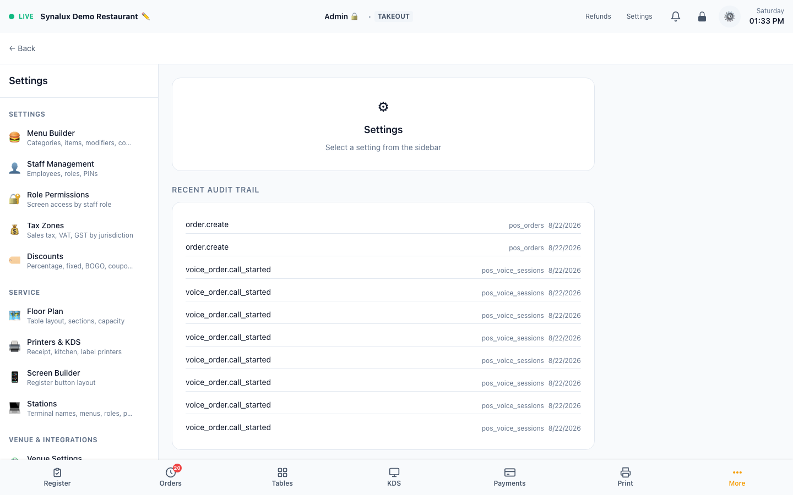

| Settings area | Route | What it controls |
|---|---|---|
| Menu Builder | `/pos/settings/menu` | Categories, items, modifier sets, shared modifiers, combos, pricing, availability, KDS routing, barcodes, EBT flags, allergens, recipes, price levels, and CSV import/export |
| Staff Management | `/pos/settings/staff` | Staff records, roles, PINs, cards, QR badges, and passkeys |
| Role Permissions | `/pos/settings/roles` | Permission matrix for the seven staff roles |
| Tax Zones | `/pos/settings/tax` | Sales tax, VAT/GST jurisdictions, rates, and taxable item types |
| Discounts | `/pos/settings/discounts` | Percentage, fixed, BOGO, group, coupon, eligibility, stacking, and usage rules |
| Floor Plan | `/pos/settings/tables` | Rooms, tables, capacity, position, dimensions, rotation, and QR table codes |
| Printers & KDS | `/pos/settings/printers` | Receipt/kitchen/label printers, drawers, stations, and category routing |
| Screen Builder | `/pos/settings/screen-builder` | Venue layout profiles, 12 POS screens, register behavior, receipts, and responsive presentation variants |
| Stations | `/pos/settings/stations` | Terminal identity, device assignment, menus, printers, revenue centers, and role access |
| Venue Settings | `/pos/settings/venue` | Venue identity/time zone, processor, table occupancy, revenue centers, price levels, auto-gratuity, cash discount, over-payment behavior, blind drawer, sales tax on discounts, meal rules, and order types |
| Integrations | `/pos/settings/integrations` | Payment, ordering, accounting, calendar, drive, mail, messaging, and voice providers |
| Online Ordering | `/pos/settings/online-ordering` | Hours, pickup/delivery channels, minimums, prep times, zones, and closed dates |
| Void Reasons | `/pos/settings/void-reasons` | Active order/item void reasons and translations |
| Comp Reasons | `/pos/settings/comp-reasons` | Active item-comp reasons and translations |
| Account | `/pos/settings/account` | Account data export and deletion controls |
| Touch Diagnostic | `/pos/settings/touch-diagnostic` | Touchscreen detection and input diagnostics |

**Delivery Management** is also available directly at `/pos/settings/delivery`. It controls 3PD, in-house, and hybrid delivery modes plus provider selection and menu sync, but it is not currently a card on the Settings landing page.

---

## Features

<a name="staff-login--authentication"></a>

### Staff Login & Authentication

PIN login with clock-in, 7-level role-based access, and automatic screen routing per role. Four authentication methods — PIN is default, biometric and card are progressive enhancements.

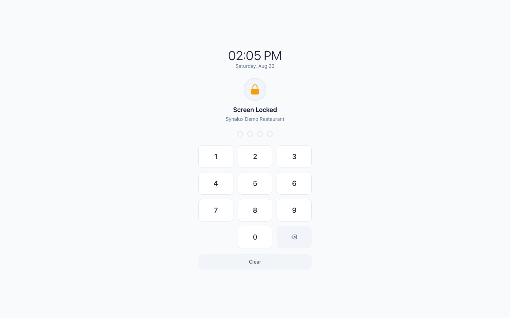
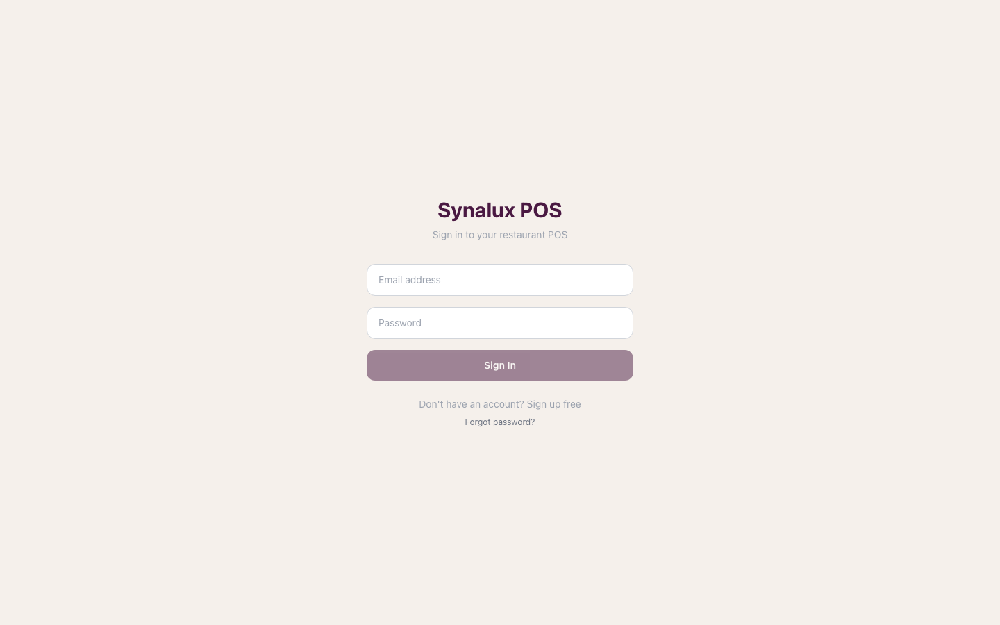

<details>
<summary><strong>Authentication Methods</strong></summary>

| Method | How it works | Setup |
|---|---|---|
| **PIN** | 4-digit numeric code per staff member | Default — created on staff setup |
| **WebAuthn Passkeys** | Touch ID, Face ID, Windows Hello, hardware security keys | Settings > Staff > Register Passkey |
| **Swipe Card** | Magnetic stripe / RFID employee badges | Settings > Staff > Assign Card |
| **Manual Card Entry** | Keyed card-not-present transactions (admin override required) | Admin PIN + confirmation dialog |

Touch ID and Face ID passkeys are registered to supported devices. Multiple passkeys can be registered per staff member, and PIN remains available as the fallback sign-in method.

</details>

**Account sign-in and staff PIN are separate authorization layers.** Email/password signs the device into a venue account. A PIN then selects the on-duty staff identity for shared-terminal workflows. When someone opens Settings or another account-managed route, the POS verifies the signed-in account's venue membership and switches to that account's linked, active staff record; it never carries a cashier or server PIN identity into management as authority. If the account has no accessible venue or linked active staff record, management access stops with an account-access error.

**Sign Out is a staff handoff, not a venue-account logout.** It clears the active staff identity and returns the terminal to the PIN pad while retaining the venue account session, so the next employee can enter their own PIN without re-entering the venue email and password.

<details>
<summary><strong>Roles & Routing</strong></summary>

1. Add staff in **Settings > Staff Management** — display name, four-digit PIN, and one assigned role
2. Assign roles: cashier, host, server, bartender, supervisor, manager, admin
3. After staff authentication, the selected Revenue Center and its configured landing page determine where that role starts. If the device has not selected a station, the employee chooses an allowed station or skips station filtering; stations already locked to another device require manager override permission

| Role | Landing Page | What you see |
|---|---|---|
| Admin | Settings | Settings + All screens |
| Manager | Register | All screens + EOD |
| Supervisor | Register | Register, Tables, KDS, EOD |
| Server | Register | Register + Tables + Handheld |
| Bartender | Register | Bar Register + Age Verification |
| Host | Tables | Tables + Reservations |
| Cashier | Register | Register only |

These rows are the standard terminal-role baseline, not an immutable list. **Settings > Role Permissions** can add or remove terminal routes for each venue, Revenue Center configuration can choose the post-login landing screen, and a station's **Allowed Roles** can restrict who may use that terminal. None of those terminal settings bypasses the separate account-membership check for Settings and other management routes.

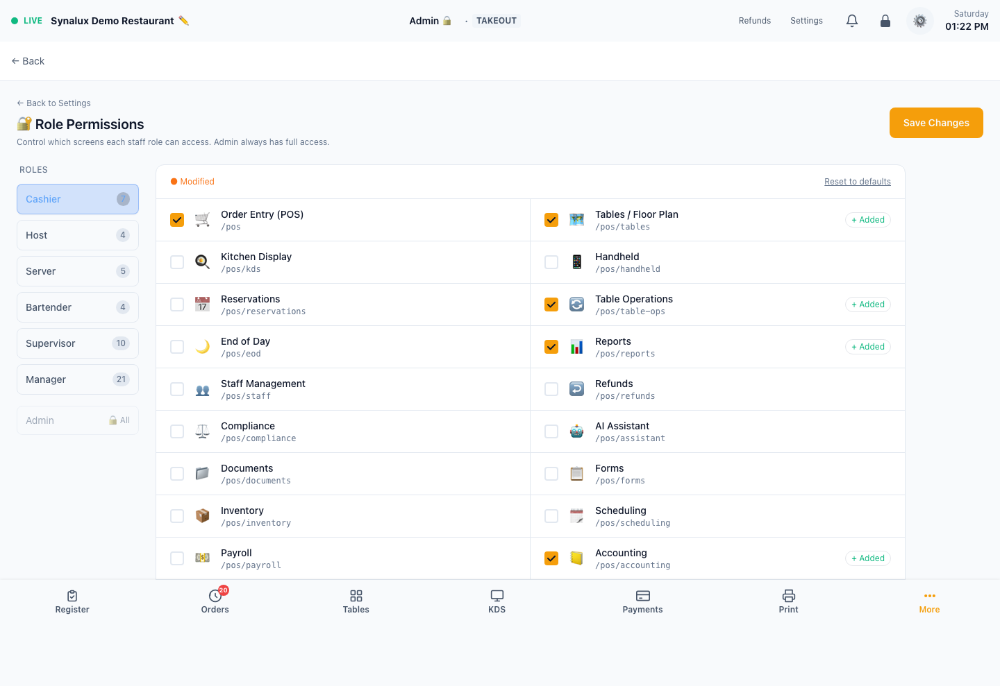
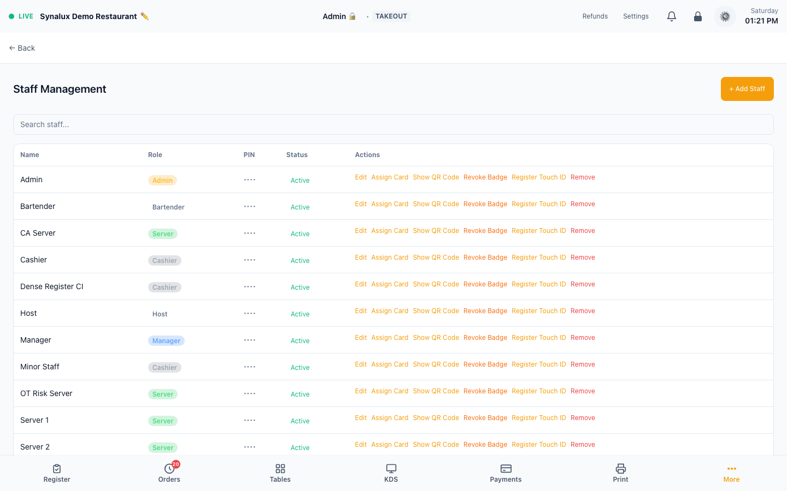

</details>

---

### Revenue Centers

Revenue Centers control which menu categories appear, which KDS stations receive items, which discounts are eligible, and which price level applies — per service area.

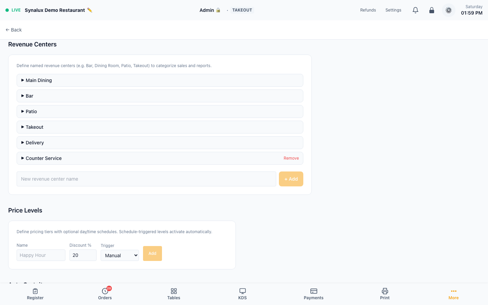


<details>
<summary><strong>Setup</strong></summary>

1. Define RCs in **Settings > Venue Settings** (e.g., Main Dining, Bar, Patio, Takeout)
2. Configure per-RC in **Settings > Venue Settings > Revenue Centers**:
   - **Menu Categories** — which categories show when this RC is active
   - **KDS Routes** — remap station routing (e.g., Bar RC sends all items to bar station)
   - **Eligible Discounts** — restrict which discounts work in this RC
   - **Price Level** — default pricing for orders in this RC
   - **🏁 Landing Screen** — where staff land right after picking this RC: Floor Plan (pick a table first), Bar Tabs, Register, or Delivery Board. Table-service RCs typically land on the Floor Plan so servers choose their table before the order opens. Staff only land where their role has access.
3. Staff select their RC at login and are taken straight to that RC's workflow screen. Orders are automatically scoped.

</details>

---

### Per-Station Configuration

Named terminal configurations with independent menus, printers, and access controls. The bar terminal sees only drink categories, the hostess station sees only table service. **📍 Assign** — one tap per iPad binds the terminal to its station **by device**, and it auto-selects that station on every login and reload. The binding survives Wi-Fi changes, router reboots, and new DHCP leases — no station picker, no network configuration.

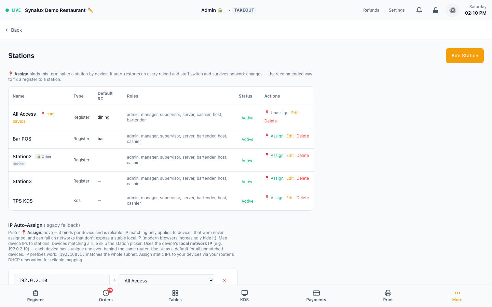

The active station shows next to the staff name in the top bar (e.g. **Alex M. · BAR POS**), so staff always know which terminal identity they're ringing on.

<details>
<summary><strong>Setup</strong></summary>

1. Go to **Settings > Stations > Add Station**
2. Set **Name** ("Bar POS", "Hostess", "Drive-Thru 1")
3. Assign **Menu Categories** — only these categories appear on this terminal
4. Assign **Printers** — this station sends tickets to specific printers
5. Set **Default Revenue Center** — auto-selects RC when staff logs in
6. Set **Allowed Roles** — restrict which staff roles can use this station
7. Set **Allowed Revenue Centers** — restrict which RCs are available

**One-tap device assignment:**

1. Walk to the bar iPad → open **Settings > Stations**
2. Tap **📍 Assign** on "Bar POS" → this iPad is now bound to that station, marked with a **📍 This device** badge (stations bound to other terminals show **🔒 Other device**)
3. On every future login, this iPad auto-selects Bar POS — no station picker, no manual steps
4. Repeat for each device: dining iPad → "All Access", takeout iPad → "Takeout"
5. **📍 Unassign** releases the binding; if a device has no assignment, the station picker appears at login

**First-login claim:** on an unassigned terminal, the station picker after PIN entry claims the chosen station for that device — same effect as Assign in Settings. Stations already claimed by another terminal show "In Use"; managers can override to move a station to a new device.


**IP Auto-Assign (legacy fallback):** the section at the bottom maps device IPs to stations for terminals that were never device-assigned. Prefer 📍 Assign — IP matching depends on the network exposing a stable local IP, which modern browsers increasingly hide. Existing rules keep working; `*` acts as a default for unmatched devices and IP prefixes (e.g. `192.168.1.`) match whole subnets.

</details>

---

### Price Levels

Create multiple named price levels with optional day/time scheduling. Happy hour, employee, and VIP-style pricing can use venue multipliers with per-item overrides; the current editor does not impose or advertise a 14-level product limit.

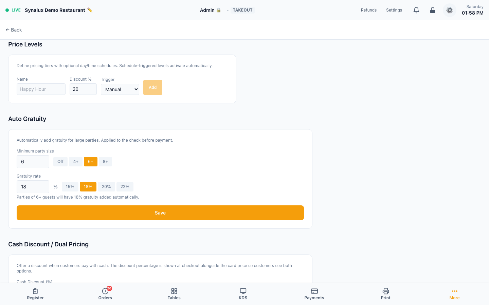

<details>
<summary><strong>Setup</strong></summary>

1. Define levels in **Settings > Venue Settings > Price Levels** with name + multiplier
2. Set **Schedule** for auto-switching: `{days: ["mon","tue","wed","thu","fri"], start: "16:00", end: "18:00"}`
3. **Overnight windows** work: `{start: "22:00", end: "02:00"}`
4. Per-item overrides in **Menu Builder > Item > Price Levels** (exact price per level)
5. **Price cascade:** Station price level → RC price level → Schedule → Base price
6. Manual price-level override requires manager permission or higher

</details>

---

### Register

Ring orders in seconds. Categories, product grid, and order ticket — all on one screen. Cart auto-scrolls as items are added. Open Price button creates custom-priced items with a description field. Send to Kitchen button reappears after adding new items to a submitted order.

**Customer Name / Order Reference** — every order has a Customer Name field in the order panel. Type a guest name for takeout tickets, bar tabs, or dine-in. The name prints on receipts and appears on KDS tickets.

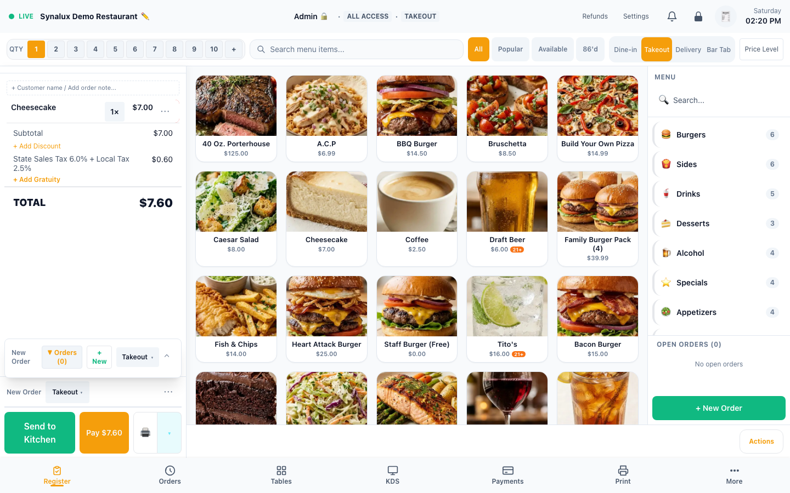

**Item Search** — tap the search icon on the register to search the full menu in real time (2-character minimum). Finds items across all categories instantly — no scrolling needed.


**Custom order types** — choose which order types appear on the register (dine-in, takeout, delivery, drive-thru, bar tab, catering) and give them custom labels (e.g. show *drive-thru* as "Curbside") in **Settings > Venue > Order Types**.

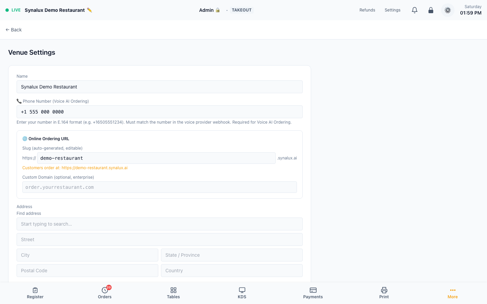

**Comp an item** — comp a line item with a configurable reason. Manage the reason list in **Settings > Comp Reasons**; when comping, staff pick a reason (or free-text) so comps are itemized by cause in the Comps report.

<p>
  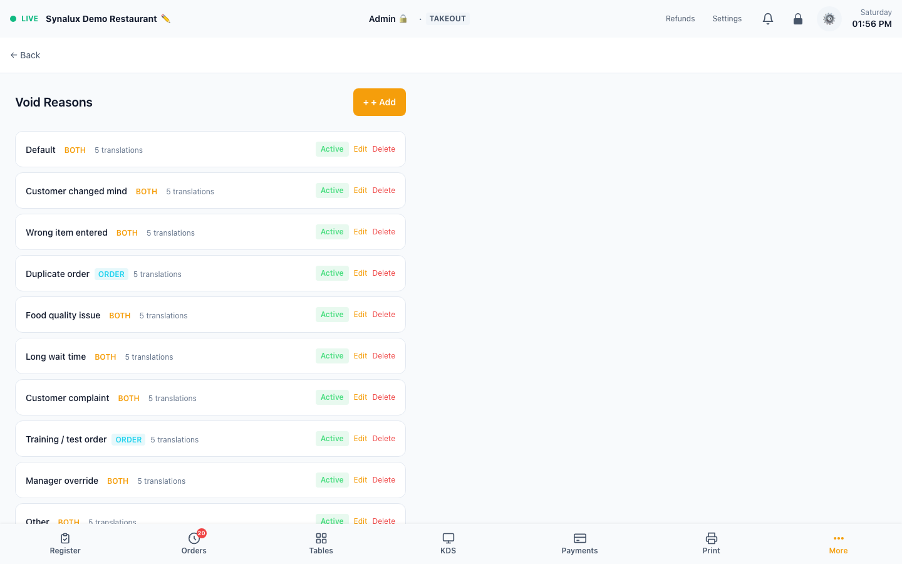
  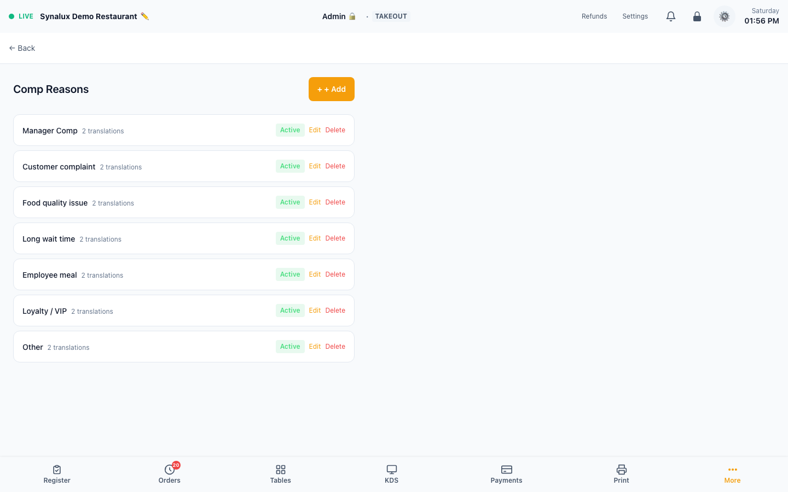
</p>

<details>
<summary><strong>Setup</strong></summary>

1. **Settings > Menu Builder > Items** — add categories and items with **Item Type** (Food/Alcohol/Beverage/Merchandise), **EBT/SNAP eligibility**, and **KDS Station** (Grill/Fry/Prep/Expo/Bar/Cold/Pass) dropdowns
2. Set prices, KDS stations, barcodes, and item details in **Edit Item**; use **Assign Sets** to attach reusable modifier sets
3. **Per-item price level overrides** — set custom prices for Employee, Happy Hour, VIP levels in the item edit form. **Happy-hour pricing applies to online and phone orders too** — the customer is charged the same happy-hour price they see
4. **Combos** — build meal deals in the Combos tab. A component can be a specific item **or a category slot** ("any item from Sides"), each with its own **quantity** (e.g. Burger + any Side ×2 + any Drink for $10). Combo savings apply on the register and on online/phone/AI orders alike
5. **Category scheduling** — open the category editor to set day/time availability for the whole category. The same schedule is enforced before an order is accepted or charged across the Register, public ordering, voice, WhatsApp, and other ordering channels; item-level schedules can still narrow an individual item's availability
6. Items appear on the register automatically

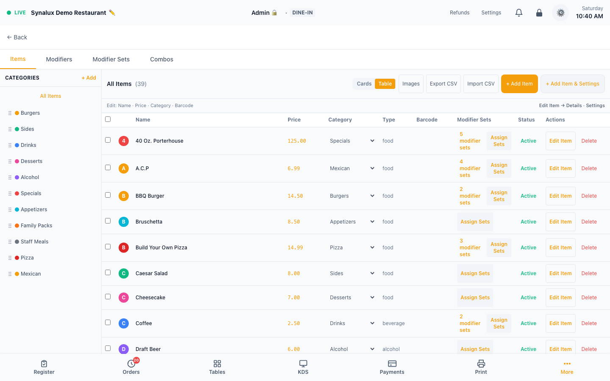
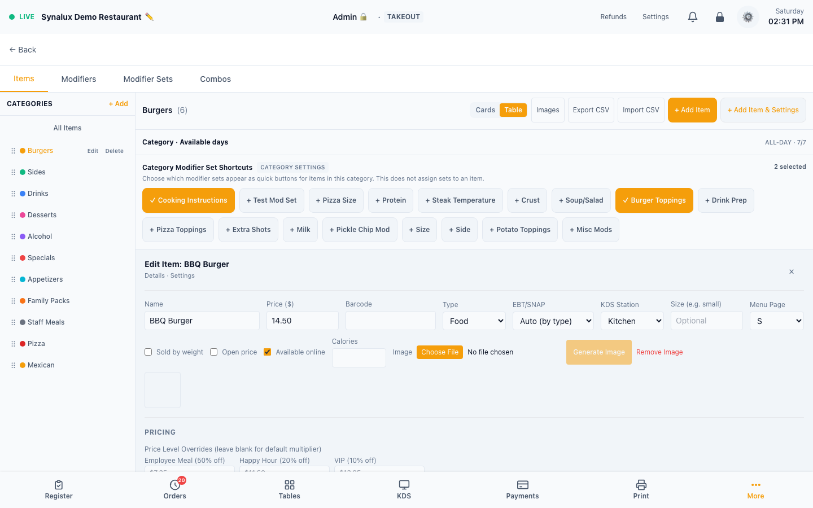
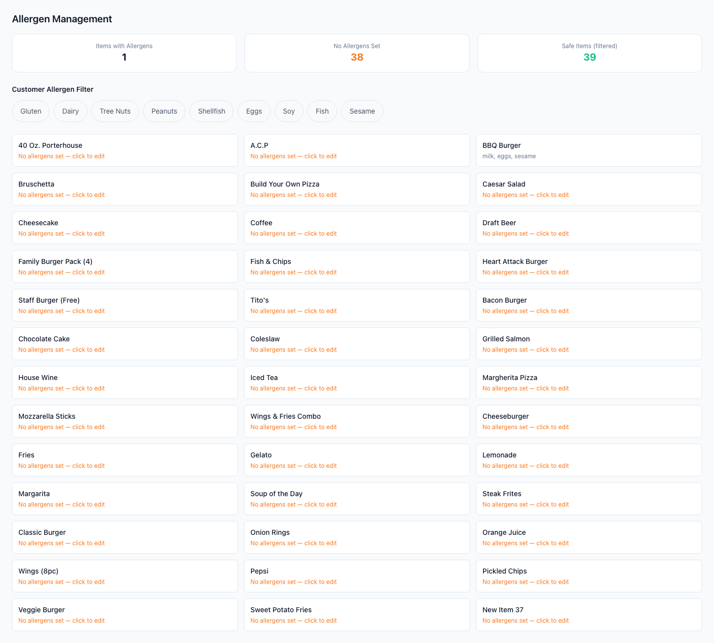
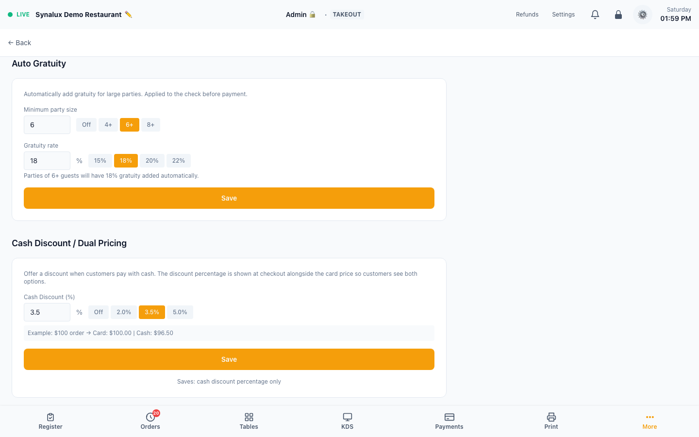
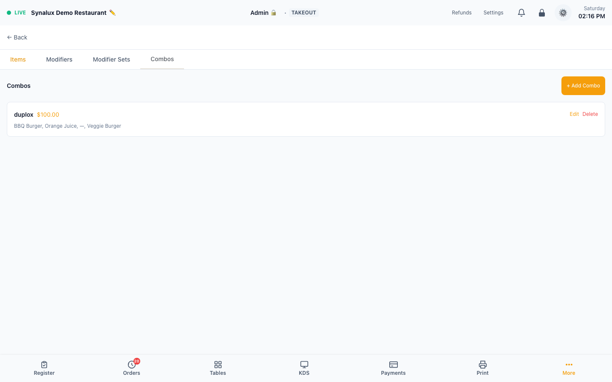
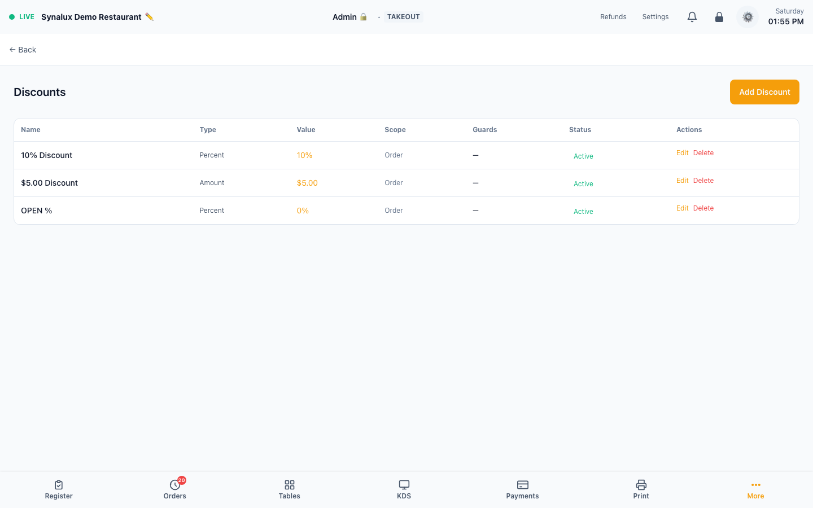
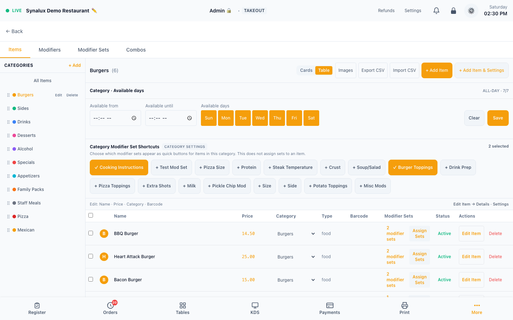
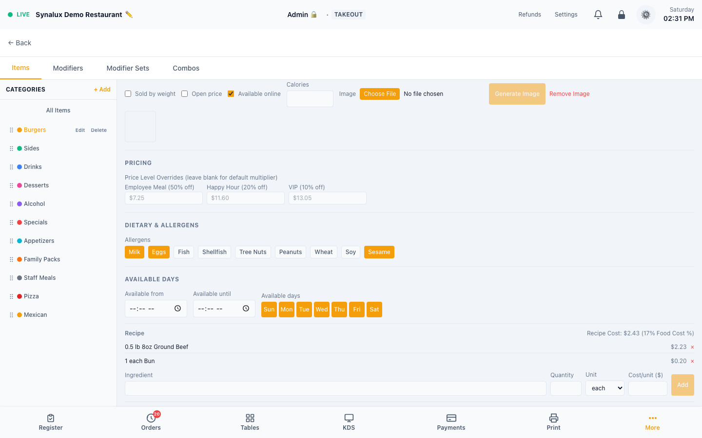


</details>

<details>
<summary><strong>Import & export your menu (CSV)</strong></summary>

**Settings > Menu Builder** has **Export CSV** and **Import CSV** buttons. The quickest way to start is to export first — the file you get back is exactly the format import expects, so you can edit it in Excel or Google Sheets and import it again.

The first row must be a header row. Column order does not matter and header names are not case-sensitive. **`name` and `price` are required**; every other column is optional and may be left out entirely.

| Column | Required | What to put in it |
|--------|----------|-------------------|
| `name` | **Yes** | Item name, up to 200 characters |
| `price` | **Yes** | Price in dollars, e.g. `14.50` |
| `category` | No | Name of an existing category, e.g. `Appetizers` |
| `type` | No | `food`, `beverage`, `alcohol`, or `merchandise`. Defaults to `food` |
| `barcode` | No | Barcode for scanning at the register |
| `available` | No | `no` marks the item unavailable. Anything else means available |
| `calories` | No | Whole number |
| `allergens` | No | Separate multiple allergens with **semicolons**: `nuts;dairy` |

Example:

```csv
name,price,category,type,available,allergens
Caesar Salad,8.00,Appetizers,food,yes,dairy;gluten
House Red,11.50,Drinks,alcohol,yes,
Cheesecake,7.00,Desserts,food,no,dairy;eggs;gluten
```

What to expect on import:

- **Import only adds new items — it never changes existing ones.** If an item with the same name already exists in the same category, that row is skipped and the item is left exactly as it is. Editing a price in the CSV and re-importing will **not** update the item; change prices in the Menu Builder instead. The upside is that re-running the same file is always safe and never creates duplicates
- **Categories are matched, never created.** A category name that does not already exist is reported back in the summary and the item is imported without a category. Create your categories first
- **Bad rows are skipped, not fatal.** A row missing a name or with an unreadable price is counted and reported; the rest of the file still imports
- After importing, the summary tells you how many items were imported, skipped as duplicates, skipped as invalid, and how many category names went unmatched
- Up to **5,000 rows** per file
- Newly imported items without photos can be filled in from the Menu Images manager — see [AI Dish Image Generation](#ai-dish-image-generation)

Values containing a comma, quote, or line break should be wrapped in double quotes, the same as any spreadsheet export.

</details>

---

<a name="tables--floor-plan"></a>

### Tables & Floor Plan

Visual floor plan with color-coded table status, multiple rooms, and resizable/rotatable tables. Table state syncs across every terminal in real time — no manual refresh.

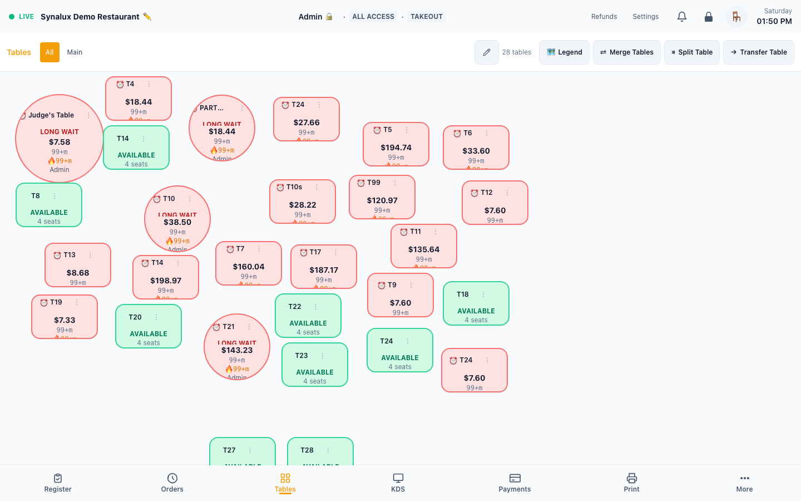

<details>
<summary><strong>Setup</strong></summary>

1. **Settings > Floor Plan** — add tables with name, section, capacity, shape, **size (width/height), and rotation**. Drag to position, resize, and rotate each table to match the real room
2. **Multiple rooms** — group tables by section (Main, Patio, Bar) into separate rooms; a room switcher draws one room at a time in both the designer and the live floor view
3. **Change Table** — move an order to a different table from the order panel. Pick the new table from the floor plan
4. **Move seats between orders** — transfer individual seat groups from one table's order to another
5. Merge, split-back, transfer, or reopen closed checks from the table detail panel
6. **Occupy-on-add** — adding items to a table opens its check immediately, so the table shows **occupied on every terminal** in real time, before "Send to Kitchen." Toggle in **Settings > Venue > Table Occupancy** (on by default); turn it off to only occupy the table once the order is fired
7. **Live status** — available / occupied / long-wait syncs across all terminals instantly, with no manual refresh
8. **Mark Clean** — after a table is vacated, tap **Mark Clean** to flip it back to available (records a bussed timestamp so a fired order is never mistaken for a new one)

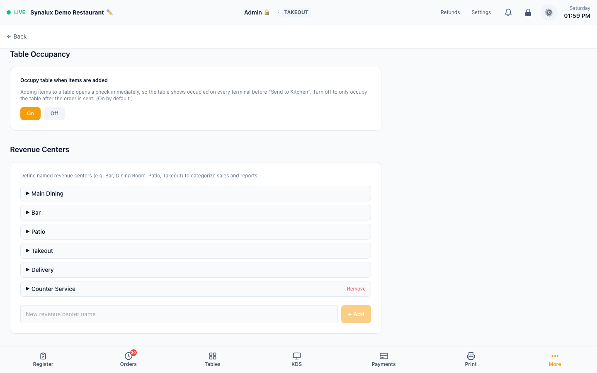
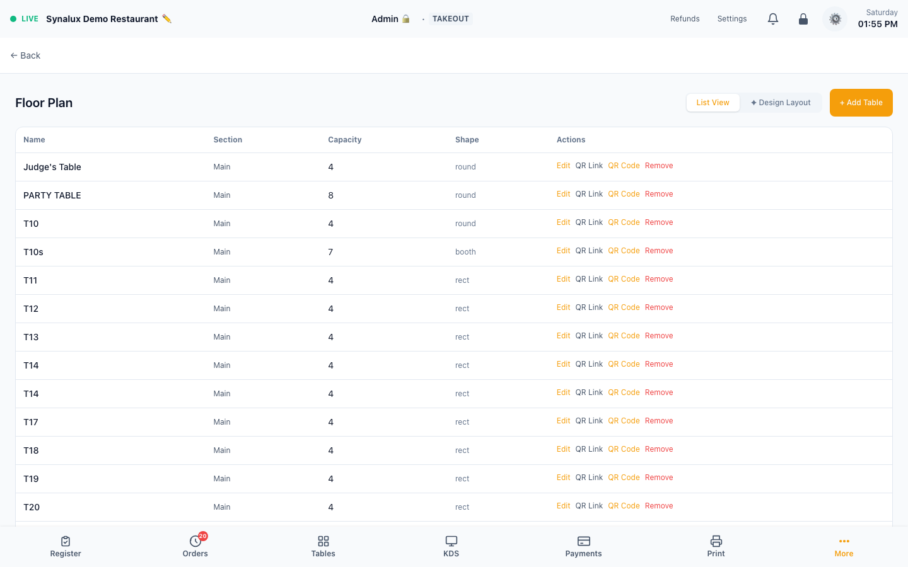
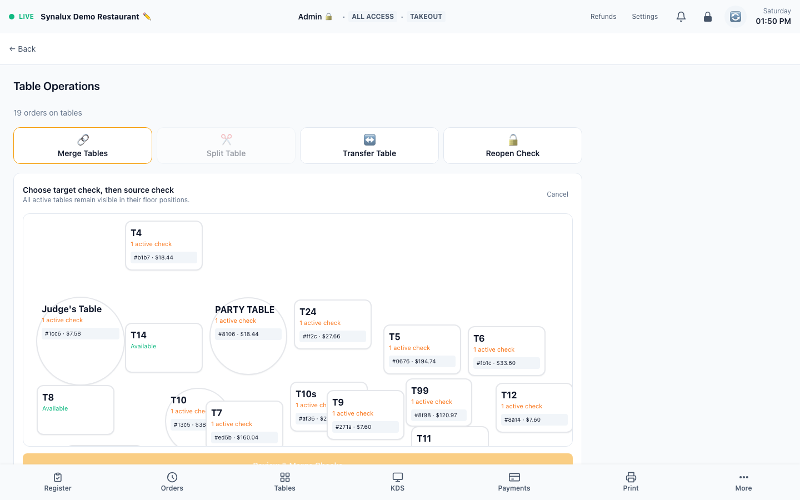
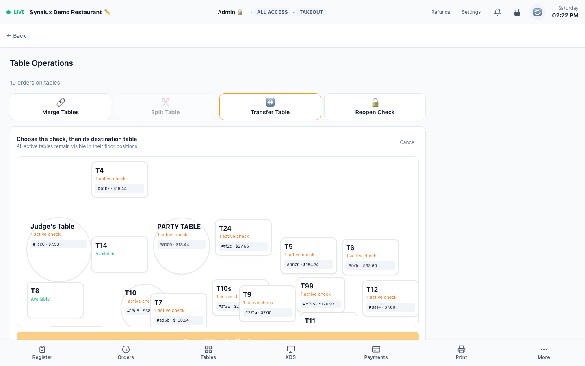

</details>

---

### Seat Management

Assign items to individual seats for split checks and per-guest delivery. Seat tabs on the register let servers ring items per guest. Split a single item across all seated guests — price is distributed evenly.


<details>
<summary><strong>Setup</strong></summary>

1. Tap **Seat 1 / Seat 2 / + Seat** tabs on the register to assign items to specific guests
2. Tap the **⋯** menu on any line item, then **Move to Seat**, to assign or change which guest it belongs to (the item shows a colored seat chip)
3. **Split item across guests** — open a line item's **⋯** menu → **Move to Seat**, then tap "Split across all (N)." The item is cloned into one line per seat with the price distributed evenly (remainder goes to seat 1). Modifier prices are also split
4. Split check by seat — each guest gets their own bill with only their items
5. Seat assignment works alongside courses — assign items to Seat 1/2/3 and Course 1/2/3 independently

</details>

---

### Kitchen Display (KDS)

Ticket board with color-coded timing (green → yellow → orange → red). Bump, recall, void. All-day count per item. 8 station types: Kitchen, Grill, Fry, Prep, Expo, Bar, Cold, Pass.

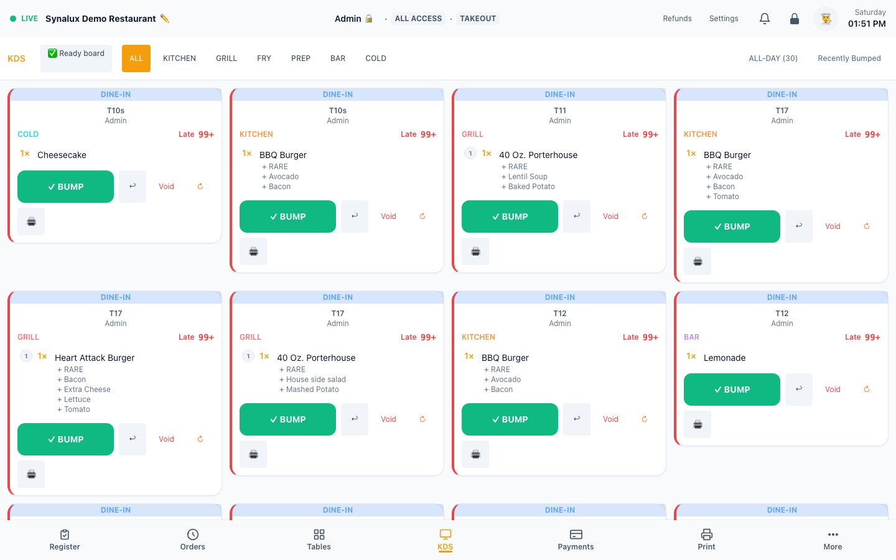

<details>
<summary><strong>Setup</strong></summary>

1. Open `/pos/kds` on any tablet or TV
2. Filter by station: ALL, Grill, Fry, Prep, Expo, Bar, Cold, Pass
3. Configure routing rules in **Settings > Printers & KDS**
4. **Timed Course Fire** — set **Prep time (minutes)** for each menu item. Items split by course; later courses auto-fire based on the longest preparation time so everything finishes together
5. **Modifier Steering** — modifiers can redirect items to additional stations. Set "Steer to Station" on any modifier option in Menu Builder. Steering is additive: item goes to default AND modifier station
6. **Voids reflect on fired tickets** — voiding an item after it's fired marks it struck-through with a **VOID** badge on the kitchen ticket, so the line the kitchen already sees is cancelled instead of leaving a phantom item to be made

</details>

---

<a name="expo--order-management"></a>

### Expo & Order Management

The KDS is only one part of the live order workflow:

- **Expo** (`/pos/expo`) collects completed kitchen work for final handoff and lets staff mark ready orders complete.
- **Orders** (`/pos/orders`) is the searchable order ledger for open and completed checks, totals, staff, and tender context.
- **Table Operations** (`/pos/table-ops`) centralizes active table checks for transfers, merges, split-backs, and reopen workflows.
- **Scheduled Orders** (`/pos/scheduled`) lists future orders when the venue has scheduled demand. An empty scheduled-order queue is intentionally not illustrated.

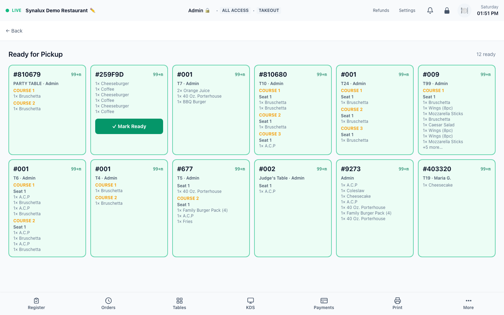
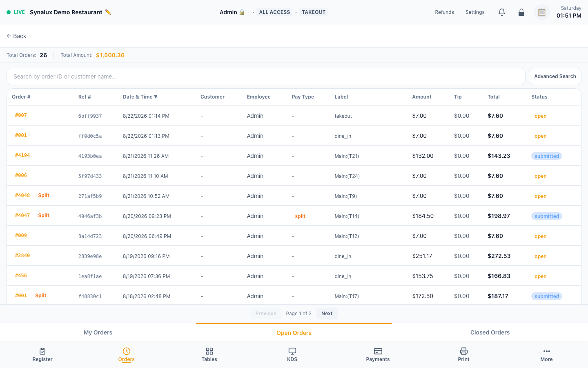


---

### Timed Course Fire

Automatic kitchen ticket timing — items in a course fire based on prep time so everything lands on the expo at the same time. Course numbers are assigned at the register; KDS hides future-course tickets until their fire time.


<details>
<summary><strong>How it works</strong></summary>

1. Set **Prep time (minutes)** on each menu item in **Settings > Menu Builder**
2. Assign **Course 1 / 2 / 3** to items in the cart during order entry
3. Course 1 fires immediately. Course 2 fires after Course 1's longest prep time elapses
4. Within a course, faster items are delayed — a 5-min soup waits 13 minutes so it finishes with the 18-min steak
5. KDS hides future-dated tickets until their fire time passes
6. Online, voice, and WhatsApp orders receive an estimated ready time based on the longest-preparation item

</details>

---

### Modifier-Based KDS Steering

Modifiers can redirect parent items to additional kitchen stations (additive routing). Example: a "Grilled Shrimp" modifier on a burger sends the burger to both Prep AND Grill stations.

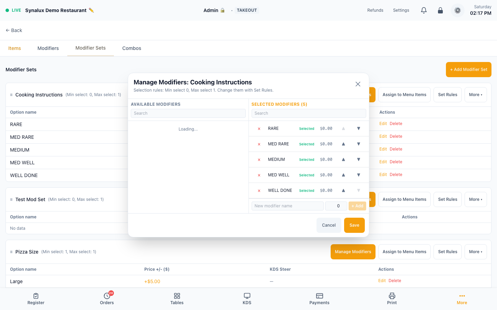

<details>
<summary><strong>Setup</strong></summary>

1. Open **Settings > Menu Builder > Modifiers tab**
2. Click **Edit** on any modifier option to open the inline edit form
3. Set **KDS Steer** dropdown on any modifier option (e.g., "Grilled Shrimp" → Grill)
4. Toggle **Follow Item** to control whether modifier text appears on the steered ticket
5. Steering is **additive** — the item goes to its default station AND the modifier's station
6. Multiple modifiers can steer to different stations without printing the same routed item twice

</details>

---

### Payment

Card, cash, gift card, mobile pay, house account, bar tabs, and cash discount/dual pricing. Tap to Pay on iPhone appears only after the supported iPhone and Stripe Terminal setup are ready; EBT/SNAP authorization is not currently available. Split check, tips, and post-payment tip via QR are also supported.

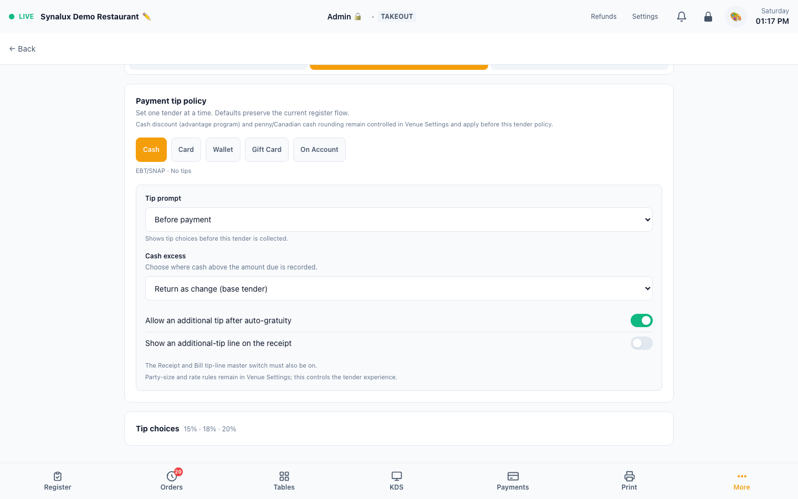

<details>
<summary><strong>Setup</strong></summary>


1. **Card** — connect the venue's Stripe merchant account and location, then pair a supported reader from **Settings > Integrations** and complete an authorization/refund test
2. **Tap-to-Pay on iPhone** — requires the Synalux POS iPhone app, Stripe as the venue processor, a supported signed build/device, a Stripe Terminal Location, and Stripe Tap to Pay availability. When the native capability check passes, tap **Tap to Pay on iPhone** on the payment screen; otherwise that tender stays hidden rather than presenting an unusable button
3. **Cash discount / Dual pricing** — configure the cash discount percentage in **Settings > Venue > Cash Discount**. Customers see both card and cash prices at checkout (e.g. Card: $100 | Cash: $96.50)
4. **Bar tabs** — tap "🍺 Start Tab" at payment to pre-authorize a card and hold the check open. Open tabs show in the register sidebar with a one-tap "Close" button to capture the final amount
5. **Gift cards** — issue from the Gift Cards page
6. **House accounts** — create the customer account on **House Accounts**, then choose **House Account** at payment or record standalone account activity. See [House Accounts](#house-accounts)
7. **EBT/SNAP** — *not currently available for payment authorization*. Per-item eligibility already works: mark each menu item **EBT-eligible / not eligible / auto** in Menu Builder (auto infers from item type — food/beverage eligible, alcohol excluded), and the register exempts eligible items from tax at tender. The EBT tender cannot currently complete a payment, so contact support before promising EBT to a venue
8. **Split check** — four modes: even split, by seat, by item, and by custom amount. Each split can pay by a different method (card/cash/gift card). Unsplit (merge) an open split back into one check from the order panel
9. **Tender-specific tips and excess payments** — open **Settings > Screen Builder > Register > Payments**, then select **Cash**, **Card**, **Wallet**, **Gift Card**, or **On Account**. Each tender can use its own tip timing. Cash can route an amount above the balance to change/base tender, tip, gratuity, or a cashier prompt. EBT/SNAP remains non-tippable
10. **Auto-gratuity and receipt tips** — in the same Payments tab, decide per tender whether an additional tip is allowed after auto-gratuity and whether the receipt shows an additional-tip line. Suggested percentages, custom-tip visibility, and the maximum tip percentage are configured below the tender policy. The receipt's master tip-line control must also be enabled
11. **Venue-level pricing rules** — **Settings > Venue** remains the source for cash discount/advantage-program pricing, auto-gratuity party-size and rate rules, and cash rounding. Canadian cash is rounded to the nearest five cents; another currency follows penny amounts unless nickel rounding is enabled. These rules are applied before the tender-specific policy
12. **Legacy/default over-payment fallback** — **Settings > Venue > Over-payment handling** supplies the venue fallback (*Give change*, *Add to tip*, or *Ask cashier each time*) when the Screen Builder payment-tip policy is not active. Once the Screen Builder policy is active, its Cash excess setting controls the tender workflow. The amount applied to the bill remains the amount owed; excess is recorded according to the selected policy

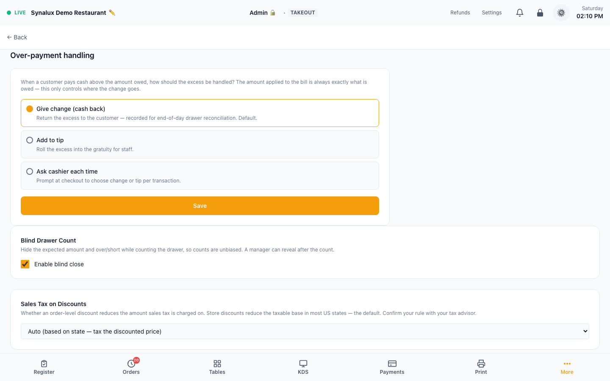
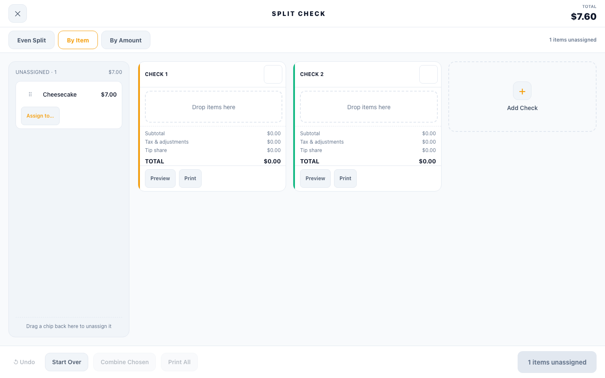
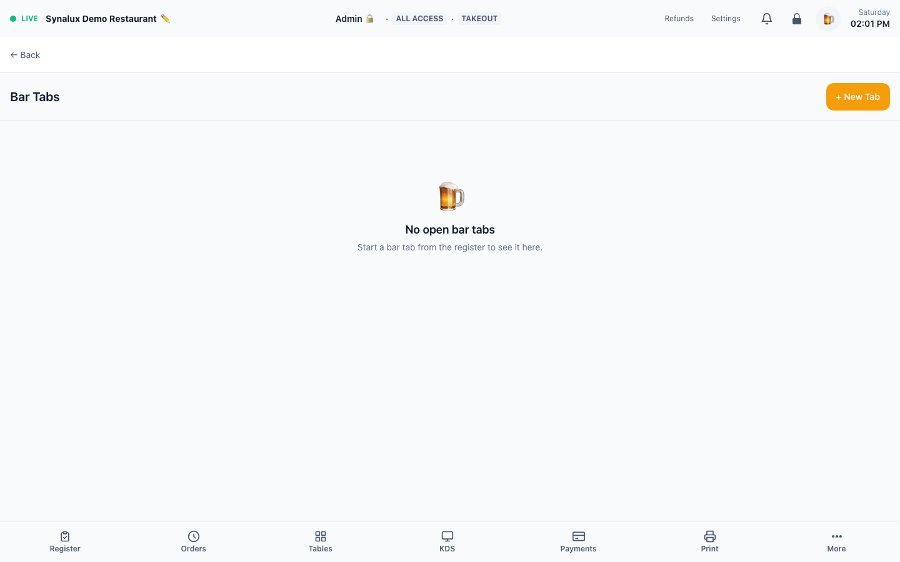
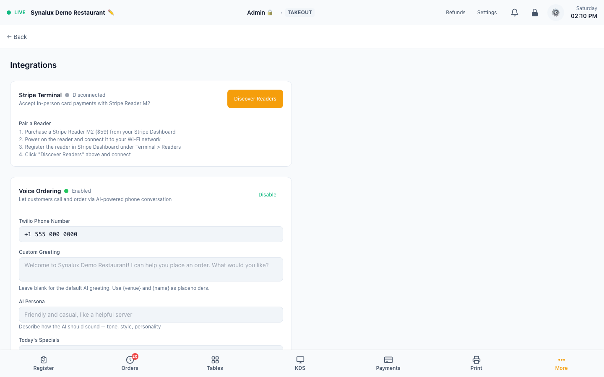
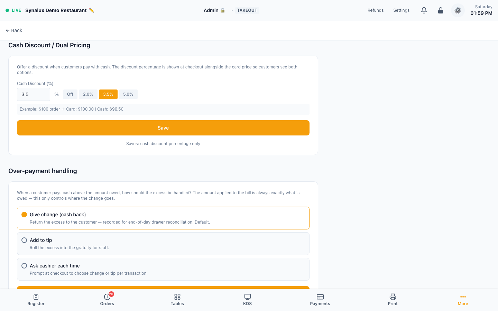


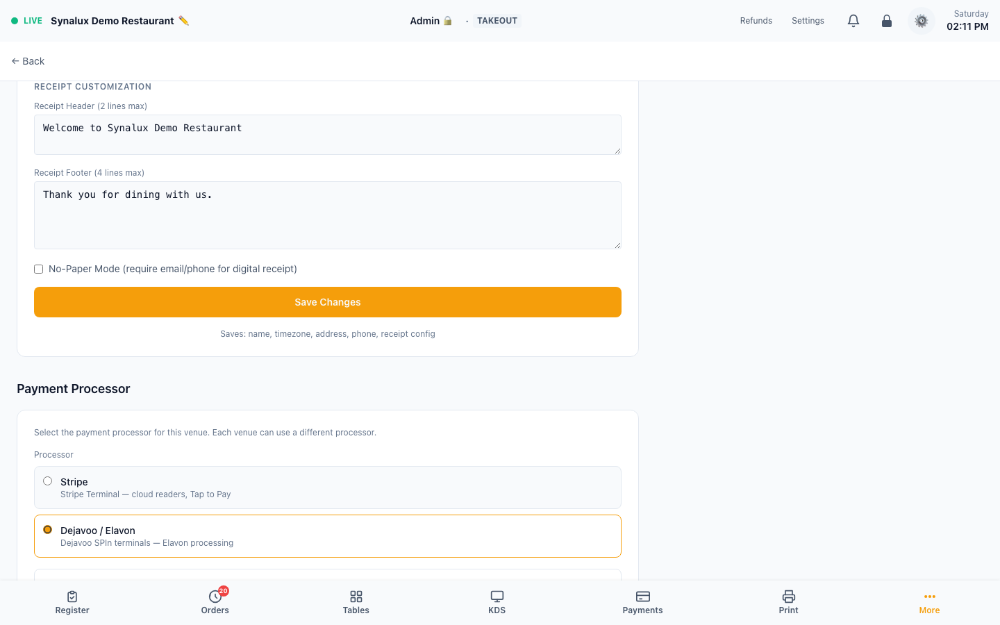
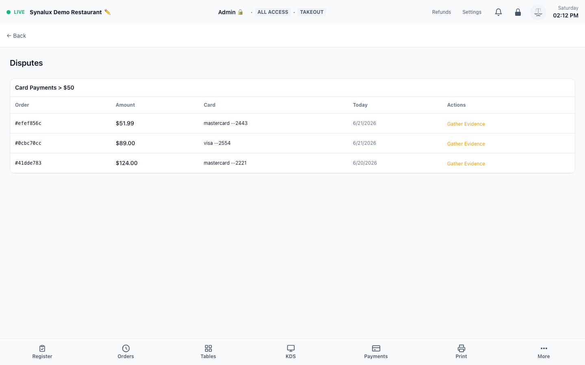


</details>

<details>
<summary><strong>Payment review, receipts, disputes, and refunds</strong></summary>

These pages serve different jobs:

| Page | Route | Purpose |
|---|---|---|
| Payment Review | `/pos/payments` | Exception queue for payments that need staff review; it is not the complete payment history and can legitimately be empty |
| Receipts | `/pos/receipts` | Find an order, select it, then preview, print, email, or text its receipt |
| Disputes | `/pos/disputes` | Chargeback/dispute cases, evidence, amount, status, and due dates |
| Refunds | `/pos/refunds` | Search completed sales and process or review partial/full refunds |

Empty review queues and the pre-selection Receipts state are intentionally not used as screenshots.

</details>

---

<a name="staff--labor"></a>

### Staff & Labor

Scheduling, break punches, meal-penalty enforcement, overtime alerts, tip pooling (3 modes), and payroll with FLSA compliance.


<details>
<summary><strong>Setup</strong></summary>

1. **Settings > Staff Management** — add an employee with a display name, four-digit PIN, and role. Search the list or edit an existing employee; PINs remain masked in the table
2. **Staff sign-in methods** — use **Assign Card** for a magnetic-stripe card or RFID fob, **Show QR Code** to issue a printable badge, **Revoke Badge** before replacing a badge, and **Register Touch ID** on supported WebAuthn hardware. Keep the PIN as the fallback sign-in method
3. **Settings > Role Permissions** — choose Cashier, Host, Server, Bartender, Supervisor, or Manager, then select the POS screens that role can open. Save the venue override or reset a role to its built-in defaults. Admin is locked to full access
4. Configure pay periods, break rules, and overtime thresholds
5. Tip pool mode: by hours, percentage, or points
6. **Break punches** — staff Start/End a meal or rest break from the timeclock. Ending a break resumes the same shift (no clock-out/clock-in), and the break minutes are recorded on the shift
7. **Meal penalty** — set the rules in **Settings > Venue > Meal Penalty & Break Rules** (threshold, minimum meal length, premium minutes, and a **grace period**). When someone works past the threshold with no qualifying meal break, a premium is owed; it rolls into the labor report's gross pay. The grace period is slack past the threshold before any penalty applies

</details>

---

<a name="online-ordering--qr-table"></a>

### Online Ordering & QR Table

Customers browse your menu, order, and pay — no app needed. Pickup and delivery channels. QR codes per table go straight to KDS. Scheduled orders, loyalty points, promo codes, AI chat assistant, and order tracking.

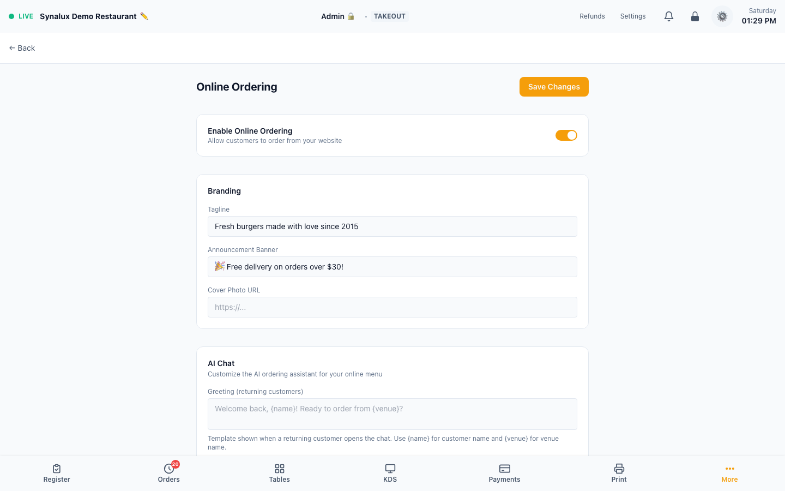

<details>
<summary><strong>Setup</strong></summary>

1. **Enable** — turn on online ordering in **Settings > Online Ordering**
2. **Branding** — set the storefront tagline, announcement banner, and cover-photo URL
3. **AI ordering assistant** — customize returning-customer and new-customer greetings plus the assistant persona. The supported `{name}` and `{venue}` placeholders are filled at runtime
4. **Business hours** — set per-day open/close times. Orders are blocked outside hours
5. **Channels** — enable Pickup and/or Delivery independently with separate minimum-order amounts and preparation times; Delivery also has a base fee
6. **Delivery zones** — set the venue coordinates, then define radius zones with their own fee and minimum order
7. **Closed dates** — add holidays or other dates when online ordering is unavailable
8. **Share your link** — customers order at `https://your-slug.synalux.ai` or your configured enterprise custom domain. Manage the slug and custom domain in **Settings > Venue**
9. **QR table ordering** — print QR tents from **Settings > Floor Plan**. Customer scans, orders, and the ticket goes straight to KDS
10. **Scheduled orders** — customers pick a future date/time at checkout. Orders appear on KDS at the scheduled time
11. **Promo codes** — one-time-use codes are validated at checkout and duplicate redemption is rejected
12. **AI chat** — customer-facing AI understands your full menu including modifiers and pizza builder. Supports 14 languages with voice input/output

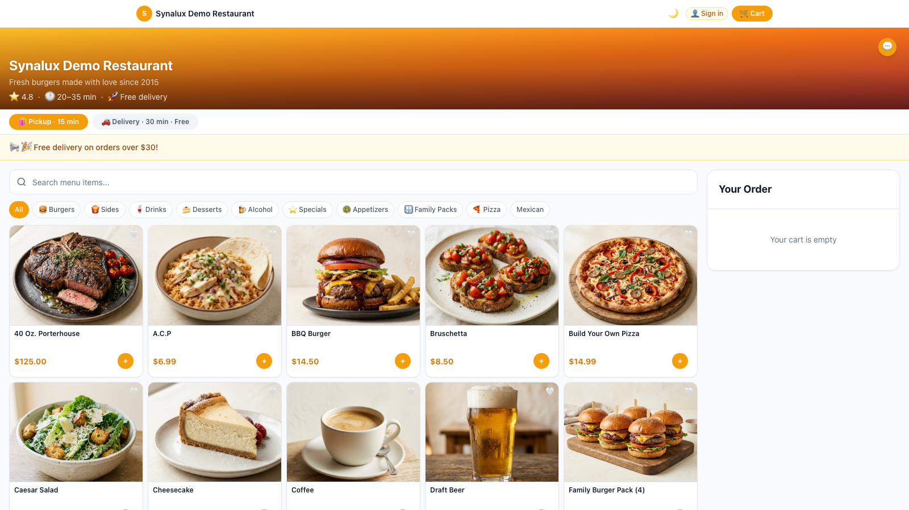
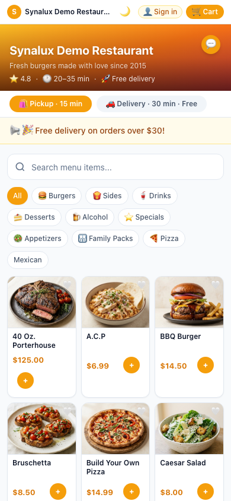
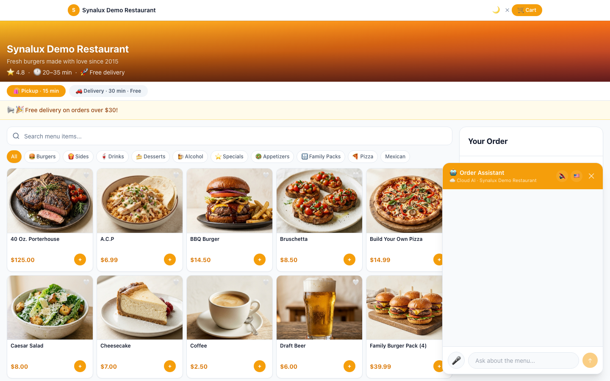


</details>

---

### Delivery Management

In-house drivers, 3PD delegation (DoorDash Drive, Uber Direct), or hybrid mode. Route optimization, driver GPS tracking, auto-dispatch, and menu sync to 3PD platforms. The current settings screen separates 3PD, in-house, and hybrid choices and keeps provider setup and menu sync in the same workflow.

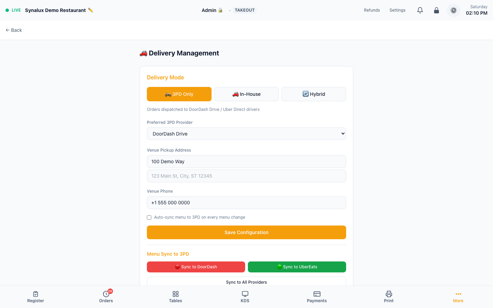

<details>
<summary><strong>Setup</strong></summary>

1. **Choose mode** in **Settings > Delivery**: 3PD Only, In-House, or Hybrid (try in-house first, fall back to 3PD)
2. **3PD providers** — connect DoorDash Drive or Uber Direct in **Settings > Integrations**, then test delivery creation, status updates, and cancellation
3. **In-house drivers** — add drivers with name, phone, vehicle type (car/bike/scooter/walk), and max concurrent orders
4. **Menu sync** — tap "Sync to DoorDash" / "Sync to Uber Eats" to upload your menu. Enable auto-sync to push changes automatically when you edit menu items
5. **Driver mobile page** — drivers open `/pos/delivery/driver` on their phone. They see assigned orders, tap to navigate, mark picked up / delivered / failed, and auto-report GPS every 30s
6. **Route optimization** — batch dispatch clusters nearby deliveries and assigns the optimal driver using proximity scoring
7. **Order status sync** — when KDS bumps an order to "ready", the system notifies the 3PD provider and triggers auto-dispatch for in-house drivers

The driver page is documented without a screenshot when the demo has no assigned deliveries; an empty driver queue is not representative of the workflow.

</details>

---

### AI Chat Assistant

Context-aware AI assistant across staff POS workflows and the online-ordering experience. It uses the current route to load relevant page context, supports voice input, quick prompts, and Prism memory, and can take **real actions** where that screen exposes a tool. Actions are **module-isolated** (a tool runs only in its own workflow) and **role-gated** (only staff with the required permission can run it). Dedicated display surfaces and screens without an action tool remain read-only or omit the launcher.

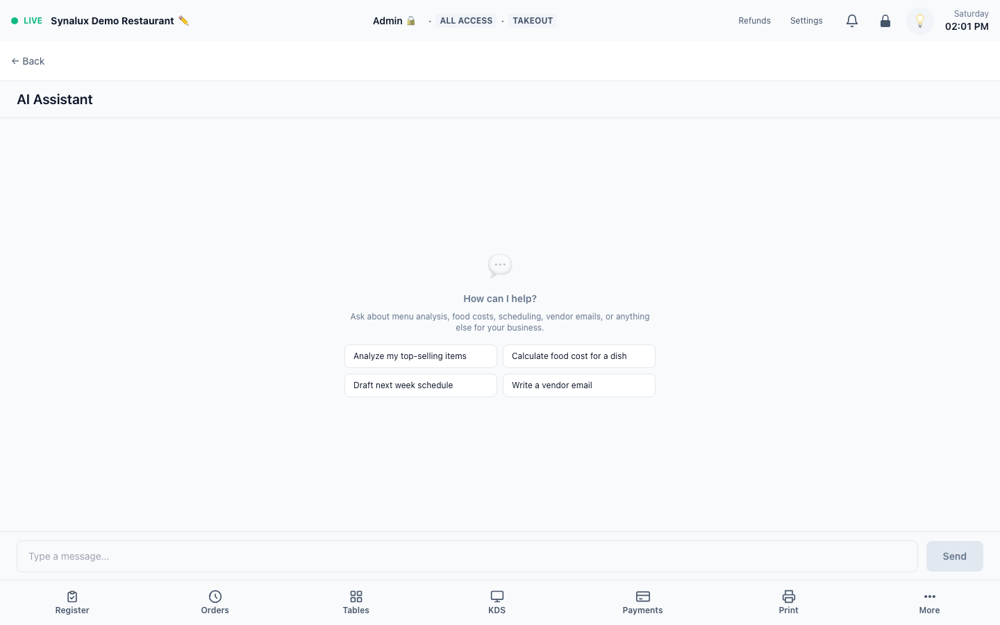

<details>
<summary><strong>How it works</strong></summary>

**POS Staff Chat** — appears on supported operational pages, loads the context exposed for that screen, and beyond answering questions can **perform the action for you** when that module exposes a tool (it confirms first, then calls an audited, tenant-scoped tool):
- **Register / Handheld / Drive-Thru / Tabs** — add item, apply discount, void item, split check, send payment link, open drawer; "Find order with 3 cokes"
- **KDS / Coursing / Expo** — bump or recall tickets, check allergens; "What's the oldest ticket?"
- **Tables / Table Ops** — availability, merge / split / transfer, reopen check
- **Reservations** — book a reservation, add a walk-in to the waitlist, seat / cancel / mark no-show
- **Loyalty** — look up a member, enroll a new member
- **Gift Cards** — check balance, reload, redeem against an order
- **Staff** — clock a staff member out
- **Messaging** — post to a staff channel; **Calendar** — schedule an event
- **Reports / Dashboards** — sales summary (revenue, orders, average ticket, tax, tips, discounts)
- **Payroll / HR / Multi-Location** — aggregate labor-hours and labor-cost summary
- **Accounting** — chart-of-accounts summary; **Allergens** — allergen-coverage audit; **Compliance** — RBS certs, incidents, data-deletion deadlines; **Documents** — search the file drive; **Marketing** — campaign performance; **Feedback** — NPS + ratings; **House Accounts / Vendors / Payments / Refunds / Scheduled orders** — read-only summaries
- **Screen Builder** — toggle receipt display options

Money- and compliance-sensitive actions (payroll ACH, tax changes, journal postings, loyalty point grants, issuing refunds, sending marketing) are deliberately **read-only in chat** — the assistant surfaces the data and points you to the on-screen control to execute them.

**OO Customer Chat** — customers ask "Make me a half pepperoni half mushroom pizza" and the AI builds the order with correct modifiers and pricing:
- Voice input (microphone) + voice output (speaker) with adjustable speed/pitch/gender
- 14 languages with locale picker
- Returning customer greeting via cookie
- Confirmed AI actions can add or remove items, filter the menu, and suggest a combo

</details>

---

### AI Voice Ordering (Phone)

Customers call your venue's configured phone number and place orders through a spoken conversation. Returning-customer context and menu-aware correction are built into the workflow; SMS notifications remain conditional on sender configuration, consent, and content restrictions.

Voice Ordering is configured from **Settings > Integrations**. A provider card or enabled toggle documents configuration only; it does not prove that a live phone number, payment processor, SMS sender, and kitchen path have all completed an end-to-end order.

<details>
<summary><strong>Setup & Configuration</strong></summary>

1. **Enable** in Settings > Integrations > Voice Ordering
2. Set your **Twilio phone number** in Settings > Venue
3. Complete the phone-number connection with Synalux onboarding, then place a live test call that reaches the menu, payment choice, kitchen, and configured notification path

**Customizable settings:**

| Setting | Description |
|---------|-------------|
| Custom Greeting | Opening message with `{venue}` and `{name}` placeholders |
| AI Persona | Tone and style — "friendly server", "professional concierge", etc. |
| Today's Specials | AI proactively suggests these when asked "what's good?" |
| Supported Languages | 16 selectable conversation languages in the current Settings UI. Automatic first-utterance recognition varies by language, so explicitly configure and test every language the venue offers |
| Fallback Number | Transfer to human after repeated AI failures |

</details>

<details>
<summary><strong>How a call works</strong></summary>

1. Customer calls venue phone number
2. The assistant starts in the venue or returning caller's configured language. For a first-time caller, automatic language recognition can switch before the first cart item when the deployed phone service recognizes the language; the language is then locked for that order.
3. The configured phone service carries speech and responses between the caller and the ordering workflow.
4. Returning customers auto-recognized by phone — AI greets by name, knows past orders.
5. Input checks reject empty, repeated, filler-only, or malformed input before the order assistant acts; this reduces noise-related turns but does not guarantee that every noisy utterance will be classified correctly.
6. The order assistant uses the recognized request and current cart to return the next response or cart action.
7. AI adds items immediately, confirms with price: "Added a Classic Burger for twelve dollars. What else?"
8. Phonetic correction: garbled phone audio auto-matched to menu items
9. "Change burger to family pack" → removes old + adds new in one turn
10. "Repeat my order" → AI reads back all items with prices
11. "That's all" → asks for customer name → reads back order with total
12. "Yes" → order created → KDS kitchen ticket → SMS confirmation
13. Authorized managers can review the completed call and order activity in reporting

**Customer commands:**

| Say | What happens |
|-----|-------------|
| Any menu item name | Added immediately with price confirmation |
| "Change X to Y" | Removes X, adds Y |
| "Remove the fries" | Item removed |
| "What do you have?" | Top items listed |
| "Repeat my order" | Current order read back with prices |
| "My usual" | Adds items from last order (returning customers) |
| "Put me on the waitlist" | Asks for party size and adds customer to venue waitlist |
| "How long is the wait?" | Reads back current waitlist estimate |
| "That's all" / "Done" | Starts confirmation flow |
| "Yes" / "Confirm" | Places order |
| "No" / "Wait" | Returns to ordering |

**Language support:** The current integration screen lets the venue select English, Spanish, French, Chinese, Russian, Arabic, Portuguese, German, Italian, Japanese, Korean, Vietnamese, Hindi, Ukrainian, Romanian, and Bulgarian. A returning caller can start with the stored supported language. Automatic first-utterance recognition is more limited than the settings list, so configure and test each offered language rather than advertising every selected language as automatically detected.

The order language locks after the first cart item so a menu name or noisy utterance cannot silently change the language mid-order. Test every enabled language with the venue's actual phone number before launch; configuration is not proof that the provider accepted a specific accent, device, or call path.

**Online ordering** is also available at the same time:


</details>

<details>
<summary><strong>Go-live checklist</strong></summary>

- Confirm the venue phone number, supported languages, greeting, fallback number, and operating hours
- Place test calls for a new customer and a recognized returning customer
- Verify menu pricing, modifiers, substitutions, order read-back, kitchen routing, and payment handling
- Verify any configured SMS notification with the venue's approved sender and customer consent flow
- Confirm that repeated low-confidence input transfers to the configured human line

</details>


---

### WhatsApp Ordering

WhatsApp uses the same menu, cart validation, pricing, and order-placement rules as the other ordering channels, with channel-specific language and delivery behavior. Customers can send text or a voice note, receive the cart in the thread, and confirm the order without installing a separate restaurant app.


<details>
<summary><strong>How it works</strong></summary>

1. Customer texts or sends a voice message to the venue on WhatsApp
2. The order assistant responds using the same menu, pricing, and cart rules used by the voice workflow
3. The initial reply language comes from supported text/script detection, the mapped caller locale, or the venue locale. Voice notes use the configured transcription service; do not advertise an untested language as automatically detected
4. Add items naturally: "I want a burger and fries" or "я хочу бургер и картошку"
5. Cart displayed after each message:
   ```
   🛒 Your cart:
     1x Classic Burger
     1x Fries

   Say "done" when ready to order.
   ```
6. "done" → asks for name → confirms order → "YES" → order placed
7. Confirmation with order number, total, and estimated pickup time
8. When the configured processor returns a checkout URL, the payment link is sent in the WhatsApp thread; otherwise the order falls back to the configured pay-at-pickup message
9. The order confirmation is delivered in the WhatsApp conversation through Twilio's WhatsApp sender, not as a separate SMS
10. A confirmation email is attempted only when the recognized loyalty member has an email address and the venue has email delivery enabled
11. Returning customers recognized by phone — favorites and past orders recalled

**Commands:**

| Text | What happens |
|------|-------------|
| Any menu item | Added to cart with price |
| "Change X to Y" | Swap items |
| "Remove fries" | Item removed |
| "My usual" | Last order re-added |
| "Done" | Starts confirmation |
| "YES" | Places order → KDS ticket |
| Voice message (mic button) | Transcribed by the configured speech service, then processed as text |

**Language support:**

| Input | Languages |
|-------|-----------|
| **Text messages** | Venue locale plus the route's currently recognized script/caller-locale mappings; a successful reply does not prove automatic language recognition for every future message |
| **Voice messages** | The deployed speech configuration; validate each language before launch |
| **AI responses** | Requested session locale when it can be determined; unsupported or ambiguous input falls back to the venue language |

**Venue assignment:** The inbound WhatsApp number must be assigned to the venue. Unassigned numbers are rejected rather than guessed from a country code or routed to another venue.

**Setup:**
1. Register and approve the venue's WhatsApp Business sender
2. Complete the WhatsApp connection with Synalux onboarding
3. In **Settings > Integrations**, confirm the number assigned to the venue
4. Send a real text and voice-note order, confirm the kitchen ticket, payment choice, and customer reply before publishing the number

</details>

---

### AI Dish Image Generation

Menu items automatically get AI-generated dish photos — no professional photography needed. A photo is generated once per dish and cached, so the same item is never billed twice. Items show an emoji placeholder until a photo exists, and photos you upload yourself always take priority.

<details>
<summary><strong>Setup</strong></summary>

1. Open **Settings > Menu Builder**. A new item generates its photo in the background — the item is sellable immediately and the picture catches up
2. **Generate one** — an item without a photo shows a **Generate image** button in its editor
3. **Generate all missing** — the Menu Images manager generates every item that lacks a photo in one batch, showing the item count and estimated cost for approval before anything runs
4. **Upload your own** at any time to override a generated photo. Uploads are never overwritten by generation, and clearing generated images leaves your uploads untouched
5. Each venue has a **monthly image budget**. When it is reached, generation stops rather than continuing to spend, and says so instead of failing quietly

</details>

<details>
<summary><strong>If an item is missing its photo</strong></summary>

Occasionally a photo cannot be produced at the moment an item is created. The item is still saved and sellable — only the picture is missing.

Opening **Settings > Menu Builder** retries recently added items automatically, so in most cases the photo appears on your next visit to that page with no action needed. To fix one immediately, use **Generate image** in the item's editor, or **Generate all missing** in the Menu Images manager.

</details>

---

<a name="pizza-builder--modifiers"></a>

### Pizza Builder & Modifiers

Visual half/half pizza builder with per-topping placement and intensity. Standard modifiers with qty, nested groups, forced/optional, and max-quantity limits.

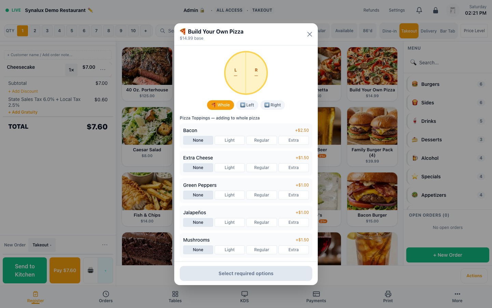

<details>
<summary><strong>Setup</strong></summary>

1. **Modifier sets** — create sets in **Settings > Menu Builder > Modifier Sets**. Set min/max selections, price deltas, and max quantity per option. Use **Items** on a set to tick every menu item that should offer it, instead of opening each item one at a time
2. **Shared modifiers** — the **Modifiers** tab is your venue's list of modifiers, each one defined once and reused. "Ranch" is a single modifier that can belong to several sets and carry a different price in each, so renaming it or 86'ing it takes effect everywhere at once. Open a set and choose **Edit** to pick modifiers for it from that shared list, set each one's price for this set, and drag them into the order staff will see
3. **Pizza builder** — set a modifier group's display mode to "🍕 Pizza Builder" in the menu builder. This triggers the visual half/half UI instead of checkboxes
4. **Placement** — customers choose Whole, Left Half, or Right Half for each topping. Half placement = 50% of the topping price
5. **Intensity** — None (not selected), Light (75% price), Regular (100%), Extra (150% price)
6. **3PD compatibility** — pizza toppings sync to DoorDash/UberEats as standard modifiers (placement/intensity are stripped since 3PD doesn't support halves). This is logged as an incompatibility
7. **AI chat** — "Make me a half pepperoni half mushroom pizza" works without the visual builder. The AI maps to the correct modifiers and prices
8. **Special requests on touch terminals** — tap the Special Request field to focus it and request the terminal's native touch keyboard. The same POS-wide bridge covers eligible text inputs and text areas; a hardware keyboard still works, and fields explicitly marked to opt out do not force the on-screen keyboard

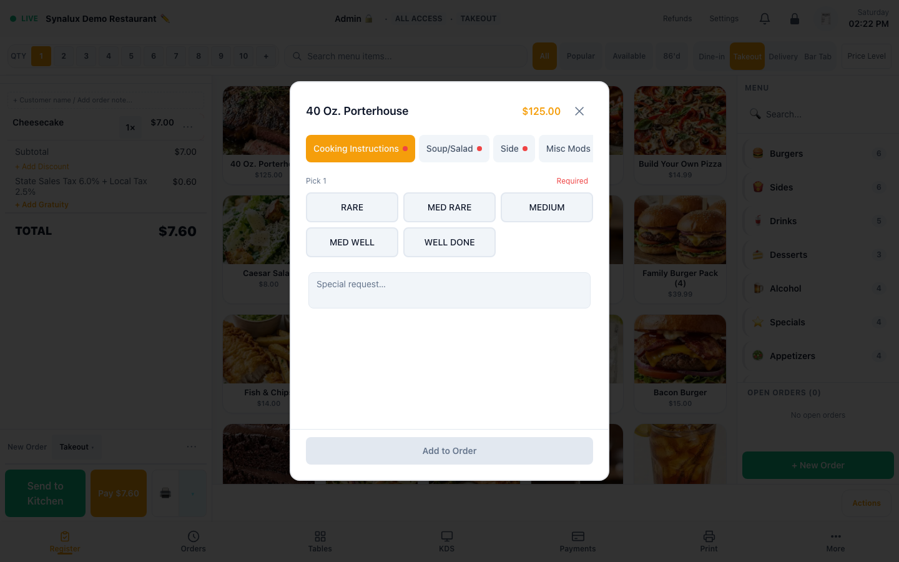

</details>

---

### Customer Display

Second screen facing the customer with live order, running total, and idle promos.

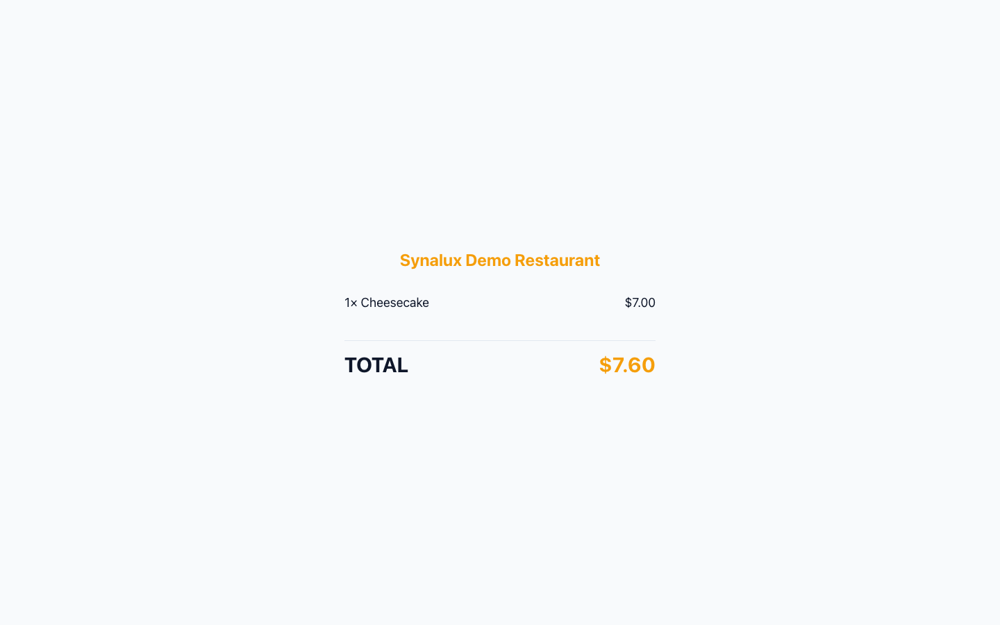

<details>
<summary><strong>Setup</strong></summary>

1. Open `/pos/display` on a second iPad or monitor facing the customer
2. The display auto-syncs with the active register order in real time
3. Configure idle promo images in **Settings > Venue**

</details>

---

### Reports

Sales, PMIX, category sales, per-tax/jurisdiction, menu engineering, speed of service, server leaderboard, payments, voids, and comps. CSV export on every report.

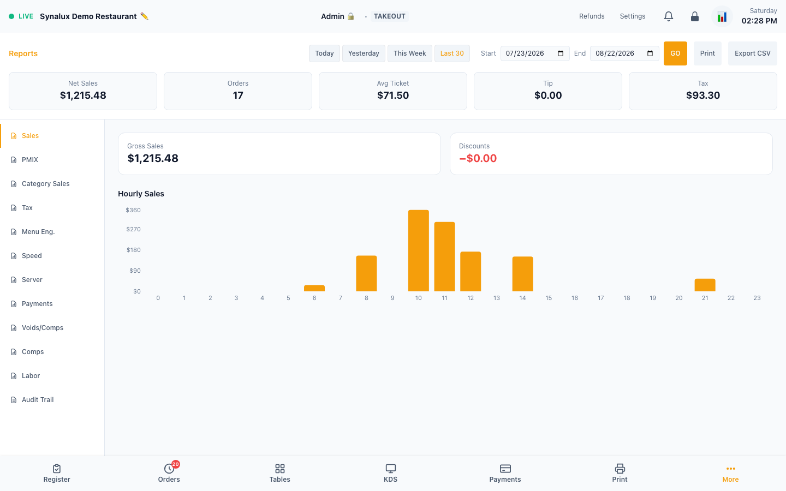

<details>
<summary><strong>Setup</strong></summary>

1. Access from the **Reports** page — all reports are auto-generated from order data
2. **Sales** — hourly heatmap, daily/weekly/monthly totals
3. **PMIX** — product mix by category, item, and modifier
4. **Category sales** — sales rolled up by menu category (major group), with each category's share of net sales
5. **Tax** — a per-jurisdiction breakdown (taxable sales + tax collected per tax zone) that reconciles against the recorded tax
6. **Comps** — comped items itemized, broken down by (configurable) comp reason, with totals and CSV
7. **Menu engineering** — Star/Dog/Puzzle/Workhorse quadrant analysis
8. **Speed of service** — per-station ticket times at `/pos/reports/speed`
9. **Server leaderboard** — staff performance ranking at `/pos/reports/leaderboard`
10. **Audit** — actor, action, entity, timestamp, and details at `/pos/reports/audit`
11. **Labor** — hours, break minutes, overtime, and meal-penalty premium folded into gross pay
12. **CSV export** — every report has a one-click CSV download

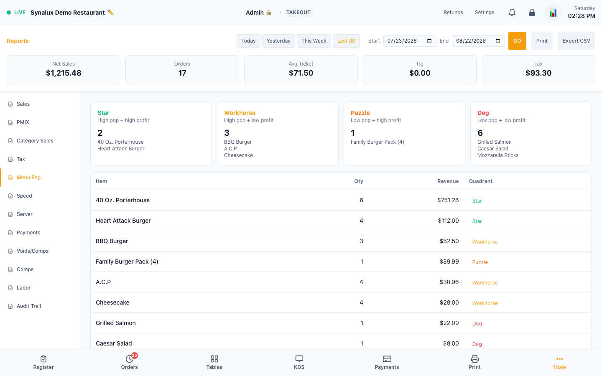
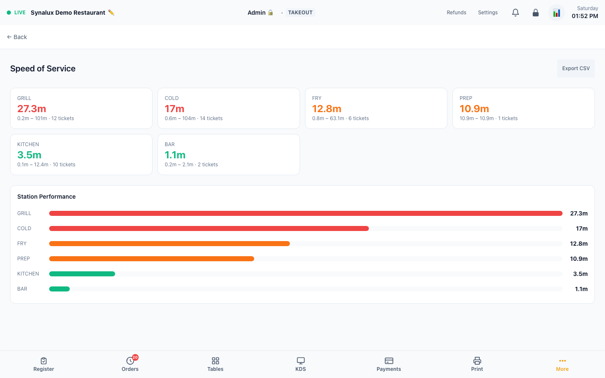
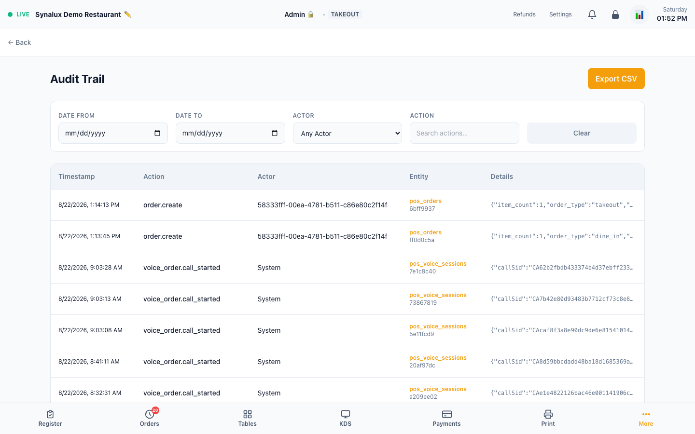


</details>

---

<a name="inventory--recipe-costing"></a>

### Inventory & Recipe Costing

Stock tracking with protected deductions, low-stock alerts, vendor management, recipe builder with ingredient cost + profit margin %, plus reorder suggestions and purchase orders with receiving.

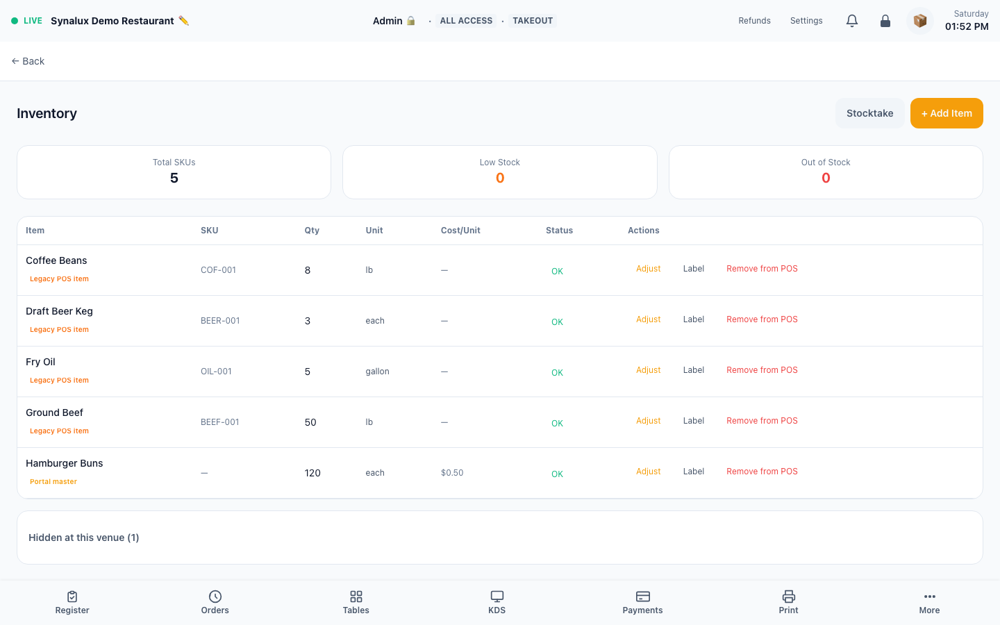

<details>
<summary><strong>Setup</strong></summary>

1. Add inventory items with SKU, qty, unit, cost per unit, and **low stock threshold** (the reorder point)
2. Link **recipes** to menu items — ingredient cost + margin % auto-calculates
3. On order completion, inventory **auto-deducts** per recipe and safely retries if another stock update happened at the same time
4. **Stock count** with audit trail — records who counted, old vs new quantity
5. Low-stock items trigger **real-time alerts** at shift clock-in
6. **Reorder suggestions** — items at or below their reorder point are surfaced with a suggested order quantity (up to par) and estimated cost, grouped by vendor
7. **Purchase orders** — raise a PO to a supplier straight from the suggestions (one PO per vendor); **receive** it to add the ordered quantities back into stock. Receiving is idempotent so a PO can't be received twice

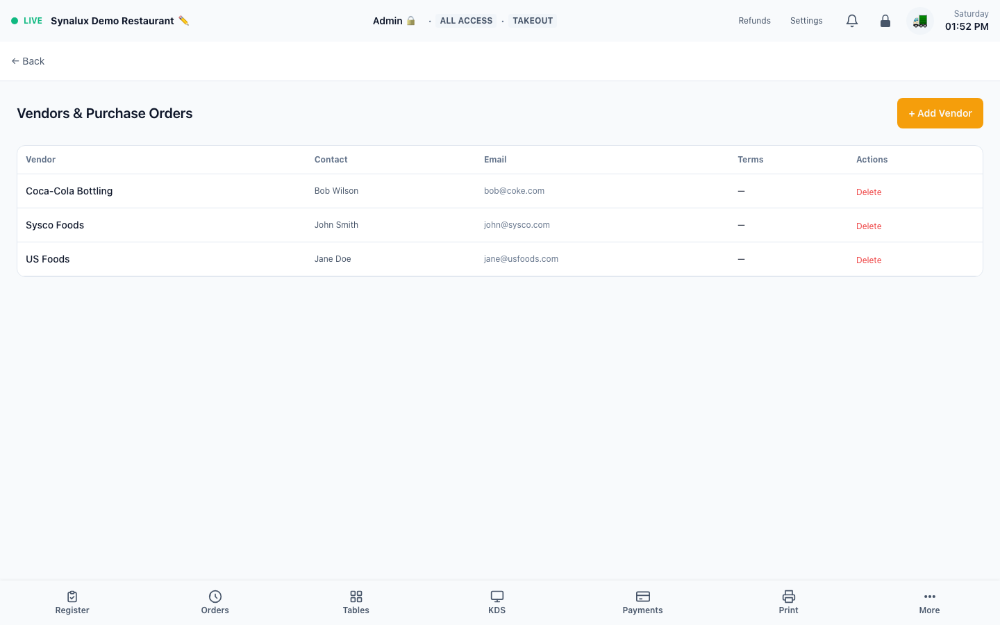

The current demo includes a populated recipe and food-cost example:

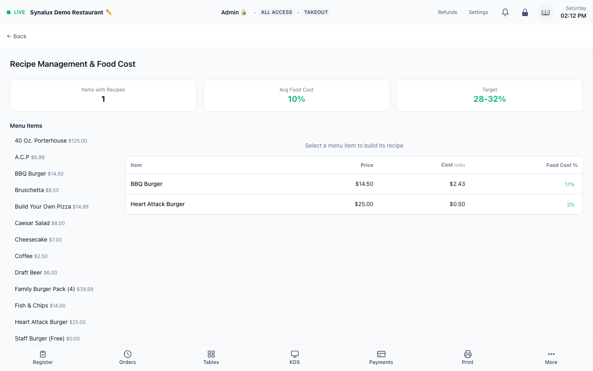

</details>

---

<a name="gift-cards--loyalty"></a>

### Gift Cards & Loyalty

Issue gift cards ($25–$250) with auto-numbering and multi-location redemption. Loyalty with points, auto-tier, referrals, and **automatic award coupon generation** when customers cross point thresholds.

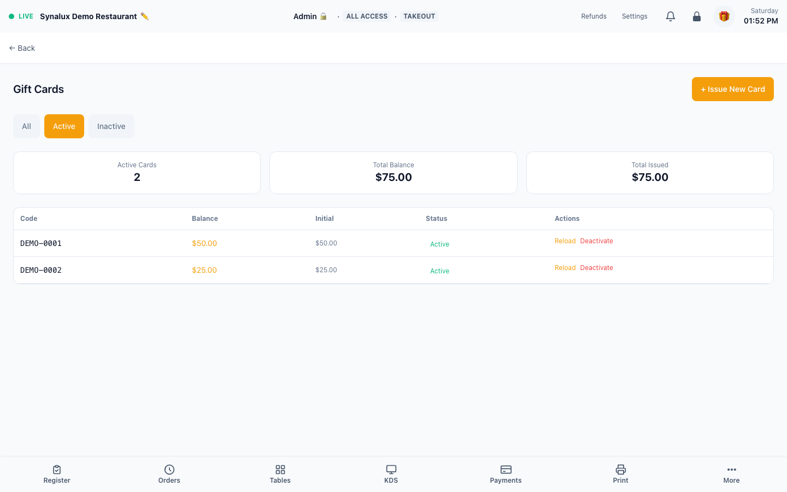

<details>
<summary><strong>Setup</strong></summary>

1. **Gift cards** — issue from the Gift Cards page. Auto-numbered. Customers redeem at payment
2. **Multi-location** — enable cross-location redemption for the venue group during onboarding, then test issue and redemption at each participating location
3. **Loyalty** — enable in **Settings > Loyalty**. Customers earn points per dollar spent
4. Auto-tier upgrades: Bronze → Silver → Gold based on cumulative spend
5. **Award auto-generation** — configure point thresholds in venue features. When a customer crosses a threshold, one single-use coupon is issued with the configured discount value
6. Referral rewards: existing customers share a link, both get bonus points

The current demo has no enrolled loyalty members, so the screenshot shows the real enrollment and retention controls without implying live member activity:

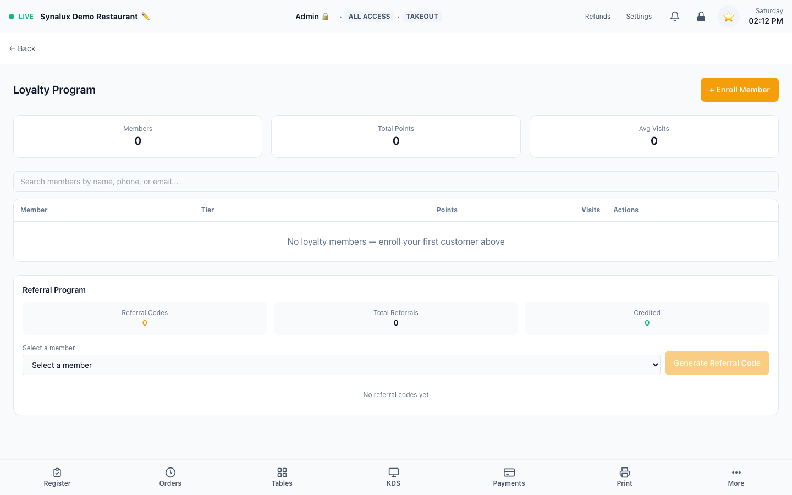

</details>

---

### House Accounts

House Accounts is the customer A/R workspace for companies, schools, municipalities, regular guests, and other customers that buy now and settle later. It includes credit limits, an immutable activity ledger, customer deposits, statements, delivery history, public balance access, and payment collection.


<p>
  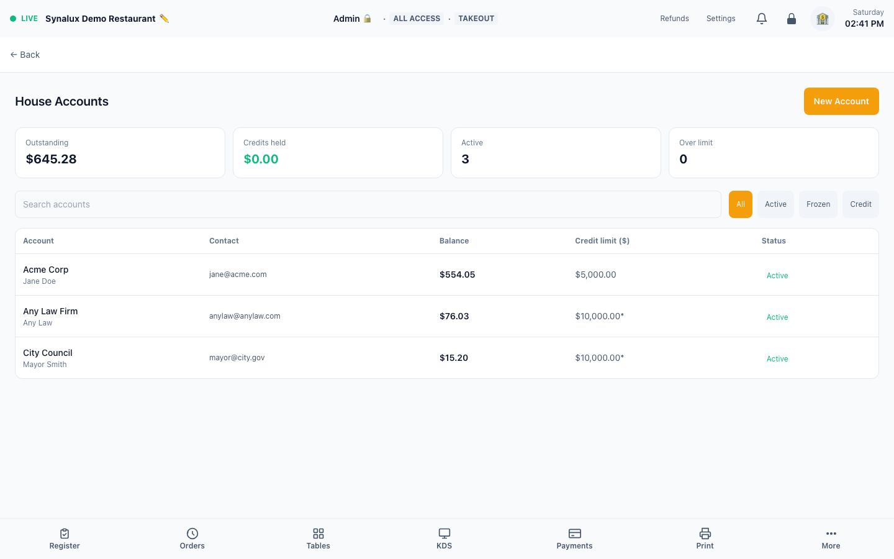
  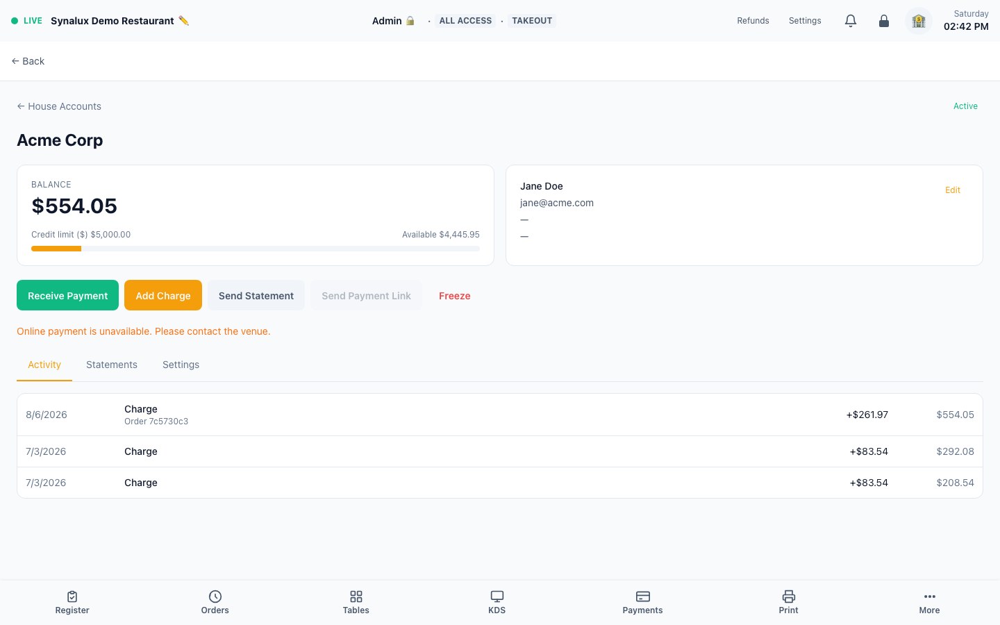
</p>

<details open>
<summary><strong>Manager setup</strong></summary>

1. Confirm the venue has an active **Enterprise** subscription or trial.
2. Open **House Accounts** from the POS navigation and select **New Account**.
3. Enter the account name. Add a contact name, email, mobile number, and billing address when statements or payment links will be delivered.
4. Set the credit limit if your role permits financial overrides. Otherwise the venue default applies.
5. Open the account, select **Settings**, and optionally configure:
   - statement frequency: **7, 14, or 30 days**
   - next statement date
   - email and/or SMS automatic delivery
   - an automatic discount
6. Use **Freeze** instead of deleting an account. Frozen accounts keep their complete ledger and statement history and cannot accept new charges or payments until reactivated.

Managers and supervisors can manage accounts. Credit-limit changes require the same elevated permission used for payment refunds.

</details>

<details>
<summary><strong>Charge an account</strong></summary>

- **From a sale:** on the payment screen choose **House Account**, select the customer, review available credit, and confirm. The POS blocks charges that exceed the account limit.
- **Standalone charge:** open the account and select **Add Charge** for activity that is not tied to a POS order. Enter the amount and a useful note.
- **Automatic discount:** when configured in the account Settings tab, the discount is applied to eligible orders before the charge reaches the account.

Order-backed charges are posted to the general ledger by the normal end-of-day journal. Standalone account activity posts immediately, so the same receivable is never posted twice.

</details>

<details>
<summary><strong>Receive a payment or customer deposit</strong></summary>

Open the account and select **Receive Payment**, then choose the tender that was actually used:

| Tender | Workflow |
|---|---|
| **Cash** | An open cash drawer is required. The collection is included in drawer reconciliation. |
| **Check** | Record the payment and put the check number in the note. It does not change cash-drawer totals. |
| **Card terminal** | Complete the payment on the venue's configured Stripe or Dejavoo terminal first. Then record it against the account and enter the processor transaction or receipt reference. The configured processor is linked to the ledger entry automatically. |
| **Other** | Use for a verified external payment method and describe the source/reference in the note. |

If the payment exceeds the current amount due, the POS shows the resulting credit and requires confirmation before holding it as a **customer deposit**. Credits are available for future charges and are shown separately from A/R.


</details>

<details>
<summary><strong>Create and send statements</strong></summary>

1. Open the account and select **Statements**.
2. Choose the period end. The period start is derived from the canonical ledger or the preceding statement so activity cannot be skipped.
3. Select **Generate**, then **View**, **Print**, or **Send**.
4. Email and SMS attempts appear in delivery history. A failed channel is visible on both the account list and account detail page.
5. To correct a statement, select **Void**, enter a reason, and optionally regenerate the same period. Issued history is never deleted.

Automatic statements run daily and process accounts whose configured next-send date is due. The scheduled job skips empty periods and advances the next statement date safely.

The public demo currently has no issued statements, so the current screenshot shows the real period selector and an intentional empty statement history rather than a fabricated statement.

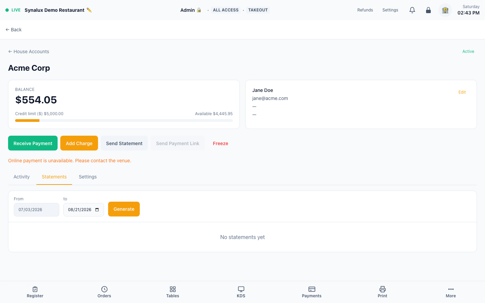

</details>

<details>
<summary><strong>Customer balance and hosted payment links</strong></summary>

Every account can provide a secure customer page with the current balance and statement history. Replace the public access link from the account Settings tab if it was shared with the wrong recipient. The production demo currently reports online payment as unavailable, so the screenshots below document the account controls without implying that hosted payment is connected.

- **Stripe:** hosted balance-payment links are available after hosted House Account payments have been enabled and verified for the venue. Only one active fixed-amount link is allowed, it expires after 24 hours, and a balance change invalidates the old link.
- **Dejavoo:** terminal payments can be recorded against the account. Hosted House Account checkout is shown only when that processor workflow is available and verified for the venue.

<p>
  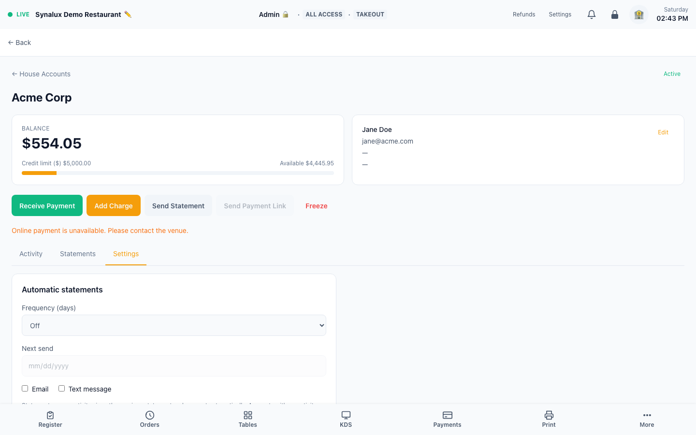
  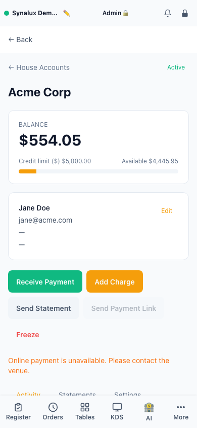
</p>

</details>

#### Accounting behavior

House Accounts uses debit/credit control accounts rather than a second, isolated accounting system:

- a positive amount owed is **House Accounts Receivable**
- an overpayment or prepaid credit is **Customer Deposits**
- standalone charges and collections post immediately
- order-backed charges remain part of the existing end-of-day sales journal
- payments reduce A/R first; any excess credits Customer Deposits
- later charges consume Customer Deposits before increasing A/R

The posting path is idempotent and failed accounting posts are retained for retry instead of silently dropping the subledger event.

---

### Discount Engine

Auto-apply discounts, group discounts ("every 4th pizza free"), stacking rules, purchase minimums, and usage limits — all enforced by the POS.


<details>
<summary><strong>Setup</strong></summary>

1. **Auto-apply** — toggle on any discount. Applied automatically when conditions met (no coupon code needed)
2. **Group discounts** — choose the qualifying item count (for example, every fourth item) and whether the reward is free or percentage-off. The discount applies to the lowest-priced qualifying item
3. **Stacking** — enable **Exclusive** to prevent combining with other discounts
4. **Purchase minimum** — enter the minimum subtotal required before the discount applies
5. **Max uses** — set a usage limit for a promotion. The POS prevents redemption beyond that limit
6. **Modifier targeting** — require specific modifier selections (e.g., "large pizza with exactly 2 toppings")
7. **Revenue Center restrictions** — limit discounts to specific RCs
8. **Target price** — set a specific final price for promotional items
9. **Coupon codes** — add a code to keep the discount out of the open discount list; the cashier applies it by typing or **scanning the code** in the Register's coupon field. Invalid, expired, and not-yet-active codes are rejected with inline feedback

| Type | Example | How it works |
|------|---------|-------------|
| Percent | 10% off | Choose **Percent** and enter **10%** |
| Amount | $5 off | Choose **Amount** and enter **$5.00** |
| BOGO | Buy one, get one | Configure the qualifying quantity and free-item reward |
| Target price | Item for $5 | Choose **Target price** and enter $5.00 |
| Group | Every fourth item free | Choose every fourth qualifying item and the free-item reward |

</details>

---

### Real-Time Alerts

Automated alerts for low stock, overtime, and order delays. Auto-scan at every shift clock-in. Role-filtered — managers see everything, servers see their own.


<details>
<summary><strong>Setup</strong></summary>

1. **Low stock** — set **Low Stock Threshold** on inventory items. The POS warns at the threshold and marks zero stock as critical
2. **Overtime** — warning at 8 hours on clock, critical at 10 hours
3. **Order delay** — warning at 25 minutes ticket age, critical at 40 minutes
4. Alerts auto-scan at every **staff clock-in** — no manual trigger needed
5. **Duplicate protection** — the same condition generates only one unread alert
6. View alerts in the Reports dashboard (60-second auto-refresh)

</details>

---

### Compliance

Age verification, RBS cert tracking, tax-exempt orders, per-item taxability, CCPA/GDPR, and full audit trail.

The current Compliance page renders successfully and exposes alcohol, privacy, certificate, and incident controls in one workspace.

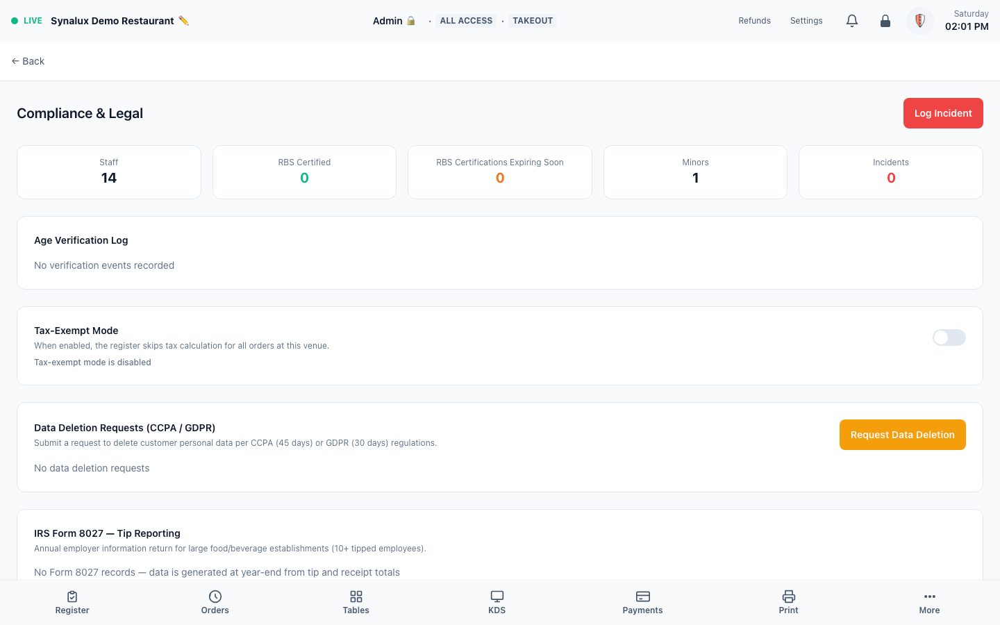

<details>
<summary><strong>Tax Configuration</strong></summary>

**Order-level tax exempt** — toggle an entire order as non-taxable from the order panel.

**Per-item taxability** — each menu item has an **Item Type** (Food, Alcohol, Beverage, Merchandise). Tax zones define which item types they apply to. Set an item's type to one not included in any active tax zone and it is effectively non-taxable. Configure item types in **Settings > Menu Builder** and tax zones in **Settings > Tax**.

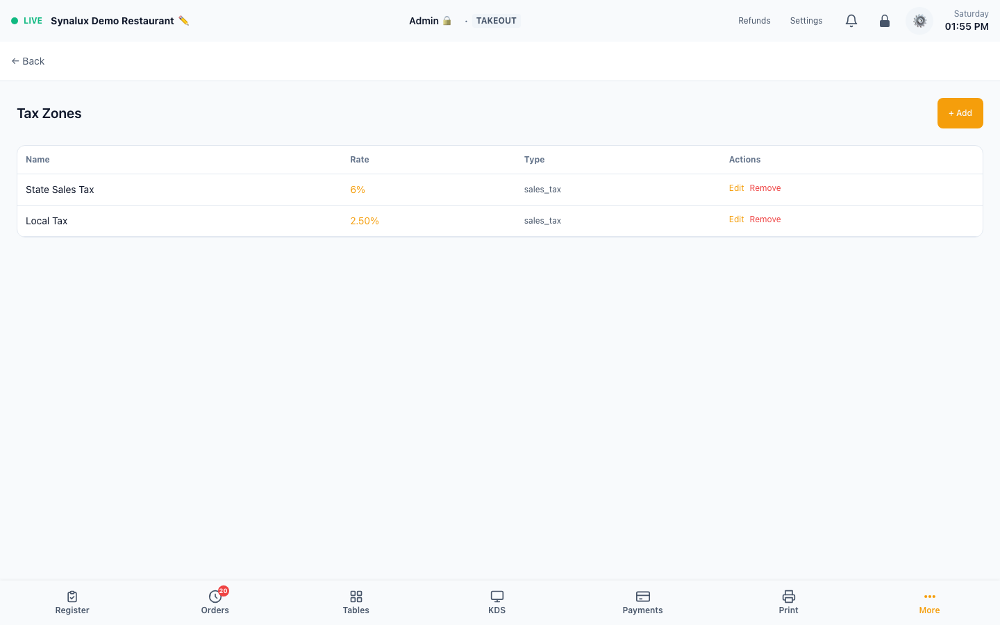


</details>

<details>
<summary><strong>Age Verification & Compliance</strong></summary>

Age checks are enforced for alcohol items; privacy controls cover CCPA/GDPR data requests; and RBS certificates are tracked by staff member. The current Compliance screenshot above is evidence of the management surface, not proof that a particular venue has completed every certificate or external compliance obligation.

</details>

---

### End of Day

Count cash (with optional blind close), distribute tip pool, export GL journal, print Z-Report, close register.

The current demo screenshot shows the End of Day cash-management inputs and Z-report preview. Its zero-value day is an intentional current state, not a completed-close claim.

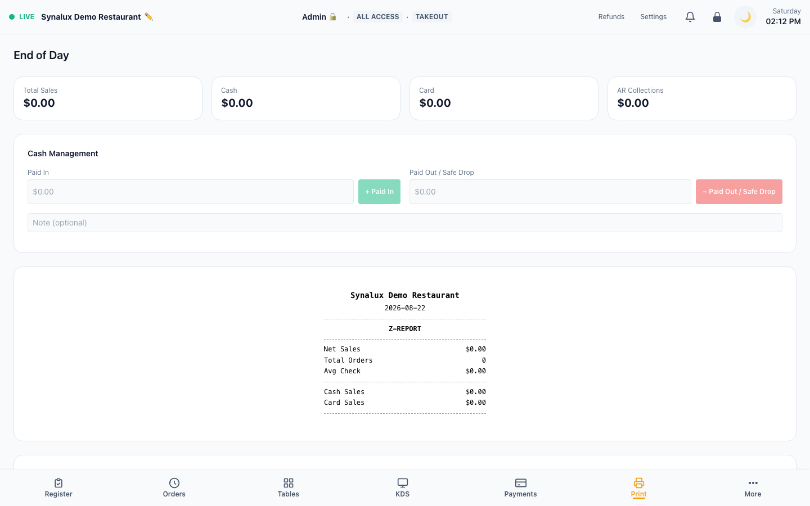

<details>
<summary><strong>Setup</strong></summary>

1. Enter the closing count by denomination — the counted total, expected amount, and over/short are shown as you count
2. **Blind drawer count** — enable **Blind Close** in **Settings > Venue** to hide the expected amount and over/short while counting, so the count is unbiased. A manager can reveal the figures after the count is entered; the variance is still recorded
3. **Tip pool** distribution, **GL journal** export, and **Z-Report** print
4. Closing the register records the over/short for reconciliation

</details>

---

<a name="reservations--waitlist"></a>

### Reservations & Waitlist

Full reservation + waitlist management. Timeline view with party size, table assignment, auto-position waitlist with ETA, and connected reservation partners.

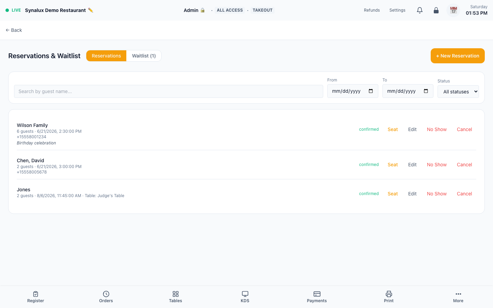

<details>
<summary><strong>Setup</strong></summary>

1. Open the **Reservations** page — toggle between Reservations and Waitlist tabs
2. **Create reservation** — guest name, phone, email, party size, date/time, table assignment
3. **Add to waitlist** — auto-positions with estimated wait time (15 min × position)
4. **Seat** a party — assign a table and record the seating time
5. **Cancel / No-show** — tracked with timestamps for reporting
6. **Reservation partners** — connect Google Reserve, OpenTable, or Yelp in **Settings > Integrations**, then test booking creation, updates, and cancellation
7. Auto-refresh: reservations every 30s, waitlist every 15s

</details>

---

### Catering

Large-order entry with Banquet Event Orders, delivery scheduling, and deposit tracking.

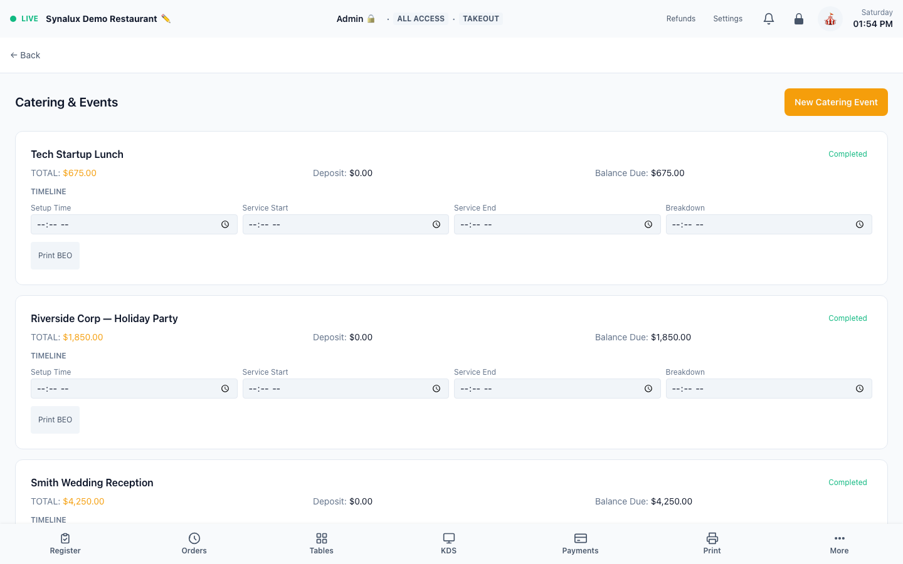

<details>
<summary><strong>Setup</strong></summary>

1. Open the **Catering** page to create catering events
2. Build a Banquet Event Order (BEO) with menu items, headcount, and timeline
3. Set delivery date/time and assign a driver or 3PD provider
4. Track deposits (partial payments) against the event total

</details>

---

### Drive-Thru

Lane management with color-coded timing and auto-advance to the next station.

The production demo currently has no active drive-thru tickets, so this workflow is documented without an empty lane-board screenshot.

<details>
<summary><strong>Setup</strong></summary>

1. Open `/pos/drive-thru` on a dedicated screen per lane
2. Orders flow through stations: Order → Prep → Window
3. Color-coded timing (green < 3 min, yellow < 5 min, red > 5 min)
4. Auto-advance when KDS bumps the ticket

</details>

---

### Handheld Server

Tableside ordering on any iPhone. Same menu, same modifiers, same KDS routing.

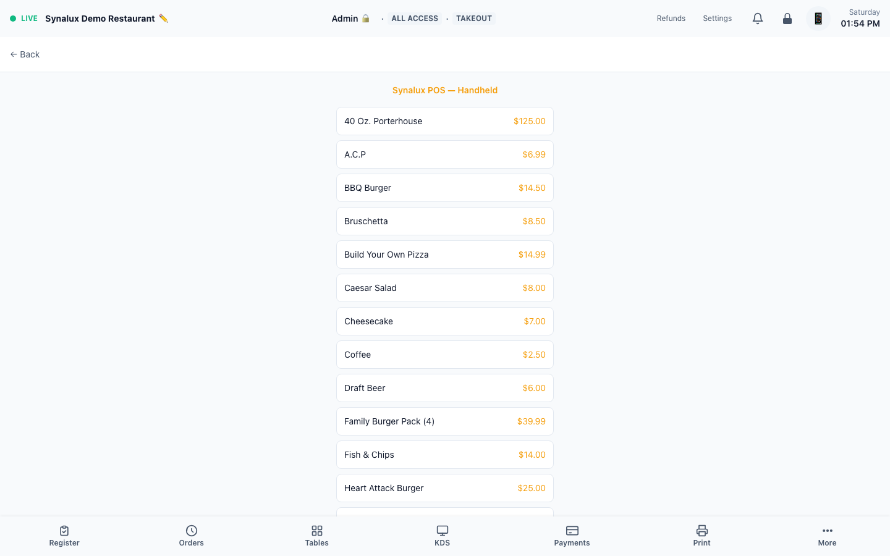

<details>
<summary><strong>Setup</strong></summary>

1. Open `/pos/handheld` on any iPhone or small tablet
2. Server logs in with their PIN — same role-based access as the register
3. Tap a table → add items → send to KDS. Full modifier support including pizza builder

</details>

---

### Refunds

Partial or full refund with reason codes for Stripe and Dejavoo payments. Tip-aware refund ceiling prevents over-refund on tip-adjusted captures. Gift card and house account balances auto-restored on refund.

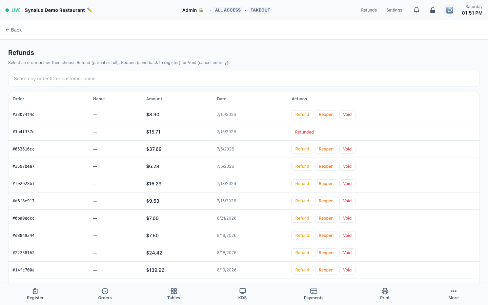

<details>
<summary><strong>Setup</strong></summary>

1. Open the **Refunds** page or tap "Refund" on any completed order
2. Choose partial (specific items) or full refund
3. Select a reason code (wrong item, quality, customer request, etc.)
4. Refund is processed via the venue's payment processor (Stripe or Dejavoo SPIn). Cash refunds are recorded for drawer reconciliation
5. **Reopen check** — managers can reopen a closed order for corrections, then re-close

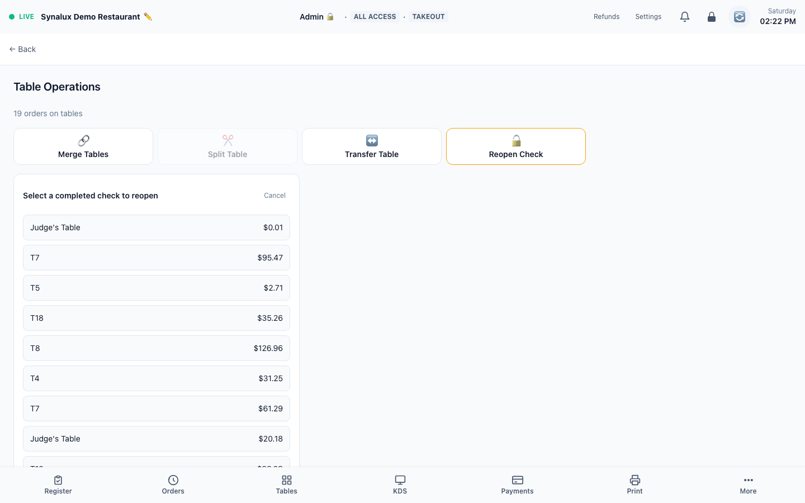

</details>

---

<a name="multi-location--franchise"></a>

### Multi-Location & Franchise

Per-venue KPIs, consolidated P&L, config push, and franchise reporting. Month-to-date comparison across all locations with revenue, COGS, labor, and net profit side-by-side.

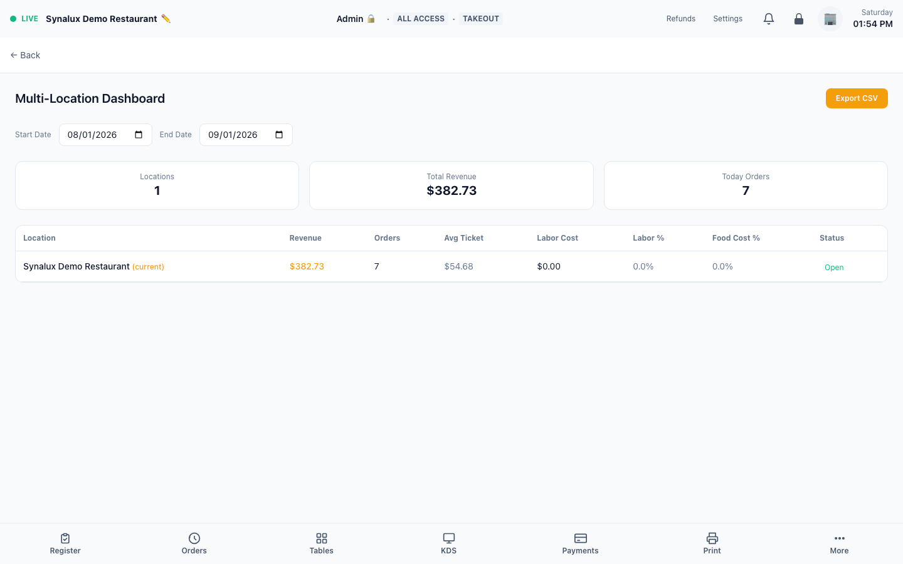

<details>
<summary><strong>Setup</strong></summary>

1. Create additional venues under the same workspace in **Settings > Multi-Location**
2. Push menu, tax, and discount configs from a template venue to all locations
3. View consolidated P&L, sales, and labor reports across all venues
4. Franchise reporting with per-location royalty calculations
5. **Month-to-date comparison** — revenue, COGS, labor, net profit per venue side-by-side
6. **CSV export** — download consolidated P&L for accountant handoff

</details>

---

<a name="accounting--ledger"></a>

### Accounting & Ledger

Journal entries, general ledger, and connected banking are available in the POS accounting workspace. End-of-day activity is recorded in Synalux accounting; a connected QuickBooks or Xero card is not by itself proof that an external journal export completed.

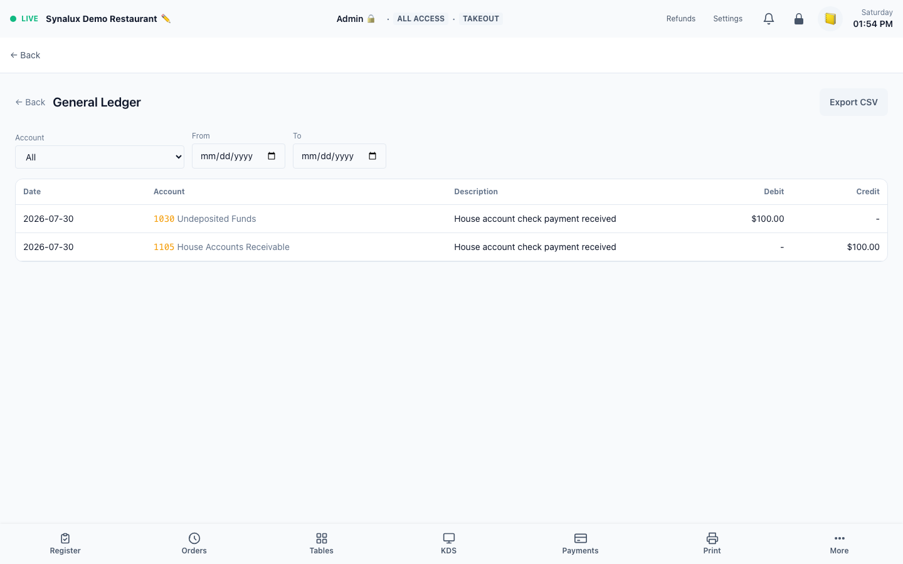

<details>
<summary><strong>Setup</strong></summary>

1. Open `/pos/accounting` for the main accounting dashboard
2. `/pos/accounting/ledger` for journal entries and GL
3. `/pos/accounting/banking` for bank feed integration
4. Connect QuickBooks or Xero in **Settings > Integrations** when the venue uses that provider, then run an end-to-end export and reconciliation test before relying on it for close. A connected status alone does not prove that an external end-of-day journal was delivered and reconciled

Banking is documented without a screenshot until a bank connection is present; the disconnected setup state is not used as an example.

</details>

---

<a name="coursing--course-firing"></a>

### Coursing & Course Firing

Multi-course meal sequencing with per-item course assignment and fire-on-demand. Assign course numbers to menu items and fire them sequentially from the register.

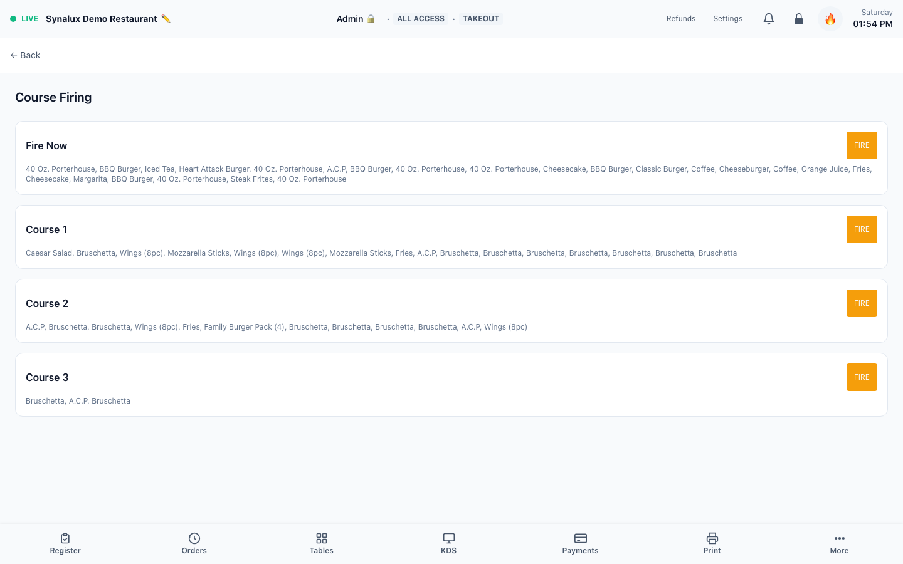

<details>
<summary><strong>Setup</strong></summary>

1. Assign course numbers (1–6) to each item in the order ticket using the Course dropdown
2. Course 0 = fire immediately. Courses 1–6 fire in sequence when the server taps **"Fire Next Course"**
3. KDS shows course badges on each ticket item with color-coded timing
4. Seat assignment works alongside courses — assign items to Seat 1/2/3 and Course 1/2/3 independently
5. Kitchen holds later courses until earlier ones are bumped — perfect for appetizer → entree → dessert flow

</details>

---

### Order Throttling

Rate-limit incoming online orders during peak times to prevent kitchen overwhelm.

The production demo currently has no queued throttled orders, so the zero-queue state is not shown as a product screenshot.

<details>
<summary><strong>Setup</strong></summary>

1. Configure throttle limits in **Settings > Online Ordering**
2. Set max orders per 15-minute window
3. When the limit is reached, new customers see "We're busy — try again in a few minutes"

</details>

---

<a name="hr--timesheets"></a>

### HR & Timesheets

Leave management, timesheet review, payroll draft with FLSA overtime split, and per-server KPIs. Pulls directly from clock-in/out data — all staff appear automatically including PIN-only staff.

HR, timesheet, and payroll pages are documented without demo screenshots until the selected pay period contains populated shift and payroll records.

<details>
<summary><strong>Setup</strong></summary>

1. Open `/pos/hr` for the HR command center
2. **Timesheets tab** — clock-in/clock-out data grouped by staff member for the selected week. Week picker defaults to current Mon–Sun
3. **Payroll Draft tab** — calculates gross pay: regular hours (up to 40h) + overtime (above 40h at 1.5×). Export CSV for Gusto/ADP
4. **KPIs tab** — per-server metrics: sales/hour, avg check, tip %, 7-day sparkline trend
5. Staff submit time-off requests; managers approve/deny
6. **IRS Form 8027** — Settings > Compliance > Form 8027. Auto-calculates gross receipts, charge tips, and 8% allocation for tipped establishments

</details>

---

### Back Office Suite

Common back-office workflows are reachable from the POS shell, so staff do not need to leave the application navigation. Accounting, payroll, forms, messaging, and POS reports use venue-scoped data; mail, documents, calendar, banking, and other provider-backed functions still require the corresponding connected Synalux Back Office account or external provider.

The `/pos/backoffice/*` paths are the canonical routes and keep the back-office sidebar visible. Legacy standalone paths such as `/pos/documents`, `/pos/mail`, `/pos/calendar`, `/pos/dashboards`, `/pos/forms`, and `/pos/payroll` redirect into that shell.

| Module | What it does | Route |
|---|---|---|
| **Accounting & GL** | Double-entry ledger, journal entries, P&L, balance sheet. EOD auto-posts to GL | `/pos/accounting` |
| **Bank Feed** | View connected banking accounts and transactions through the Synalux Back Office banking connection; current POS proxy routes support the configured Plaid or Mercury workflow | `/pos/accounting/banking` |
| **Payroll** | Pay-period review, payroll drafts, history, and exports | `/pos/backoffice/payroll` |
| **Documents** | Connected cloud file storage, folders, uploads, and sharing | `/pos/backoffice/documents` |
| **Mail** | Connected mailbox, compose/reply, templates, and vendor auto-tagging | `/pos/backoffice/mail` |
| **Calendar** | Connected calendar events, reservations, catering, and staff meetings | `/pos/backoffice/calendar` |
| **Back Office Messaging** | Venue-scoped channels and real-time staff communication | `/pos/backoffice/messaging` |
| **Staff Messages** | Standalone staff messaging workspace outside the back-office shell | `/pos/messages` |
| **AI Assistant** | Context-aware AI with live POS data | `/pos/assistant` |
| **Operational Forms** | 12 ready-to-print/download restaurant forms | `/pos/backoffice/forms` |
| **Custom Form Builder** | Custom templates and searchable submissions with 10 field types | `/pos/form-builder` |
| **Dashboards** | Drag-and-drop widget builder with auto-refresh | `/pos/backoffice/dashboards` |

<details>
<summary><strong>Documents</strong></summary>

Documents uses the portal-connected cloud drive. Connect the appropriate provider/account before expecting files; without that authorization the page presents a connection requirement rather than a local standalone drive.

</details>

<details>
<summary><strong>Mail</strong></summary>

Full inbox for your restaurant — connected to Gmail or Outlook. Compose, reply, templates (vendor orders, catering quotes, EOD summary). Vendor emails auto-tagged with vendor name badge when sender matches your vendor records.

Mail is provider-backed and requires portal authentication plus a connected mailbox. It does not fall back to a separate local inbox.

</details>

<details>
<summary><strong>Calendar</strong></summary>

Connected calendar events, reservations, catering events, staff meetings, and delivery schedules appear in one view. A provider connection is required; the production demo connection prompt is not used as a feature screenshot.

</details>

<details>
<summary><strong>Staff Messaging</strong></summary>

Slack-like internal messaging — no Slack account needed. 6 pre-configured channels:

| Channel | Purpose |
|---|---|
| **All Staff** | Broadcast to everyone |
| **Front of House** | Servers, hosts, bartenders |
| **Back of House** | Kitchen, prep, expo |
| **Managers** | Managers and admin only |
| **Daily Specials** | Push 86'd items, daily features |
| **Lost & Found** | Customer lost items |

Messages update live within venue-scoped channels. The current POS messaging screens are channel-based; this guide does not promise direct-message UI or a fixed delivery-latency SLA.

</details>

<details>
<summary><strong>Dashboards</strong></summary>

Drag-and-drop widget builder with metric cards, charts, and tables. Preset templates for Owner, Manager, and Kitchen views. Auto-refresh every 30 seconds.

The dashboard builder is documented without a screenshot when the venue has no saved dashboard widgets.

</details>

<details>
<summary><strong>Operational Forms vs. Custom Form Builder</strong></summary>

These are separate workflows:

- `/pos/backoffice/forms` contains the 12 built-in restaurant forms. Staff choose a form and print or download a prefilled document; it is not an empty template library.
- `/pos/form-builder` creates custom templates, collects submissions, and provides searchable history. It supports 10 field types: Text, Email, Telephone, Number, Date, Select, Radio, Textarea, Checkbox, and Signature.

Use Operational Forms for standard restaurant paperwork and Custom Form Builder when the venue needs its own form structure.

</details>

---

### Screen Builder

Configure every POS screen from a single settings page — button layout, split modes and limits, tip controls, hold timing, login methods, kiosk lock, receipt format, grid columns, display toggles, item sizing, and responsive presentation. Configuration is stored in named venue layout profiles rather than only in the current browser.

**Navigate to:** Settings > Screen Builder


<details>
<summary><strong>Profiles, persistence, and runtime precedence</strong></summary>

- Create, save, and activate named layout profiles for the venue. The active profile is used by the venue's configured terminals.
- Each screen consumes the active stored layout at runtime; Screen Builder is not a documentation-only preview.
- Register settings inherit in this order: **Venue profile → Revenue Center profile → Station override → Device layout**. The most specific configured value wins and an unset value inherits from the previous layer.
- The final Phone, Landscape, Tablet, or Short-height layer changes responsive presentation fields for that device without bypassing venue rules, staff permissions, or payment authorization.
- Upgrades preserve the historic behavior of two formerly display-only controls: profiles that have never explicitly set them continue to show **Custom Tip** and keep **Receipt Logo** off. The first explicit toggle in Screen Builder activates that control; the authorized Screen Builder receipt action can also activate **Receipt Logo**. After **Save changes**, the saved on/off value is enforced at runtime. This avoids silently changing a live terminal during an upgrade.

</details>

<details>
<summary><strong>12 Configurable Screens</strong></summary>

| Screen | Key Settings |
|--------|-------------|
| **Register** | Mode-specific Persistent / Actions / Hidden buttons, tender and tip behavior, check/menu panel arrangement, item display size, responsive grid, imagery, toolbar, and receipt settings |
| **KDS** | Columns, gap spacing, ticket card size, all-day counts, age alert thresholds, per-station colors |
| **Tables** | Columns, table button size, elapsed timer, revenue display, heat map |
| **Customer Display** | Show modifiers, unit price, font size, idle content (promos/logo/specials/blank), tax breakdown |
| **Menu Board** | Columns, font size, show prices, show images |
| **Drive-Thru** | Columns, card size, vehicle description, elapsed timer, timer warning and danger thresholds |
| **Bar Tabs** | Columns, card size, show total, automatic tab naming |
| **EOD** | Tip pool section, cash denominations, denomination columns |
| **Reports** | Chart height, labor section, end-of-day by terminal, card brand breakdown, receipt preview |
| **Orders** | Which columns appear, summary bar, default tab, page size |
| **Online Ordering** | Grid columns, tile imagery and density, search, assistant placement |
| **Appearance** | Default theme, accent colour, font scale, theme toggle, compact mode, high contrast |

</details>

<details>
<summary><strong>Device layouts — why a setting can look different on the floor</strong></summary>

Each screen has a **Base** layout plus four optional responsive variants: **Phone**, **Landscape**, **Tablet**, and **Short height**. A terminal automatically uses whichever one matches its screen size, falling back to Base when you have not customised that size.

This is what lets a phone use a compact grid while a wide terminal shows more columns, without maintaining two separate menus. Column count is configured per layout and is not hardcoded to one value for every phone, tablet, or desktop. Device layouts change presentation only — never payments, permissions, or any operational rule.

That presentation-only restriction applies to the responsive variants, not the Base layout profile. Base and profile configuration also contains operational controls such as maximum tip percentage, allowed/default split modes, hold auto-send timing, receipt content, login-method visibility, and kiosk auto-lock.

**Short height** is worth knowing about: it is chosen by window *height*, not width. A laptop browser window with tabs and a bookmarks bar can be short enough to qualify even though it is very wide, so it can pick up the Short height layout rather than Base.

Because of that, the layout you are editing is not always the layout in front of you. The device tab that matches your current screen is marked **THIS DEVICE**, and if you are editing a different one, a note appears telling you which layout your screen is actually rendering, with a one-tap button to jump to it. If you change a setting and the screen does not change, check that banner first — you are almost certainly editing a different device size.

</details>

<details>
<summary><strong>Register Layout Builder</strong></summary>

Register settings are divided into three tabs so the editor does not crowd unrelated controls together:

- **Actions** — configure each ordering mode independently: Dine-in, Bar Tab, Quick Service, Takeout, and Delivery
- **Payments** — configure tender-specific tip prompts, excess-payment allocation, additional tip after gratuity, receipt tip behavior, suggested percentages, Custom Tip, and the maximum tip percentage
- **Layout** — configure the category rail, quantity selector, search and order-type controls, check/menu panel arrangement, item sizing, images, grid density, receipts, login choices, splits, holds, and notifications

Every configurable Register action belongs to exactly one placement for each service mode:

- **Persistent** — visible on the primary register surface for frequent or time-critical work
- **Actions** — reachable from the Actions menu without consuming the primary row
- **Hidden** — omitted for that mode

The default is a dense hybrid, not a hardcoded workflow. These are the starting recommendations:

| Service mode | Persistent by default | Actions menu by default |
|---|---|---|
| **Dine-in** | Send to Kitchen, Pay, Split | Refire, Transfer, Merge, Move, Hold, Discount, Payments, Print Check, QR Pay, No Sale, Void Order |
| **Bar Tab** | Send to Kitchen, Pay, Hold, Split | Refire, Transfer, Merge, Move, Discount, Payments, Print Check, QR Pay, No Sale, Void Order |
| **Quick Service** | Quick Cash, Quick Card, Send to Kitchen, Pay | Refire, Split, Hold, Discount, Payments, Print Check, QR Pay, No Sale, Void Order, Transfer, Merge, Move |
| **Takeout** | Send to Kitchen, Pay, Print Check | Refire, Split, Hold, Discount, Payments, QR Pay, No Sale, Void Order, Transfer, Merge, Move |
| **Delivery** | Send to Kitchen, Pay, Print Check | Refire, Hold, Discount, Payments, QR Pay, Void Order, Split, Transfer, Merge, Move, No Sale |

Scan, Open Price, Weight, and any other action can also be moved between placements when that service model needs it. Reorder actions by dragging or with the move controls, choose Small/Medium/Large, edit the default button name, and add a translated name for any supported POS locale. Empty custom names fall back to the built-in translated label.

Role locks remain visible so staff can discover the action, but Screen Builder never grants authority: RBAC and manager-override rules are still enforced when the action is used. The editor also preserves a usable service path: **Send to Kitchen** and **Pay** cannot be hidden, and at least one payment action must remain reachable through Persistent or Actions.

Venues may keep the expanded dense layout, adopt the hybrid defaults, or streamline individual modes. Moving a button to Actions changes discoverability, not its underlying capability or permission requirement.

**Check Panel Width:**

| Setting | Width on a large screen | Best for |
|---------|------------------------|----------|
| **Narrow** | ~340px | Maximum menu grid space |
| **Standard** | ~420px | Balanced — recommended |
| **Wide** | ~480px | Check-centric workflow, large item names |

All three narrow to around 300px on smaller screens so the menu grid stays usable — the setting controls how much room the check takes once there is room to give.

**Item Display Size:**

| Setting | Text size | Best for |
|---------|-----------|----------|
| **Compact** | Small (14px) | High item count, experienced staff |
| **Comfortable** | Medium (16px) | General use — recommended |
| **Spacious** | Large (18px) | Readability, accessibility, training |

**Operational controls that are easy to miss:**

- **Login Methods** — show or hide PIN, swipe-card, and QR login choices on the shared-terminal gate
- **Split Check** — enable Even, By Seat, By Item, and By Amount; choose the default tab; set 2–20 maximum splits; use the full-screen split board; allow fractional item splits; and show shared-item badges
- **Tip** — edit the suggested percentages, show or hide Custom Tip, and set the 10–50% maximum tip limit used for card authorization and checkout validation
- **Hold** — edit hold-time presets, show future date/time, show the hold badge, and choose whether held checks auto-send when due
- **Notifications** — show order-ready, table, stock, and clock events; enable sound; and cap the retained notification list

</details>

<details>
<summary><strong>Receipt & Bill</strong></summary>

Configure receipt output from **Settings > Screen Builder > Register > Receipt & Bill**.

**Paper Width** — controls thermal column count, PDF page width, and browser print max-width simultaneously:

| Width | Thermal cols | PDF width | Common hardware |
|-------|:---:|:---:|-----------------|
| **80mm** (default) | 42 | 80mm | Epson TM-T88, Star TSP143/TSP654, most desktop receipt printers |
| **58mm** | 30 | 58mm | Mobile printers (Star SM-S, Epson TM-P), small café countertops |
| **76mm** | 40 | 76mm | Impact/dot-matrix kitchen printers (Star SP700), wide legacy units |

80mm is the most common. Choose 58mm for mobile/handheld setups. 76mm is typically only used with older impact printers.

Toggle 14 receipt sections on/off:

| Section | Default |
|---------|:-------:|
| Header (venue name) | On |
| Address | On |
| Logo | Off |
| Items | On |
| Modifiers | On |
| Qty & unit price | On |
| Tax breakdown | On |
| Suggested gratuity | On |
| Tip line | On |
| Signature line | On |
| QR code | On |
| Barcode | Off |
| CC details | On |
| Footer message | On |

The **Logo** switch applies to all three receipt surfaces: the on-screen/browser receipt, generated PDF, and thermal ESC/POS output (a monochrome raster is used for thermal printers). When QR is enabled, choose **Tip link**, **Order details**, **Feedback**, or **Custom URL**. When Barcode is enabled, choose **Order ID**, **Order Number**, or **Payment ID**. The footer text is editable independently of the footer on/off switch.

</details>

---

### QR Code Login

Staff can scan a QR badge to log in — no PIN needed. Badges are secure, venue-scoped, and revocable per employee. Print badges from **Settings > Staff Management** and assign them to staff members. Lost badges can be revoked instantly without affecting other credentials.


---

### Hold/Send Kitchen Timing

Set a hold timer (5-60 minutes) on an order before sending to kitchen. Kitchen tickets auto-fire when the timer expires even if the Register page is no longer open. Servers use this for appetizer-first timing, bar-tab food holds, or coordinating with a reservation arrival.

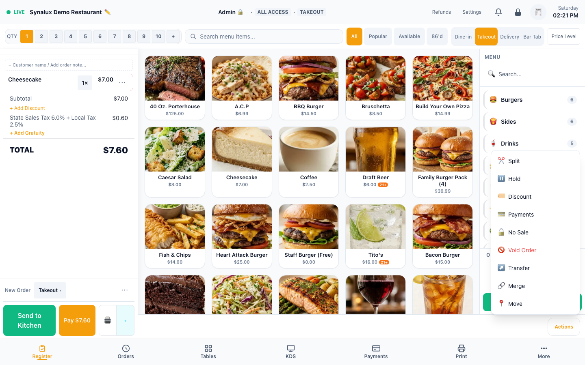

---

### Split Check with Fractional Splits

Split a single item across multiple checks (1/2, 1/3, 1/4). Share badges show which items are shared across guests. Penny-conserving math ensures totals always balance — remainder cents go to the first split. Works alongside seat management and coursing.


---

### Notification Bell

Real-time alerts for new online orders, order-ready bumps, table timer alerts, and low stock warnings. Configurable per notification type with sound alerts. Bell icon in the top bar shows unread count — tap to expand the notification drawer without leaving the current screen.

---

### Bar Tab Name Capture

When a card is swiped for a bar tab, the cardholder name is automatically captured and used as the tab name. No manual typing needed. Configure automatic naming and the as-returned, Last/First, or First Last format in **Settings > Screen Builder > Bar Tabs**.


---

### Training Mode

Isolated sandbox. Orders excluded from reports. Staff can practice without affecting live data.

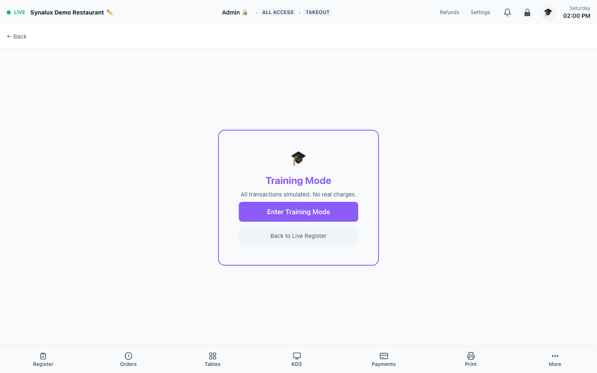

<details>
<summary><strong>Setup</strong></summary>

1. Enable training mode in **Settings > Venue** — toggle "Training Mode"
2. All orders created while training mode is active are tagged `[TRAINING]`
3. Training orders are excluded from sales reports, EOD, and payroll calculations
4. Disable training mode when done — real orders resume immediately

</details>

---

### Offline Mode (PWA)

Synalux POS is a Progressive Web App (PWA) with an offline queue. After the app shell and menu have been loaded and cached on a terminal, staff can continue building orders, accepting cash, and using supported cached workflows during a network interruption. Queued work syncs after connectivity returns. Every venue should rehearse its offline workflow before go-live because card behavior, cached data, browser storage, and connected peripherals depend on the configured terminal and processor.

When the network goes down, a warning banner and red **"Offline"** badge appear at the top of the screen. The current demo explicitly directs staff to cash because Store & Forward is not enabled there. When the connection returns, queued orders and supported payments begin syncing; staff can open the badge to review queue state and any failures.

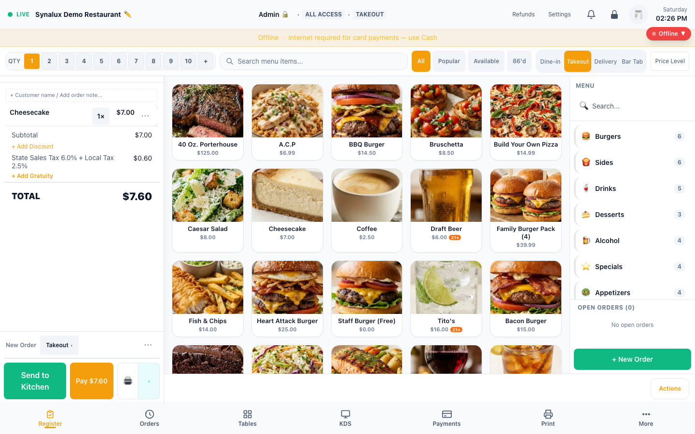

**What works offline:**

| Capability | How it works |
|---|---|
| **Orders** | Queued on the terminal and submitted once connectivity returns |
| **Cash payments** | Recorded locally with the order and synced when network returns |
| **Menu browsing** | A recently loaded menu remains available for up to 24 hours so staff can ring items without network |
| **Reports** | Recently loaded order and payment data is cached for four hours. Sales totals and payment mix can use that cache; reports that require uncached item, labor, or provider data still need a connection |
| **PDF receipts** | Generated in the browser when the receipt/PDF code and order data were already loaded on that terminal |
| **Screen availability** | Recently opened Register, KDS, Tables, and EOD screens may reopen offline. Live data and uncached screens still require a connection |

**What requires network or an explicitly enabled fallback:**

| Capability | Offline behavior |
|---|---|
| **Card payments** | By default, the Register requires internet and directs staff to cash. A venue may enable Store & Forward only after reviewing processor support, per-transaction/queue limits, staff permissions, and chargeback risk; eligible offline card attempts then enter the review/sweep workflow |
| **Bar tab pre-authorization** | Requires the processor connection; do not treat a locally queued order as an active card hold |
| **Staff clock in/out** | Requires a network connection; shift punches are not part of the offline order/payment queue |
| **New split-check persistence** | Requires a connection. Do not start a new split while the order still exists only as an unresolved offline order |
| **End-of-day totals** | Requires current synchronized data. A previously opened EOD screen may appear, but an uncached or stale summary is not a safe closing figure |
| **Real-time KDS updates** | Live updates pause while disconnected. Confirm the kitchen display is current after connectivity returns |
| **Receipt email / SMS** | Requires an active connection and configured delivery service. A PDF receipt may still be available when its screen and order were already loaded |

#### Offline safeguards and reconciliation

- Queued orders and supported payments are tracked so reconnect and page reloads do not invite duplicate submission
- Temporary failures retry automatically; rejected or expired work is surfaced to staff instead of disappearing silently
- Multiple open tabs are reconciled against the same order state after reconnect
- If a card result is uncertain, do not repeat the charge manually. Review **Payments > Needs Review** and follow the processor reconciliation workflow
- Queue entries older than 48 hours expire with a staff notification and must be reviewed or re-entered

#### Tender behavior after reconnect

| Tender | Staff-facing behavior |
|--------|-----------------------|
| **Cash** | The payment follows the queued order after reconnect. Offline cash gratuity allocation is unavailable because the complete settlement must be recorded together |
| **Store & Forward card** | Available only for approved processor/device combinations with venue limits enabled. Attempts appear in **Payments > Needs Review** until the processor result is known |
| **Bar tab pre-authorization** | Requires the processor connection; a queued order is not an active card hold |
| **Manual card, gift card, and House Account** | Wait for connectivity and for the order to finish syncing before collecting payment |
| **Split payment** | Reconnect and confirm the order before starting or completing a split |

<details>
<summary><strong>Setup</strong></summary>

1. Open the POS in Chrome or Safari and add to home screen — installs as a PWA automatically
2. When network drops, a red "Offline" badge appears in the top-right corner with queue status
3. Verify that offline orders and cash payments queue locally and reconcile after connectivity returns
4. If the venue has approved Store & Forward, configure its limits and permissions in **Settings > Venue**, then test an eligible processor/device path and the **Payments > Needs Review** workflow. Without that explicit setup, card and bar-tab authorization require internet
5. Test reconnect, duplicate-submit protection, rejected items, and queue-expiry handling on every browser/device type used by the venue

</details>

---

### Integrations

Customer-configurable connection cards currently include Stripe Terminal, DoorDash, Uber Eats, Grubhub, QuickBooks, Xero, Gusto, ADP, OpenTable, Google Reserve, Yelp, Google Calendar, Google Drive, Gmail, Outlook, and Slack. Voice Ordering and WhatsApp use their dedicated setup section. Dejavoo terminal settings are managed with the venue's payment configuration rather than through a generic connection card.

The Settings page is a control surface, not proof that a provider is connected. The current screenshot is included to show where integrations are configured; any disconnected status remains visible and must not be interpreted as end-to-end provider acceptance.


<details>
<summary><strong>Setup</strong></summary>

1. Open **Settings > Integrations** and use the connection flow shown for the provider. Contact Synalux onboarding when a provider requires account approval or assisted activation
2. **Stripe** — connect the venue merchant account and location, pair supported readers, then authorize and refund a real test payment. Tap to Pay additionally requires the supported iPhone app and device
3. **DoorDash / Uber** — connect the venue's provider account, then verify a menu sync, delivery quote, dispatch, status update, and cancellation as applicable
4. **SMS / email delivery** — confirm the approved sender, customer-consent flow, receipt or notification content, and real delivery to an accessible test recipient
5. **QuickBooks / Xero** — connect the venue account, then verify an external export and reconciliation before relying on the integration for close

</details>

---

### Operational Forms

Cash Count, Void Auth, Tax-Exempt Cert, Catering BEO, Tip Declaration, Inventory Count, Time-Off, Purchase Order, Incident Log, Daily Specials, Prep List, Server Checkout.

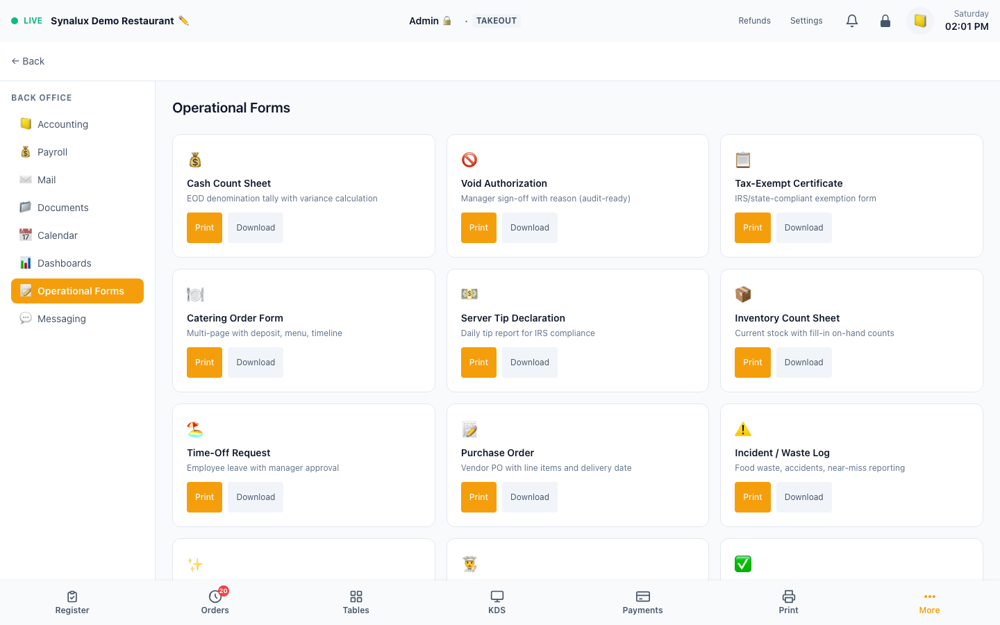

<details>
<summary><strong>Setup</strong></summary>

1. Open `/pos/backoffice/forms` to access all 12 pre-built operational forms (`/pos/forms` redirects there)
2. Forms auto-fill venue name, date, and staff info from the current session
3. Open a form, then print or download it; use `/pos/form-builder` only for custom templates and submissions

</details>

---

### Digital Menu Board

Configure layout, sections, and pricing display. Assign to any TV or display.

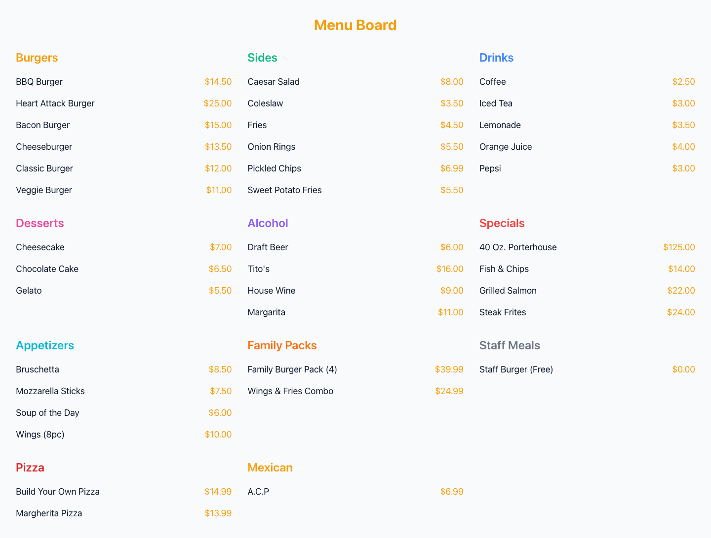

<details>
<summary><strong>Setup</strong></summary>

1. Open `/pos/board` on any TV or large display
2. Configure columns, font size, prices, and images in **Settings > Screen Builder > Menu Board**. The board groups the active Menu Builder items by category
3. Prices and availability auto-sync from the menu builder

</details>

---

### Marketing & Campaigns

Email/SMS blasts, promo codes, audience segmentation, planned send times, and send history.

Marketing is documented without a production screenshot when the demo has no campaign records.

<details>
<summary><strong>Setup</strong></summary>

1. Open the **Marketing** page to create email or SMS campaigns
2. **Audience segmentation** — target a campaign by minimum orders, minimum spend, last-visit recency, and whether the contact has an email or phone. A live summary shows who the campaign will reach
3. **Planned send** — set a planned send time on a campaign; it's shown on the campaign card so staff know when to send it
4. Create promo codes with percentage or fixed discounts
5. Requires Twilio (SMS) or SendGrid (email) credentials in **Settings > Integrations**

</details>

---

### Customer Feedback

Post-visit surveys, an at-the-terminal NPS prompt, star ratings, comment review, and response templates.

Feedback is documented without a production screenshot when the demo has no submitted responses; a zero-response dashboard is not used as an example.

<details>
<summary><strong>Setup</strong></summary>

1. Open `/pos/feedback` to view submitted customer surveys and the NPS dashboard
2. **On-terminal NPS capture** — enable **Auto-Prompt** in the Feedback settings and the payment-complete screen shows a 0–10 "how likely to recommend" prompt with an optional comment. Tapping a score records it immediately (non-blocking — it never holds up the close-out)
3. QR codes on receipts link to the survey form
4. Star ratings, NPS, and comments are aggregated per server and per time period

</details>

---

<a name="printers--cash-drawer"></a>

### Printers & Cash Drawer

Thermal receipt printers, kitchen ticket printers, and cash drawers. Network (LAN), USB, and Bluetooth options are available for Epson, Star, and generic ESC/POS hardware. Browser-native USB/Bluetooth still depends on a compatible browser, operating system, device permission, and printer interface; some hardware may require its vendor driver or utility.

The demo has configured receipt and KDS destinations but no explicit category routing rules. The current screenshot shows those configured devices with network addresses masked. With no routing rules, items continue to use each item's selected KDS Station; explicit category rules override that default for selected categories.

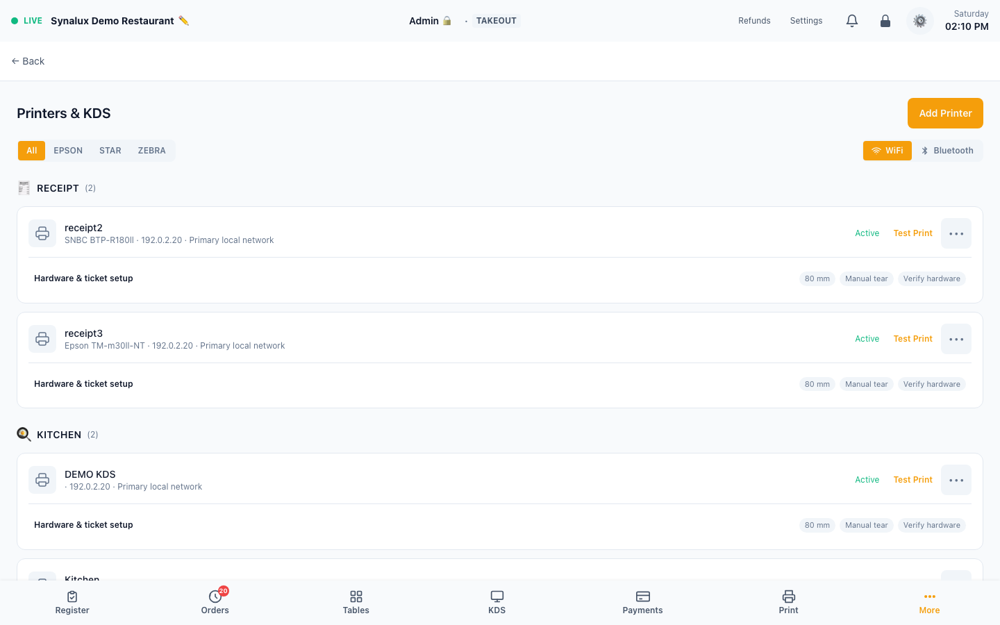

<details>
<summary><strong>Supported Hardware</strong></summary>

| Use | Connection | Examples |
|-----|------------|----------|
| Receipt and kitchen tickets | Network, USB, or Bluetooth where supported | Common Epson, Star, and compatible thermal printers |
| Labels | Network connection | Compatible Zebra label printers |

Select the correct make and model in **Settings > Printers & KDS**, then run a test print on the exact printer and media used by the venue. Hardware and browser support varies by model.

</details>

<details>
<summary><strong>Network Printer Setup (Recommended)</strong></summary>

Best for restaurants — printer connects to the same LAN as the POS terminal.

1. Assign a **static IP** to the printer (check printer's network config sheet — hold Feed button during power-on on most models)
2. Go to **Settings > Printers & KDS**
3. Click **Add Printer**
4. Enter a friendly **Name** (e.g. "Front Receipt", "Kitchen 1")
5. Select or enter the printer's correct make and model
6. Select a **Station**: receipt, kitchen, bar, expo, or label
7. Select **Network (LAN)** and enter the printer's **IP address**
8. Click **Add Printer**, then **Test Print** to verify

**Cloud POS + local printer:** When the POS is hosted online but the printer is on the venue's private network, install and register the Synalux Print Relay at that physical site. The relay delivers print jobs to the local printer without exposing the venue network to inbound internet traffic.

**Printer auto-discovery:** If a local relay is running, discovered printers appear at the top of the settings page. Click **Configure** to auto-fill name, IP, and model.

</details>

<details>
<summary><strong>Cloud Print Relay (Required for Cloud → Local Printing)</strong></summary>

If your POS is hosted in the cloud (pos.synalux.ai) and your printers are on a local network (192.168.x.x, 10.x.x.x), install the relay app on any computer at your venue.

> **iOS / iPad users:** No relay is needed for supported direct printing from the iOS app to a printer on the venue network. Add the printer in **Settings > Printers & KDS** and tap **Test Print**.

**Download and install:**

| Platform | Download |
|----------|----------|
| **macOS** | [Download .dmg](https://github.com/dcostenco/synalux-local-relay/releases/latest) |
| **Windows** | [Download .msi](https://github.com/dcostenco/synalux-local-relay/releases/latest) |

**Setup (one time):**

1. Download and install the relay app
2. In **Settings > Printers & KDS > Cloud Print Relay**, choose the physical site and select **Prepare Setup**
3. Select **Open Relay App** and allow the browser to hand the one-time setup link to the installed relay
4. Confirm that the relay is reported as configured, then use **Test Print** on each printer at that site
5. Configure startup and update behavior according to the installer and operating-system policy used at the venue

The desktop relay uses the one-time setup link and does not require staff to edit configuration files. Protect relay setup access as an administrative operation and replace a relay from the same settings panel when a computer is retired.

**How it works:** The registered relay receives jobs for its assigned venue and site, delivers them to the selected local printer, and reports the result back to the POS. If delivery is uncertain, review the job before reprinting so a receipt or kitchen ticket is not duplicated.

**Troubleshooting:**

| Symptom | Fix |
|---------|-----|
| Nothing prints after Test Print | Make sure the relay app is running (check system tray) |
| Relay connected but printer doesn't respond | Verify the printer address in POS settings, confirm the printer is powered on and on the same venue network, then run **Test Print** again |
| Relay app won't start | Check the computer's internet connection and restart the installed relay. Contact Synalux support if it still does not connect |

</details>

<details>
<summary><strong>USB Printer Setup</strong></summary>

Uses the browser's USB device connection. Chrome and Edge are the supported browser path; operating-system or vendor drivers may still be required for the printer to appear as an available device.

1. Connect the printer via USB to the POS terminal
2. Go to **Settings > Printers & KDS** > **Add Printer**
3. Enter Name, Model, Station
4. Select **USB (Browser Native)**
5. Click **Add Printer**
6. Click **Test Print** — the browser shows a serial port picker, select your printer
7. The browser remembers the selection for future prints

**Requirements:** Use a supported Chrome or Edge release and allow the browser's device permission when prompted. The first test print requires a staff action.

</details>

<details>
<summary><strong>Bluetooth Printer Setup</strong></summary>

Uses the browser's Bluetooth device connection. This can be useful for supported mobile POS terminals.

1. Put the printer in Bluetooth pairing mode
2. Go to **Settings > Printers & KDS** > **Add Printer**
3. Enter Name, Model, Station
4. Select **Bluetooth (Browser Native)**
5. Click **Add Printer**
6. Click **Test Print** — the browser shows a Bluetooth device picker, select your printer

**Requirements:** Use a supported Chrome release and allow the browser's Bluetooth permission when prompted. Confirm the exact printer model supports browser-based Bluetooth printing.

</details>

<details>
<summary><strong>Cash Drawer Setup</strong></summary>

Cash drawers connect to the receipt printer via an **RJ-12 cable** (the "DK" port on the back of most thermal printers). The configured receipt printer opens the drawer, so the drawer does not need a separate USB connection.

1. Plug the drawer's RJ-12 cable into the printer's **DK port** (labeled "DK" or with a drawer icon)
2. In **Settings > Printers & KDS**, ensure your receipt printer is configured with station = **receipt**
3. An **Open Cash Drawer** button appears next to Test Print — click it to kick the drawer
4. The drawer also kicks automatically after a cash payment, and on **No Sale** — the No Sale action physically opens the drawer (to make change) and records a no-sale audit event

**Troubleshooting:**

| Symptom | Fix |
|---------|-----|
| Drawer doesn't open | Check RJ-12 is in the DK port, not the phone/network port |
| Opens intermittently | Replace RJ-12 cable — these are fragile |
| Wrong drawer opens | Check DK1 vs DK2 port on the printer |
| "Open Cash Drawer" not visible | Printer must be assigned to the **receipt** station |

</details>

<details>
<summary><strong>KDS Routing (Multi-Printer)</strong></summary>

Route menu categories to specific printer stations so bar items print at the bar, food items print in the kitchen, etc.

1. In **Settings > Printers & KDS**, scroll to **KDS Routing**
2. Click **Add Route**
3. Select a **menu category** (e.g. "Appetizers", "Drinks")
4. Select a **station** (kitchen, bar, expo)
5. Set **copies** (1–3)
6. Click **Add**

When an order is sent to kitchen, items are split by category and routed to the correct station.

</details>

<details>
<summary><strong>Troubleshooting</strong></summary>

| Issue | Steps |
|-------|-------|
| Network printer not responding | Confirm the printer is powered on, on the same venue network, and still uses the address saved in **Settings > Printers & KDS**. Run **Test Print** and contact the venue network administrator or Synalux support if it remains unavailable |
| USB "No port selected" | Use a supported Chrome or Edge release, reconnect the USB cable, run **Test Print**, and choose the printer when the browser asks for device permission |
| Print goes to wrong printer | Verify each printer has the correct **station** and check KDS routing rules. |

</details>

---

### Label Printer

Print price or SKU labels from the Inventory workspace to a configured ZPL-capable label printer. Verify the exact printer model and network path during installation.


<details>
<summary><strong>Setup</strong></summary>

1. Add a compatible label printer in **Settings > Printers & KDS** and assign it to the **label** station
2. Open **Inventory** and select **Label** for an item
3. A linked menu item's retail price is used for a price label; an unlinked inventory item produces an SKU label instead of exposing vendor cost as a customer price
4. The generated label includes the item name and available retail-price/SKU/barcode data. Test the final ZPL layout on the exact media and printer model used by the venue

</details>

---

### Equipment & Fixed-Asset Tracking

Operational stock remains in the POS Inventory workspace. Equipment and other depreciable purchases are tracked as fixed assets in the connected Synalux Back Office inventory, where accounting fields and depreciation belong; the POS does not present a separate warranty or maintenance registry.


<details>
<summary><strong>Setup</strong></summary>

1. Create or edit the item in the connected Back Office Inventory workspace
2. Enable **Track this item as a fixed asset** and enter unit cost, purchase date, useful life, salvage value, and straight-line or declining-balance depreciation
3. Review fixed-asset value and monthly depreciation in Back Office; authorized accounting staff can post the monthly depreciation journal
4. Maintain serial numbers, warranties, and service schedules in the venue's approved asset/service system because those are not fields in the current POS fixed-asset workflow

</details>

---

### Manager Mobile

iPhone access to reports, KPIs, and quick actions — same data as the desktop, optimized for mobile.

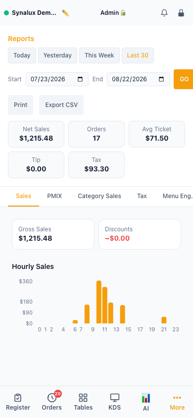

<details>
<summary><strong>Setup</strong></summary>

1. Open `/pos/reports` on any iPhone or mobile browser
2. Pin to home screen for quick access
3. Live KPIs: today's sales, open checks, labor %, voids, and average ticket size

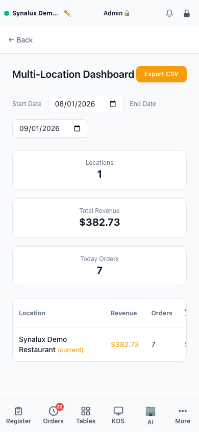

</details>

---

<a name="security--pci-compliance"></a>

### Security & PCI Compliance

Synalux POS is designed to keep raw card entry inside supported processor surfaces and terminal hardware. A venue's PCI-DSS scope and SAQ are determined by its complete environment, processor/acquirer, network, devices, and operating procedures; confirm the required validation with the acquirer or a qualified PCI adviser rather than relying on this guide alone.

| Scenario | Current handling |
|---|---|
| **In-person card payments** | Supported Stripe Terminal or Dejavoo terminal workflows keep card capture in the configured provider/device path. Pair only approved hardware and follow that provider's network and PCI instructions |
| **Keyed/manual card entry** | The Stripe path uses Stripe's hosted Payment Element rather than a POS-owned raw-card form. Access remains permission-controlled |
| **Online ordering checkout** | Uses the configured hosted/processor checkout path. Verify the actual live storefront, authorized payment, confirmation, refund, and settlement before launch |
| **Offline card handling** | The old Online Ordering “Offline CC Vault” UI is disabled. Register card payments require internet unless the venue has explicitly configured and accepted the risk of a supported Store & Forward path |

**Regional data routing:** Customer provisioning maps supported EU/EEA/UK/Swiss country codes to the EU project and supported North American country codes to the US project. Unknown countries are rejected rather than guessed, and the region choice is treated as permanent. Confirm country, region, and regional services before the venue begins trading.

**Data privacy:** Built-in CCPA and GDPR deletion workflows. Customer data purge available in Settings. Minor labor law compliance with age-gated access controls.

---

## 26 languages

English, Spanish, French, Chinese, Arabic, Romanian, Portuguese, German, Italian, Japanese, Korean, Vietnamese, Russian, Ukrainian, Polish, Turkish, Dutch, Swedish, Hebrew, Thai, Hindi, Indonesian, Malay, Filipino, Greek, Bulgarian. Arabic and Hebrew use right-to-left layout support.

---

## Connect services and integrations

Integration onboarding is completed from **Settings > Integrations** or with Synalux support. Only an authorized venue administrator should connect a provider account. Never place private provider credentials in documentation, support chat, screenshots, or shared notes.

| Service | Customer setup and acceptance |
|---|---|
| **Card payments** | Connect the venue merchant account and location, pair supported readers, then complete an authorization, receipt, refund, and settlement check. Tap to Pay also requires a supported iPhone app and device |
| **DoorDash, Uber, and Grubhub** | Connect the venue provider account, then test menu publication, order or delivery creation, status updates, cancellation, and reconciliation as applicable |
| **SMS, WhatsApp, email, and voice** | Confirm the approved sender or phone number, consent flow, operating hours, fallback behavior, and real delivery to an accessible test recipient |
| **Google Reserve, OpenTable, and Yelp** | Connect the venue account, then test a booking creation, update, cancellation, table assignment, and guest notification |
| **QuickBooks and Xero** | Connect the venue accounting account, export a test period, and reconcile the result before relying on it for close |
| **Gusto and ADP** | Connect the venue payroll account or use the reviewed payroll export, then confirm the completed result in the provider account before treating a run as delivered |
| **Banking and ACH** | Connect the authorized Synalux Back Office banking account, verify the intended account and permissions, and test the approved workflow with finance oversight |
| **Menu images and AI features** | Enable only the services approved for the venue, review cost controls and data policy, and verify the customer-visible result before launch |
| **EBT/SNAP** | Use Menu Builder to mark item eligibility. Eligibility totals do not authorize an EBT payment; processor authorization is not currently available in the POS |
| **Apple and Google Wallet** | Complete the venue wallet-program onboarding and test an issued loyalty pass. The POS falls back to a barcode when wallet delivery is unavailable |
| **Label printers** | Choose the printer model in **Settings > Printers & KDS**, assign it to the label station, and test the final label on the exact media used by the venue |

A provider card or “connected” status confirms configuration only. Complete the real customer journey—including failure, cancellation, refund, and reconciliation where applicable—before enabling the service for staff or guests.

---

## License

BUSL-1.1 — see [`LICENSE`](../LICENSE).
