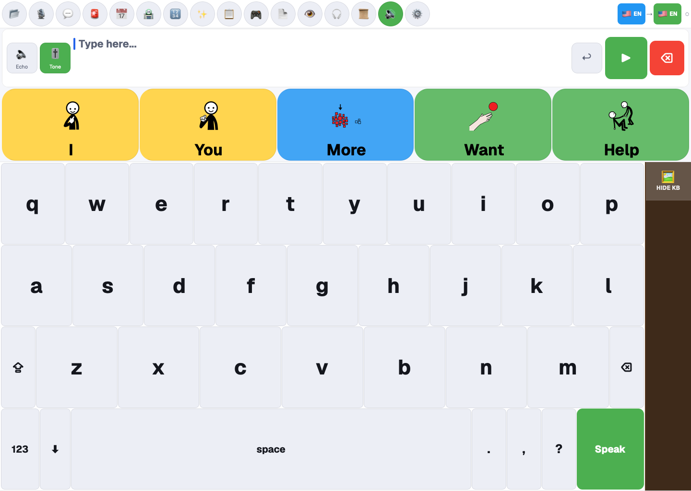
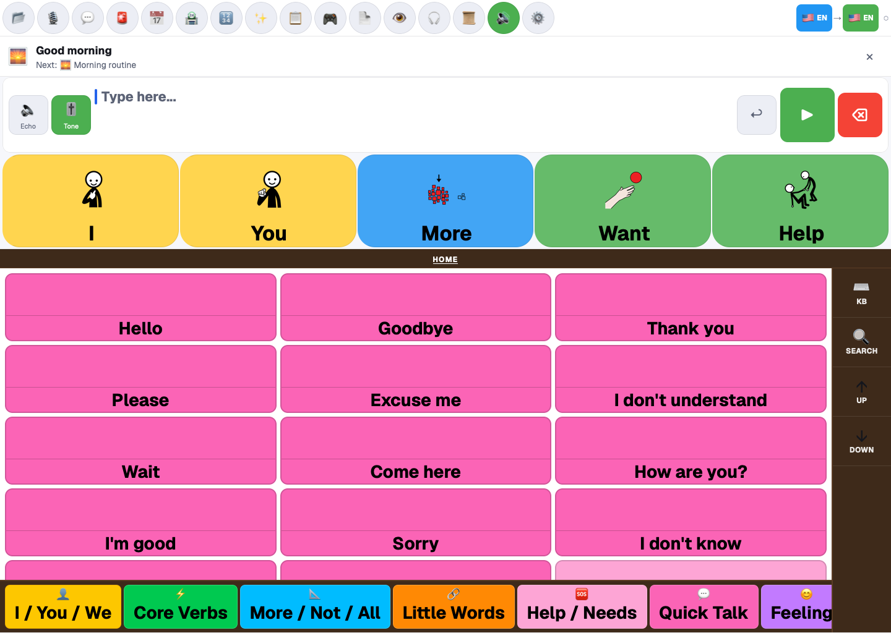
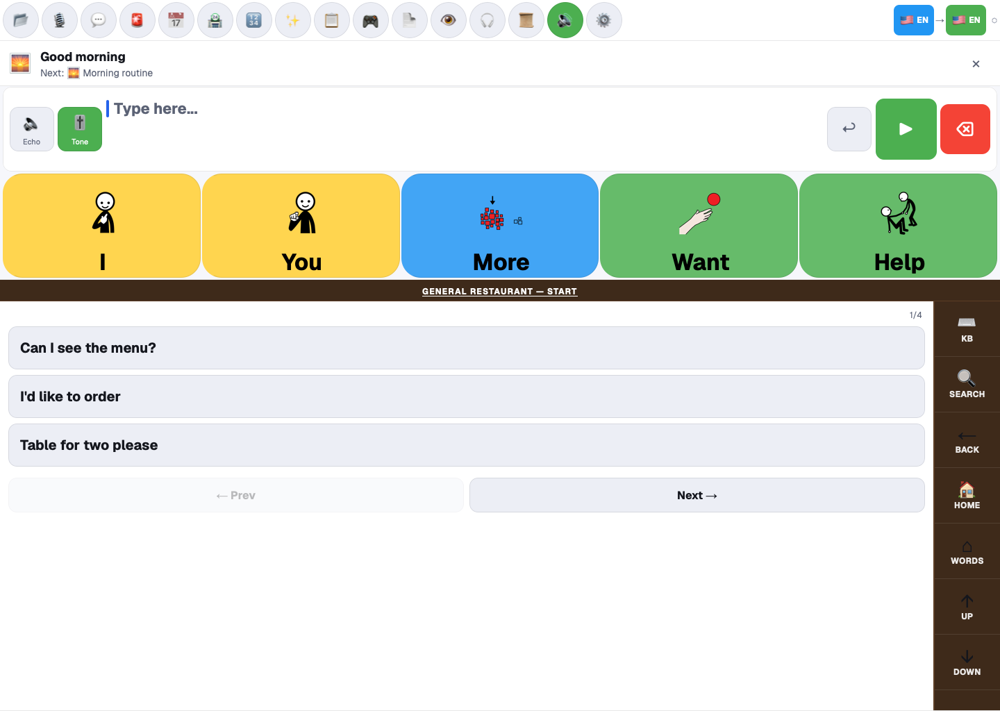
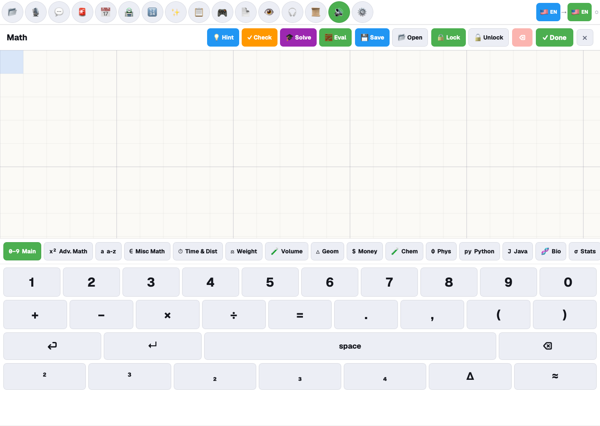
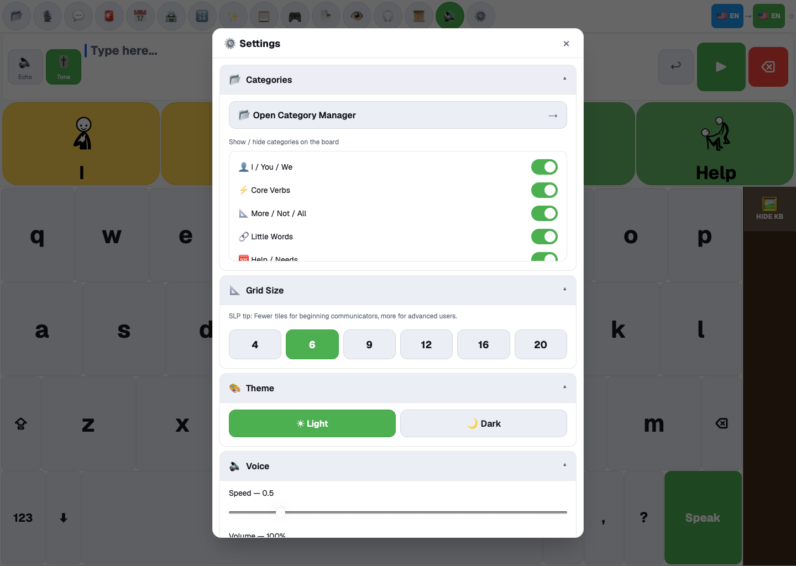

# Prism AAC

Prism AAC is an augmentative and alternative communication workspace for people who communicate with pictograms, phrase boards, typing, speech output, or alternative input methods.

- [Open the web app](https://synalux.ai/prism-aac)
- [View current plans](https://synalux.ai/pricing)
- [View the open-source project](https://github.com/dcostenco/prism-aac)

The controls available on a device can vary by browser, operating system, permissions, account, installed modules, and plan.

## Communication board at a glance

The main board keeps the communication path visible:

- a message bar for the sentence being built;
- Undo, Speak, and Delete actions;
- pictogram prediction tiles;
- an on-screen keyboard;
- input and output language selectors;
- optional Echo and Tone controls;
- a persistent Speak action.

Tap pictograms or type words to build the message, then select **Speak**. The exact speech voice depends on the selected language and the voices available through the current device and configured services.

## Categories and phrase boards

Select **Categories** from the toolbar to open the phrase board. The current board includes core words, quick talk, help and needs, feelings, questions, actions, people, food and drink, places, school or work, health and body, time, and other vocabulary groups.

Use the controls on the right to show the keyboard, search, move through the board, or return home. The category strip provides direct movement between vocabulary groups.

Caregivers can open **Settings → Categories → Open Category Manager** to manage board categories. Category visibility and the selected grid size affect how much vocabulary appears at once; choose a layout that the communicator can target reliably.

## Real-world scenarios

Some categories contain guided phrase sequences for common activities. In **Food & Drink**, for example, the current General Restaurant sequence starts with phrases such as “Can I see the menu?”, “I’d like to order,” and “Table for two please.”

Use **Next** and **Prev** to move through a sequence. Available scenario packs can change with the installed vocabulary and marketplace modules, so review the actual phrases before relying on a board in a new setting.

## Keyboard, prediction, and languages

The keyboard supports direct typing alongside the pictogram board. Prediction tiles can be selected without finishing a word manually.

The toolbar exposes separate input and output languages where translation is available. Confirm both language buttons before speaking a translated message. Translation, assisted correction, and some prediction paths may require an account, a configured model, or a network connection; the keyboard and stored board remain the fallback communication path.

## Math workspace

Select **Math** to open the graph-paper workspace.

The current Math panel includes:

- a graph-paper canvas;
- Hint, Check, Solve, and Eval actions;
- Save, Open, Lock, Unlock, Delete, and Done controls;
- Main and advanced math symbol sets;
- subject tabs such as time and distance, weight, volume, geometry, money, chemistry, physics, Python, Java, biology, statistics, music, earth science, history, and language;
- a touch-friendly numeric and symbol keyboard.

Assisted explanations and evaluation depend on the selected subject and configured services. Review generated work before using it for instruction or assessment.

## Schedule, messages, notes, and history

The toolbar can open:

- **Schedule** for visual routines and tasks;
- **Messages** for configured caregiver or contact communication;
- **Notes** for saved caregiver or user notes;
- **History** for previously spoken or composed communication.

These modules use the active device and account state. A message shown as composed is not proof it was delivered; verify the module’s sent or error state.

## Games, marketplace, and reading tools

Depending on the current configuration, toolbar modules can include:

- **Games** for communication and interaction activities;
- **Marketplace** for available vocabulary, board, and first-party modules;
- **PDF Reader** for supported documents;
- **Screenshot Reader** for on-screen text recognition;
- **Comfort Player** for a simplified media experience.

Marketplace entries can be installed, active, unavailable, or marked for a future release. Use the status shown on the item instead of assuming every listed module is immediately usable.

Text recognition and document reading depend on file quality, browser support, and permissions. Verify important text against the source document.

## Accessibility and alternative input

Open **Settings → Accessibility & Input Modes** to review the controls available on the device. The current application includes configuration for:

- direct touch;
- switch scanning;
- head tracking and dwell selection;
- eye-gaze weighting within the tracking controls;
- built-in gesture recognition and action mapping;
- keyboard size and board density;
- reduced-motion and visual theme preferences.

Camera-based controls require explicit camera permission. Tracking accuracy varies with device placement, lighting, movement range, and camera quality. Complete calibration with the communicator, keep a reliable touch or switch fallback available, and use the emergency tracking-reset path if pointer control becomes unstable.

Custom-gesture recording may be shown as unavailable in the current build. Do not treat the presence of a control as evidence that training completed.

## Emergency alert

The Alert button opens a confirmation workflow. If a primary caregiver and delivery route are configured, confirm the alert and wait for the application’s sent or failed status.

An in-app alert is not a replacement for an emergency call system. If no caregiver is configured, delivery fails, or immediate assistance is required, use the person’s established emergency procedure.

## Settings

Settings are organized into collapsible sections so the communication board remains uncluttered. Current sections can include:

- category visibility and Category Manager;
- grid size;
- light and dark themes;
- voice speed, volume, and voice selection;
- language and vocabulary set;
- word visibility;
- contacts;
- toolbar customization;
- accessibility and input modes;
- Math;
- hand calibration;
- custom categories and phrases;
- export and import;
- Synalux account;
- caregiver PIN;
- local model configuration;
- AAC resources.

Use a caregiver PIN when settings should not be changed accidentally. Keep a recoverable record of the PIN according to your organization’s policy.

## Offline use

Prism AAC caches parts of the application for supported installed-browser use. After the app and needed vocabulary have loaded successfully, core typing, stored boards, and device speech may remain available without a connection.

Network-dependent features—including synchronization, cloud-assisted tools, marketplace refreshes, and message delivery—cannot be assumed to work offline.

Before relying on offline use:

1. Open the app while connected.
2. Load the board, language, and voice the communicator needs.
3. Disconnect the test device.
4. Compose and speak a test phrase.
5. Reconnect and verify any queued or synchronized activity.

Repeat this check after browser storage is cleared, the app is updated, or the device changes.

## Privacy and safe use

- Speech, camera, contact, and notification permissions are requested by the relevant feature; grant only what the communicator needs.
- Camera-based input should show a permission or status error rather than silently claiming it is active.
- AI-assisted text, recognition results, translations, and tutoring require human review.
- Do not use the application as the sole route for urgent medical or safety communication.
- Caregivers and clinicians remain responsible for vocabulary selection, access-method fit, consent, and backup communication.

## First-time setup

1. Open Prism AAC on the communicator’s device.
2. Select the input and output languages.
3. Test the Speak control and choose an available voice.
4. Open **Settings** and select a comfortable grid size and theme.
5. Use **Category Manager** to show the vocabulary groups needed most.
6. Configure contacts or a primary caregiver before testing Alerts or Messages.
7. Calibrate alternative input with the communicator if touch is not the primary access method.
8. Practice one core phrase, one real-world scenario, and the emergency backup procedure.
9. Test offline behavior on that exact device before field use.

For help, contact [support@synalux.ai](mailto:support@synalux.ai).
