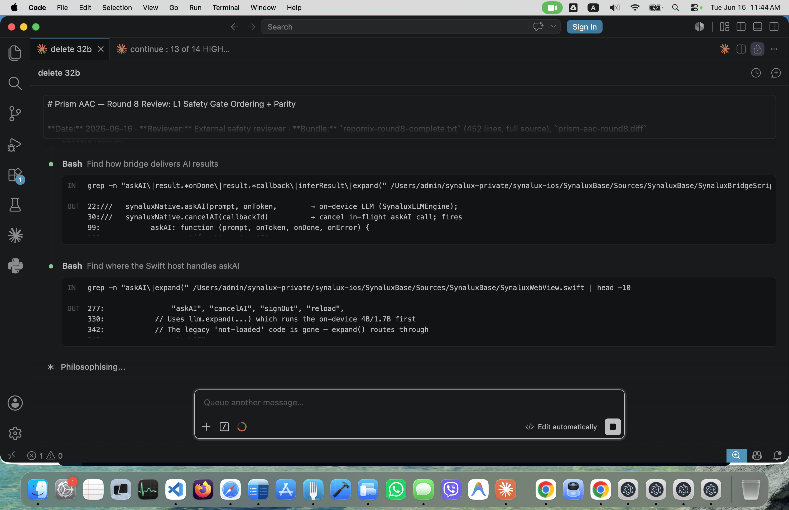
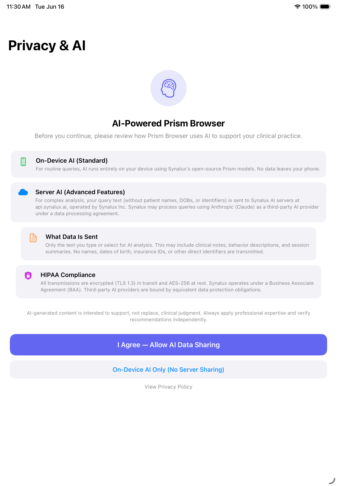

# Prism Browser

A web browser built for healthcare providers and AAC users. Designed for people who navigate the web via head tracking, switch scanning, dwell click, and voice commands — and for clinicians who need browsing with HIPAA technical safeguards on shared clinical devices.

Available on **macOS**, **Windows**, **Linux** (Electron desktop) and **iPad/iPhone** (native iOS app).

> Implements HIPAA §164.312 technical safeguards. Full HIPAA compliance depends on your practice's BAA, risk assessment, and organizational policies. Consult your compliance officer before deploying on clinical devices.

---

## At a Glance

| | |
|---|---|
| **Platforms** | macOS, Windows, Linux (desktop) · iPad, iPhone (iOS) |
| **AAC Input Methods** | Head tracking, switch scanning, dwell click, voice commands, 8 gesture types |
| **Clinical Features** | PHI scrubbing, audit logging, session timeout, clinical context sidebar, therapy timer |
| **Security** | Sandbox + CSP, session isolation, HMAC audit chain, encrypted storage, PIN lockout |
| **Tests** | 172 desktop + 16 iOS = 188 unit tests across 16 test suites |
| **Audit Score** | 9/10 after 4 adversarial review rounds (70+ findings, all resolved) |

---

## iOS App

### Desktop



### iOS



The iOS app follows the same B2B subscription pattern as Synalux POS and Online Ordering:

| Feature | Implementation |
|---------|---------------|
| **Auth flow** | AI consent → Apple Sign-In → Face ID → BrowserShell |
| **Dual WKWebView** | Portal tab (authenticated, persistent) + browsing tabs (nonPersistent, no auth cookies) |
| **AAC Content Bridge** | JS IIFE injected via WKUserScript — defineProperty (non-writable), closure-only nonce |
| **Content blocking** | 3 WKContentRuleList sets (ads, privacy, annoyances) compiled at launch |
| **Caregiver mode** | PIN in iOS Keychain (constant-time compare), domain allowlist, time limits |
| **Widgets** | Quick Search, Bookmarks, Shield Stats (App Group shared data) |
| **Tabs** | Up to 10 tabs, scroll-to-hide toolbar (locked visible in AAC mode) |
| **iPad multitasking** | Split View + Slide Over support |
| **Monitoring** | Datadog RUM — separate "Prism Browser iOS" dashboard |

---

## Who It's For

- **AAC users** with cerebral palsy, Down syndrome, SMA, ALS, traumatic brain injury, or other conditions that limit fine motor control
- **BCBAs and RBTs** who need to browse clinical resources during therapy sessions on shared iPads
- **Healthcare practices** that need a managed browser with HIPAA technical safeguards for shared clinical devices

### Who It's Not For

Prism Browser uses **camera-based head tracking**, which requires some reliable head movement. It is not a replacement for:

- **Eye-gaze systems** (Tobii Dynavox TD Browse, PCEye) — users with no functional head movement (advanced ALS, locked-in syndrome, severe quadriplegic CP) need dedicated eye-tracking hardware
- **Full AAC communication systems** (Grid 3, TD Snap, Proloquo2Go) — Prism is a web browser with AAC access methods, not a symbol-based communication platform

If your client needs eye gaze, we recommend evaluating Tobii Dynavox or Smartbox devices alongside (not instead of) Prism Browser.

---

## AAC Accessibility

### Head Tracking

Control the cursor with head movement using any built-in camera — no special hardware required:

- **MediaPipe FaceDetector** — GPU-accelerated at 24fps, self-hosted (no CDN, SHA-256 verified)
- **Kalman smoothing** — confidence-weighted cursor stabilization with EMA tremor filtering
- **Dwell click** — configurable 200ms–5000ms, visual ring shows progress
- **Drift detection** — adaptive travel threshold + directional ratio filter (tremor-aware)
- **Auto-recovery** — 8/10 confidence probe resumes tracking automatically after drift, 60-second hard timeout prevents permanent lockout
- **Per-side fatigue tracking** — independent left/right accuracy monitoring for hemiplegia/stroke users
- **Background recalibration** — learns and corrects drift without user intervention
- **Edge scroll** — cursor at screen edge triggers proportional auto-scroll (disabled during dwell)

### Gesture Detection

8 gestures with **per-side blink thresholds** for CP asymmetry:

| Gesture | Action | Notes |
|---------|--------|-------|
| **Blink** (both eyes) | Click at cursor | Per-side thresholds — right-side-weak CP users set lower right threshold |
| **Wink left** | Navigate back | Asymmetric eye closure detection |
| **Wink right** | Navigate forward | |
| **Nod** | Scroll down | Pitch oscillation with zero-crossing validation |
| **Head shake** | Cancel / escape | Yaw oscillation |
| **Smile** | Toggle reader mode | Suppressed during TTS (conversation mode) |
| **Brow raise** | Scroll up | |
| **Mouth open** | Stop TTS | Suppressed during TTS |

- **Conversation mode** — mouth gestures automatically suppressed while TTS is speaking + 500ms settle delay. Prevents false activations from speech articulation.
- **EMA smoothing** (alpha=0.3) — filters single-frame tremor spikes
- **Configurable thresholds** — per gesture, per side

### Switch Scanning

Navigate web pages using external switches, keyboard, or gamepad:

- **Two-phase scanning** — first groups (ARIA landmarks + spatial rows), then individual items
- **Dynamic DOM rebuild** — scan groups refresh on SPA navigation (600ms debounced MutationObserver)
- **Chrome + content groups** — browser controls scanned alongside page elements
- **Configurable** — speed (500–5000ms), loop count, group scan toggle

### Voice Commands

22 offline commands via Web Speech API — no cloud dependency:

| Category | Commands |
|----------|----------|
| Navigation | "go back", "go forward", "reload", "new tab", "close tab" |
| Scrolling | "scroll down", "scroll up", "go to top", "go to bottom" |
| Actions | "click", "find", "read page", "stop reading" |
| Tab management | "next tab", "previous tab" |

### Bootstrap Wizard

First-run setup accessible via **every input method**:

- **Head tracking** — coarse pre-calibration starts on mount; 2-second dwell targets (120×120px)
- **Switch scanning** — Tab + Enter
- **Voice** — speak the option name
- **Mouse/touch** — click directly
- Head tracking stays active during calibration step (no lockout between wizard screens)

### ZoomToClick Magnifier

Precision selection for dense web content:

- 3+ targets within 100px → **3x magnified lens** appears
- **Progressive settle radius** — widens over time for tremor users (10px → 40px)
- **Auto-select** after 10 seconds (most-frequented element in the window)
- **15-second auto-dismiss** — lens can't trap the user
- Settle period before dwell starts (magnification amplifies tremor 3x)

### UndoToast

Undo accidental navigation:

- **Centered** — reachable from any cursor position
- **Extended duration** — max(5s, 3× dwellMs) for slow-dwell users
- **Hover-pause** — auto-dismiss timer pauses when cursor approaches
- **5-action undo stack** — covers sequences of accidental clicks

### Break Reminder

Configurable rest timer:

- Default: 20-minute intervals
- Auto-pause on sustained accuracy drop (<50% for 5 min)
- Tracking paused during break (not the page), oversized "Resume" button

---

## How It Compares

| Feature | Prism Browser | TD Browse (Tobii Dynavox) | Grid 3 Browser (Smartbox) | Chrome + Extensions |
|---------|:---:|:---:|:---:|:---:|
| **Head tracking (no hardware)** | Built-in | Requires eye tracker hardware | Requires external tracker | Requires HeadMouse Nano |
| **Switch scanning** | Built-in (dynamic ARIA) | Not primary | Built-in (Grid 3) | Third-party AT |
| **Dwell click** | Built-in (configurable) | Built-in (eye gaze) | Built-in | Extension required |
| **Voice commands** | Offline, built-in | Not available | Voice via Grid 3 | OS Voice Control |
| **Per-side blink thresholds** | Yes (CP asymmetry) | No | No | No |
| **Auto-recovery (60s timeout)** | Yes | Manual re-cal | Manual re-enable | N/A |
| **PHI scrubbing on search** | Automatic (regex + NER) | No | No | No |
| **HIPAA audit logging** | HMAC-chained | No | No | No |
| **Content blocking** | Built-in (3 rule sets) | No | No | Extension required |
| **iPad app** | Yes (native) | TD Pilot only | Grid for iPad | Chrome iOS (no ext.) |
| **Price** | Included with Synalux | ~$200+ software (hardware from $10,000) | ~$550+ software | Free (no AT) |

**Notes:** TD Browse is the gold standard for eye-tracking-based browsing — Prism's camera tracking is less precise than dedicated eye trackers for users with very limited head movement. Grid 3 offers deeper AAC vocabulary and communication tools.

---

## Privacy & Security

### Session Isolation

| Session | Cookies | Native Bridge | Use |
|---------|---------|---------------|-----|
| Portal (authenticated) | Persistent | Full SynaluxBridgeScript | Clinical portal access |
| Browsing (sandboxed) | nonPersistent | AAC content bridge only | General web |
| Private (ephemeral) | None (cleared on close) | AAC content bridge only | No history recorded |

### PHI Sanitization

Two-layer scrubbing on all search queries:

**Layer 1 (Regex):** SSN, phone, email, DOB (with/without leading zeros, written dates), address, ZIP/ZIP+4, NPI, hyphenated names

**Layer 2 (Context-gated NER):** ICD-10 codes (including U-codes), NDC drug codes, 40 medication name prefixes, MRN patterns, age patterns, 5-digit ZIP, lowercase names — all gated on `hasMedicalContext()` to reduce false positives

### Session Lock (HIPAA §164.312(a)(2)(iii))

- 15-minute inactivity timeout → automatic lock
- PIN-based unlock with **exponential backoff** (30s → 1m → 5m → 15m max)
- PIN change requires current PIN + blocked while locked
- Encrypted storage via OS keychain (desktop: safeStorage, iOS: Keychain)
- Failed attempts audit-logged
- Locks on system suspend / lock-screen

### Audit Logging (HIPAA §164.312(b))

- Append-only JSONL with **HMAC-SHA256 chain** (per-install key in OS keychain)
- 40+ event types with user identity
- Renderer can only write allowlisted event types (session/security events restricted to main process)
- Cross-day chaining for multi-session integrity
- Private browsing: audit logged, history NOT recorded

### Content Bridge Security

| | Desktop (Electron) | iOS (WKWebView) |
|---|---|---|
| Isolation | Isolated-world preload (invisible to page JS) | Same-world IIFE + defineProperty (non-writable, non-configurable) |
| Authentication | IPC channel per tab | Closure-only nonce, validated in Swift |
| Popup prevention | setWindowOpenHandler → deny | createWebViewWith → load in same view |
| DOM traversal | Iframes + open shadow DOM | Same |

---

## Clinical Features

| Feature | Description | Shortcut |
|---------|-------------|----------|
| **Reader Mode** | Readability.js extraction + DOMPurify + adjustable font + TTS | Cmd+Shift+R |
| **Word-by-Word TTS** | 3-tier: Azure Neural → Web Speech → espeak-ng WASM. Adjustable rate. | |
| **AI Page Summary** | PHI-sanitized text → portal AI → 3-5 bullet summary | Cmd+Shift+P |
| **Clinical Context** | Active patient data sidebar (name, DOB, dx, meds, notes) | Cmd+Shift+X |
| **Therapy Timer** | Start/stop/resume with notes, auto-logged to audit trail | Cmd+Shift+T |
| **PHI-Safe Printing** | Regex-masked rendered text (catches PHI split across tags) | Cmd+P |
| **Translation** | Portal-routed, LRU cache (500 entries), 25 languages | |
| **Web Clipper** | Highlight → save with notes, color, URL. Encrypted storage. | |

---

## Caregiver Mode

| Feature | Description |
|---------|-------------|
| **PIN lock** | iOS Keychain / macOS safeStorage, constant-time comparison |
| **Domain allowlist** | Dot-boundary matching (evil-google.com doesn't pass for google.com) |
| **Time limits** | Configurable daily session duration |
| **Usage analytics** | Domains visited (apex only), session time, shield blocks — 30-day rolling |
| **Content blocking** | 3 rule sets: ads, privacy, annoyances. Per-site exemptions. Shield badge. |

---

## Additional Features

| Feature | Description |
|---------|-------------|
| **Split view** | Two tabs side-by-side (desktop). iPad Split View + Slide Over. |
| **Private browsing** | Ephemeral session. No history, no cookies. Audit still fires. |
| **Bookmarks & history** | Encrypted via OS keychain. Chrome import supported. |
| **Settings export** | JSON profile + QR code for therapist-to-therapist sharing |
| **Cross-device sync** | Server-encrypted bookmarks/settings via portal API |
| **DNS-over-HTTPS** | Cloudflare + Google secure resolvers |
| **Phishing protection** | Safe Browsing proxy. Degrades gracefully when API unavailable. |
| **Auto-updater** | Code-signed feed (desktop). App Store updates (iOS). |

---

## Tracking Pipeline

```
Camera → MediaPipe Face Detection (24 FPS)
    → EMA Smoothing (alpha=0.3, tremor filter)
    → Kalman Filter (confidence-weighted)
    → Drift Detector (adaptive threshold + directional ratio)
    → Recovery Probe (8/10 window, 60s hard timeout)
    → Edge Pin Detector
    → Fatigue Tracker (per-side independent)
    → Gesture Detector (per-side blink, conversation mode)
    → Content Bridge → queryInteractive / hitTest / dispatchActivate
```

---

## Technical Architecture

### Desktop

- **Electron** with WebContentsView per tab (not deprecated BrowserView)
- **61 TypeScript source files**, 15 test suites (172 tests)
- Two session partitions: `persist:browsing` (shielded) + `persist:portal` (authenticated)
- Sandbox + context isolation on all views
- Register/attach/detach lifecycle — no listener leaks on macOS close→reopen

### iOS

- **19 Swift source files** + 5 widget files, 16 unit tests
- Same B2B subscription pattern as Synalux POS and Online Ordering
- WKContentRuleList ad blocking, App Group for widgets
- Datadog RUM for crash reporting + performance monitoring

---

## Keyboard Shortcuts

| Shortcut | Action |
|----------|--------|
| Cmd+T | New tab |
| Cmd+W | Close tab |
| Cmd+1-9 | Switch to tab N |
| Cmd+Shift+]/[ | Next/previous tab |
| Cmd+L | Focus address bar |
| Cmd+F | Find in page |
| Cmd+, | Settings |
| Cmd+Shift+R | Reader mode |
| Cmd+Shift+S | Switch scanning |
| Cmd+Shift+P | Summarize page |
| Cmd+Shift+X | Clinical context |
| Cmd+Shift+T | Therapy timer |
| Cmd+Shift+K | AAC phrase board |
| Cmd+/ | AI chat |
| Cmd+P | PHI-safe print |

---

## System Requirements

### Desktop
- macOS 12+ (Apple Silicon + Intel universal)
- Windows 10+ (x64)
- Linux (AppImage, x64)
- Camera required for head tracking
- 4 GB RAM minimum

### iOS
- iPad or iPhone with iOS 16+
- Front-facing camera for head tracking
- Synalux subscription (same tier as POS / Online Ordering)

---

## Getting Started

Prism Browser is included with your Synalux subscription. No additional purchase required.

1. **Desktop**: Download from [synalux.ai/downloads](https://synalux.ai/downloads)
2. **iPad/iPhone**: Available on the App Store (search "Prism Browser")
3. Sign in with your Synalux account
4. Complete the AAC setup wizard — choose your input method
5. Start browsing

For shared clinical devices, enable **Caregiver Mode** in Settings.

---

*For questions or feature requests, contact [support@synalux.ai](mailto:support@synalux.ai) or visit [synalux.ai/docs](https://synalux.ai/docs).*
