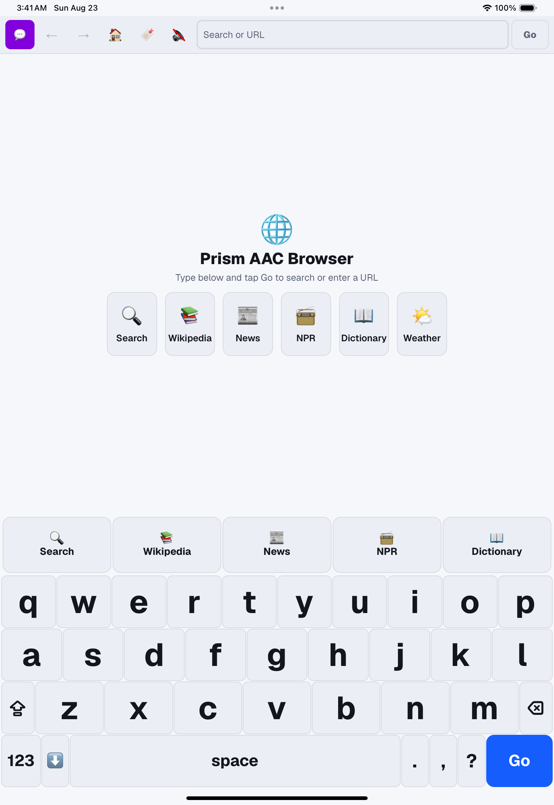
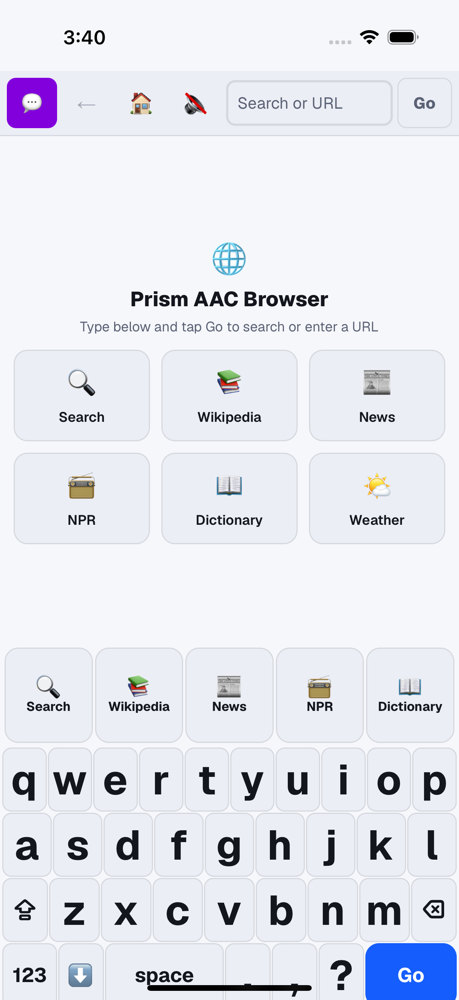

# Prism AAC Browser

Prism AAC Browser combines web browsing with the communication tools used in Prism AAC. A person can type a web address or search with the large on-screen keyboard, use one-tap site shortcuts, switch from browsing to spoken communication, and return to the AAC board without leaving the app.

The current release is for **iPhone and iPad running iOS or iPadOS 16 or later**.

## Browser at a glance

The iPad layout keeps the browser toolbar at the top, the current page or start screen in the center, and the AAC keyboard at the bottom.

The iPhone layout provides the same controls in a narrower, touch-friendly arrangement.

These screenshots were captured from the current iOS app. Available shortcuts can change as the app is updated or customized.

## Get started

1. Install Prism AAC Browser from the App Store on an iPhone or iPad.
2. Open the app while connected to the internet so the current browser and AAC experience can load.
3. Tap **Search or URL** and use the on-screen keyboard to enter a website or search phrase.
4. Tap **Go** or select one of the large site shortcuts.
5. Tap the purple communication button when you want to leave the browser and return to the AAC board. Confirm the change when prompted.

## Browse the web

### Search or open a website

- Enter a complete website address, such as `example.org`, or type ordinary search words.
- The suggestion row above the keyboard offers site shortcuts while you type.
- Tap **Go** in the toolbar or on the keyboard to open the result.
- Tap **Home** to return to the browser start screen.
- Use **Back** and **Forward** after visiting pages. Forward appears when screen space allows and there is a page to return to.

### Use site shortcuts and bookmarks

The start screen shows large shortcuts for commonly used sites. On larger screens, the bookmark control in the toolbar can show the pinned-site row. While viewing a site, the star control can pin or unpin it for quicker access later.

### Work with external pages

Some websites do not allow their pages to appear inside another page. When that happens, use the offered external-page action. In the iOS app, the native page viewer provides:

- Back and Forward
- Reload or Stop
- Share
- **Done** to return to Prism AAC Browser

If a page still does not load, check the connection and try the site in Safari.

## Switch between Go and Speak

The speaker control in the toolbar changes what happens to the text you compose:

| Mode | What it does |
|---|---|
| **Go** | Uses browser and site suggestions, then opens the typed address or search. |
| **Speak** | Uses AAC word predictions and speaks the composed phrase instead of navigating. |

The icon shows whether speech mode is active. Switch back to **Go** before entering a new address or web search.

## Use the AAC keyboard

- Tap letters to compose a search, address, or spoken phrase.
- Use the suggestion row to complete a site or word more quickly.
- Use **Shift**, **Backspace**, **123**, punctuation, and **Space** as needed.
- After a page opens, the keyboard may collapse to make more room. Tap **Show keyboard** to restore it.
- The large keys and visible focus states also support iOS accessibility input such as Switch Control or Voice Control when those features are configured on the device.

## Permissions and optional features

Prism AAC Browser asks for an iOS permission only when a related feature needs it. Depending on the features you choose, iOS may ask for access to:

- **Microphone and Speech Recognition** for voice input
- **Camera** for supported hands-free access or custom picture features
- **Location, Contacts, and Notifications** for a configured emergency workflow

You can review or change permissions in **iOS Settings → Prism Browser**. Denying a permission leaves the related feature unavailable but does not prevent ordinary touch browsing.

## Emergency communication

Emergency controls belong to the Prism AAC communication experience, not to ordinary web navigation. Configure emergency contacts and test the intended workflow with a caregiver before relying on it.

When an emergency action is triggered, the iOS app provides an immediate local audible and notification response. Delivery to a caregiver requires the app to be signed in and the emergency workflow to be configured and connected. If delivery is unavailable, the local response does not mean that a caregiver or emergency service received the alert.

Prism AAC Browser is not a replacement for 911 or your local emergency number.

## Privacy and safe browsing

- Web addresses and search terms are sent to the website or search service you choose.
- External websites have their own privacy, cookie, accessibility, and content policies.
- Review the address before entering private or sensitive information.
- Use the device passcode and keep iOS and the app updated on shared devices.
- Camera, microphone, speech, contact, and location access remain controlled through iOS permissions.

Read the [Synalux Privacy Policy](https://synalux.ai/legal/privacy) for current details.

## Troubleshooting

### The app says there is no connection

Confirm that the device can reach the internet, then tap **Retry** or reopen the app. A limited offline communication screen may be available, but live websites require a connection.

### A website does not appear

Some sites block in-app display. Use the external-page option or open the site in Safari. If only one site fails, the problem may be that site's policy rather than the app or network.

### The keyboard disappeared

The app collapses the keyboard after navigation to give the page more space. Tap **Show keyboard** to bring it back.

### Text does not speak

Check that the toolbar is in **Speak** mode, the device volume is audible, and Silent Mode or Focus settings are not suppressing sound. Then try a short phrase.

### Voice input does not start

Open **iOS Settings → Prism Browser** and confirm Microphone and Speech Recognition access. Voice input also needs a supported language and may require a network connection depending on the device language.

### The app is unresponsive after opening a page

Tap **Done** in the native page viewer or return to **Home**. If the controls do not respond, close and reopen the app, then retry the page.

## Support

For help, email [support@synalux.ai](mailto:support@synalux.ai). Include the device model, iOS or iPadOS version, the action you were taking, and the website involved. Do not include passwords or private health information.
